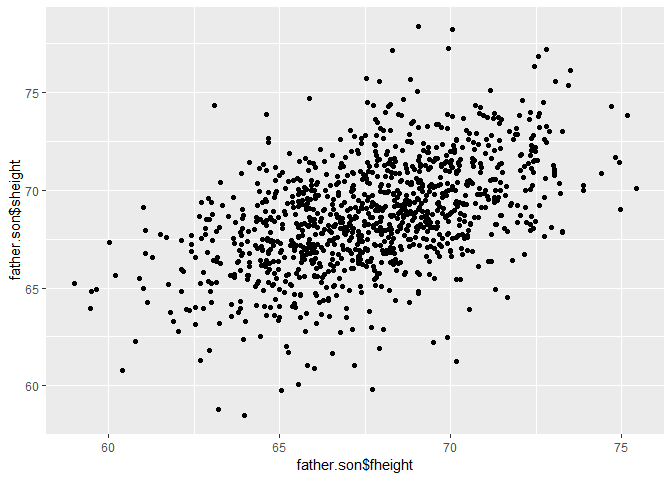
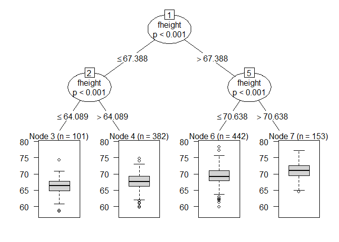
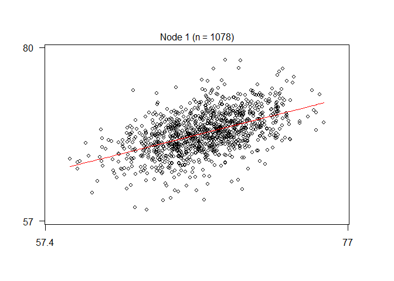

# week 1
##  student T distribution
1 parameter, - degrees of freedom.
distribution of X average - mu/(S/sqrt(n))
with n-1 degrees of freedom
confidence interval interval - z+-t*S//sqrt(n)

For skewed distribution, the spirit of the t interval assumptions are violated.
  better to have logs or use different summary like the median

## T confidenct with pair measurements


```r
data(sleep)
head(sleep)
```

```
##   extra group ID
## 1   0.7     1  1
## 2  -1.6     1  2
## 3  -0.2     1  3
## 4  -1.2     1  4
## 5  -0.1     1  5
## 6   3.4     1  6
```

---

```r
g1 <- sleep$extra[1 : 10]; g2 <- sleep$extra[11 : 20]
difference <- g2 - g1
mn <- mean(difference); s <- sd(difference); n <- 10
mn + c(-1, 1) * qt(.975, n-1) * s / sqrt(n)
```

```
## [1] 0.7001142 2.4598858
```

```r
t.test(difference)$conf.int
```

```
## [1] 0.7001142 2.4598858
## attr(,"conf.level")
## [1] 0.95
```

## T Independent group T intervals

## Independent group $t$ confidence intervals

- Suppose that we want to compare the mean blood pressure between two groups in a randomized trial; those who received the treatment to those who received a placebo
- We cannot use the paired t test because the groups are independent and may have different sample sizes
- We now present methods for comparing independent groups

---

## Notation

- Let $X_1,\ldots,X_{n_x}$ be iid $N(\mu_x,\sigma^2)$
- Let $Y_1,\ldots,Y_{n_y}$ be iid $N(\mu_y, \sigma^2)$
- Let $\bar X$, $\bar Y$, $S_x$, $S_y$ be the means and standard deviations
- Using the fact that linear combinations of normals are again normal, we know that $\bar Y - \bar X$ is also normal with mean $\mu_y - \mu_x$ and variance $\sigma^2 (\frac{1}{n_x} + \frac{1}{n_y})$
- The pooled variance estimator $$S_p^2 = \{(n_x - 1) S_x^2 + (n_y - 1) S_y^2\}/(n_x + n_y - 2)$$ is a good estimator of $\sigma^2$

---

## Note

- The pooled estimator is a mixture of the group variances, placing greater weight on whichever has a larger sample size
- If the sample sizes are the same the pooled variance estimate is the average of the group variances
- The pooled estimator is unbiased
$$
    \begin{eqnarray*}
    E[S_p^2] & = & \frac{(n_x - 1) E[S_x^2] + (n_y - 1) E[S_y^2]}{n_x + n_y - 2}\\
            & = & \frac{(n_x - 1)\sigma^2 + (n_y - 1)\sigma^2}{n_x + n_y - 2}
    \end{eqnarray*}
$$
- The pooled variance  estimate is independent of $\bar Y - \bar X$ since $S_x$ is independent of $\bar X$ and $S_y$ is independent of $\bar Y$ and the groups are independent

---

## Result

- The sum of two independent Chi-squared random variables is Chi-squared with degrees of freedom equal to the sum of the degrees of freedom of the summands
- Therefore
$$
    \begin{eqnarray*}
      (n_x + n_y - 2) S_p^2 / \sigma^2 & = & (n_x - 1)S_x^2 /\sigma^2 + (n_y - 1)S_y^2/\sigma^2 \\ \\
      & = & \chi^2_{n_x - 1} + \chi^2_{n_y-1} \\ \\
      & = & \chi^2_{n_x + n_y - 2}
    \end{eqnarray*}
$$

---

## Putting this all together

- The statistic
$$
    \frac{\frac{\bar Y - \bar X - (\mu_y - \mu_x)}{\sigma \left(\frac{1}{n_x} + \frac{1}{n_y}\right)^{1/2}}}%
    {\sqrt{\frac{(n_x + n_y - 2) S_p^2}{(n_x + n_y - 2)\sigma^2}}}
    = \frac{\bar Y - \bar X - (\mu_y - \mu_x)}{S_p \left(\frac{1}{n_x} + \frac{1}{n_y}\right)^{1/2}}
$$
is a standard normal divided by the square root of an independent Chi-squared divided by its degrees of freedom 
- Therefore this statistic follows Gosset's $t$ distribution with $n_x + n_y - 2$ degrees of freedom
- Notice the form is (estimator - true value) / SE

---

## Confidence interval

- Therefore a $(1 - \alpha)\times 100\%$ confidence interval for $\mu_y - \mu_x$ is 
$$
    \bar Y - \bar X \pm t_{n_x + n_y - 2, 1 - \alpha/2}S_p\left(\frac{1}{n_x} + \frac{1}{n_y}\right)^{1/2}
$$
- Remember this interval is assuming a constant variance across the two groups
- If there is some doubt, assume a different variance per group, which we will discuss later


- Comparing SBP for 8 oral contraceptive users versus 21 controls
- $\bar X_{OC} = 132.86$ mmHg with $s_{OC} = 15.34$ mmHg
- $\bar X_{C} = 127.44$ mmHg with $s_{C} = 18.23$ mmHg
- Pooled variance estimate

```r
sp <- sqrt((7 * 15.34^2 + 20 * 18.23^2) / (8 + 21 - 2))
132.86 - 127.44 + c(-1, 1) * qt(.975, 27) * sp * (1 / 8 + 1 / 21)^.5
```

```
## [1] -9.521097 20.361097
```

### lets mistreat sleep data as group

```r
data(sleep)
x1 <- sleep$extra[sleep$group == 1]
x2 <- sleep$extra[sleep$group == 2]
n1 <- length(x1)
n2 <- length(x2)
sp <- sqrt( ((n1 - 1) * sd(x1)^2 + (n2-1) * sd(x2)^2) / (n1 + n2-2))
md <- mean(x1) - mean(x2)
semd <- sp * sqrt(1 / n1 + 1/n2)
md + c(-1, 1) * qt(.975, n1 + n2 - 2) * semd
```

```
## [1] -3.363874  0.203874
```

```r
t.test(x1, x2, paired = FALSE, var.equal = TRUE)$conf
```

```
## [1] -3.363874  0.203874
## attr(,"conf.level")
## [1] 0.95
```

```r
t.test(x1, x2, paired = TRUE)$conf
```

```
## [1] -2.4598858 -0.7001142
## attr(,"conf.level")
## [1] 0.95
```


### chick weights


```r
require(party)
```

```
## Loading required package: party
```

```
## Warning: package 'party' was built under R version 3.5.2
```

```
## Loading required package: grid
```

```
## Loading required package: mvtnorm
```

```
## Warning: package 'mvtnorm' was built under R version 3.5.2
```

```
## Loading required package: modeltools
```

```
## Loading required package: stats4
```

```
## Loading required package: strucchange
```

```
## Loading required package: zoo
```

```
## 
## Attaching package: 'zoo'
```

```
## The following objects are masked from 'package:base':
## 
##     as.Date, as.Date.numeric
```

```
## Loading required package: sandwich
```

```r
library(datasets)
require(reshape2)
```

```
## Loading required package: reshape2
```

```r
require(ggplot2)
```

```
## Loading required package: ggplot2
```

```
## Warning: package 'ggplot2' was built under R version 3.5.2
```

```r
data("ChickWeight")
chick <- mob(data= ChickWeight, weight~Time|Diet, model = glinearModel, family=gaussian(link = "log"))
plot(chick)
```

<!-- -->

```r
wideCW <- dcast(ChickWeight, Diet+Chick~Time, value.var = "weight")
require(dplyr)
```

```
## Loading required package: dplyr
```

```
## Warning: package 'dplyr' was built under R version 3.5.2
```

```
## 
## Attaching package: 'dplyr'
```

```
## The following objects are masked from 'package:stats':
## 
##     filter, lag
```

```
## The following objects are masked from 'package:base':
## 
##     intersect, setdiff, setequal, union
```

```r
names(wideCW)[-(1:2)] <- paste("time",names(wideCW)[-(1:2)], sep = "")
wideCW <- wideCW %>% mutate(gain = time21-time0)

ggplot(data=wideCW, aes(x= factor(Diet), y = gain, fill=Diet))+geom_violin()
```

```
## Warning: Removed 5 rows containing non-finite values (stat_ydensity).
```

<!-- -->

```r
wideCW14 <- subset(wideCW, Diet %in% c(1,4))
rbind(t.test(gain~Diet, paired = FALSE, var.equal = TRUE, data = wideCW14)$conf,t.test(gain~Diet, paired = FALSE, var.equal = FALSE, data = wideCW14)$conf)
```

```
##           [,1]      [,2]
## [1,] -108.1468 -14.81154
## [2,] -104.6590 -18.29932
```

### Unequal variances.
when in doubt - use unequal variance calculation.
in R, t.test(..., var.equal = FALSE)

# week 3
## hypothesis testing
h1 and h0 and type 1 and type 2 errors

**Truth** | **Decide** | **Result**
--- | --- | ---
$H_0$ | $H_0$ | Correct accept null
$H_0$ | $H_a$ | **Type I error**
$H_a$ | $H_0$ | **Type II error**
$H_a$ | $H_a$ | Correct reject null

## Example of choosing a rejection region
reject $H_0$ if Z-score is greater than hypothesized mean (at $\alpha=0.05$).

or whenever:
$$\sqrt{n}(\hat X - \mu_0)/s > Z_{1-\alpha}$$

## two siced test
2 sided tests
$ H_a: \mu \neq K$
We reject if the test statistic is too large or too small.

need to split $\alpha=0.05$ into 2 tails


```r
qt(.025,15) #reject 2 sided if lower
```

```
## [1] -2.13145
```

```r
qt(.975,15) #reject 2 sided if higher
```

```
## [1] 2.13145
```

### T test in R


```r
require(UsingR)
```

```
## Loading required package: UsingR
```

```
## Warning: package 'UsingR' was built under R version 3.5.2
```

```
## Loading required package: MASS
```

```
## 
## Attaching package: 'MASS'
```

```
## The following object is masked from 'package:dplyr':
## 
##     select
```

```
## Loading required package: HistData
```

```
## Warning: package 'HistData' was built under R version 3.5.2
```

```
## Loading required package: Hmisc
```

```
## Warning: package 'Hmisc' was built under R version 3.5.2
```

```
## Loading required package: lattice
```

```
## Loading required package: survival
```

```
## Loading required package: Formula
```

```
## 
## Attaching package: 'Hmisc'
```

```
## The following objects are masked from 'package:dplyr':
## 
##     src, summarize
```

```
## The following objects are masked from 'package:base':
## 
##     format.pval, units
```

```
## 
## Attaching package: 'UsingR'
```

```
## The following object is masked from 'package:survival':
## 
##     cancer
```

```r
require(ggplot2)
data(father.son)
t.test(father.son$sheight - father.son$fheight)
```

```
## 
## 	One Sample t-test
## 
## data:  father.son$sheight - father.son$fheight
## t = 11.789, df = 1077, p-value < 2.2e-16
## alternative hypothesis: true mean is not equal to 0
## 95 percent confidence interval:
##  0.8310296 1.1629160
## sample estimates:
## mean of x 
## 0.9969728
```

```r
qplot(father.son$fheight,father.son$sheight)
```

<!-- -->

```r
require(party)
cfit <- ctree(sheight~., data = father.son)
plot(cfit)
```

<!-- -->

```r
cfit2 <- mob(sheight~fheight|fheight, data = father.son)
plot(cfit2)
```

<!-- -->

### difference between groups
$ H_0: \mu_1 =\mu_2$
same as
$ H_0: \mu_1 -\mu_2=0$


```r
library(datasets)
require(reshape2)
require(ggplot2)

data("ChickWeight")

wideCW <- dcast(ChickWeight, Diet + Chick ~ Time, value.var = "weight")
require(dplyr)
names(wideCW)[-(1:2)] <-
    paste("time", names(wideCW)[-(1:2)], sep = "")

wideCW <- wideCW %>% mutate(gain = time21 - time0)

wideCW14 <- subset(wideCW, Diet %in% c(1,4))
t.test(gain~Diet, paired = FALSE, var.equal = TRUE, data = wideCW14)
```

```
## 
## 	Two Sample t-test
## 
## data:  gain by Diet
## t = -2.7252, df = 23, p-value = 0.01207
## alternative hypothesis: true difference in means is not equal to 0
## 95 percent confidence interval:
##  -108.14679  -14.81154
## sample estimates:
## mean in group 1 mean in group 4 
##        136.1875        197.6667
```

## P-values
__idea__ Suppose nothing is gouing on - how unusual is it to see the estimate we got?

__Approach:__

1. Define the hypothetical distr. of a data summary whtn nothing is going on $ H_0 $
2. Calculate the statistics with data we have (*test statistics*).
3. Compare what we calculated to our hypothetical distribution and see if value is "extreme" (*p-value*).

*can look at this as attained significance level*
Our test statistics was 2 for $H_0:\mu_0=30$ versus $H_a:\mu>30$.
Reject one- sided test when $\alpha=0.05$.
By reporting P-value, the reader can perform the hypothesis test at whatever $\alpha$ level he or she choses.

### example
* 8 children, 7 are girls
* if gender is p=0.5, what's the probability of getting 7 or more girls out of 8 children?


```r
choose(8,7)*0.5^8+choose(8,8)*0.5^8
```

```
## [1] 0.03515625
```

```r
pbinom(6,size = 8, prob = 0.5, lower.tail = FALSE)
```

```
## [1] 0.03515625
```

### poisson example

* infection rate 10 inf per 100 person/days at risk (rate of 0.1)
* Assume that an infection rate of 0.05 is a benchmark
* given the model, could the observed rate being larger than 0.05 be attributed to chance?
* under $H_0:\lambda=0.05$ so$\lambda_0\cdot{100}=5$
* consider $ H_a:\lambda > 0.05 $


```r
ppois(9,5, lower.tail = FALSE)
```

```
## [1] 0.03182806
```

