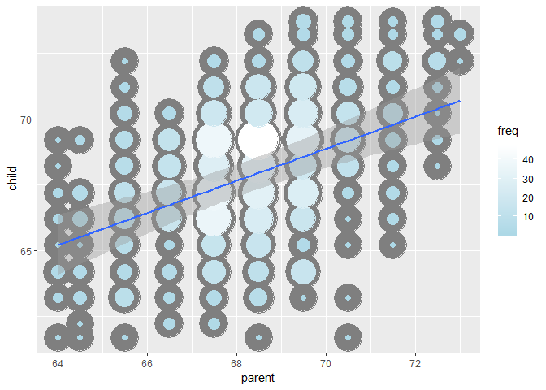

# week 1
# Introduction to regression

## linear model - great start

## material

read simply statistics blog

https://simplystatistics.org

https://github.com/bcaffo/courses/tree/master/07_RegressionModels

https://www.youtube.com/playlist?list=PLpl-gQkQivXjqHAJd2t-J_One_fYE55tC

https://leanpub.com/regmods

http://datasciencespecialization.github.io/ 

### advanced

https://leanpub.com/lm 

## questions for the class

* use simple relations - parents and child heights
* find parsimonious, easily described mean relationship
* quantify what genotype info has beyond parental height in child height
* how we take data and generalize? what assumptions are needed for this?
* why there is a regression to the mean?

### install regression models _SWIRL_

`
install_from_swirl("Regression Models")
`
Galton data

Looking at distributions


```r
require("UsingR")
require(ggplot2)
require(reshape2)
data("galton")
library(dplyr)
```

```
## Warning: package 'dplyr' was built under R version 3.5.2
```

```
## 
## Attaching package: 'dplyr'
```

```
## The following objects are masked from 'package:Hmisc':
## 
##     src, summarize
```

```
## The following object is masked from 'package:MASS':
## 
##     select
```

```
## The following objects are masked from 'package:stats':
## 
##     filter, lag
```

```
## The following objects are masked from 'package:base':
## 
##     intersect, setdiff, setequal, union
```

```r
long <- melt(galton)
```

```
## No id variables; using all as measure variables
```

```r
g <- ggplot(long, aes(x = value, fill = variable))+
    geom_histogram(color="black",
                   binwidth = 1)+
    facet_grid(.~variable)
g
```

<!-- -->

### finding the middle with least squares

$\mu$
  that minimizes $$\sum_{i=1}^n (Y_i - \mu)^2$$


```r
require(manipulate)
```

```
## Loading required package: manipulate
```

```
## Warning: package 'manipulate' was built under R version 3.5.2
```

```r
myHist <- function(mu) {
    mse <- mean((galton$child - mu) ^ 2)
    g <- ggplot(galton, aes(x = child)) +
        geom_histogram(fill = "salmon", binwidth = 1) +
        geom_vline(xintercept = mu, size = 3) +
        ggtitle(paste("mu =", mu, ", MSE = ", round(mse, 2), sep = ""))
    g
}
#manipulate(myHist(mu), mu=slider(62, 74, step = 0.1))

## true mean
g <- ggplot(galton, aes(x = child)) +
    geom_histogram(fill = "salmon",
                   binwidth = 1,
                   color = "black") +
    geom_vline(xintercept = mean(galton$child), size = 3)
g
```

<!-- -->


```r
ggplot(galton, aes(x = parent, y = child)) +
    geom_jitter()
```

<!-- -->

```r
freqData <- as.data.frame(table(galton$child, galton$parent))
names(freqData) <- c("child", "parent", "freq")
freqData$child <- as.numeric(as.character(freqData$child))
freqData$parent <- as.numeric(as.character(freqData$parent))
g <- ggplot(filter(freqData, freq > 0), aes(x = parent, y = child))
g <- g  + scale_size(range = c(2, 20), guide = "none" )
g <- g + geom_point(colour="grey50", aes(size = freq+20, show_guide = FALSE))
```

```
## Warning: Ignoring unknown aesthetics: show_guide
```

```r
g <- g + geom_point(aes(colour=freq, size = freq))
g <- g + scale_colour_gradient(low = "lightblue", high="white")                    
g
```

<!-- -->

### Regreassion through the origin.

Consider picking the slope $\beta$ that minimizes $$\sum_{i=1}^n (Y_i - X_i \beta)^2$$


### In the next few lectures we'll talk about why this is the solution

```r
lm(I(child - mean(child))~ I(parent - mean(parent)) - 1, data = galton)
```

```
## 
## Call:
## lm(formula = I(child - mean(child)) ~ I(parent - mean(parent)) - 
##     1, data = galton)
## 
## Coefficients:
## I(parent - mean(parent))  
##                   0.6463
```

## Basic notation and background 

### Variance

Define the empirical variance as 
$$
S^2 = \frac{1}{n-1} \sum_{i=1}^n (X_i - \bar X)^2 
= \frac{1}{n-1} \left( \sum_{i=1}^n X_i^2 - n \bar X ^ 2 \right)
$$
 
The empirical standard deviation is defined as
$S = \sqrt{S^2}$. Notice that the standard deviation has the same units as the data.

The data defined by $X_i / s$ have empirical standard deviation 1. This is called "scaling" the data.

## Normalization

The data defined by
$$
Z_i = \frac{X_i - \bar X}{s}
$$

have empirical mean zero and empirical standard deviation 1. 

## The empirical covariance
 Consider now when we have pairs of data, $(X_i, Y_i)$.

 Their empirical covariance is 
$$
Cov(X, Y) = 
\frac{1}{n-1}\sum_{i=1}^n (X_i - \bar X) (Y_i - \bar Y)
= \frac{1}{n-1}\left( \sum_{i=1}^n X_i Y_i - n \bar X \bar Y\right)
$$

 The correlation is defined is
$$
Cor(X, Y) = \frac{Cov(X, Y)}{S_x S_y}
$$
where $S_x$ and $S_y$ are the estimates of standard deviations 
for the $X$ observations and $Y$ observations, respectively.

## linear least squares

## Results
* The least squares model fit to the line $Y = \beta_0 + \beta_1 X$ through the data pairs $(X_i, Y_i)$ with $Y_i$ as the outcome obtains the line $Y = \hat \beta_0 + \hat \beta_1 X$ where
  $$\hat \beta_1 = Cor(Y, X) \frac{Sd(Y)}{Sd(X)} ~~~ \hat \beta_0 = \bar Y - \hat \beta_1 \bar X$$
* $\hat \beta_1$ has the units of $Y / X$, $\hat \beta_0$ has the units of $Y$.
* The line passes through the point $(\bar X, \bar Y$)
* The slope of the regression line with $X$ as the outcome and $Y$ as the predictor is $Cor(Y, X) Sd(X)/ Sd(Y)$. 
* The slope is the same one you would get if you centered the data,
$(X_i - \bar X, Y_i - \bar Y)$, and did regression through the origin.
* If you normalized the data, $\{ \frac{X_i - \bar X}{Sd(X)}, \frac{Y_i - \bar Y}{Sd(Y)}\}$, the slope is $Cor(Y, X)$.

## Revisiting Galton's data
### Double check our calculations using R


```r
y <- galton$child
x <- galton$parent
beta1 <- cor(y, x) *  sd(y) / sd(x)
beta0 <- mean(y) - beta1 * mean(x)
rbind(c(beta0, beta1), coef(lm(y ~ x)))
```

```
##      (Intercept)         x
## [1,]    23.94153 0.6462906
## [2,]    23.94153 0.6462906
```
