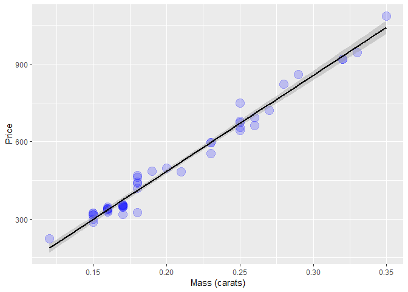
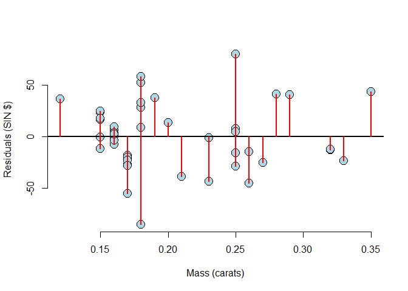
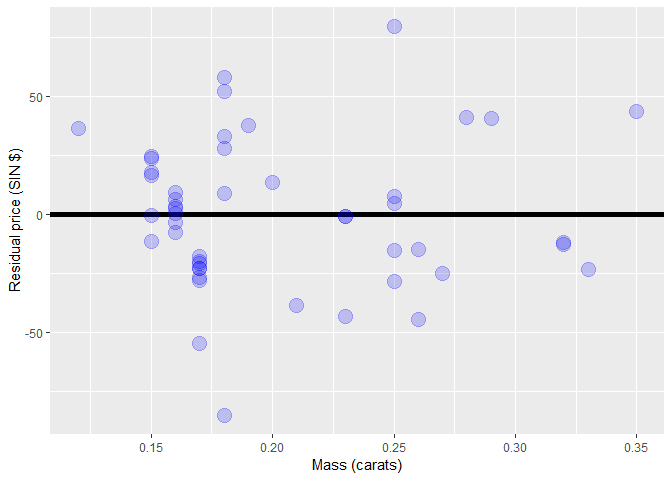
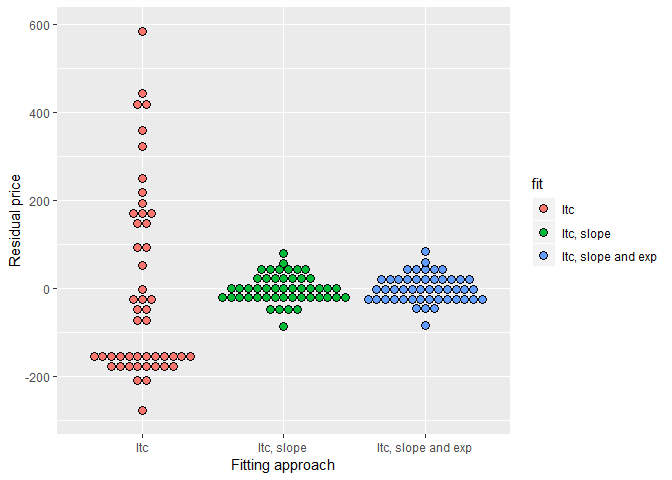
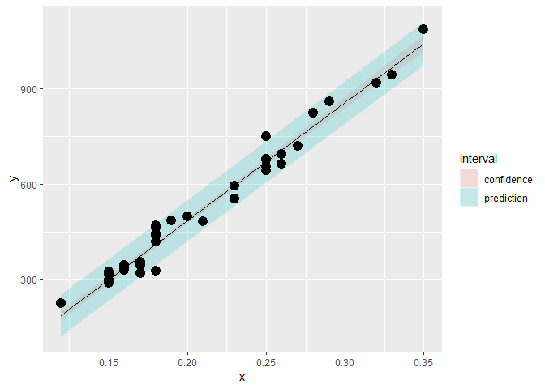

# week 2

## Statistical linear regression models

How do we do inference?

Consider developing a probabilistic model for linear regression
$$
Y_i = \beta_0 + \beta_1 X_i + \epsilon_{i}
$$
Here the $\epsilon_{i}$ are assumed iid $N(0, \sigma^2)$. 

Note, $E[Y_i ~|~ X_i = x_i] = \mu_i = \beta_0 + \beta_1 x_i$

Note, $Var(Y_i ~|~ X_i = x_i) = \sigma^2$.

### Interpretting regression coefficients, the slope
* $\beta_0$ is the expected value of the response when the predictor is 0
* $\beta_1$ is the expected change in response for a 1 unit change in the predictor
$$
E[Y ~|~ X = x+1] - E[Y ~|~ X = x] =
\beta_0 + \beta_1 (x + 1) - (\beta_0 + \beta_1 x ) = \beta_1
$$
* Consider the impact of changing the units of $X$. 
$$
Y_i = \beta_0 + \beta_1 X_i + \epsilon_i
= \beta_0 + \frac{\beta_1}{a} (X_i a) + \epsilon_i
= \beta_0 + \tilde \beta_1 (X_i a) + \epsilon_i
$$
* Therefore, multiplication of $X$ by a factor $a$ results in dividing the coefficient by a factor of $a$. 
* Example: $X$ is height in $m$ and $Y$ is weight in $kg$. Then $\beta_1$ is $kg/m$. Converting $X$ to $cm$ implies multiplying $X$ by $100 cm/m$. To get $\beta_1$ in the right units, we have to divide by $100 cm /m$ to get it to have the right units. 
$$
X m \times \frac{100cm}{m} = (100 X) cm
~~\mbox{and}~~
\beta_1 \frac{kg}{m} \times\frac{1 m}{100cm} = 
\left(\frac{\beta_1}{100}\right)\frac{kg}{cm}
$$


### linear regression for prediciton

Better if X is from the input cloud range.


```r
require(UsingR)
```

```
## Loading required package: UsingR
```

```
## Warning: package 'UsingR' was built under R version 3.5.3
```

```
## Loading required package: MASS
```

```
## Warning: package 'MASS' was built under R version 3.5.3
```

```
## Loading required package: HistData
```

```
## Warning: package 'HistData' was built under R version 3.5.3
```

```
## Loading required package: Hmisc
```

```
## Warning: package 'Hmisc' was built under R version 3.5.3
```

```
## Loading required package: lattice
```

```
## Loading required package: survival
```

```
## Warning: package 'survival' was built under R version 3.5.3
```

```
## Loading required package: Formula
```

```
## Loading required package: ggplot2
```

```
## Warning: package 'ggplot2' was built under R version 3.5.3
```

```
## 
## Attaching package: 'Hmisc'
```

```
## The following objects are masked from 'package:base':
## 
##     format.pval, units
```

```
## 
## Attaching package: 'UsingR'
```

```
## The following object is masked from 'package:survival':
## 
##     cancer
```

```r
data("diamond")
require(ggplot2)
ggplot(diamond, aes(x = carat, y = price))+
    labs( x = "Mass (carats)", y = "Price")+
    geom_point(size = 5, colour = "blue", alpha=0.2)+
    geom_smooth(method = "lm", colour = "black")
```

<!-- -->

```r
fit <- lm(price~carat, data=diamond)
fit
```

```
## 
## Call:
## lm(formula = price ~ carat, data = diamond)
## 
## Coefficients:
## (Intercept)        carat  
##      -259.6       3721.0
```

```r
summary(fit)
```

```
## 
## Call:
## lm(formula = price ~ carat, data = diamond)
## 
## Residuals:
##     Min      1Q  Median      3Q     Max 
## -85.159 -21.448  -0.869  18.972  79.370 
## 
## Coefficients:
##             Estimate Std. Error t value Pr(>|t|)    
## (Intercept)  -259.63      17.32  -14.99   <2e-16 ***
## carat        3721.02      81.79   45.50   <2e-16 ***
## ---
## Signif. codes:  0 '***' 0.001 '**' 0.01 '*' 0.05 '.' 0.1 ' ' 1
## 
## Residual standard error: 31.84 on 46 degrees of freedom
## Multiple R-squared:  0.9783,	Adjusted R-squared:  0.9778 
## F-statistic:  2070 on 1 and 46 DF,  p-value: < 2.2e-16
```

```r
coef(fit)
```

```
## (Intercept)       carat 
##   -259.6259   3721.0249
```

Getting a better interpretable intercept


```r
fit2 <- lm(price ~ I(carat - mean(carat)), diamond)
coef(fit2)
```

```
##            (Intercept) I(carat - mean(carat)) 
##               500.0833              3721.0249
```
Intercept is a price for a mean diamond


```r
fit3 <- lm(price ~ I(carat * 10), diamond)
coef(fit3)
```

```
##   (Intercept) I(carat * 10) 
##     -259.6259      372.1025
```

This is 1/10 th carat.


```r
newx <- c(0.16, 0.27, 0.4)
# manual precition
coef(fit)[1] + coef(fit)[2] * newx
```

```
## [1]  335.7381  745.0508 1228.7840
```

```r
# using predict
predict(fit, newdata = data.frame(carat = newx))
```

```
##         1         2         3 
##  335.7381  745.0508 1228.7840
```

## residuals

###Properties of the residuals

* $E[e_i] = 0$.
* If an intercept is included, $\sum_{i=1}^n e_i = 0$
* If a regressor variable, $X_i$, is included in the model $\sum_{i=1}^n e_i X_i = 0$. 
* Residuals are useful for investigating poor model fit.
* Positive residuals are above the line, negative residuals are below.
* Residuals can be thought of as the outcome ($Y$) with the
  linear association of the predictor ($X$) removed.
* One differentiates residual variation (variation after removing
the predictor) from systematic variation (variation explained by the regression model).
* Residual plots highlight poor model fit.


```r
data("diamond")
y <- diamond$price
x <- diamond$carat
n <- length(y)
fit <- lm(y ~ x)
e <- resid(fit)
yhat <- predict(fit)
max(abs(e - (y - yhat)))
```

```
## [1] 9.485746e-13
```

```r
max(abs(e - (y - coef(fit)[1] - coef(fit)[2] * x)))
```

```
## [1] 9.485746e-13
```


```r
plot(x, e,  
     xlab = "Mass (carats)", 
     ylab = "Residuals (SIN $)", 
     bg = "lightblue", 
     col = "black", cex = 2, pch = 21,frame = FALSE)
abline(h = 0, lwd = 2)
for (i in 1 : n) 
  lines(c(x[i], x[i]), c(e[i], 0), col = "red" , lwd = 2)
```

<!-- -->
### Diamond data residual plot


```r
diamond$e <- resid(lm(price ~ carat, data = diamond))
g = ggplot(diamond, aes(x = carat, y = e))
g = g + xlab("Mass (carats)")
g = g + ylab("Residual price (SIN $)")
g = g + geom_hline(yintercept = 0, size = 2)
g = g + geom_point(size = 5, colour = "blue", alpha=0.2)
g
```

<!-- -->
### Diamond data residual plot mean model vs linear model


```r
e = c(resid(lm(price ~ 1, data = diamond)),
      resid(lm(price ~ carat, data = diamond)),
      resid(lm(price~ I(carat)+I(exp(carat)), data = diamond)))
fit = factor(c(rep("Itc", nrow(diamond)),
               rep("Itc, slope", nrow(diamond)),
               rep("Itc, slope and exp", nrow(diamond))))
g = ggplot(data.frame(e = e, fit = fit), aes(y = e, x = fit, fill = fit))
g = g + geom_dotplot(binaxis = "y", size = 2, stackdir = "center", binwidth = 20)
```

```
## Warning: Ignoring unknown parameters: size
```

```r
g = g + xlab("Fitting approach")
g = g + ylab("Residual price")
g
```

<!-- -->

## residual variance

- The total variability in our response is the variability around an intercept
(think mean only regression) $\sum_{i=1}^n (Y_i - \bar Y)^2$
- The regression variability is the variability that is explained by adding the
predictor $\sum_{i=1}^n  (\hat Y_i - \bar Y)^2$
- The error variability is what's leftover around the regression line
$\sum_{i=1}^n (Y_i - \hat Y_i)^2$
- Neat fact
$$
\sum_{i=1}^n (Y_i - \bar Y)^2 
= \sum_{i=1}^n (Y_i - \hat Y_i)^2 + \sum_{i=1}^n  (\hat Y_i - \bar Y)^2 
$$

### R squared
- R squared is the percentage of the total variability that is explained
by the linear relationship with the predictor
$$
R^2 = \frac{\sum_{i=1}^n  (\hat Y_i - \bar Y)^2}{\sum_{i=1}^n (Y_i - \bar Y)^2}
$$

* $R^2$ is the sample correlation squared.

Statistics like $\frac{\hat \theta - \theta}{\hat \sigma_{\hat \theta}}$ often have the following properties.
    1. Is normally distributed and has a finite sample Student's T distribution if the  variance is replaced with a sample estimate (under normality assumptions).
    3. Can be used to test $H_0 : \theta = \theta_0$ versus $H_a : \theta >, <, \neq \theta_0$.
    4. Can be used to create a confidence interval for $\theta$ via $\hat \theta \pm Q_{1-\alpha/2} \hat \sigma_{\hat \theta}$
    where $Q_{1-\alpha/2}$ is the relevant quantile from either a normal or T distribution.
    

```r
library(UsingR)
data(diamond)
y <- diamond$price
x <- diamond$carat
n <- length(y)
beta1 <- cor(y, x) * sd(y) / sd(x)
beta0 <- mean(y) - beta1 * mean(x)
e <- y - beta0 - beta1 * x
sigma <- sqrt(sum(e ^ 2) / (n - 2))
ssx <- sum((x - mean(x)) ^ 2)
seBeta0 <- (1 / n + mean(x) ^ 2 / ssx) ^ .5 * sigma
seBeta1 <- sigma / sqrt(ssx)
tBeta0 <- beta0 / seBeta0
tBeta1 <- beta1 / seBeta1
pBeta0 <- 2 * pt(abs(tBeta0), df = n - 2, lower.tail = FALSE)
pBeta1 <- 2 * pt(abs(tBeta1), df = n - 2, lower.tail = FALSE)
coefTable <-
    rbind(c(beta0, seBeta0, tBeta0, pBeta0),
          c(beta1, seBeta1, tBeta1, pBeta1))
colnames(coefTable) <-
    c("Estimate", "Std. Error", "t value", "P(>|t|)")
rownames(coefTable) <- c("(Intercept)", "x")
## easy
coefTable
```

```
##              Estimate Std. Error   t value      P(>|t|)
## (Intercept) -259.6259   17.31886 -14.99094 2.523271e-19
## x           3721.0249   81.78588  45.49715 6.751260e-40
```

```r
fit <- lm(y ~ x); 
summary(fit)$coefficients
```

```
##              Estimate Std. Error   t value     Pr(>|t|)
## (Intercept) -259.6259   17.31886 -14.99094 2.523271e-19
## x           3721.0249   81.78588  45.49715 6.751260e-40
```

```r
summary(fit)
```

```
## 
## Call:
## lm(formula = y ~ x)
## 
## Residuals:
##     Min      1Q  Median      3Q     Max 
## -85.159 -21.448  -0.869  18.972  79.370 
## 
## Coefficients:
##             Estimate Std. Error t value Pr(>|t|)    
## (Intercept)  -259.63      17.32  -14.99   <2e-16 ***
## x            3721.02      81.79   45.50   <2e-16 ***
## ---
## Signif. codes:  0 '***' 0.001 '**' 0.01 '*' 0.05 '.' 0.1 ' ' 1
## 
## Residual standard error: 31.84 on 46 degrees of freedom
## Multiple R-squared:  0.9783,	Adjusted R-squared:  0.9778 
## F-statistic:  2070 on 1 and 46 DF,  p-value: < 2.2e-16
```

## Getting a confidence interval

```r
sumCoef <- summary(fit)$coefficients
sumCoef[1,1] + c(-1, 1) * qt(.975, df = fit$df) * sumCoef[1, 2]
```

```
## [1] -294.4870 -224.7649
```

```r
sumCoef[2,1] + c(-1, 1) * qt(.975, df = fit$df) * sumCoef[2, 2]
```

```
## [1] 3556.398 3885.651
```
With 95% confidence, we estimate that a 0.1 carat increase in
diamond size results in a 355.6 to 388.6 increase in price in (Singapore) dollars.

# Prediction
## Prediction of outcomes
* Consider predicting $Y$ at a value of $X$
  * Predicting the price of a diamond given the carat
  * Predicting the height of a child given the height of the parents
* The obvious estimate for prediction at point $x_0$ is 
$$
\hat \beta_0 + \hat \beta_1 x_0
$$
* A standard error is needed to create a prediction interval.
* There's a distinction between intervals for the regression
  line at point $x_0$ and the prediction of what a $y$ would be
  at point $x_0$. 
* Line at $x_0$ se, $\hat \sigma\sqrt{\frac{1}{n} +  \frac{(x_0 - \bar X)^2}{\sum_{i=1}^n (X_i - \bar X)^2}}$
* Prediction interval se at $x_0$, $\hat \sigma\sqrt{1 + \frac{1}{n} + \frac{(x_0 - \bar X)^2}{\sum_{i=1}^n (X_i - \bar X)^2}}$


```r
require(ggplot2)
newx <- data.frame(x = seq(min(x), max(x), length = 100))
p1 <-
    data.frame(predict(fit, newdata = newx, interval = ("confidence")))
p2 <-
    data.frame(predict(fit, newdata = newx, interval = ("prediction")))
p1$interval = "confidence"
p2$interval = "prediction"
p1$x <- newx$x
p2$x <- newx$x
dat <- rbind(p1, p2)
names(dat)[1] <- "y"

ggplot(dat, aes(x = x, y = y)) +
    geom_ribbon(aes(ymin = lwr, ymax = upr, fill = interval), alpha = 0.2) +
    geom_line() +
    geom_point(data = data.frame(x = x, y = y), aes(x = x, y = y), size = 4)
```

<!-- -->

We are more confident near the mean than far away from them.

#quiz

```r
#1

x <- c(0.61, 0.93, 0.83, 0.35, 0.54, 0.16, 0.91, 0.62, 0.62)
y <- c(0.67, 0.84, 0.6, 0.18, 0.85, 0.47, 1.1, 0.65, 0.36)
fit <- lm(y ~ x)
summary(fit)
```

```
## 
## Call:
## lm(formula = y ~ x)
## 
## Residuals:
##      Min       1Q   Median       3Q      Max 
## -0.27636 -0.18807  0.01364  0.16595  0.27143 
## 
## Coefficients:
##             Estimate Std. Error t value Pr(>|t|)  
## (Intercept)   0.1885     0.2061   0.914    0.391  
## x             0.7224     0.3107   2.325    0.053 .
## ---
## Signif. codes:  0 '***' 0.001 '**' 0.01 '*' 0.05 '.' 0.1 ' ' 1
## 
## Residual standard error: 0.223 on 7 degrees of freedom
## Multiple R-squared:  0.4358,	Adjusted R-squared:  0.3552 
## F-statistic: 5.408 on 1 and 7 DF,  p-value: 0.05296
```

```r
0.05296
```

```
## [1] 0.05296
```

```r
#2
0.223
```

```
## [1] 0.223
```

```r
#3
data("mtcars")
fit3 <- lm(mtcars$mpg ~ mtcars$wt)
summary(fit3)
```

```
## 
## Call:
## lm(formula = mtcars$mpg ~ mtcars$wt)
## 
## Residuals:
##     Min      1Q  Median      3Q     Max 
## -4.5432 -2.3647 -0.1252  1.4096  6.8727 
## 
## Coefficients:
##             Estimate Std. Error t value Pr(>|t|)    
## (Intercept)  37.2851     1.8776  19.858  < 2e-16 ***
## mtcars$wt    -5.3445     0.5591  -9.559 1.29e-10 ***
## ---
## Signif. codes:  0 '***' 0.001 '**' 0.01 '*' 0.05 '.' 0.1 ' ' 1
## 
## Residual standard error: 3.046 on 30 degrees of freedom
## Multiple R-squared:  0.7528,	Adjusted R-squared:  0.7446 
## F-statistic: 91.38 on 1 and 30 DF,  p-value: 1.294e-10
```

```r
predict(fit3, mean(mtcars$wt))
```

```
##         1         2         3         4         5         6         7 
## 23.282611 21.919770 24.885952 20.102650 18.900144 18.793255 18.205363 
##         8         9        10        11        12        13        14 
## 20.236262 20.450041 18.900144 18.900144 15.533127 17.350247 17.083024 
##        15        16        17        18        19        20        21 
##  9.226650  8.296712  8.718926 25.527289 28.653805 27.478021 24.111004 
##        22        23        24        25        26        27        28 
## 18.472586 18.926866 16.762355 16.735633 26.943574 25.847957 29.198941 
##        29        30        31        32 
## 20.343151 22.480940 18.205363 22.427495
```

```r
data(mtcars)
fit <- lm(mpg ~ I(wt - mean(wt)), data = mtcars)
confint(fit)
```

```
##                      2.5 %    97.5 %
## (Intercept)      18.990982 21.190268
## I(wt - mean(wt)) -6.486308 -4.202635
```

```r
18.991
```

```
## [1] 18.991
```

```r
#4 
#The estimated expected change in mpg per 1,000 lb increase in weight.


#5
fit <- lm(mpg ~ wt, data = mtcars)
newwt <- data.frame(wt=c(3))
predict(fit, newwt, interval = ("prediction"))
```

```
##        fit      lwr      upr
## 1 21.25171 14.92987 27.57355
```

```r
27.57
```

```
## [1] 27.57
```

```r
#6
fit <- lm(mpg ~ I(wt/2), data = mtcars)
confint(fit)
```

```
##                 2.5 %   97.5 %
## (Intercept)  33.45050 41.11975
## I(wt/2)     -12.97262 -8.40527
```

```r
-12.97262
```

```
## [1] -12.97262
```

```r
#7
# smaller unit - bigger slope by 100

#8
#b0-cb1

#9

#0.25 times

fit1 <- lm(mpg ~ wt, data = mtcars)
fit2 <- lm(mpg ~ 1, data = mtcars)

sse1 <- sum((predict(fit1) - mtcars$mpg)^2)
sse2 <- sum((predict(fit2) - mtcars$mpg)^2)
sse1/sse2
```

```
## [1] 0.2471672
```

```r
#10 zero if intercept
```

