# week 3

## Multivariable  regression analyses.

If lots of predictors, not one.

The linear model - linear in coefficients
$$Y_i = \sum^p_{k=1}{X_{ik}\beta_j}+\epsilon_i$$


```r
n = 100
x <- rnorm(n)
x2 <- rnorm(n)
x3 <- rnorm(n)
y <- 1 + x + x2 + x3 + rnorm(n, sd = .1)
ey <- resid(lm(y ~ x2 + x3))
ex <- resid(lm(x ~ x2 + x3))
sum(ey * ex) / sum(ex ^ 2)
```

```
## [1] 0.9847117
```

```r
coef(lm(ey ~ ex - 1))
```

```
##        ex 
## 0.9847117
```

```r
coef(lm(y ~ x + x2 + x3))
```

```
## (Intercept)           x          x2          x3 
##   1.0000499   0.9847117   0.9981139   1.0108964
```

## Fitted values, residuals and residual variation
All of our SLR quantities can be extended to linear models

* Model $Y_i = \sum_{k=1}^p X_{ik} \beta_{k} + \epsilon_{i}$ where $\epsilon_i \sim N(0, \sigma^2)$

* Fitted responses $\hat Y_i = \sum_{k=1}^p X_{ik} \hat \beta_{k}$

* Residuals $e_i = Y_i - \hat Y_i$

* Variance estimate $\hat \sigma^2 = \frac{1}{n-p} \sum_{i=1}^n e_i ^2$

* To get predicted responses at new values, $x_1, \ldots, x_p$, simply plug them into the linear model $\sum_{k=1}^p x_{k} \hat \beta_{k}$

* Coefficients have standard errors, $\hat \sigma_{\hat \beta_k}$, and
$\frac{\hat \beta_k - \beta_k}{\hat \sigma_{\hat \beta_k}}$
follows a $T$ distribution with $n-p$ degrees of freedom.

* Predicted responses have standard errors and we can calculate predicted and expected response intervals.


```r
require(datasets)
data("swiss")
require(GGally)
```

```
## Loading required package: GGally
```

```
## Warning: package 'GGally' was built under R version 3.5.3
```

```
## Loading required package: ggplot2
```

```
## Warning: package 'ggplot2' was built under R version 3.5.2
```

```r
require(ggplot2)
ggpairs(swiss, lower = list(continuous = wrap("smooth", method = "loess")))
```

<!-- -->

```r
#fitting all
summary(lm(Fertility~., data = swiss))
```

```
## 
## Call:
## lm(formula = Fertility ~ ., data = swiss)
## 
## Residuals:
##      Min       1Q   Median       3Q      Max 
## -15.2743  -5.2617   0.5032   4.1198  15.3213 
## 
## Coefficients:
##                  Estimate Std. Error t value Pr(>|t|)    
## (Intercept)      66.91518   10.70604   6.250 1.91e-07 ***
## Agriculture      -0.17211    0.07030  -2.448  0.01873 *  
## Examination      -0.25801    0.25388  -1.016  0.31546    
## Education        -0.87094    0.18303  -4.758 2.43e-05 ***
## Catholic          0.10412    0.03526   2.953  0.00519 ** 
## Infant.Mortality  1.07705    0.38172   2.822  0.00734 ** 
## ---
## Signif. codes:  0 '***' 0.001 '**' 0.01 '*' 0.05 '.' 0.1 ' ' 1
## 
## Residual standard error: 7.165 on 41 degrees of freedom
## Multiple R-squared:  0.7067,	Adjusted R-squared:  0.671 
## F-statistic: 19.76 on 5 and 41 DF,  p-value: 5.594e-10
```

```r
summary(lm(Fertility~., data = swiss))$coefficients
```

```
##                    Estimate  Std. Error   t value     Pr(>|t|)
## (Intercept)      66.9151817 10.70603759  6.250229 1.906051e-07
## Agriculture      -0.1721140  0.07030392 -2.448142 1.872715e-02
## Examination      -0.2580082  0.25387820 -1.016268 3.154617e-01
## Education        -0.8709401  0.18302860 -4.758492 2.430605e-05
## Catholic          0.1041153  0.03525785  2.952969 5.190079e-03
## Infant.Mortality  1.0770481  0.38171965  2.821568 7.335715e-03
```

```r
#only one result
summary(lm(Fertility~Agriculture, data = swiss))
```

```
## 
## Call:
## lm(formula = Fertility ~ Agriculture, data = swiss)
## 
## Residuals:
##      Min       1Q   Median       3Q      Max 
## -25.5374  -7.8685  -0.6362   9.0464  24.4858 
## 
## Coefficients:
##             Estimate Std. Error t value Pr(>|t|)    
## (Intercept) 60.30438    4.25126  14.185   <2e-16 ***
## Agriculture  0.19420    0.07671   2.532   0.0149 *  
## ---
## Signif. codes:  0 '***' 0.001 '**' 0.01 '*' 0.05 '.' 0.1 ' ' 1
## 
## Residual standard error: 11.82 on 45 degrees of freedom
## Multiple R-squared:  0.1247,	Adjusted R-squared:  0.1052 
## F-statistic: 6.409 on 1 and 45 DF,  p-value: 0.01492
```

How can adjustment reverse the sign of an effect? Let's try a simulation.

```r
n <- 100; x2 <- 1 : n; x1 <- .01 * x2 + runif(n, -.1, .1); y = -x1 + x2 + rnorm(n, sd = .01)
summary(lm(y ~ x1))$coef
```

```
##              Estimate Std. Error   t value     Pr(>|t|)
## (Intercept)  1.703034   1.107872  1.537213 1.274638e-01
## x1          97.524206   1.934407 50.415564 6.713306e-72
```

```r
summary(lm(y ~ x1 + x2))$coef
```

```
##                 Estimate   Std. Error      t value      Pr(>|t|)
## (Intercept) -0.001254677 0.0019143720   -0.6553986  5.137625e-01
## x1          -1.008029572 0.0173129986  -58.2238580  2.902944e-77
## x2           1.000083659 0.0001724962 5797.7155396 1.697791e-270
```

---
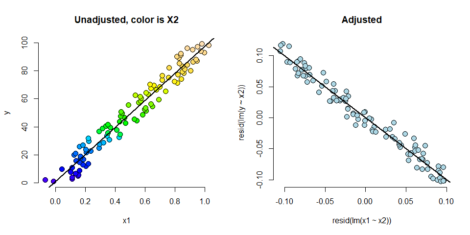<!-- -->

## Dummy variables

More than 2 levels

* Consider a multilevel factor level. For didactic reasons, let's say a three level factor (example, US political party affiliation: Republican, Democrat, Independent)

* $Y_i = \beta_0 + X_{i1} \beta_1 + X_{i2} \beta_2 + \epsilon_i$.

* $X_{i1}$ is 1 for Republicans and 0 otherwise.

* $X_{i2}$ is 1 for Democrats and 0 otherwise.

* If $i$ is Republican $E[Y_i] = \beta_0 +\beta_1$

* If $i$ is Democrat $E[Y_i] = \beta_0 + \beta_2$.

* If $i$ is Independent $E[Y_i] = \beta_0$. 

* $\beta_1$ compares Republicans to Independents.

* $\beta_2$ compares Democrats to Independents.

* $\beta_1 - \beta_2$ compares Republicans to Democrats.

* (Choice of reference category changes the interpretation.)


```r
require(datasets)
data(InsectSprays)
require(stats)
require(graphics)
ggplot(data = InsectSprays, aes(y = count, x = spray, fill = spray)) +
    geom_violin(colour = "black", size = 1) +
    xlab("Type of spray") + ylab("insect count")
```

<!-- -->

```r
# model
summary(lm(count~spray, data = InsectSprays))
```

```
## 
## Call:
## lm(formula = count ~ spray, data = InsectSprays)
## 
## Residuals:
##    Min     1Q Median     3Q    Max 
## -8.333 -1.958 -0.500  1.667  9.333 
## 
## Coefficients:
##             Estimate Std. Error t value Pr(>|t|)    
## (Intercept)  14.5000     1.1322  12.807  < 2e-16 ***
## sprayB        0.8333     1.6011   0.520    0.604    
## sprayC      -12.4167     1.6011  -7.755 7.27e-11 ***
## sprayD       -9.5833     1.6011  -5.985 9.82e-08 ***
## sprayE      -11.0000     1.6011  -6.870 2.75e-09 ***
## sprayF        2.1667     1.6011   1.353    0.181    
## ---
## Signif. codes:  0 '***' 0.001 '**' 0.01 '*' 0.05 '.' 0.1 ' ' 1
## 
## Residual standard error: 3.922 on 66 degrees of freedom
## Multiple R-squared:  0.7244,	Adjusted R-squared:  0.7036 
## F-statistic:  34.7 on 5 and 66 DF,  p-value: < 2.2e-16
```

```r
#without intercept
summary(lm(count~spray -1, data = InsectSprays))
```

```
## 
## Call:
## lm(formula = count ~ spray - 1, data = InsectSprays)
## 
## Residuals:
##    Min     1Q Median     3Q    Max 
## -8.333 -1.958 -0.500  1.667  9.333 
## 
## Coefficients:
##        Estimate Std. Error t value Pr(>|t|)    
## sprayA   14.500      1.132  12.807  < 2e-16 ***
## sprayB   15.333      1.132  13.543  < 2e-16 ***
## sprayC    2.083      1.132   1.840  0.07024 .  
## sprayD    4.917      1.132   4.343 4.95e-05 ***
## sprayE    3.500      1.132   3.091  0.00292 ** 
## sprayF   16.667      1.132  14.721  < 2e-16 ***
## ---
## Signif. codes:  0 '***' 0.001 '**' 0.01 '*' 0.05 '.' 0.1 ' ' 1
## 
## Residual standard error: 3.922 on 66 degrees of freedom
## Multiple R-squared:  0.9003,	Adjusted R-squared:  0.8912 
## F-statistic: 99.33 on 6 and 66 DF,  p-value: < 2.2e-16
```
Hardcode dummy - I are instances.
Reference level is "C"

```r
summary(lm(count ~
               I(1 * (spray == 'A')) +
               I(1 * (spray == 'B')) +
               I(1 * (spray == 'D')) +
               I(1 * (spray == 'E')) +
               I(1 * (spray == 'F'))
           , data = InsectSprays))
```

```
## 
## Call:
## lm(formula = count ~ I(1 * (spray == "A")) + I(1 * (spray == 
##     "B")) + I(1 * (spray == "D")) + I(1 * (spray == "E")) + I(1 * 
##     (spray == "F")), data = InsectSprays)
## 
## Residuals:
##    Min     1Q Median     3Q    Max 
## -8.333 -1.958 -0.500  1.667  9.333 
## 
## Coefficients:
##                       Estimate Std. Error t value Pr(>|t|)    
## (Intercept)              2.083      1.132   1.840   0.0702 .  
## I(1 * (spray == "A"))   12.417      1.601   7.755 7.27e-11 ***
## I(1 * (spray == "B"))   13.250      1.601   8.276 8.51e-12 ***
## I(1 * (spray == "D"))    2.833      1.601   1.770   0.0814 .  
## I(1 * (spray == "E"))    1.417      1.601   0.885   0.3795    
## I(1 * (spray == "F"))   14.583      1.601   9.108 2.79e-13 ***
## ---
## Signif. codes:  0 '***' 0.001 '**' 0.01 '*' 0.05 '.' 0.1 ' ' 1
## 
## Residual standard error: 3.922 on 66 degrees of freedom
## Multiple R-squared:  0.7244,	Adjusted R-squared:  0.7036 
## F-statistic:  34.7 on 5 and 66 DF,  p-value: < 2.2e-16
```
Better way to relevel:


```r
spray2 <- relevel(InsectSprays$spray,"C")
summary(lm(count~spray2, data = InsectSprays))
```

```
## 
## Call:
## lm(formula = count ~ spray2, data = InsectSprays)
## 
## Residuals:
##    Min     1Q Median     3Q    Max 
## -8.333 -1.958 -0.500  1.667  9.333 
## 
## Coefficients:
##             Estimate Std. Error t value Pr(>|t|)    
## (Intercept)    2.083      1.132   1.840   0.0702 .  
## spray2A       12.417      1.601   7.755 7.27e-11 ***
## spray2B       13.250      1.601   8.276 8.51e-12 ***
## spray2D        2.833      1.601   1.770   0.0814 .  
## spray2E        1.417      1.601   0.885   0.3795    
## spray2F       14.583      1.601   9.108 2.79e-13 ***
## ---
## Signif. codes:  0 '***' 0.001 '**' 0.01 '*' 0.05 '.' 0.1 ' ' 1
## 
## Residual standard error: 3.922 on 66 degrees of freedom
## Multiple R-squared:  0.7244,	Adjusted R-squared:  0.7036 
## F-statistic:  34.7 on 5 and 66 DF,  p-value: < 2.2e-16
```

Fitting multiple lines. ANCOVA

```r
require(datasets)
data("swiss")
hist(swiss$Catholic)
```

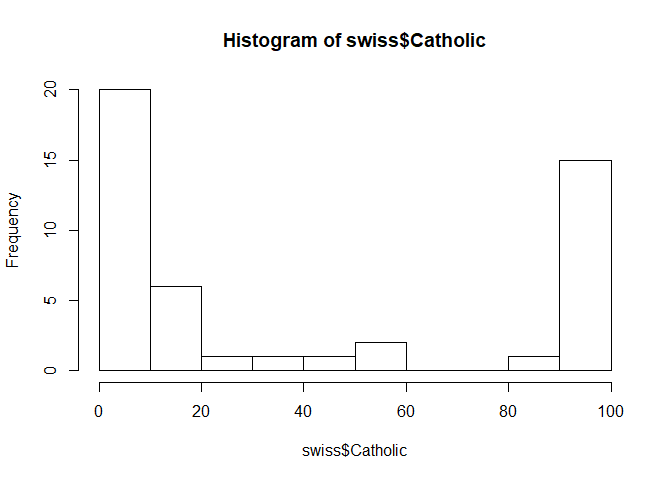<!-- -->

```r
library(dplyr)
```

```
## Warning: package 'dplyr' was built under R version 3.5.2
```

```
## 
## Attaching package: 'dplyr'
```

```
## The following object is masked from 'package:GGally':
## 
##     nasa
```

```
## The following objects are masked from 'package:stats':
## 
##     filter, lag
```

```
## The following objects are masked from 'package:base':
## 
##     intersect, setdiff, setequal, union
```

```r
swiss <- swiss %>% mutate(CatholicBin = 1 * (Catholic > 50))

g <-
    ggplot(swiss, aes(
        x = Agriculture,
        y = Fertility,
        colour = factor(CatholicBin)
    )) +
    geom_point (size = 4, alpha = 0.75)

g
```

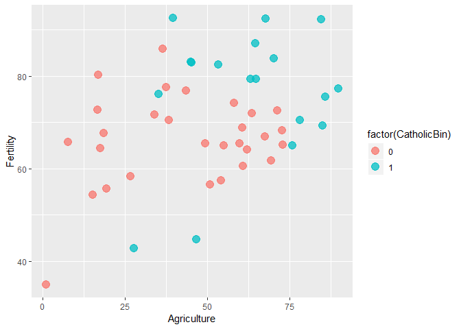<!-- -->

Could mace a factor - with x2 = 1 for CatholicBin


```r
fit <- lm(Fertility ~ Agriculture, data = swiss)
g1 <- g +
    geom_abline(intercept = coef(fit)[1], slope = coef(fit)[2], size = 2)
g1
```

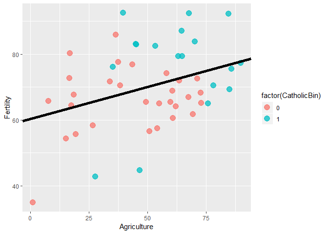<!-- -->

```r
summary(fit)
```

```
## 
## Call:
## lm(formula = Fertility ~ Agriculture, data = swiss)
## 
## Residuals:
##      Min       1Q   Median       3Q      Max 
## -25.5374  -7.8685  -0.6362   9.0464  24.4858 
## 
## Coefficients:
##             Estimate Std. Error t value Pr(>|t|)    
## (Intercept) 60.30438    4.25126  14.185   <2e-16 ***
## Agriculture  0.19420    0.07671   2.532   0.0149 *  
## ---
## Signif. codes:  0 '***' 0.001 '**' 0.01 '*' 0.05 '.' 0.1 ' ' 1
## 
## Residual standard error: 11.82 on 45 degrees of freedom
## Multiple R-squared:  0.1247,	Adjusted R-squared:  0.1052 
## F-statistic: 6.409 on 1 and 45 DF,  p-value: 0.01492
```

```r
fit <-
    lm(Fertility ~ Agriculture + factor(CatholicBin), data = swiss)
g1 <- g +
    geom_abline(intercept = coef(fit)[1],
                slope = coef(fit)[2],
                size = 2)
g1 <- g1 +
    geom_abline(
        intercept = coef(fit)[1] + coef(fit)[3],
        slope = coef(fit)[2],
        size = 2
    )
g1
```

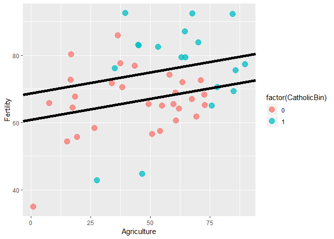<!-- -->

```r
summary(fit)
```

```
## 
## Call:
## lm(formula = Fertility ~ Agriculture + factor(CatholicBin), data = swiss)
## 
## Residuals:
##     Min      1Q  Median      3Q     Max 
## -29.803  -6.701   1.382   6.855  20.435 
## 
## Coefficients:
##                      Estimate Std. Error t value Pr(>|t|)    
## (Intercept)           60.8322     4.1059  14.816   <2e-16 ***
## Agriculture            0.1242     0.0811   1.531   0.1329    
## factor(CatholicBin)1   7.8843     3.7484   2.103   0.0412 *  
## ---
## Signif. codes:  0 '***' 0.001 '**' 0.01 '*' 0.05 '.' 0.1 ' ' 1
## 
## Residual standard error: 11.39 on 44 degrees of freedom
## Multiple R-squared:  0.2046,	Adjusted R-squared:  0.1685 
## F-statistic:  5.66 on 2 and 44 DF,  p-value: 0.006492
```

With interaction

```r
fit <-
    lm(Fertility ~ Agriculture * factor(CatholicBin), data = swiss) #fits all interaction
g1 <- g +
    geom_abline(intercept = coef(fit)[1],
                slope = coef(fit)[2],
                size = 2)
g1 <- g1 +
    geom_abline(
        intercept = coef(fit)[1] + coef(fit)[3],
        slope = coef(fit)[2] + coef(fit)[4],
        size = 2
    )
g1
```

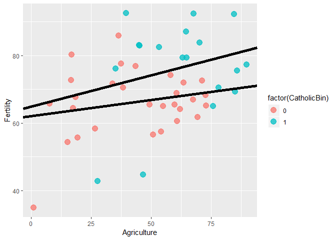<!-- -->

```r
summary(fit)
```

```
## 
## Call:
## lm(formula = Fertility ~ Agriculture * factor(CatholicBin), data = swiss)
## 
## Residuals:
##     Min      1Q  Median      3Q     Max 
## -28.840  -6.668   1.016   7.092  20.242 
## 
## Coefficients:
##                                  Estimate Std. Error t value Pr(>|t|)    
## (Intercept)                      62.04993    4.78916  12.956   <2e-16 ***
## Agriculture                       0.09612    0.09881   0.973    0.336    
## factor(CatholicBin)1              2.85770   10.62644   0.269    0.789    
## Agriculture:factor(CatholicBin)1  0.08914    0.17611   0.506    0.615    
## ---
## Signif. codes:  0 '***' 0.001 '**' 0.01 '*' 0.05 '.' 0.1 ' ' 1
## 
## Residual standard error: 11.49 on 43 degrees of freedom
## Multiple R-squared:  0.2094,	Adjusted R-squared:  0.1542 
## F-statistic: 3.795 on 3 and 43 DF,  p-value: 0.01683
```

Adding adjustments

## Consider the following simulated data
Code for the first plot, rest omitted


```r
n <-
    100
t <- rep(c(0, 1), c(n / 2, n / 2))
x <- c(runif(n / 2), runif(n / 2))

beta0 <- 0
beta1 <- 2
tau <- 1
sigma <- .2
y <- beta0 + x * beta1 + t * tau + rnorm(n, sd = sigma)
plot(x, y, type = "n", frame = FALSE)
abline(lm(y ~ x), lwd = 2)
abline(h = mean(y[1:(n / 2)]), lwd = 3)
abline(h = mean(y[(n / 2 + 1):n]), lwd = 3)
fit <- lm(y ~ x + t)
abline(coef(fit)[1], coef(fit)[2], lwd = 3)
abline(coef(fit)[1] + coef(fit)[3], coef(fit)[2], lwd = 3)
points(
    x[1:(n / 2)],
    y[1:(n / 2)],
    pch = 21,
    col = "black",
    bg = "lightblue",
    cex = 2
)
points(
    x[(n / 2 + 1):n],
    y[(n / 2 + 1):n],
    pch = 21,
    col = "black",
    bg = "salmon",
    cex = 2
)
```

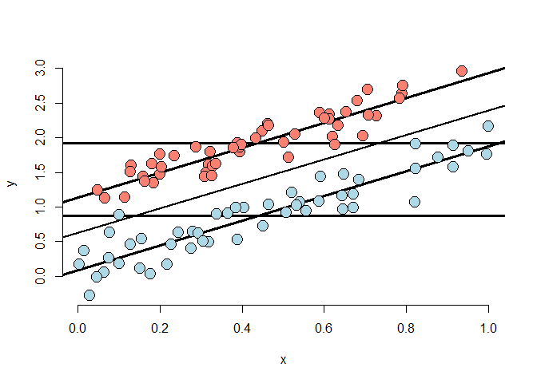<!-- -->

## Simulation 2
strong marginal effect when disregard effect, very subtle effect if adjust for X
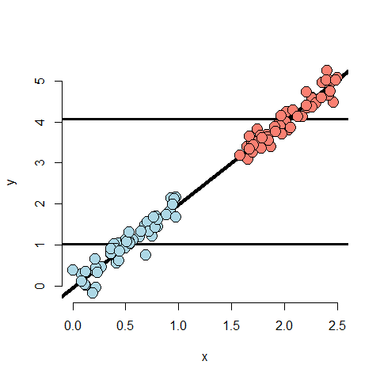<!-- -->

## Simulation 3 
illustration of simpson's paradox
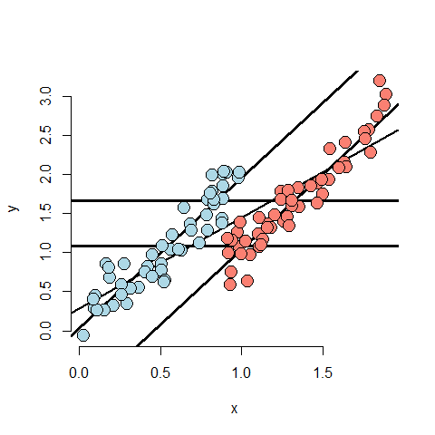<!-- -->

## Simulation 4
no marginal effect, but a huge effect, when adjust for X
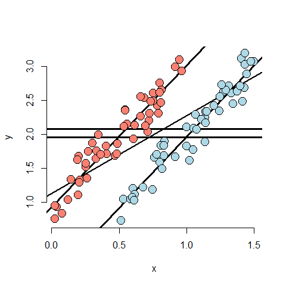<!-- -->

## Simulation 5
This will be wrong if we think that slopes are equeal - need to have an interaction term
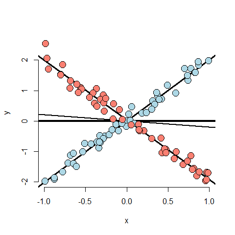<!-- -->

### Simulation 6
Binary treatment - not necessary.

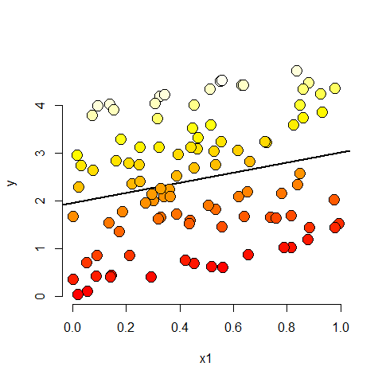<!-- -->

Need to look in 3d


```r
library(rgl)
```

```
## Warning: package 'rgl' was built under R version 3.5.3
```

```r
plot3d(x1, x2, y)
```
