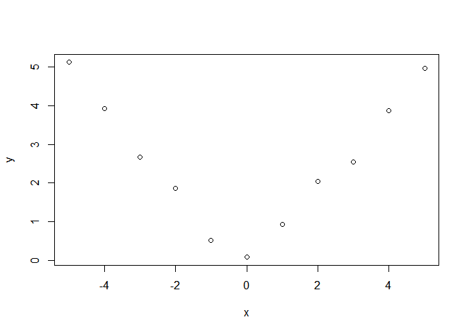

# week 4

swirl

10. Variance Inflation Factors
11. Overfitting and Underfitting
12. Binary Outcomes
13. Count Outcomes


VIF is the square of standard error inflation.

anova to assess the significance of the two added regressors
The three asterisks, ***, at the lower right of the printed table indicate that the null hypothesis is rejected at the 0.001 level, so at
| least one of the two additional regressors is significant

`anova(fit1, fit3)`
but 
Model residuals should be tested for normality.
normality test
shapiro.test(fit3$residuals)


deviance(model), calculates the residual sum of squares

`all.equal(lhs,rhs)`
var(data)=var(estimate)+var(residuals)

## binary results
logit model, logistic regression
$log(p/(1-p)) = b0 + b1*score$ . The link function, $log(p/(1-p))$

## count outcomes
Poisson process

http://jtleek.com/codedata.html

class test `class(hits[,'date'])`

` mdl <- glm(visits ~ date, poisson, hits)`
poisson regression - result is a number

confidence interval vor logit regression
`exp(confint(mdl,'date'))`

offset
`mdl2 <- glm(formula = simplystats ~ date, family = poisson, data = hits, offset = log(visits + 1))`

#Lectures
Logistic regression
Binomial random variables and binary


```r
load("./ravensData.rda")
head(ravensData)
```

```
##   ravenWinNum ravenWin ravenScore opponentScore
## 1           1        W         24             9
## 2           1        W         38            35
## 3           1        W         28            13
## 4           1        W         34            31
## 5           1        W         44            13
## 6           0        L         23            24
```

__Log odds $(-\infty,\infty)$__

$$\ln\left(\frac{\rm{Pr}(RW_i | RS_i, b_0, b_1 )}{1-\rm{Pr}(RW_i | RS_i, b_0, b_1)}\right)$$ 
$$Odds=\frac{p}{1-p} $$
$$P=\frac{Odds}{1-Odds} $$
logit == log of the odds.


__Logistic__

$$ \rm{Pr}(RW_i | RS_i, b_0, b_1) = \frac{\exp(b_0 + b_1 RS_i)}{1 + \exp(b_0 + b_1 RS_i)}$$

or

$$ \ln\left(\frac{\rm{Pr}(RW_i | RS_i, b_0, b_1 )}{1-\rm{Pr}(RW_i | RS_i, b_0, b_1)}\right) = b_0 + b_1 RS_i $$
$b_0$ - Log odds of a Ravens win if they score zero points
$$\frac{exp(b_0)}{1-exp(b_0)} = probability of winnin with 0 points$$
$b_1$ - Log odds ratio of win probability for each point scored (compared to zero points)

$exp(b_1)$ ration of increase per 1 point

## Ravens logistic regression


```r
logRegRavens <-
    glm(ravensData$ravenWinNum ~ ravensData$ravenScore, family = "binomial")
summary(logRegRavens)
```

```
## 
## Call:
## glm(formula = ravensData$ravenWinNum ~ ravensData$ravenScore, 
##     family = "binomial")
## 
## Deviance Residuals: 
##     Min       1Q   Median       3Q      Max  
## -1.7575  -1.0999   0.5305   0.8060   1.4947  
## 
## Coefficients:
##                       Estimate Std. Error z value Pr(>|z|)
## (Intercept)           -1.68001    1.55412  -1.081     0.28
## ravensData$ravenScore  0.10658    0.06674   1.597     0.11
## 
## (Dispersion parameter for binomial family taken to be 1)
## 
##     Null deviance: 24.435  on 19  degrees of freedom
## Residual deviance: 20.895  on 18  degrees of freedom
## AIC: 24.895
## 
## Number of Fisher Scoring iterations: 5
```

## Ravens fitted values


```r
plot(ravensData$ravenScore,logRegRavens$fitted,pch=19,col="blue",xlab="Score",ylab="Prob Ravens Win")
```

<!-- -->

## Odds ratios and confidence intervals


```r
exp(logRegRavens$coeff)
```

```
##           (Intercept) ravensData$ravenScore 
##             0.1863724             1.1124694
```

```r
## 11% increase per score
exp(confint(logRegRavens))  ##- odds ratio
```

```
## Waiting for profiling to be done...
```

```
##                             2.5 %   97.5 %
## (Intercept)           0.005674966 3.106384
## ravensData$ravenScore 0.996229662 1.303304
```


confidence interval - includes 1, increase in score is not significant

## ANOVA for logistic regression


```r
anova(logRegRavens,test="Chisq")
```

```
## Analysis of Deviance Table
## 
## Model: binomial, link: logit
## 
## Response: ravensData$ravenWinNum
## 
## Terms added sequentially (first to last)
## 
## 
##                       Df Deviance Resid. Df Resid. Dev Pr(>Chi)  
## NULL                                     19     24.435           
## ravensData$ravenScore  1   3.5398        18     20.895  0.05991 .
## ---
## Signif. codes:  0 '***' 0.001 '**' 0.01 '*' 0.05 '.' 0.1 ' ' 1
```

### Interpreting Odds Ratios

* Not probabilities 
* Odds ratio of 1 = no difference in odds
* Log odds ratio of 0 = no difference in odds
* Odds ratio < 0.5 or > 2 commonly a "moderate effect"
* Relative risk $\frac{\rm{Pr}(RW_i | RS_i = 10)}{\rm{Pr}(RW_i | RS_i = 0)}$ often easier to interpret, harder to estimate
* For small probabilities RR $\approx$ OR but __they are not the same__!

#Quiz
1. -0.031 - coefficient wrong


```r
library(MASS)
?shuttle
```

```
## starting httpd help server ... done
```

```r
mdl <- glm(use~wind, binomial, shuttle)
summary(mdl)
```

```
## 
## Call:
## glm(formula = use ~ wind, family = binomial, data = shuttle)
## 
## Deviance Residuals: 
##    Min      1Q  Median      3Q     Max  
## -1.073  -1.073  -1.060   1.286   1.300  
## 
## Coefficients:
##             Estimate Std. Error z value Pr(>|z|)
## (Intercept) -0.25131    0.17817  -1.410    0.158
## windtail    -0.03181    0.25224  -0.126    0.900
## 
## (Dispersion parameter for binomial family taken to be 1)
## 
##     Null deviance: 350.36  on 255  degrees of freedom
## Residual deviance: 350.35  on 254  degrees of freedom
## AIC: 354.35
## 
## Number of Fisher Scoring iterations: 4
```

```r
exp(mdl$coefficients)
```

```
## (Intercept)    windtail 
##   0.7777778   0.9686888
```
 2. 1.485 wrong
 

```r
mdl2 <- glm(use~wind+magn, binomial, shuttle)

summary(mdl2)
```

```
## 
## Call:
## glm(formula = use ~ wind + magn, family = binomial, data = shuttle)
## 
## Deviance Residuals: 
##    Min      1Q  Median      3Q     Max  
## -1.184  -1.040  -1.015   1.321   1.349  
## 
## Coefficients:
##               Estimate Std. Error z value Pr(>|z|)
## (Intercept) -3.635e-01  2.841e-01  -1.280    0.201
## windtail    -3.201e-02  2.530e-01  -0.127    0.899
## magnMedium   2.442e-16  3.599e-01   0.000    1.000
## magnOut      3.795e-01  3.568e-01   1.064    0.287
## magnStrong   6.441e-02  3.590e-01   0.179    0.858
## 
## (Dispersion parameter for binomial family taken to be 1)
## 
##     Null deviance: 350.36  on 255  degrees of freedom
## Residual deviance: 348.78  on 251  degrees of freedom
## AIC: 358.78
## 
## Number of Fisher Scoring iterations: 4
```

3. The coefficients reverse their signs. right

4. Consider the insect spray data \verb|InsectSprays|InsectSprays. Fit a Poisson model using spray as a factor level. Report the estimated relative rate comapring spray A (numerator) to spray B (denominator).
-0.05588 wrong


```r
library(datasets)
?InsectSprays

mdl4 <- glm(formula = count ~ spray, family = poisson, data = InsectSprays)
summary(mdl4)
```

```
## 
## Call:
## glm(formula = count ~ spray, family = poisson, data = InsectSprays)
## 
## Deviance Residuals: 
##     Min       1Q   Median       3Q      Max  
## -2.3852  -0.8876  -0.1482   0.6063   2.6922  
## 
## Coefficients:
##             Estimate Std. Error z value Pr(>|z|)    
## (Intercept)  2.67415    0.07581  35.274  < 2e-16 ***
## sprayB       0.05588    0.10574   0.528    0.597    
## sprayC      -1.94018    0.21389  -9.071  < 2e-16 ***
## sprayD      -1.08152    0.15065  -7.179 7.03e-13 ***
## sprayE      -1.42139    0.17192  -8.268  < 2e-16 ***
## sprayF       0.13926    0.10367   1.343    0.179    
## ---
## Signif. codes:  0 '***' 0.001 '**' 0.01 '*' 0.05 '.' 0.1 ' ' 1
## 
## (Dispersion parameter for poisson family taken to be 1)
## 
##     Null deviance: 409.041  on 71  degrees of freedom
## Residual deviance:  98.329  on 66  degrees of freedom
## AIC: 376.59
## 
## Number of Fisher Scoring iterations: 5
```

```r
-0.05588
```

```
## [1] -0.05588
```
5. The coefficient estimate is multiplied by 10. wrong

6. 1.01307 right

```r
x <- -5:5
y <- c(5.12, 3.93, 2.67, 1.87, 0.52, 0.08, 0.93, 2.05, 2.54, 3.87, 4.97)
plot(x,y)
```

<!-- -->

```r
library(lspline)
m1 <- lm(y ~ lspline(x, c(0)))
summary(m1)
```

```
## 
## Call:
## lm(formula = y ~ lspline(x, c(0)))
## 
## Residuals:
##      Min       1Q   Median       3Q      Max 
## -0.32158 -0.10979  0.01595  0.14065  0.26258 
## 
## Coefficients:
##                   Estimate Std. Error t value Pr(>|t|)    
## (Intercept)       -0.18258    0.13558  -1.347    0.215    
## lspline(x, c(0))1 -1.02416    0.04805 -21.313 2.47e-08 ***
## lspline(x, c(0))2  1.01307    0.04805  21.082 2.69e-08 ***
## ---
## Signif. codes:  0 '***' 0.001 '**' 0.01 '*' 0.05 '.' 0.1 ' ' 1
## 
## Residual standard error: 0.2276 on 8 degrees of freedom
## Multiple R-squared:  0.986,	Adjusted R-squared:  0.9825 
## F-statistic: 282.3 on 2 and 8 DF,  p-value: 3.812e-08
```


