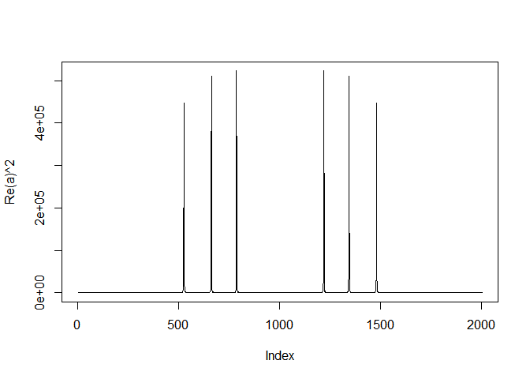

# week 4

swirl

10. Variance Inflation Factors
11. Overfitting and Underfitting
12. Binary Outcomes
13. Count Outcomes


VIF is the square of standard error inflation.

anova to assess the significance of the two added regressors
The three asterisks, ***, at the lower right of the printed table indicate that the null hypothesis is rejected at the 0.001 level, so at
| least one of the two additional regressors is significant

`anova(fit1, fit3)`
but 
Model residuals should be tested for normality.
normality test
shapiro.test(fit3$residuals)


deviance(model), calculates the residual sum of squares

`all.equal(lhs,rhs)`
var(data)=var(estimate)+var(residuals)

## binary results
logit model, logistic regression
$log(p/(1-p)) = b0 + b1*score$ . The link function, $log(p/(1-p))$

## count outcomes
Poisson process

http://jtleek.com/codedata.html

class test `class(hits[,'date'])`

` mdl <- glm(visits ~ date, poisson, hits)`
poisson regression - result is a number

confidence interval vor logit regression
`exp(confint(mdl,'date'))`

offset
`mdl2 <- glm(formula = simplystats ~ date, family = poisson, data = hits, offset = log(visits + 1))`

#Lectures

#GLMs
## Example, logistic regression
* Assume that $Y_i \sim Bernoulli(\mu_i)$ so that $E[Y_i] = \mu_i$ where $0\leq \mu_i \leq 1$.
* Linear predictor $\eta_i = \sum_{k=1}^p X_{ik} \beta_k$
* Link function 
$g(\mu) = \eta = \log\left( \frac{\mu}{1 - \mu}\right)$
$g$ is the (natural) log odds, referred to as the **logit**.
* Note then we can invert the logit function as


$$\mu_i = \frac{\exp(\eta_i)}{1 + \exp(\eta_i)}$$
$$1 - \mu_i = \frac{1}{1 + \exp(\eta_i)}$$
Thus the likelihood is
$$
\prod_{i=1}^n \mu_i^{y_i} (1 - \mu_i)^{1-y_i}
= \exp\left(\sum_{i=1}^n y_i \eta_i \right)
\prod_{i=1}^n (1 + \eta_i)^{-1}
$$

---
## Example, Poisson regression
* Assume that $Y_i \sim Poisson(\mu_i)$ so that $E[Y_i] = \mu_i$ where $0\leq \mu_i$
* Linear predictor $\eta_i = \sum_{k=1}^p X_{ik} \beta_k$
* Link function 
$g(\mu) = \eta = \log(\mu)$
* Recall that $e^x$ is the inverse of $\log(x)$ so that 


$$
\mu_i = e^{\eta_i}
$$
Thus, the likelihood is
$$
\prod_{i=1}^n (y_i !)^{-1} \mu_i^{y_i}e^{-\mu_i}
\propto \exp\left(\sum_{i=1}^n y_i \eta_i - \sum_{i=1}^n \mu_i\right)
$$


Logistic regression
Binomial random variables and binary


```r
load("./ravensData.rda")
head(ravensData)
```

```
##   ravenWinNum ravenWin ravenScore opponentScore
## 1           1        W         24             9
## 2           1        W         38            35
## 3           1        W         28            13
## 4           1        W         34            31
## 5           1        W         44            13
## 6           0        L         23            24
```

__Log odds $(-\infty,\infty)$__

$$\ln\left(\frac{\rm{Pr}(RW_i | RS_i, b_0, b_1 )}{1-\rm{Pr}(RW_i | RS_i, b_0, b_1)}\right)$$ 
$$Odds=\frac{p}{1-p} $$
$$P=\frac{Odds}{1-Odds} $$
logit == log of the odds.


__Logistic__

$$ \rm{Pr}(RW_i | RS_i, b_0, b_1) = \frac{\exp(b_0 + b_1 RS_i)}{1 + \exp(b_0 + b_1 RS_i)}$$

or

$$ \ln\left(\frac{\rm{Pr}(RW_i | RS_i, b_0, b_1 )}{1-\rm{Pr}(RW_i | RS_i, b_0, b_1)}\right) = b_0 + b_1 RS_i $$
$b_0$ - Log odds of a Ravens win if they score zero points
$$\frac{exp(b_0)}{1-exp(b_0)} = probability of winnin with 0 points$$
$b_1$ - Log odds ratio of win probability for each point scored (compared to zero points)

$exp(b_1)$ ration of increase per 1 point

## Ravens logistic regression


```r
logRegRavens <-
    glm(ravensData$ravenWinNum ~ ravensData$ravenScore, family = "binomial")
summary(logRegRavens)
```

```
## 
## Call:
## glm(formula = ravensData$ravenWinNum ~ ravensData$ravenScore, 
##     family = "binomial")
## 
## Deviance Residuals: 
##     Min       1Q   Median       3Q      Max  
## -1.7575  -1.0999   0.5305   0.8060   1.4947  
## 
## Coefficients:
##                       Estimate Std. Error z value Pr(>|z|)
## (Intercept)           -1.68001    1.55412  -1.081     0.28
## ravensData$ravenScore  0.10658    0.06674   1.597     0.11
## 
## (Dispersion parameter for binomial family taken to be 1)
## 
##     Null deviance: 24.435  on 19  degrees of freedom
## Residual deviance: 20.895  on 18  degrees of freedom
## AIC: 24.895
## 
## Number of Fisher Scoring iterations: 5
```

## Ravens fitted values


```r
plot(ravensData$ravenScore,logRegRavens$fitted,pch=19,col="blue",xlab="Score",ylab="Prob Ravens Win")
```

<!-- -->

## Odds ratios and confidence intervals


```r
exp(logRegRavens$coeff)
```

```
##           (Intercept) ravensData$ravenScore 
##             0.1863724             1.1124694
```

```r
## 11% increase per score
exp(confint(logRegRavens))  ##- odds ratio
```

```
## Waiting for profiling to be done...
```

```
##                             2.5 %   97.5 %
## (Intercept)           0.005674966 3.106384
## ravensData$ravenScore 0.996229662 1.303304
```


confidence interval - includes 1, increase in score is not significant

## ANOVA for logistic regression


```r
anova(logRegRavens,test="Chisq")
```

```
## Analysis of Deviance Table
## 
## Model: binomial, link: logit
## 
## Response: ravensData$ravenWinNum
## 
## Terms added sequentially (first to last)
## 
## 
##                       Df Deviance Resid. Df Resid. Dev Pr(>Chi)  
## NULL                                     19     24.435           
## ravensData$ravenScore  1   3.5398        18     20.895  0.05991 .
## ---
## Signif. codes:  0 '***' 0.001 '**' 0.01 '*' 0.05 '.' 0.1 ' ' 1
```

### Interpreting Odds Ratios

* Not probabilities 
* Odds ratio of 1 = no difference in odds
* Log odds ratio of 0 = no difference in odds
* Odds ratio < 0.5 or > 2 commonly a "moderate effect"
* Relative risk $\frac{\rm{Pr}(RW_i | RS_i = 10)}{\rm{Pr}(RW_i | RS_i = 0)}$ often easier to interpret, harder to estimate
* For small probabilities RR $\approx$ OR but __they are not the same__!

* [Open Intro Chapter on Logistic Regression](http://www.openintro.org/stat/down/oiStat2_08.pdf)

# poisson GLM

* Many data take the form of counts
  * Calls to a call center
  * Number of flu cases in an area
  * Number of cars that cross a bridge
* Data may also be in the form of rates
  * Percent of children passing a test
  * Percent of hits to a website from a country
* Linear regression with transformation is an option

Useful for counts and rates.

## The Poisson mass function
- $X \sim Poisson(t\lambda)$ if
$$
P(X = x) = \frac{(t\lambda)^x e^{-t\lambda}}{x!}
$$
For $x = 0, 1, \ldots$.
- The mean of the Poisson is $E[X] = t\lambda$, thus $E[X / t] = \lambda$
- The variance of the Poisson is $Var(X) = t\lambda$.
- The Poisson tends to a normal as $t\lambda$ gets large.

Mean and variance are equal.

* Since the unit of time is always one day, set $t = 1$ and then
the Poisson mean is interpretted as web hits per day. (If we set $t = 24$, it would
be web hits per hour).


```r
load("./gaData.rda")
library(ggplot2)
gaData$julian <- julian(gaData$date)
head(gaData)
```

```
##         date visits simplystats julian
## 1 2011-01-01      0           0  14975
## 2 2011-01-02      0           0  14976
## 3 2011-01-03      0           0  14977
## 4 2011-01-04      0           0  14978
## 5 2011-01-05      0           0  14979
## 6 2011-01-06      0           0  14980
```


```r
qplot(julian, visits, data=gaData)
```

<!-- -->

```r
plot(gaData$julian,gaData$visits,pch=19,col="darkgrey",xlab="Julian",ylab="Visits")
lm1 <- lm(gaData$visits ~ gaData$julian)
abline(lm1,col="red",lwd=3)
```

<!-- -->

add a log of hits

- When you take the natural log of outcomes and fit a regression model, your exponentiated coefficients
estimate things about geometric means.
- $e^{\beta_0}$ estimated geometric mean hits on day 0
- $e^{\beta_1}$ estimated relative increase or decrease in geometric mean hits per day
- There's a problem with logs with you have zero counts, adding a constant works

```r
round(exp(coef(lm(I(log(gaData$visits + 1)) ~ gaData$julian))), 5)
```

```
##   (Intercept) gaData$julian 
##       0.00000       1.00231
```

## Linear vs. Poisson regression

__Linear__

$$ NH_i = b_0 + b_1 JD_i + e_i $$

or

$$ E[NH_i | JD_i, b_0, b_1] = b_0 + b_1 JD_i$$

__Poisson/log-linear__

$$ \log\left(E[NH_i | JD_i, b_0, b_1]\right) = b_0 + b_1 JD_i $$

or

$$ E[NH_i | JD_i, b_0, b_1] = \exp\left(b_0 + b_1 JD_i\right) $$


## Poisson regression in R


```r
plot(gaData$julian,gaData$visits,pch=19,col="darkgrey",xlab="Julian",ylab="Visits")
glm1 <- glm(gaData$visits ~ gaData$julian,family="poisson")
abline(lm1,col="red",lwd=3); lines(gaData$julian,glm1$fitted,col="blue",lwd=3)
```

<!-- -->

## Model agnostic standard errors 


```r
library(sandwich)
confint.agnostic <- function (object, parm, level = 0.95, ...)
{
    cf <- coef(object); pnames <- names(cf)
    if (missing(parm))
        parm <- pnames
    else if (is.numeric(parm))
        parm <- pnames[parm]
    a <- (1 - level)/2; a <- c(a, 1 - a)
    pct <- stats:::format.perc(a, 3)
    fac <- qnorm(a)
    ci <- array(NA, dim = c(length(parm), 2L), dimnames = list(parm,
                                                               pct))
    ses <- sqrt(diag(sandwich::vcovHC(object)))[parm]
    ci[] <- cf[parm] + ses %o% fac
    ci
}
```
[http://stackoverflow.com/questions/3817182/vcovhc-and-confidence-interval](http://stackoverflow.com/questions/3817182/vcovhc-and-confidence-interval)

---

## Estimating confidence intervals


```r
confint(glm1)
```

```
## Waiting for profiling to be done...
```

```
##                       2.5 %        97.5 %
## (Intercept)   -34.346577587 -31.159715656
## gaData$julian   0.002190043   0.002396461
```

```r
confint.agnostic(glm1)
```

```
##                       2.5 %        97.5 %
## (Intercept)   -36.362674594 -29.136997254
## gaData$julian   0.002058147   0.002527955
```

Rates.
Hitsfromstat/allhits
$$ \log\left(E[NHSS_i | JD_i, b_0, b_1]\right) = \log(Totalhits_i) + b_0 + b_1 JD_i $$

```r
glm2 <-
    glm(
        gaData$simplystats ~ julian(gaData$date),
        offset = log(visits + 1), #+1 because take log of 0
        family = "poisson",
        data = gaData
    )
plot(
    julian(gaData$date),
    glm2$fitted,
    col = "blue",
    pch = 19,
    xlab = "Date",
    ylab = "Fitted Counts"
)
points(julian(gaData$date),
       glm1$fitted,
       col = "red",
       pch = 19)
```

<!-- -->

```r
#basically rates are blue points devided by red line
##rates
plot(
    julian(gaData$date),
    gaData$simplystats / (gaData$visits + 1),
    col = "grey",
    xlab = "Date",
    ylab = "Fitted Rates",
    pch = 19
)
lines(
    julian(gaData$date),
    glm2$fitted / (gaData$visits + 1),
    col = "blue",
    lwd = 3
)
```

<!-- -->
## More information
zero inflation - lots of zeros not randomly in the dataset (e.g. in the beginning)
* [pscl package](http://cran.r-project.org/web/packages/pscl/index.html) - the function _zeroinfl_ fits zero inflated models. 

# fitting split functions

## How to fit functions using linear models
* Consider a model $Y_i = f(X_i) + \epsilon$. 
* How can we fit such a model using linear models (called scatterplot smoothing)
* Consider the model 
  $$
  Y_i = \beta_0 + \beta_1 X_i + \sum_{k=1}^d (x_i - \xi_k)_+ \gamma_k + \epsilon_{i}
  $$
where $(a)_+ = a$ if $a > 0$ and $0$ otherwise and $\xi_1 \leq ... \leq \xi_d$ are known knot points.
* Prove to yourelf that the mean function
$$
\beta_0 + \beta_1 X_i + \sum_{k=1}^d (x_i - \xi_k)_+ \gamma_k
$$
is continuous at the knot points.

---
## Simulated example

```r
n <- 500; x <- seq(0, 4 * pi, length = n); y <- sin(x) + rnorm(n, sd = .3)
knots <- seq(0, 8 * pi, length = 20); 
splineTerms <- sapply(knots, function(knot) (x > knot) * (x - knot))
xMat <- cbind(1, x, splineTerms)
yhat <- predict(lm(y ~ xMat - 1))
plot(x, y, frame = FALSE, pch = 21, bg = "lightblue", cex = 2)
lines(x, yhat, col = "red", lwd = 2)
```

<!-- -->

## Adding squared terms
* Adding squared terms makes it continuously differentiable at the knot points.
* Adding cubic terms makes it twice continuously differentiable at the knot points; etcetera.
$$
  Y_i = \beta_0 + \beta_1 X_i + \beta_2 X_i^2 + \sum_{k=1}^d (x_i - \xi_k)_+^2 \gamma_k + \epsilon_{i}
$$

---

```r
splineTerms <- sapply(knots, function(knot) (x > knot) * (x - knot)^2)
xMat <- cbind(1, x, x^2, splineTerms)
yhat <- predict(lm(y ~ xMat - 1))
plot(x, y, frame = FALSE, pch = 21, bg = "lightblue", cex = 2)
lines(x, yhat, col = "red", lwd = 2)
```

<!-- -->

## Notes
* The collection of regressors is called a basis.
  * People have spent **a lot** of time thinking about bases for this kind of problem. So, consider this as just a teaser.
* Single knot point terms can fit hockey stick like processes.
* These bases can be used in GLMs as well.
* An issue with these approaches is the large number of parameters introduced. 
  * Requires some method of so called regularization.

---
## Harmonics using linear models

```r
##Chord finder, playing the white keys on a piano from octave c4 - c5
notes4 <-
    c(261.63, 293.66, 329.63, 349.23, 392.00, 440.00, 493.88, 523.25)
t <- seq(0, 2, by = .001)
n <- length(t)
c4 <-
    sin(2 * pi * notes4[1] * t)
e4 <- sin(2 * pi * notes4[3] * t)

g4 <- sin(2 * pi * notes4[5] * t)
chord <- c4 + e4 + g4 + rnorm(n, 0, 0.3)
x <- sapply(notes4, function(freq)
    sin(2 * pi * freq * t))
fit <- lm(chord ~ x - 1)
```

---
<!-- -->

---

```r
##(How you would really do it)
a <- fft(chord)
plot(Re(a) ^ 2, type = "l")
```

<!-- -->

# more

* more glm
* correlated data and longitudinal data

#Quiz
1. 0.969
-0.031 - coefficient wrong

```r
library(MASS)
library(dplyr)
```

```
## 
## Attaching package: 'dplyr'
```

```
## The following object is masked from 'package:MASS':
## 
##     select
```

```
## The following objects are masked from 'package:stats':
## 
##     filter, lag
```

```
## The following objects are masked from 'package:base':
## 
##     intersect, setdiff, setequal, union
```

```r
head(shuttle)
```

```
##   stability error sign wind   magn vis  use
## 1     xstab    LX   pp head  Light  no auto
## 2     xstab    LX   pp head Medium  no auto
## 3     xstab    LX   pp head Strong  no auto
## 4     xstab    LX   pp tail  Light  no auto
## 5     xstab    LX   pp tail Medium  no auto
## 6     xstab    LX   pp tail Strong  no auto
```

```r
shuttle <-
    shuttle %>% mutate(autobin = ifelse(use == "auto", 1, 0))
mdl <- glm(autobin~wind, binomial, shuttle)
summary(mdl)
```

```
## 
## Call:
## glm(formula = autobin ~ wind, family = binomial, data = shuttle)
## 
## Deviance Residuals: 
##    Min      1Q  Median      3Q     Max  
## -1.300  -1.286   1.060   1.073   1.073  
## 
## Coefficients:
##             Estimate Std. Error z value Pr(>|z|)
## (Intercept)  0.25131    0.17817   1.410    0.158
## windtail     0.03181    0.25224   0.126    0.900
## 
## (Dispersion parameter for binomial family taken to be 1)
## 
##     Null deviance: 350.36  on 255  degrees of freedom
## Residual deviance: 350.35  on 254  degrees of freedom
## AIC: 354.35
## 
## Number of Fisher Scoring iterations: 4
```

```r
exp(mdl$coefficients)
```

```
## (Intercept)    windtail 
##    1.285714    1.032323
```

```r
1/1.032323 
```

```
## [1] 0.9686891
```

```r
#solution
## Make our own variables just for illustration
shuttle$auto <- 1 * (shuttle$use == "auto")
shuttle$headwind <- 1 * (shuttle$wind == "head")
fit <- glm(auto ~ headwind, data = shuttle, family = binomial)
exp(coef(fit))
```

```
## (Intercept)    headwind 
##   1.3272727   0.9686888
```

```r
## Another way without redifing variables
fit <- glm(relevel(use, "noauto") ~ relevel(wind, "tail"), data = shuttle, family = binomial)
exp(coef(fit))
```

```
##               (Intercept) relevel(wind, "tail")head 
##                 1.3272727                 0.9686888
```
 2. 0.969
 1.485 wrong
 

```r
mdl2 <- glm(autobin~wind+magn, binomial, shuttle)

summary(mdl2)
```

```
## 
## Call:
## glm(formula = autobin ~ wind + magn, family = binomial, data = shuttle)
## 
## Deviance Residuals: 
##    Min      1Q  Median      3Q     Max  
## -1.349  -1.321   1.015   1.040   1.184  
## 
## Coefficients:
##               Estimate Std. Error z value Pr(>|z|)
## (Intercept)  3.635e-01  2.841e-01   1.280    0.201
## windtail     3.201e-02  2.530e-01   0.127    0.899
## magnMedium   1.205e-15  3.599e-01   0.000    1.000
## magnOut     -3.795e-01  3.568e-01  -1.064    0.287
## magnStrong  -6.441e-02  3.590e-01  -0.179    0.858
## 
## (Dispersion parameter for binomial family taken to be 1)
## 
##     Null deviance: 350.36  on 255  degrees of freedom
## Residual deviance: 348.78  on 251  degrees of freedom
## AIC: 358.78
## 
## Number of Fisher Scoring iterations: 4
```

```r
exp(mdl2$coefficients)
```

```
## (Intercept)    windtail  magnMedium     magnOut  magnStrong 
##   1.4383682   1.0325265   1.0000000   0.6841941   0.9376181
```

```r
1/1.0325265
```

```
## [1] 0.9684981
```

```r
## Another way without redifing variables
fit <- glm(relevel(use, "noauto") ~ relevel(wind, "tail") + magn, data = shuttle, 
    family = binomial)
exp(coef(fit))
```

```
##               (Intercept) relevel(wind, "tail")head 
##                 1.4851533                 0.9684981 
##                magnMedium                   magnOut 
##                 1.0000000                 0.6841941 
##                magnStrong 
##                 0.9376181
```

3. The coefficients reverse their signs. right

4. Consider the insect spray data \verb|InsectSprays|InsectSprays. Fit a Poisson model using spray as a factor level. Report the estimated relative rate comapring spray A (numerator) to spray B (denominator).
0.9456521
-0.05588 wrong


```r
library(datasets)
head(InsectSprays)
```

```
##   count spray
## 1    10     A
## 2     7     A
## 3    20     A
## 4    14     A
## 5    14     A
## 6    12     A
```

```r
mdl4 <- glm(formula = count ~ spray, family = poisson, data = InsectSprays)
summary(mdl4)
```

```
## 
## Call:
## glm(formula = count ~ spray, family = poisson, data = InsectSprays)
## 
## Deviance Residuals: 
##     Min       1Q   Median       3Q      Max  
## -2.3852  -0.8876  -0.1482   0.6063   2.6922  
## 
## Coefficients:
##             Estimate Std. Error z value Pr(>|z|)    
## (Intercept)  2.67415    0.07581  35.274  < 2e-16 ***
## sprayB       0.05588    0.10574   0.528    0.597    
## sprayC      -1.94018    0.21389  -9.071  < 2e-16 ***
## sprayD      -1.08152    0.15065  -7.179 7.03e-13 ***
## sprayE      -1.42139    0.17192  -8.268  < 2e-16 ***
## sprayF       0.13926    0.10367   1.343    0.179    
## ---
## Signif. codes:  0 '***' 0.001 '**' 0.01 '*' 0.05 '.' 0.1 ' ' 1
## 
## (Dispersion parameter for poisson family taken to be 1)
## 
##     Null deviance: 409.041  on 71  degrees of freedom
## Residual deviance:  98.329  on 66  degrees of freedom
## AIC: 376.59
## 
## Number of Fisher Scoring iterations: 5
```

```r
exp(mdl4$coefficients)
```

```
## (Intercept)      sprayB      sprayC      sprayD      sprayE      sprayF 
##  14.5000000   1.0574713   0.1436782   0.3390805   0.2413793   1.1494253
```

```r
1/1.0574713
```

```
## [1] 0.9456521
```

```r
fit <- glm(count ~ relevel(spray, "B"), data = InsectSprays, family = poisson)
exp(coef(fit))[2]
```

```
## relevel(spray, "B")A 
##            0.9456522
```

```r
#when we relevel we decare the basis one
```
5. coefficient is unchanged 
The coefficient estimate is multiplied by 10. wrong

6. 1.01307 right

```r
x <- -5:5
y <- c(5.12, 3.93, 2.67, 1.87, 0.52, 0.08, 0.93, 2.05, 2.54, 3.87, 4.97)
plot(x,y)
```

<!-- -->

```r
library(lspline)
```

```
## Warning: package 'lspline' was built under R version 3.5.3
```

```r
m1 <- lm(y ~ lspline(x, c(0)))
summary(m1)
```

```
## 
## Call:
## lm(formula = y ~ lspline(x, c(0)))
## 
## Residuals:
##      Min       1Q   Median       3Q      Max 
## -0.32158 -0.10979  0.01595  0.14065  0.26258 
## 
## Coefficients:
##                   Estimate Std. Error t value Pr(>|t|)    
## (Intercept)       -0.18258    0.13558  -1.347    0.215    
## lspline(x, c(0))1 -1.02416    0.04805 -21.313 2.47e-08 ***
## lspline(x, c(0))2  1.01307    0.04805  21.082 2.69e-08 ***
## ---
## Signif. codes:  0 '***' 0.001 '**' 0.01 '*' 0.05 '.' 0.1 ' ' 1
## 
## Residual standard error: 0.2276 on 8 degrees of freedom
## Multiple R-squared:  0.986,	Adjusted R-squared:  0.9825 
## F-statistic: 282.3 on 2 and 8 DF,  p-value: 3.812e-08
```

```r
#shorter one
z <- (x > 0) * x
fit <- lm(y ~ x + z)
sum(coef(fit)[2:3])
```

```
## [1] 1.013067
```

using step

```r
fitall <- lm(mpg~., data = mtcars)
summary(step(fitall,direction="both",trace=FALSE))
```

```
## 
## Call:
## lm(formula = mpg ~ wt + qsec + am, data = mtcars)
## 
## Residuals:
##     Min      1Q  Median      3Q     Max 
## -3.4811 -1.5555 -0.7257  1.4110  4.6610 
## 
## Coefficients:
##             Estimate Std. Error t value Pr(>|t|)    
## (Intercept)   9.6178     6.9596   1.382 0.177915    
## wt           -3.9165     0.7112  -5.507 6.95e-06 ***
## qsec          1.2259     0.2887   4.247 0.000216 ***
## am            2.9358     1.4109   2.081 0.046716 *  
## ---
## Signif. codes:  0 '***' 0.001 '**' 0.01 '*' 0.05 '.' 0.1 ' ' 1
## 
## Residual standard error: 2.459 on 28 degrees of freedom
## Multiple R-squared:  0.8497,	Adjusted R-squared:  0.8336 
## F-statistic: 52.75 on 3 and 28 DF,  p-value: 1.21e-11
```
