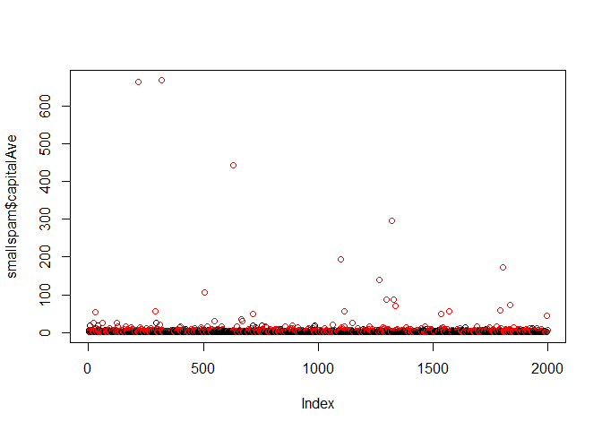
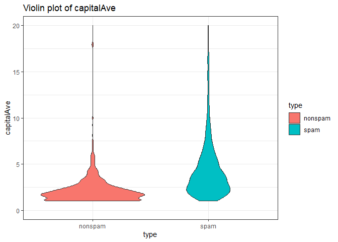

# week 1

Elements of statistical learning.
https://web.stanford.edu/~hastie/ElemStatLearn/

caret package

```r
require(caret)
```

```
## Loading required package: caret
```

```
## Loading required package: lattice
```

```
## Loading required package: ggplot2
```

Machine learning by stanford on coursera

# what is prediction

1. probability/sampling from the pool of data
2. get training set and process it
3. build a prediction function

## process

* question  (formultate this)
* input data (find it and know its limitation)
* features (frquency of words)
* algorithm 
* parameters
* evaluation

## relative importance of steps

somitmes - we need to give up
garbage in - garbage out.
often mode data - better model

*good features*

- lead to data compression
- retain relevant info
- are created based on expert application knowledge

*mistakes*

- trying to automate feature selection
- not pay attention to data-specific quirks

algorithm sometimes do not matter that much

issues to sonsider
- interpetable 
- simple
- accurate
- fast
- scalable

# in sample error

*in sample* - error rate you get for a predictor in the training sample
*out of sample error* - on a testing sample

key idea

1. out of sample is what we want
2. sample error < out of sample error
3. reason - overfitting


```r
library(kernlab)
```

```
## 
## Attaching package: 'kernlab'
```

```
## The following object is masked from 'package:ggplot2':
## 
##     alpha
```

```r
data("spam")
smallspam <- spam[sample(dim(spam)[1],size = 2000),]
smaplabel <- (smallspam$type=="spam")*1+1
plot(smallspam$capitalAve,col=smaplabel)
```

<!-- -->

```r
library(ggplot2)
ggplot(spam, aes(y = capitalAve, x = type, fill = type)) + geom_violin() +
labs(title = "Violin plot of capitalAve")+theme_bw()+ylim(0,20)
```

```
## Warning: Removed 67 rows containing non-finite values (stat_ydensity).
```

<!-- -->
Can make a a prediction based on capitalAve
CapitalAve>2.4 "spam"

```r
rule2 <- function(x){
    prediction <- rep(NA, length(x))
    prediction[x>2.8] <- "spam"
    prediction[x<=2.8] <- "nonspam"
    return(prediction)
}
table(rule2(smallspam$capitalAve),smallspam$type)
```

```
##          
##           nonspam spam
##   nonspam     951  290
##   spam        237  522
```

```r
table(rule2(spam$capitalAve),spam$type)
```

```
##          
##           nonspam spam
##   nonspam    2224  642
##   spam        564 1171
```

```r
sum(rule2(spam$capitalAve)==spam$type)
```

```
## [1] 3395
```

```r
library(party)
```

```
## Loading required package: grid
```

```
## Loading required package: mvtnorm
```

```
## Loading required package: modeltools
```

```
## Loading required package: stats4
```

```
## 
## Attaching package: 'modeltools'
```

```
## The following object is masked from 'package:kernlab':
## 
##     prior
```

```
## Loading required package: strucchange
```

```
## Loading required package: zoo
```

```
## 
## Attaching package: 'zoo'
```

```
## The following objects are masked from 'package:base':
## 
##     as.Date, as.Date.numeric
```

```
## Loading required package: sandwich
```

```r
 cfit <- ctree(type~capitalAve, smallspam)
table(predict(cfit,spam),spam$type)
```

```
##          
##           nonspam spam
##   nonspam    2445  826
##   spam        343  987
```

```r
sum(predict(cfit,spam)==spam$type)/dim(spam)[1]
```

```
## [1] 0.7459248
```

```r
 cfit2 <- ctree(type~capitalAve+you, smallspam)
table(predict(cfit2,spam),spam$type)
```

```
##          
##           nonspam spam
##   nonspam    2355  623
##   spam        433 1190
```

```r
sum(predict(cfit2,spam)==spam$type)/dim(spam)[1]
```

```
## [1] 0.7704847
```

```r
 cfit3 <- ctree(type~., smallspam)
table(predict(cfit3,spam),spam$type)
```

```
##          
##           nonspam spam
##   nonspam    2607  297
##   spam        181 1516
```

```r
sum(predict(cfit3,spam)==spam$type)/dim(spam)[1]
```

```
## [1] 0.8961095
```

# prediction study design

1. define error rate
2. split data into
    training
    testing
    validation(optional)
3. pick features (using cross validation)
4. on the training set pick prediction
use cross validation
5 if no validaiton
*apply 1 to test set*
6 if validaiton set
apply to test set and refine
*appy 1 time to validation set*

## avoid small sample size
###good rules
* big data

60% training
20% test
20% validation

* medium

60% training
40% testing

* if small
do cross validation
report this with caveat.

## remember
* set a validation set aside and dont look at it
* in genereal - random sample
* data must reflect structure of the problem
    * if evolve over time - split into random time chunks
* all subsets should reflect as much diversity as possible
    * random assignment does this
    * can also try to balance by features - but tricky

# types of errors
medical test e.g.
* *true positive* - correctyly identified (sick and diagnosed)
* *false positive* - incorrectyly identified (healthy and diagnosed)
* *false negative* - incorrectyly rejected (sick adn not identified)

$ Sensitivity = \frac{Positive test}{disease}$
$ Specificity = \frac{Negative test}{no desease}$
$ positivepredictive value = \frac{desease}{Positive test}$
$ Negative predictive value = \frac{no desease}{Negative test}$
$ accuracy =\frac{TP+TN}{all}$

## for continuous data
Mean square error (MSE)

$\frac{1}{n}\sum^n_{i=1}{(Prediction_i-Truth_i)^2}$

RMSE

$\sqrt{\frac{1}{n}\sum^n_{i=1}{(Prediction_i-Truth_i)^2}}$

