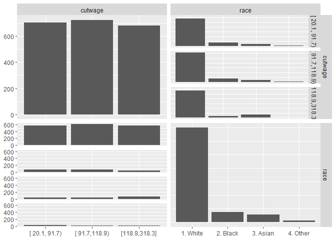

# week 2

Caret package

## additional materisl


* Caret tutorials:
    * [http://www.edii.uclm.es/~useR-2013/Tutorials/kuhn/user_caret_2up.pdf](http://www.edii.uclm.es/~useR-2013/Tutorials/kuhn/user_caret_2up.pdf)
    * [https://cran.r-project.org/web/packages/caret/vignettes/caret.html](https://cran.r-project.org/web/packages/caret/vignettes/caret.html)
* A paper introducing the caret package
    * [http://www.jstatsoft.org/v28/i05/paper](http://www.jstatsoft.org/v28/i05/paper)


```r
require(caret)
```

```
## Loading required package: caret
```

```
## Loading required package: lattice
```

```
## Loading required package: ggplot2
```

Functionality

* cleaning
    * preProcess
* data splitting
    * createDataPartition
    * createResample
    * createTimeSlices
* trainign/testing functionality
    * train
    * predict
* model comparison
    * confusionMatrix

```r
require(kernlab)
data(spam)
intrain <- createDataPartition(y = spam$type, p = 0.75, list = FALSE)
training <- spam[intrain, ]
testing <- spam[-intrain, ]
dim(training)
```

```
## [1] 3451   58
```

```r
#fit a model
set.seed(32343)
modelFit <- train(type ~ ., data = training, method = "glm")
```

```
## Warning: glm.fit: fitted probabilities numerically 0 or 1 occurred
```

```
## Warning: glm.fit: algorithm did not converge
```

```
## Warning: glm.fit: fitted probabilities numerically 0 or 1 occurred

## Warning: glm.fit: fitted probabilities numerically 0 or 1 occurred

## Warning: glm.fit: fitted probabilities numerically 0 or 1 occurred

## Warning: glm.fit: fitted probabilities numerically 0 or 1 occurred

## Warning: glm.fit: fitted probabilities numerically 0 or 1 occurred

## Warning: glm.fit: fitted probabilities numerically 0 or 1 occurred

## Warning: glm.fit: fitted probabilities numerically 0 or 1 occurred

## Warning: glm.fit: fitted probabilities numerically 0 or 1 occurred

## Warning: glm.fit: fitted probabilities numerically 0 or 1 occurred

## Warning: glm.fit: fitted probabilities numerically 0 or 1 occurred

## Warning: glm.fit: fitted probabilities numerically 0 or 1 occurred

## Warning: glm.fit: fitted probabilities numerically 0 or 1 occurred

## Warning: glm.fit: fitted probabilities numerically 0 or 1 occurred

## Warning: glm.fit: fitted probabilities numerically 0 or 1 occurred

## Warning: glm.fit: fitted probabilities numerically 0 or 1 occurred

## Warning: glm.fit: fitted probabilities numerically 0 or 1 occurred

## Warning: glm.fit: fitted probabilities numerically 0 or 1 occurred

## Warning: glm.fit: fitted probabilities numerically 0 or 1 occurred

## Warning: glm.fit: fitted probabilities numerically 0 or 1 occurred

## Warning: glm.fit: fitted probabilities numerically 0 or 1 occurred

## Warning: glm.fit: fitted probabilities numerically 0 or 1 occurred

## Warning: glm.fit: fitted probabilities numerically 0 or 1 occurred

## Warning: glm.fit: fitted probabilities numerically 0 or 1 occurred

## Warning: glm.fit: fitted probabilities numerically 0 or 1 occurred

## Warning: glm.fit: fitted probabilities numerically 0 or 1 occurred
```

```r
modelFit
```

```
## Generalized Linear Model 
## 
## 3451 samples
##   57 predictor
##    2 classes: 'nonspam', 'spam' 
## 
## No pre-processing
## Resampling: Bootstrapped (25 reps) 
## Summary of sample sizes: 3451, 3451, 3451, 3451, 3451, 3451, ... 
## Resampling results:
## 
##   Accuracy   Kappa   
##   0.9230686  0.838479
```

```r
#results
modelFit$finalModel
```

```
## 
## Call:  NULL
## 
## Coefficients:
##       (Intercept)               make            address  
##        -1.415e+00         -2.048e-01         -1.562e-01  
##               all              num3d                our  
##         1.382e-01          2.296e+00          7.191e-01  
##              over             remove           internet  
##         7.525e-01          2.227e+00          5.438e-01  
##             order               mail            receive  
##         5.907e-01          1.051e-01         -3.786e-01  
##              will             people             report  
##        -1.705e-01         -1.193e-01          1.087e-01  
##         addresses               free           business  
##         1.884e+00          1.077e+00          9.305e-01  
##             email                you             credit  
##         9.044e-02          4.920e-02          7.633e-01  
##              your               font             num000  
##         2.579e-01          3.186e-01          1.631e+00  
##             money                 hp                hpl  
##         2.505e-01         -2.009e+00         -1.078e+00  
##            george             num650                lab  
##        -8.686e+00          4.783e-01         -2.030e+00  
##              labs             telnet             num857  
##        -7.727e-01         -6.201e+00          1.197e+00  
##              data             num415              num85  
##        -6.552e-01          1.271e+00         -1.956e+00  
##        technology            num1999              parts  
##         8.181e-01         -6.512e-02         -6.616e-01  
##                pm             direct                 cs  
##        -1.018e+00         -3.205e-01         -3.920e+01  
##           meeting           original            project  
##        -2.562e+00         -1.083e+00         -1.677e+00  
##                re                edu              table  
##        -8.066e-01         -1.618e+00         -2.166e+00  
##        conference      charSemicolon   charRoundbracket  
##        -2.896e+00         -1.561e+00         -1.139e-01  
## charSquarebracket    charExclamation         charDollar  
##        -6.272e-01          2.442e-01          5.857e+00  
##          charHash         capitalAve        capitalLong  
##         2.549e+00         -2.164e-02          1.261e-02  
##      capitalTotal  
##         5.332e-04  
## 
## Degrees of Freedom: 3450 Total (i.e. Null);  3393 Residual
## Null Deviance:	    4628 
## Residual Deviance: 1354 	AIC: 1470
```

```r
#predict
prediction <- predict(modelFit, newdata = testing)
head(prediction)
```

```
## [1] spam spam spam spam spam spam
## Levels: nonspam spam
```

```r
table(prediction)
```

```
## prediction
## nonspam    spam 
##     714     436
```

```r
#confusionmatrix
confusionMatrix(prediction, testing$type)
```

```
## Confusion Matrix and Statistics
## 
##           Reference
## Prediction nonspam spam
##    nonspam     662   52
##    spam         35  401
##                                          
##                Accuracy : 0.9243         
##                  95% CI : (0.9075, 0.939)
##     No Information Rate : 0.6061         
##     P-Value [Acc > NIR] : < 2e-16        
##                                          
##                   Kappa : 0.8405         
##                                          
##  Mcnemar's Test P-Value : 0.08628        
##                                          
##             Sensitivity : 0.9498         
##             Specificity : 0.8852         
##          Pos Pred Value : 0.9272         
##          Neg Pred Value : 0.9197         
##              Prevalence : 0.6061         
##          Detection Rate : 0.5757         
##    Detection Prevalence : 0.6209         
##       Balanced Accuracy : 0.9175         
##                                          
##        'Positive' Class : nonspam        
## 
```


```r
require(kernlab)
data(spam)
intrain <- createDataPartition(y = spam$type, p = 0.75, list = FALSE)
training <- spam[intrain, ]
testing <- spam[-intrain, ]
dim(training)
```

```
## [1] 3451   58
```

```r
fold <- createFolds(y=spam$type, k=10, list = TRUE, returnTrain = TRUE)
sapply(fold, length)
```

```
## Fold01 Fold02 Fold03 Fold04 Fold05 Fold06 Fold07 Fold08 Fold09 Fold10 
##   4141   4140   4142   4140   4141   4141   4141   4141   4141   4141
```

```r
#return only testing
fold <- createFolds(y=spam$type, k=10, list = TRUE, returnTrain = FALSE)
sapply(fold, length)
```

```
## Fold01 Fold02 Fold03 Fold04 Fold05 Fold06 Fold07 Fold08 Fold09 Fold10 
##    460    460    460    461    460    460    460    460    460    460
```

```r
#doing resampling the whole set
fold <- createResample(y=spam$type, times=10, list = TRUE)
sapply(fold, length)
```

```
## Resample01 Resample02 Resample03 Resample04 Resample05 Resample06 
##       4601       4601       4601       4601       4601       4601 
## Resample07 Resample08 Resample09 Resample10 
##       4601       4601       4601       4601
```

```r
# time clices
tme <- 1:1000
folds <- createTimeSlices(y=tme,initialWindow = 20, horizon = 10)
names(folds)
```

```
## [1] "train" "test"
```

```r
folds$train[[1]]
```

```
##  [1]  1  2  3  4  5  6  7  8  9 10 11 12 13 14 15 16 17 18 19 20
```

### Training options
Spam example

```r
require(caret)
require(kernlab)
data(spam)

intrain <- createDataPartition(y=spam$type, p=0.75, list = FALSE)
training <- spam[intrain,]
testing <- spam[-intrain,]
modelFit <- train(type~., data = training, method ="glm")
```

```
## Warning: glm.fit: fitted probabilities numerically 0 or 1 occurred

## Warning: glm.fit: fitted probabilities numerically 0 or 1 occurred

## Warning: glm.fit: fitted probabilities numerically 0 or 1 occurred

## Warning: glm.fit: fitted probabilities numerically 0 or 1 occurred

## Warning: glm.fit: fitted probabilities numerically 0 or 1 occurred

## Warning: glm.fit: fitted probabilities numerically 0 or 1 occurred

## Warning: glm.fit: fitted probabilities numerically 0 or 1 occurred

## Warning: glm.fit: fitted probabilities numerically 0 or 1 occurred

## Warning: glm.fit: fitted probabilities numerically 0 or 1 occurred

## Warning: glm.fit: fitted probabilities numerically 0 or 1 occurred

## Warning: glm.fit: fitted probabilities numerically 0 or 1 occurred

## Warning: glm.fit: fitted probabilities numerically 0 or 1 occurred

## Warning: glm.fit: fitted probabilities numerically 0 or 1 occurred

## Warning: glm.fit: fitted probabilities numerically 0 or 1 occurred

## Warning: glm.fit: fitted probabilities numerically 0 or 1 occurred

## Warning: glm.fit: fitted probabilities numerically 0 or 1 occurred

## Warning: glm.fit: fitted probabilities numerically 0 or 1 occurred

## Warning: glm.fit: fitted probabilities numerically 0 or 1 occurred

## Warning: glm.fit: fitted probabilities numerically 0 or 1 occurred

## Warning: glm.fit: fitted probabilities numerically 0 or 1 occurred

## Warning: glm.fit: fitted probabilities numerically 0 or 1 occurred

## Warning: glm.fit: fitted probabilities numerically 0 or 1 occurred

## Warning: glm.fit: fitted probabilities numerically 0 or 1 occurred

## Warning: glm.fit: fitted probabilities numerically 0 or 1 occurred

## Warning: glm.fit: fitted probabilities numerically 0 or 1 occurred

## Warning: glm.fit: fitted probabilities numerically 0 or 1 occurred
```

```r
#results
modelFit$finalModel
```

```
## 
## Call:  NULL
## 
## Coefficients:
##       (Intercept)               make            address  
##        -1.581e+00         -3.632e-01         -1.471e-01  
##               all              num3d                our  
##         1.360e-01          2.286e+00          4.152e-01  
##              over             remove           internet  
##         9.685e-01          2.092e+00          8.042e-01  
##             order               mail            receive  
##         7.320e-01          9.426e-02         -2.275e-01  
##              will             people             report  
##        -1.372e-01         -1.651e-01          1.535e-01  
##         addresses               free           business  
##         1.595e+00          1.011e+00          9.620e-01  
##             email                you             credit  
##         9.127e-02          8.760e-02          1.034e+00  
##              your               font             num000  
##         2.641e-01          2.894e-01          2.379e+00  
##             money                 hp                hpl  
##         3.530e-01         -1.539e+00         -1.290e+00  
##            george             num650                lab  
##        -1.129e+01          3.908e-01         -2.259e+00  
##              labs             telnet             num857  
##        -3.855e-01         -1.964e-01          2.610e+00  
##              data             num415              num85  
##        -7.208e-01          5.153e-01         -1.672e+00  
##        technology            num1999              parts  
##         9.057e-01          6.343e-03          1.290e+00  
##                pm             direct                 cs  
##        -1.031e+00         -5.633e-02         -4.230e+01  
##           meeting           original            project  
##        -2.884e+00         -1.111e+00         -1.275e+00  
##                re                edu              table  
##        -8.689e-01         -1.052e+00         -2.083e+00  
##        conference      charSemicolon   charRoundbracket  
##        -4.251e+00         -1.573e+00         -1.657e-01  
## charSquarebracket    charExclamation         charDollar  
##        -2.736e-01          4.329e-01          3.844e+00  
##          charHash         capitalAve        capitalLong  
##         2.092e+00          7.396e-03          9.254e-03  
##      capitalTotal  
##         8.734e-04  
## 
## Degrees of Freedom: 3450 Total (i.e. Null);  3393 Residual
## Null Deviance:	    4628 
## Residual Deviance: 1416 	AIC: 1532
```

```r
#predict
prediction <- predict(modelFit, newdata = testing)
head(prediction)
```

```
## [1] spam    spam    nonspam nonspam spam    spam   
## Levels: nonspam spam
```

```r
table(prediction)
```

```
## prediction
## nonspam    spam 
##     728     422
```

```r
#confusionmatrix
confusionMatrix(prediction, testing$type)
```

```
## Confusion Matrix and Statistics
## 
##           Reference
## Prediction nonspam spam
##    nonspam     671   57
##    spam         26  396
##                                           
##                Accuracy : 0.9278          
##                  95% CI : (0.9113, 0.9421)
##     No Information Rate : 0.6061          
##     P-Value [Acc > NIR] : < 2.2e-16       
##                                           
##                   Kappa : 0.847           
##                                           
##  Mcnemar's Test P-Value : 0.0009915       
##                                           
##             Sensitivity : 0.9627          
##             Specificity : 0.8742          
##          Pos Pred Value : 0.9217          
##          Neg Pred Value : 0.9384          
##              Prevalence : 0.6061          
##          Detection Rate : 0.5835          
##    Detection Prevalence : 0.6330          
##       Balanced Accuracy : 0.9184          
##                                           
##        'Positive' Class : nonspam         
## 
```

```r
# accuracy to Kappa
modelFit <- train(type~., data = training, method ="glm", metric = "Kappa")
```

```
## Warning: glm.fit: fitted probabilities numerically 0 or 1 occurred
```

```
## Warning: glm.fit: algorithm did not converge
```

```
## Warning: glm.fit: fitted probabilities numerically 0 or 1 occurred

## Warning: glm.fit: fitted probabilities numerically 0 or 1 occurred

## Warning: glm.fit: fitted probabilities numerically 0 or 1 occurred

## Warning: glm.fit: fitted probabilities numerically 0 or 1 occurred

## Warning: glm.fit: fitted probabilities numerically 0 or 1 occurred

## Warning: glm.fit: fitted probabilities numerically 0 or 1 occurred

## Warning: glm.fit: fitted probabilities numerically 0 or 1 occurred

## Warning: glm.fit: fitted probabilities numerically 0 or 1 occurred

## Warning: glm.fit: fitted probabilities numerically 0 or 1 occurred

## Warning: glm.fit: fitted probabilities numerically 0 or 1 occurred

## Warning: glm.fit: fitted probabilities numerically 0 or 1 occurred

## Warning: glm.fit: fitted probabilities numerically 0 or 1 occurred

## Warning: glm.fit: fitted probabilities numerically 0 or 1 occurred

## Warning: glm.fit: fitted probabilities numerically 0 or 1 occurred

## Warning: glm.fit: fitted probabilities numerically 0 or 1 occurred

## Warning: glm.fit: fitted probabilities numerically 0 or 1 occurred

## Warning: glm.fit: fitted probabilities numerically 0 or 1 occurred

## Warning: glm.fit: fitted probabilities numerically 0 or 1 occurred

## Warning: glm.fit: fitted probabilities numerically 0 or 1 occurred

## Warning: glm.fit: fitted probabilities numerically 0 or 1 occurred

## Warning: glm.fit: fitted probabilities numerically 0 or 1 occurred

## Warning: glm.fit: fitted probabilities numerically 0 or 1 occurred

## Warning: glm.fit: fitted probabilities numerically 0 or 1 occurred

## Warning: glm.fit: fitted probabilities numerically 0 or 1 occurred

## Warning: glm.fit: fitted probabilities numerically 0 or 1 occurred
```

```r
prediction2 <- predict(modelFit, newdata = testing)
confusionMatrix(prediction2, testing$type)
```

```
## Confusion Matrix and Statistics
## 
##           Reference
## Prediction nonspam spam
##    nonspam     671   57
##    spam         26  396
##                                           
##                Accuracy : 0.9278          
##                  95% CI : (0.9113, 0.9421)
##     No Information Rate : 0.6061          
##     P-Value [Acc > NIR] : < 2.2e-16       
##                                           
##                   Kappa : 0.847           
##                                           
##  Mcnemar's Test P-Value : 0.0009915       
##                                           
##             Sensitivity : 0.9627          
##             Specificity : 0.8742          
##          Pos Pred Value : 0.9217          
##          Neg Pred Value : 0.9384          
##              Prevalence : 0.6061          
##          Detection Rate : 0.5835          
##    Detection Prevalence : 0.6330          
##       Balanced Accuracy : 0.9184          
##                                           
##        'Positive' Class : nonspam         
## 
```

Metric options
* Continuous
    * RMSE
    * R^2
* categorical
    * accuracy
    * Kappa
    

```r
args(trainControl)
```

```
## function (method = "boot", number = ifelse(grepl("cv", method), 
##     10, 25), repeats = ifelse(grepl("[d_]cv$", method), 1, NA), 
##     p = 0.75, search = "grid", initialWindow = NULL, horizon = 1, 
##     fixedWindow = TRUE, skip = 0, verboseIter = FALSE, returnData = TRUE, 
##     returnResamp = "final", savePredictions = FALSE, classProbs = FALSE, 
##     summaryFunction = defaultSummary, selectionFunction = "best", 
##     preProcOptions = list(thresh = 0.95, ICAcomp = 3, k = 5, 
##         freqCut = 95/5, uniqueCut = 10, cutoff = 0.9), sampling = NULL, 
##     index = NULL, indexOut = NULL, indexFinal = NULL, timingSamps = 0, 
##     predictionBounds = rep(FALSE, 2), seeds = NA, adaptive = list(min = 5, 
##         alpha = 0.05, method = "gls", complete = TRUE), trim = FALSE, 
##     allowParallel = TRUE) 
## NULL
```

```r
control <- trainControl(number = 100)
modelFit <- train(type~., data = training, method ="glm", trControl=control)
```

```
## Warning: glm.fit: fitted probabilities numerically 0 or 1 occurred

## Warning: glm.fit: fitted probabilities numerically 0 or 1 occurred

## Warning: glm.fit: fitted probabilities numerically 0 or 1 occurred

## Warning: glm.fit: fitted probabilities numerically 0 or 1 occurred

## Warning: glm.fit: fitted probabilities numerically 0 or 1 occurred

## Warning: glm.fit: fitted probabilities numerically 0 or 1 occurred

## Warning: glm.fit: fitted probabilities numerically 0 or 1 occurred

## Warning: glm.fit: fitted probabilities numerically 0 or 1 occurred

## Warning: glm.fit: fitted probabilities numerically 0 or 1 occurred

## Warning: glm.fit: fitted probabilities numerically 0 or 1 occurred

## Warning: glm.fit: fitted probabilities numerically 0 or 1 occurred

## Warning: glm.fit: fitted probabilities numerically 0 or 1 occurred

## Warning: glm.fit: fitted probabilities numerically 0 or 1 occurred

## Warning: glm.fit: fitted probabilities numerically 0 or 1 occurred

## Warning: glm.fit: fitted probabilities numerically 0 or 1 occurred

## Warning: glm.fit: fitted probabilities numerically 0 or 1 occurred

## Warning: glm.fit: fitted probabilities numerically 0 or 1 occurred

## Warning: glm.fit: fitted probabilities numerically 0 or 1 occurred

## Warning: glm.fit: fitted probabilities numerically 0 or 1 occurred

## Warning: glm.fit: fitted probabilities numerically 0 or 1 occurred

## Warning: glm.fit: fitted probabilities numerically 0 or 1 occurred

## Warning: glm.fit: fitted probabilities numerically 0 or 1 occurred

## Warning: glm.fit: fitted probabilities numerically 0 or 1 occurred

## Warning: glm.fit: fitted probabilities numerically 0 or 1 occurred

## Warning: glm.fit: fitted probabilities numerically 0 or 1 occurred

## Warning: glm.fit: fitted probabilities numerically 0 or 1 occurred

## Warning: glm.fit: fitted probabilities numerically 0 or 1 occurred

## Warning: glm.fit: fitted probabilities numerically 0 or 1 occurred

## Warning: glm.fit: fitted probabilities numerically 0 or 1 occurred

## Warning: glm.fit: fitted probabilities numerically 0 or 1 occurred

## Warning: glm.fit: fitted probabilities numerically 0 or 1 occurred

## Warning: glm.fit: fitted probabilities numerically 0 or 1 occurred

## Warning: glm.fit: fitted probabilities numerically 0 or 1 occurred

## Warning: glm.fit: fitted probabilities numerically 0 or 1 occurred

## Warning: glm.fit: fitted probabilities numerically 0 or 1 occurred

## Warning: glm.fit: fitted probabilities numerically 0 or 1 occurred

## Warning: glm.fit: fitted probabilities numerically 0 or 1 occurred

## Warning: glm.fit: fitted probabilities numerically 0 or 1 occurred

## Warning: glm.fit: fitted probabilities numerically 0 or 1 occurred

## Warning: glm.fit: fitted probabilities numerically 0 or 1 occurred

## Warning: glm.fit: fitted probabilities numerically 0 or 1 occurred

## Warning: glm.fit: fitted probabilities numerically 0 or 1 occurred

## Warning: glm.fit: fitted probabilities numerically 0 or 1 occurred

## Warning: glm.fit: fitted probabilities numerically 0 or 1 occurred

## Warning: glm.fit: fitted probabilities numerically 0 or 1 occurred

## Warning: glm.fit: fitted probabilities numerically 0 or 1 occurred

## Warning: glm.fit: fitted probabilities numerically 0 or 1 occurred

## Warning: glm.fit: fitted probabilities numerically 0 or 1 occurred

## Warning: glm.fit: fitted probabilities numerically 0 or 1 occurred

## Warning: glm.fit: fitted probabilities numerically 0 or 1 occurred
```

```
## Warning: glm.fit: algorithm did not converge
```

```
## Warning: glm.fit: fitted probabilities numerically 0 or 1 occurred

## Warning: glm.fit: fitted probabilities numerically 0 or 1 occurred
```

```
## Warning: glm.fit: algorithm did not converge
```

```
## Warning: glm.fit: fitted probabilities numerically 0 or 1 occurred

## Warning: glm.fit: fitted probabilities numerically 0 or 1 occurred

## Warning: glm.fit: fitted probabilities numerically 0 or 1 occurred

## Warning: glm.fit: fitted probabilities numerically 0 or 1 occurred

## Warning: glm.fit: fitted probabilities numerically 0 or 1 occurred

## Warning: glm.fit: fitted probabilities numerically 0 or 1 occurred

## Warning: glm.fit: fitted probabilities numerically 0 or 1 occurred
```

```
## Warning: glm.fit: algorithm did not converge
```

```
## Warning: glm.fit: fitted probabilities numerically 0 or 1 occurred

## Warning: glm.fit: fitted probabilities numerically 0 or 1 occurred

## Warning: glm.fit: fitted probabilities numerically 0 or 1 occurred

## Warning: glm.fit: fitted probabilities numerically 0 or 1 occurred

## Warning: glm.fit: fitted probabilities numerically 0 or 1 occurred

## Warning: glm.fit: fitted probabilities numerically 0 or 1 occurred

## Warning: glm.fit: fitted probabilities numerically 0 or 1 occurred

## Warning: glm.fit: fitted probabilities numerically 0 or 1 occurred

## Warning: glm.fit: fitted probabilities numerically 0 or 1 occurred

## Warning: glm.fit: fitted probabilities numerically 0 or 1 occurred

## Warning: glm.fit: fitted probabilities numerically 0 or 1 occurred

## Warning: glm.fit: fitted probabilities numerically 0 or 1 occurred

## Warning: glm.fit: fitted probabilities numerically 0 or 1 occurred

## Warning: glm.fit: fitted probabilities numerically 0 or 1 occurred

## Warning: glm.fit: fitted probabilities numerically 0 or 1 occurred

## Warning: glm.fit: fitted probabilities numerically 0 or 1 occurred

## Warning: glm.fit: fitted probabilities numerically 0 or 1 occurred

## Warning: glm.fit: fitted probabilities numerically 0 or 1 occurred

## Warning: glm.fit: fitted probabilities numerically 0 or 1 occurred

## Warning: glm.fit: fitted probabilities numerically 0 or 1 occurred

## Warning: glm.fit: fitted probabilities numerically 0 or 1 occurred

## Warning: glm.fit: fitted probabilities numerically 0 or 1 occurred

## Warning: glm.fit: fitted probabilities numerically 0 or 1 occurred

## Warning: glm.fit: fitted probabilities numerically 0 or 1 occurred

## Warning: glm.fit: fitted probabilities numerically 0 or 1 occurred

## Warning: glm.fit: fitted probabilities numerically 0 or 1 occurred

## Warning: glm.fit: fitted probabilities numerically 0 or 1 occurred

## Warning: glm.fit: fitted probabilities numerically 0 or 1 occurred

## Warning: glm.fit: fitted probabilities numerically 0 or 1 occurred

## Warning: glm.fit: fitted probabilities numerically 0 or 1 occurred

## Warning: glm.fit: fitted probabilities numerically 0 or 1 occurred

## Warning: glm.fit: fitted probabilities numerically 0 or 1 occurred

## Warning: glm.fit: fitted probabilities numerically 0 or 1 occurred

## Warning: glm.fit: fitted probabilities numerically 0 or 1 occurred

## Warning: glm.fit: fitted probabilities numerically 0 or 1 occurred

## Warning: glm.fit: fitted probabilities numerically 0 or 1 occurred

## Warning: glm.fit: fitted probabilities numerically 0 or 1 occurred

## Warning: glm.fit: fitted probabilities numerically 0 or 1 occurred

## Warning: glm.fit: fitted probabilities numerically 0 or 1 occurred

## Warning: glm.fit: fitted probabilities numerically 0 or 1 occurred

## Warning: glm.fit: fitted probabilities numerically 0 or 1 occurred

## Warning: glm.fit: fitted probabilities numerically 0 or 1 occurred
```

```r
prediction <- predict(modelFit, newdata = testing)
confusionMatrix(prediction, testing$type)
```

```
## Confusion Matrix and Statistics
## 
##           Reference
## Prediction nonspam spam
##    nonspam     671   57
##    spam         26  396
##                                           
##                Accuracy : 0.9278          
##                  95% CI : (0.9113, 0.9421)
##     No Information Rate : 0.6061          
##     P-Value [Acc > NIR] : < 2.2e-16       
##                                           
##                   Kappa : 0.847           
##                                           
##  Mcnemar's Test P-Value : 0.0009915       
##                                           
##             Sensitivity : 0.9627          
##             Specificity : 0.8742          
##          Pos Pred Value : 0.9217          
##          Neg Pred Value : 0.9384          
##              Prevalence : 0.6061          
##          Detection Rate : 0.5835          
##    Detection Prevalence : 0.6330          
##       Balanced Accuracy : 0.9184          
##                                           
##        'Positive' Class : nonspam         
## 
```
Method

* boot bootstrap
* boot632 bootstrap  with adjustment
* cv cross validation
* repeatedcv = repeated cross validation
* loocv = leave one out cross validation

number - usefull for many parameters
 
* for boot/cross validaiton
* number of subsaples to take

repears

* number of times to repaea subsampling
* if big this can slow things down a lot


```r
control <- trainControl(method = "cv")
modelFit <- train(type~., data = training, method ="glm", trControl=control)
```

```
## Warning: glm.fit: fitted probabilities numerically 0 or 1 occurred

## Warning: glm.fit: fitted probabilities numerically 0 or 1 occurred

## Warning: glm.fit: fitted probabilities numerically 0 or 1 occurred

## Warning: glm.fit: fitted probabilities numerically 0 or 1 occurred

## Warning: glm.fit: fitted probabilities numerically 0 or 1 occurred

## Warning: glm.fit: fitted probabilities numerically 0 or 1 occurred

## Warning: glm.fit: fitted probabilities numerically 0 or 1 occurred

## Warning: glm.fit: fitted probabilities numerically 0 or 1 occurred

## Warning: glm.fit: fitted probabilities numerically 0 or 1 occurred

## Warning: glm.fit: fitted probabilities numerically 0 or 1 occurred

## Warning: glm.fit: fitted probabilities numerically 0 or 1 occurred
```

```r
prediction <- predict(modelFit, newdata = testing)
confusionMatrix(prediction, testing$type)
```

```
## Confusion Matrix and Statistics
## 
##           Reference
## Prediction nonspam spam
##    nonspam     671   57
##    spam         26  396
##                                           
##                Accuracy : 0.9278          
##                  95% CI : (0.9113, 0.9421)
##     No Information Rate : 0.6061          
##     P-Value [Acc > NIR] : < 2.2e-16       
##                                           
##                   Kappa : 0.847           
##                                           
##  Mcnemar's Test P-Value : 0.0009915       
##                                           
##             Sensitivity : 0.9627          
##             Specificity : 0.8742          
##          Pos Pred Value : 0.9217          
##          Neg Pred Value : 0.9384          
##              Prevalence : 0.6061          
##          Detection Rate : 0.5835          
##    Detection Prevalence : 0.6330          
##       Balanced Accuracy : 0.9184          
##                                           
##        'Positive' Class : nonspam         
## 
```
Usefull to set a seed.


```r
set.seed(1235)
modelFit3 <- train(type~., data=training, method="glm")
```

```
## Warning: glm.fit: fitted probabilities numerically 0 or 1 occurred

## Warning: glm.fit: fitted probabilities numerically 0 or 1 occurred

## Warning: glm.fit: fitted probabilities numerically 0 or 1 occurred

## Warning: glm.fit: fitted probabilities numerically 0 or 1 occurred
```

```
## Warning: glm.fit: algorithm did not converge
```

```
## Warning: glm.fit: fitted probabilities numerically 0 or 1 occurred

## Warning: glm.fit: fitted probabilities numerically 0 or 1 occurred

## Warning: glm.fit: fitted probabilities numerically 0 or 1 occurred

## Warning: glm.fit: fitted probabilities numerically 0 or 1 occurred
```

```
## Warning: glm.fit: algorithm did not converge
```

```
## Warning: glm.fit: fitted probabilities numerically 0 or 1 occurred

## Warning: glm.fit: fitted probabilities numerically 0 or 1 occurred

## Warning: glm.fit: fitted probabilities numerically 0 or 1 occurred

## Warning: glm.fit: fitted probabilities numerically 0 or 1 occurred

## Warning: glm.fit: fitted probabilities numerically 0 or 1 occurred

## Warning: glm.fit: fitted probabilities numerically 0 or 1 occurred

## Warning: glm.fit: fitted probabilities numerically 0 or 1 occurred

## Warning: glm.fit: fitted probabilities numerically 0 or 1 occurred

## Warning: glm.fit: fitted probabilities numerically 0 or 1 occurred

## Warning: glm.fit: fitted probabilities numerically 0 or 1 occurred

## Warning: glm.fit: fitted probabilities numerically 0 or 1 occurred

## Warning: glm.fit: fitted probabilities numerically 0 or 1 occurred

## Warning: glm.fit: fitted probabilities numerically 0 or 1 occurred

## Warning: glm.fit: fitted probabilities numerically 0 or 1 occurred

## Warning: glm.fit: fitted probabilities numerically 0 or 1 occurred

## Warning: glm.fit: fitted probabilities numerically 0 or 1 occurred

## Warning: glm.fit: fitted probabilities numerically 0 or 1 occurred

## Warning: glm.fit: fitted probabilities numerically 0 or 1 occurred
```

```r
modelFit3
```

```
## Generalized Linear Model 
## 
## 3451 samples
##   57 predictor
##    2 classes: 'nonspam', 'spam' 
## 
## No pre-processing
## Resampling: Bootstrapped (25 reps) 
## Summary of sample sizes: 3451, 3451, 3451, 3451, 3451, 3451, ... 
## Resampling results:
## 
##   Accuracy   Kappa    
##   0.9122941  0.8153988
```

# plotting predicitons

Wage data

```r
library(ISLR)
require(ggplot2)
require(caret)
require(GGally)
```

```
## Loading required package: GGally
```

```
## Registered S3 method overwritten by 'GGally':
##   method from   
##   +.gg   ggplot2
```

```r
require(dplyr)
```

```
## Loading required package: dplyr
```

```
## 
## Attaching package: 'dplyr'
```

```
## The following object is masked from 'package:GGally':
## 
##     nasa
```

```
## The following objects are masked from 'package:stats':
## 
##     filter, lag
```

```
## The following objects are masked from 'package:base':
## 
##     intersect, setdiff, setequal, union
```

```r
data(Wage)
summary(Wage)
```

```
##       year           age                     maritl           race     
##  Min.   :2003   Min.   :18.00   1. Never Married: 648   1. White:2480  
##  1st Qu.:2004   1st Qu.:33.75   2. Married      :2074   2. Black: 293  
##  Median :2006   Median :42.00   3. Widowed      :  19   3. Asian: 190  
##  Mean   :2006   Mean   :42.41   4. Divorced     : 204   4. Other:  37  
##  3rd Qu.:2008   3rd Qu.:51.00   5. Separated    :  55                  
##  Max.   :2009   Max.   :80.00                                          
##                                                                        
##               education                     region    
##  1. < HS Grad      :268   2. Middle Atlantic   :3000  
##  2. HS Grad        :971   1. New England       :   0  
##  3. Some College   :650   3. East North Central:   0  
##  4. College Grad   :685   4. West North Central:   0  
##  5. Advanced Degree:426   5. South Atlantic    :   0  
##                           6. East South Central:   0  
##                           (Other)              :   0  
##            jobclass               health      health_ins      logwage     
##  1. Industrial :1544   1. <=Good     : 858   1. Yes:2083   Min.   :3.000  
##  2. Information:1456   2. >=Very Good:2142   2. No : 917   1st Qu.:4.447  
##                                                            Median :4.653  
##                                                            Mean   :4.654  
##                                                            3rd Qu.:4.857  
##                                                            Max.   :5.763  
##                                                                           
##       wage       
##  Min.   : 20.09  
##  1st Qu.: 85.38  
##  Median :104.92  
##  Mean   :111.70  
##  3rd Qu.:128.68  
##  Max.   :318.34  
## 
```

```r
pairs(Wage)
```

<!-- -->

```r
Wage %>% select(age, race, wage, education) %>% ggpairs(., lower = list(continuous = wrap("smooth", alpha = 0.3, size=0.1)))
```

```
## `stat_bin()` using `bins = 30`. Pick better value with `binwidth`.
```

```
## `stat_bin()` using `bins = 30`. Pick better value with `binwidth`.
## `stat_bin()` using `bins = 30`. Pick better value with `binwidth`.
## `stat_bin()` using `bins = 30`. Pick better value with `binwidth`.
```

<!-- -->

```r
#set adide testing set
intrain <- createDataPartition(y=Wage$wage, p=0.7, list = FALSE)
training <- Wage[intrain,]
testin <- Wage[-intrain,]
dim(training)
```

```
## [1] 2102   11
```

```r
dim(testin)
```

```
## [1] 898  11
```

## Feature plot ::caret

```r
featurePlot(x = training[,c("age","race", "education")], y = training$wage, plot = "pairs")
```

<!-- -->

```r
qplot(age, wage, colour = education,data = training)+geom_smooth(method = 'lm', formula = y~x)
```

<!-- -->


```r
require(Hmisc)
```

```
## Loading required package: Hmisc
```

```
## Loading required package: survival
```

```
## 
## Attaching package: 'survival'
```

```
## The following object is masked from 'package:caret':
## 
##     cluster
```

```
## Loading required package: Formula
```

```
## 
## Attaching package: 'Hmisc'
```

```
## The following objects are masked from 'package:dplyr':
## 
##     src, summarize
```

```
## The following objects are masked from 'package:base':
## 
##     format.pval, units
```

```r
require(gridExtra)
```

```
## Loading required package: gridExtra
```

```
## 
## Attaching package: 'gridExtra'
```

```
## The following object is masked from 'package:dplyr':
## 
##     combine
```

```r
cutwage <- cut2(training$wage, g=3)
table(cutwage)
```

```
## cutwage
## [ 20.1, 91.7) [ 91.7,118.9) [118.9,318.3] 
##           702           722           678
```

```r
cbind.data.frame(cutwage,training %>% select(race)) %>% ggpairs(., lower = list(continuous = wrap("smooth", alpha = 0.3, size=0.1)))
```

<!-- -->

```r
cbind.data.frame(cutwage,training %>% select(race)) %>% table() %>% prop.table(.,2)
```

```
##                race
## cutwage          1. White  2. Black  3. Asian  4. Other
##   [ 20.1, 91.7) 0.3259132 0.4171123 0.2773723 0.5769231
##   [ 91.7,118.9) 0.3498858 0.3636364 0.2481752 0.2692308
##   [118.9,318.3] 0.3242009 0.2192513 0.4744526 0.1538462
```

```r
qplot(cutwage, age, data = training, fill = cutwage, geom = c("violin"))
```

<!-- -->

```r
qplot(cutwage, age, data = training, fill = cutwage, geom = c("boxplot"))
```

<!-- -->

```r
p1 <- qplot(race, wage, data = training, fill = education, geom = c("boxplot"))


p1
```

<!-- -->

```r
p2 <-
qplot(
race,
wage,
data = training,
fill = education, color = education,
geom = c("boxplot", "jitter")
)
grid.arrange(p1, p2, ncol = 2)
```

<!-- -->

### tables


```r
table(cutwage,training$jobclass) %>% prop.table(.,1)
```

```
##                
## cutwage         1. Industrial 2. Information
##   [ 20.1, 91.7)     0.6538462      0.3461538
##   [ 91.7,118.9)     0.5360111      0.4639889
##   [118.9,318.3]     0.4070796      0.5929204
```

### density plot


```r
qplot(wage, colour= education, data = training, geom = "density")
```

<!-- -->

```r
qplot(wage, colour= race, data = training, geom = "density")
```

<!-- -->

#### Notes 

* Make plots on the training set
    * dont explore testing
* look for
    * imbalances in outcome/predictors
    * otliers
    * groups of points not explained by a predictor
    * skewed variables

