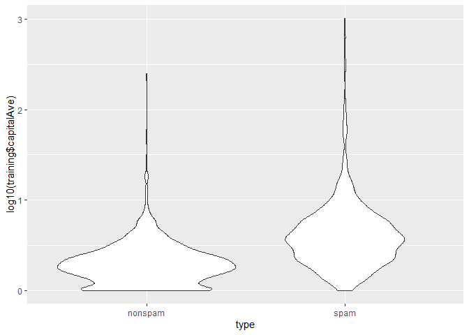
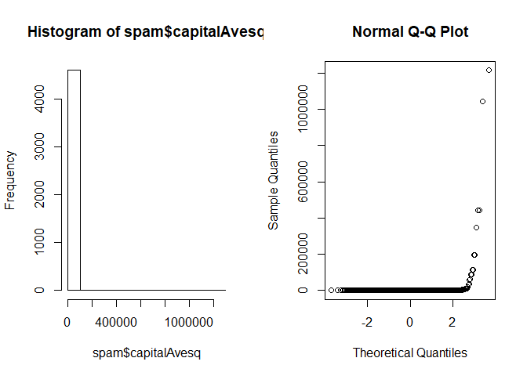
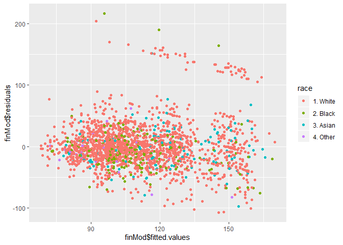
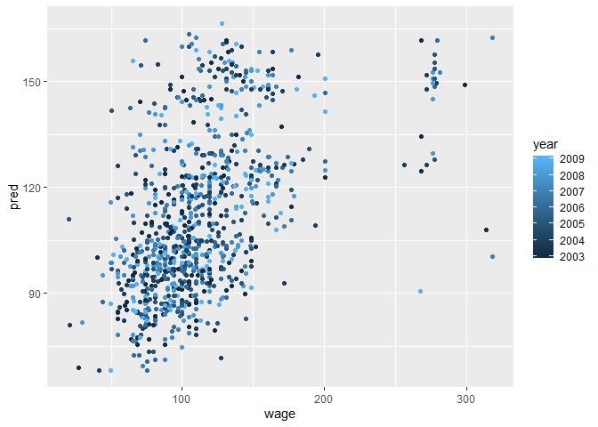

# week 2

Caret package

## additional materisl


* Caret tutorials:
    * [http://www.edii.uclm.es/~useR-2013/Tutorials/kuhn/user_caret_2up.pdf](http://www.edii.uclm.es/~useR-2013/Tutorials/kuhn/user_caret_2up.pdf)
    * [https://cran.r-project.org/web/packages/caret/vignettes/caret.html](https://cran.r-project.org/web/packages/caret/vignettes/caret.html)
* A paper introducing the caret package
    * [http://www.jstatsoft.org/v28/i05/paper](http://www.jstatsoft.org/v28/i05/paper)


```r
require(caret)
```

```
## Loading required package: caret
```

```
## Loading required package: lattice
```

```
## Loading required package: ggplot2
```

Functionality

* cleaning
    * preProcess
* data splitting
    * createDataPartition
    * createResample
    * createTimeSlices
* trainign/testing functionality
    * train
    * predict
* model comparison
    * confusionMatrix

```r
require(kernlab)
data(spam)
intrain <- createDataPartition(y = spam$type, p = 0.75, list = FALSE)
training <- spam[intrain, ]
testing <- spam[-intrain, ]
dim(training)
```

```
## [1] 3451   58
```

```r
#fit a model
set.seed(32343)
modelFit <- train(type ~ ., data = training, method = "glm")
```

```
## Warning: glm.fit: fitted probabilities numerically 0 or 1 occurred
```

```
## Warning: glm.fit: algorithm did not converge
```

```
## Warning: glm.fit: fitted probabilities numerically 0 or 1 occurred

## Warning: glm.fit: fitted probabilities numerically 0 or 1 occurred

## Warning: glm.fit: fitted probabilities numerically 0 or 1 occurred

## Warning: glm.fit: fitted probabilities numerically 0 or 1 occurred

## Warning: glm.fit: fitted probabilities numerically 0 or 1 occurred

## Warning: glm.fit: fitted probabilities numerically 0 or 1 occurred

## Warning: glm.fit: fitted probabilities numerically 0 or 1 occurred

## Warning: glm.fit: fitted probabilities numerically 0 or 1 occurred

## Warning: glm.fit: fitted probabilities numerically 0 or 1 occurred

## Warning: glm.fit: fitted probabilities numerically 0 or 1 occurred

## Warning: glm.fit: fitted probabilities numerically 0 or 1 occurred

## Warning: glm.fit: fitted probabilities numerically 0 or 1 occurred

## Warning: glm.fit: fitted probabilities numerically 0 or 1 occurred

## Warning: glm.fit: fitted probabilities numerically 0 or 1 occurred

## Warning: glm.fit: fitted probabilities numerically 0 or 1 occurred

## Warning: glm.fit: fitted probabilities numerically 0 or 1 occurred

## Warning: glm.fit: fitted probabilities numerically 0 or 1 occurred

## Warning: glm.fit: fitted probabilities numerically 0 or 1 occurred

## Warning: glm.fit: fitted probabilities numerically 0 or 1 occurred

## Warning: glm.fit: fitted probabilities numerically 0 or 1 occurred

## Warning: glm.fit: fitted probabilities numerically 0 or 1 occurred

## Warning: glm.fit: fitted probabilities numerically 0 or 1 occurred

## Warning: glm.fit: fitted probabilities numerically 0 or 1 occurred

## Warning: glm.fit: fitted probabilities numerically 0 or 1 occurred

## Warning: glm.fit: fitted probabilities numerically 0 or 1 occurred
```

```r
modelFit
```

```
## Generalized Linear Model 
## 
## 3451 samples
##   57 predictor
##    2 classes: 'nonspam', 'spam' 
## 
## No pre-processing
## Resampling: Bootstrapped (25 reps) 
## Summary of sample sizes: 3451, 3451, 3451, 3451, 3451, 3451, ... 
## Resampling results:
## 
##   Accuracy   Kappa   
##   0.9230686  0.838479
```

```r
#results
modelFit$finalModel
```

```
## 
## Call:  NULL
## 
## Coefficients:
##       (Intercept)               make            address  
##        -1.415e+00         -2.048e-01         -1.562e-01  
##               all              num3d                our  
##         1.382e-01          2.296e+00          7.191e-01  
##              over             remove           internet  
##         7.525e-01          2.227e+00          5.438e-01  
##             order               mail            receive  
##         5.907e-01          1.051e-01         -3.786e-01  
##              will             people             report  
##        -1.705e-01         -1.193e-01          1.087e-01  
##         addresses               free           business  
##         1.884e+00          1.077e+00          9.305e-01  
##             email                you             credit  
##         9.044e-02          4.920e-02          7.633e-01  
##              your               font             num000  
##         2.579e-01          3.186e-01          1.631e+00  
##             money                 hp                hpl  
##         2.505e-01         -2.009e+00         -1.078e+00  
##            george             num650                lab  
##        -8.686e+00          4.783e-01         -2.030e+00  
##              labs             telnet             num857  
##        -7.727e-01         -6.201e+00          1.197e+00  
##              data             num415              num85  
##        -6.552e-01          1.271e+00         -1.956e+00  
##        technology            num1999              parts  
##         8.181e-01         -6.512e-02         -6.616e-01  
##                pm             direct                 cs  
##        -1.018e+00         -3.205e-01         -3.920e+01  
##           meeting           original            project  
##        -2.562e+00         -1.083e+00         -1.677e+00  
##                re                edu              table  
##        -8.066e-01         -1.618e+00         -2.166e+00  
##        conference      charSemicolon   charRoundbracket  
##        -2.896e+00         -1.561e+00         -1.139e-01  
## charSquarebracket    charExclamation         charDollar  
##        -6.272e-01          2.442e-01          5.857e+00  
##          charHash         capitalAve        capitalLong  
##         2.549e+00         -2.164e-02          1.261e-02  
##      capitalTotal  
##         5.332e-04  
## 
## Degrees of Freedom: 3450 Total (i.e. Null);  3393 Residual
## Null Deviance:	    4628 
## Residual Deviance: 1354 	AIC: 1470
```

```r
#predict
prediction <- predict(modelFit, newdata = testing)
head(prediction)
```

```
## [1] spam spam spam spam spam spam
## Levels: nonspam spam
```

```r
table(prediction)
```

```
## prediction
## nonspam    spam 
##     714     436
```

```r
#confusionmatrix
confusionMatrix(prediction, testing$type)
```

```
## Confusion Matrix and Statistics
## 
##           Reference
## Prediction nonspam spam
##    nonspam     662   52
##    spam         35  401
##                                          
##                Accuracy : 0.9243         
##                  95% CI : (0.9075, 0.939)
##     No Information Rate : 0.6061         
##     P-Value [Acc > NIR] : < 2e-16        
##                                          
##                   Kappa : 0.8405         
##                                          
##  Mcnemar's Test P-Value : 0.08628        
##                                          
##             Sensitivity : 0.9498         
##             Specificity : 0.8852         
##          Pos Pred Value : 0.9272         
##          Neg Pred Value : 0.9197         
##              Prevalence : 0.6061         
##          Detection Rate : 0.5757         
##    Detection Prevalence : 0.6209         
##       Balanced Accuracy : 0.9175         
##                                          
##        'Positive' Class : nonspam        
## 
```


```r
require(kernlab)
data(spam)
intrain <- createDataPartition(y = spam$type, p = 0.75, list = FALSE)
training <- spam[intrain, ]
testing <- spam[-intrain, ]
dim(training)
```

```
## [1] 3451   58
```

```r
fold <- createFolds(y=spam$type, k=10, list = TRUE, returnTrain = TRUE)
sapply(fold, length)
```

```
## Fold01 Fold02 Fold03 Fold04 Fold05 Fold06 Fold07 Fold08 Fold09 Fold10 
##   4141   4140   4142   4140   4141   4141   4141   4141   4141   4141
```

```r
#return only testing
fold <- createFolds(y=spam$type, k=10, list = TRUE, returnTrain = FALSE)
sapply(fold, length)
```

```
## Fold01 Fold02 Fold03 Fold04 Fold05 Fold06 Fold07 Fold08 Fold09 Fold10 
##    460    460    460    461    460    460    460    460    460    460
```

```r
#doing resampling the whole set
fold <- createResample(y=spam$type, times=10, list = TRUE)
sapply(fold, length)
```

```
## Resample01 Resample02 Resample03 Resample04 Resample05 Resample06 
##       4601       4601       4601       4601       4601       4601 
## Resample07 Resample08 Resample09 Resample10 
##       4601       4601       4601       4601
```

```r
# time clices
tme <- 1:1000
folds <- createTimeSlices(y=tme,initialWindow = 20, horizon = 10)
names(folds)
```

```
## [1] "train" "test"
```

```r
folds$train[[1]]
```

```
##  [1]  1  2  3  4  5  6  7  8  9 10 11 12 13 14 15 16 17 18 19 20
```

### Training options
Spam example

```r
require(caret)
require(kernlab)
data(spam)

intrain <- createDataPartition(y=spam$type, p=0.75, list = FALSE)
training <- spam[intrain,]
testing <- spam[-intrain,]
modelFit <- train(type~., data = training, method ="glm")
```

```
## Warning: glm.fit: fitted probabilities numerically 0 or 1 occurred

## Warning: glm.fit: fitted probabilities numerically 0 or 1 occurred

## Warning: glm.fit: fitted probabilities numerically 0 or 1 occurred

## Warning: glm.fit: fitted probabilities numerically 0 or 1 occurred

## Warning: glm.fit: fitted probabilities numerically 0 or 1 occurred

## Warning: glm.fit: fitted probabilities numerically 0 or 1 occurred

## Warning: glm.fit: fitted probabilities numerically 0 or 1 occurred

## Warning: glm.fit: fitted probabilities numerically 0 or 1 occurred

## Warning: glm.fit: fitted probabilities numerically 0 or 1 occurred

## Warning: glm.fit: fitted probabilities numerically 0 or 1 occurred

## Warning: glm.fit: fitted probabilities numerically 0 or 1 occurred

## Warning: glm.fit: fitted probabilities numerically 0 or 1 occurred

## Warning: glm.fit: fitted probabilities numerically 0 or 1 occurred

## Warning: glm.fit: fitted probabilities numerically 0 or 1 occurred

## Warning: glm.fit: fitted probabilities numerically 0 or 1 occurred

## Warning: glm.fit: fitted probabilities numerically 0 or 1 occurred

## Warning: glm.fit: fitted probabilities numerically 0 or 1 occurred

## Warning: glm.fit: fitted probabilities numerically 0 or 1 occurred

## Warning: glm.fit: fitted probabilities numerically 0 or 1 occurred

## Warning: glm.fit: fitted probabilities numerically 0 or 1 occurred

## Warning: glm.fit: fitted probabilities numerically 0 or 1 occurred

## Warning: glm.fit: fitted probabilities numerically 0 or 1 occurred

## Warning: glm.fit: fitted probabilities numerically 0 or 1 occurred

## Warning: glm.fit: fitted probabilities numerically 0 or 1 occurred

## Warning: glm.fit: fitted probabilities numerically 0 or 1 occurred

## Warning: glm.fit: fitted probabilities numerically 0 or 1 occurred
```

```r
#results
modelFit$finalModel
```

```
## 
## Call:  NULL
## 
## Coefficients:
##       (Intercept)               make            address  
##        -1.581e+00         -3.632e-01         -1.471e-01  
##               all              num3d                our  
##         1.360e-01          2.286e+00          4.152e-01  
##              over             remove           internet  
##         9.685e-01          2.092e+00          8.042e-01  
##             order               mail            receive  
##         7.320e-01          9.426e-02         -2.275e-01  
##              will             people             report  
##        -1.372e-01         -1.651e-01          1.535e-01  
##         addresses               free           business  
##         1.595e+00          1.011e+00          9.620e-01  
##             email                you             credit  
##         9.127e-02          8.760e-02          1.034e+00  
##              your               font             num000  
##         2.641e-01          2.894e-01          2.379e+00  
##             money                 hp                hpl  
##         3.530e-01         -1.539e+00         -1.290e+00  
##            george             num650                lab  
##        -1.129e+01          3.908e-01         -2.259e+00  
##              labs             telnet             num857  
##        -3.855e-01         -1.964e-01          2.610e+00  
##              data             num415              num85  
##        -7.208e-01          5.153e-01         -1.672e+00  
##        technology            num1999              parts  
##         9.057e-01          6.343e-03          1.290e+00  
##                pm             direct                 cs  
##        -1.031e+00         -5.633e-02         -4.230e+01  
##           meeting           original            project  
##        -2.884e+00         -1.111e+00         -1.275e+00  
##                re                edu              table  
##        -8.689e-01         -1.052e+00         -2.083e+00  
##        conference      charSemicolon   charRoundbracket  
##        -4.251e+00         -1.573e+00         -1.657e-01  
## charSquarebracket    charExclamation         charDollar  
##        -2.736e-01          4.329e-01          3.844e+00  
##          charHash         capitalAve        capitalLong  
##         2.092e+00          7.396e-03          9.254e-03  
##      capitalTotal  
##         8.734e-04  
## 
## Degrees of Freedom: 3450 Total (i.e. Null);  3393 Residual
## Null Deviance:	    4628 
## Residual Deviance: 1416 	AIC: 1532
```

```r
#predict
prediction <- predict(modelFit, newdata = testing)
head(prediction)
```

```
## [1] spam    spam    nonspam nonspam spam    spam   
## Levels: nonspam spam
```

```r
table(prediction)
```

```
## prediction
## nonspam    spam 
##     728     422
```

```r
#confusionmatrix
confusionMatrix(prediction, testing$type)
```

```
## Confusion Matrix and Statistics
## 
##           Reference
## Prediction nonspam spam
##    nonspam     671   57
##    spam         26  396
##                                           
##                Accuracy : 0.9278          
##                  95% CI : (0.9113, 0.9421)
##     No Information Rate : 0.6061          
##     P-Value [Acc > NIR] : < 2.2e-16       
##                                           
##                   Kappa : 0.847           
##                                           
##  Mcnemar's Test P-Value : 0.0009915       
##                                           
##             Sensitivity : 0.9627          
##             Specificity : 0.8742          
##          Pos Pred Value : 0.9217          
##          Neg Pred Value : 0.9384          
##              Prevalence : 0.6061          
##          Detection Rate : 0.5835          
##    Detection Prevalence : 0.6330          
##       Balanced Accuracy : 0.9184          
##                                           
##        'Positive' Class : nonspam         
## 
```

```r
# accuracy to Kappa
modelFit <- train(type~., data = training, method ="glm", metric = "Kappa")
```

```
## Warning: glm.fit: fitted probabilities numerically 0 or 1 occurred
```

```
## Warning: glm.fit: algorithm did not converge
```

```
## Warning: glm.fit: fitted probabilities numerically 0 or 1 occurred

## Warning: glm.fit: fitted probabilities numerically 0 or 1 occurred

## Warning: glm.fit: fitted probabilities numerically 0 or 1 occurred

## Warning: glm.fit: fitted probabilities numerically 0 or 1 occurred

## Warning: glm.fit: fitted probabilities numerically 0 or 1 occurred

## Warning: glm.fit: fitted probabilities numerically 0 or 1 occurred

## Warning: glm.fit: fitted probabilities numerically 0 or 1 occurred

## Warning: glm.fit: fitted probabilities numerically 0 or 1 occurred

## Warning: glm.fit: fitted probabilities numerically 0 or 1 occurred

## Warning: glm.fit: fitted probabilities numerically 0 or 1 occurred

## Warning: glm.fit: fitted probabilities numerically 0 or 1 occurred

## Warning: glm.fit: fitted probabilities numerically 0 or 1 occurred

## Warning: glm.fit: fitted probabilities numerically 0 or 1 occurred

## Warning: glm.fit: fitted probabilities numerically 0 or 1 occurred

## Warning: glm.fit: fitted probabilities numerically 0 or 1 occurred

## Warning: glm.fit: fitted probabilities numerically 0 or 1 occurred

## Warning: glm.fit: fitted probabilities numerically 0 or 1 occurred

## Warning: glm.fit: fitted probabilities numerically 0 or 1 occurred

## Warning: glm.fit: fitted probabilities numerically 0 or 1 occurred

## Warning: glm.fit: fitted probabilities numerically 0 or 1 occurred

## Warning: glm.fit: fitted probabilities numerically 0 or 1 occurred

## Warning: glm.fit: fitted probabilities numerically 0 or 1 occurred

## Warning: glm.fit: fitted probabilities numerically 0 or 1 occurred

## Warning: glm.fit: fitted probabilities numerically 0 or 1 occurred

## Warning: glm.fit: fitted probabilities numerically 0 or 1 occurred
```

```r
prediction2 <- predict(modelFit, newdata = testing)
confusionMatrix(prediction2, testing$type)
```

```
## Confusion Matrix and Statistics
## 
##           Reference
## Prediction nonspam spam
##    nonspam     671   57
##    spam         26  396
##                                           
##                Accuracy : 0.9278          
##                  95% CI : (0.9113, 0.9421)
##     No Information Rate : 0.6061          
##     P-Value [Acc > NIR] : < 2.2e-16       
##                                           
##                   Kappa : 0.847           
##                                           
##  Mcnemar's Test P-Value : 0.0009915       
##                                           
##             Sensitivity : 0.9627          
##             Specificity : 0.8742          
##          Pos Pred Value : 0.9217          
##          Neg Pred Value : 0.9384          
##              Prevalence : 0.6061          
##          Detection Rate : 0.5835          
##    Detection Prevalence : 0.6330          
##       Balanced Accuracy : 0.9184          
##                                           
##        'Positive' Class : nonspam         
## 
```

Metric options
* Continuous
    * RMSE
    * R^2
* categorical
    * accuracy
    * Kappa
    

```r
args(trainControl)
```

```
## function (method = "boot", number = ifelse(grepl("cv", method), 
##     10, 25), repeats = ifelse(grepl("[d_]cv$", method), 1, NA), 
##     p = 0.75, search = "grid", initialWindow = NULL, horizon = 1, 
##     fixedWindow = TRUE, skip = 0, verboseIter = FALSE, returnData = TRUE, 
##     returnResamp = "final", savePredictions = FALSE, classProbs = FALSE, 
##     summaryFunction = defaultSummary, selectionFunction = "best", 
##     preProcOptions = list(thresh = 0.95, ICAcomp = 3, k = 5, 
##         freqCut = 95/5, uniqueCut = 10, cutoff = 0.9), sampling = NULL, 
##     index = NULL, indexOut = NULL, indexFinal = NULL, timingSamps = 0, 
##     predictionBounds = rep(FALSE, 2), seeds = NA, adaptive = list(min = 5, 
##         alpha = 0.05, method = "gls", complete = TRUE), trim = FALSE, 
##     allowParallel = TRUE) 
## NULL
```

```r
control <- trainControl(number = 100)
modelFit <- train(type~., data = training, method ="glm", trControl=control)
```

```
## Warning: glm.fit: fitted probabilities numerically 0 or 1 occurred

## Warning: glm.fit: fitted probabilities numerically 0 or 1 occurred

## Warning: glm.fit: fitted probabilities numerically 0 or 1 occurred

## Warning: glm.fit: fitted probabilities numerically 0 or 1 occurred

## Warning: glm.fit: fitted probabilities numerically 0 or 1 occurred

## Warning: glm.fit: fitted probabilities numerically 0 or 1 occurred

## Warning: glm.fit: fitted probabilities numerically 0 or 1 occurred

## Warning: glm.fit: fitted probabilities numerically 0 or 1 occurred

## Warning: glm.fit: fitted probabilities numerically 0 or 1 occurred

## Warning: glm.fit: fitted probabilities numerically 0 or 1 occurred

## Warning: glm.fit: fitted probabilities numerically 0 or 1 occurred

## Warning: glm.fit: fitted probabilities numerically 0 or 1 occurred

## Warning: glm.fit: fitted probabilities numerically 0 or 1 occurred

## Warning: glm.fit: fitted probabilities numerically 0 or 1 occurred

## Warning: glm.fit: fitted probabilities numerically 0 or 1 occurred

## Warning: glm.fit: fitted probabilities numerically 0 or 1 occurred

## Warning: glm.fit: fitted probabilities numerically 0 or 1 occurred

## Warning: glm.fit: fitted probabilities numerically 0 or 1 occurred

## Warning: glm.fit: fitted probabilities numerically 0 or 1 occurred

## Warning: glm.fit: fitted probabilities numerically 0 or 1 occurred

## Warning: glm.fit: fitted probabilities numerically 0 or 1 occurred

## Warning: glm.fit: fitted probabilities numerically 0 or 1 occurred

## Warning: glm.fit: fitted probabilities numerically 0 or 1 occurred

## Warning: glm.fit: fitted probabilities numerically 0 or 1 occurred

## Warning: glm.fit: fitted probabilities numerically 0 or 1 occurred

## Warning: glm.fit: fitted probabilities numerically 0 or 1 occurred

## Warning: glm.fit: fitted probabilities numerically 0 or 1 occurred

## Warning: glm.fit: fitted probabilities numerically 0 or 1 occurred

## Warning: glm.fit: fitted probabilities numerically 0 or 1 occurred

## Warning: glm.fit: fitted probabilities numerically 0 or 1 occurred

## Warning: glm.fit: fitted probabilities numerically 0 or 1 occurred

## Warning: glm.fit: fitted probabilities numerically 0 or 1 occurred

## Warning: glm.fit: fitted probabilities numerically 0 or 1 occurred

## Warning: glm.fit: fitted probabilities numerically 0 or 1 occurred

## Warning: glm.fit: fitted probabilities numerically 0 or 1 occurred

## Warning: glm.fit: fitted probabilities numerically 0 or 1 occurred

## Warning: glm.fit: fitted probabilities numerically 0 or 1 occurred

## Warning: glm.fit: fitted probabilities numerically 0 or 1 occurred

## Warning: glm.fit: fitted probabilities numerically 0 or 1 occurred

## Warning: glm.fit: fitted probabilities numerically 0 or 1 occurred

## Warning: glm.fit: fitted probabilities numerically 0 or 1 occurred

## Warning: glm.fit: fitted probabilities numerically 0 or 1 occurred

## Warning: glm.fit: fitted probabilities numerically 0 or 1 occurred

## Warning: glm.fit: fitted probabilities numerically 0 or 1 occurred

## Warning: glm.fit: fitted probabilities numerically 0 or 1 occurred

## Warning: glm.fit: fitted probabilities numerically 0 or 1 occurred

## Warning: glm.fit: fitted probabilities numerically 0 or 1 occurred

## Warning: glm.fit: fitted probabilities numerically 0 or 1 occurred

## Warning: glm.fit: fitted probabilities numerically 0 or 1 occurred

## Warning: glm.fit: fitted probabilities numerically 0 or 1 occurred
```

```
## Warning: glm.fit: algorithm did not converge
```

```
## Warning: glm.fit: fitted probabilities numerically 0 or 1 occurred

## Warning: glm.fit: fitted probabilities numerically 0 or 1 occurred
```

```
## Warning: glm.fit: algorithm did not converge
```

```
## Warning: glm.fit: fitted probabilities numerically 0 or 1 occurred

## Warning: glm.fit: fitted probabilities numerically 0 or 1 occurred

## Warning: glm.fit: fitted probabilities numerically 0 or 1 occurred

## Warning: glm.fit: fitted probabilities numerically 0 or 1 occurred

## Warning: glm.fit: fitted probabilities numerically 0 or 1 occurred

## Warning: glm.fit: fitted probabilities numerically 0 or 1 occurred

## Warning: glm.fit: fitted probabilities numerically 0 or 1 occurred
```

```
## Warning: glm.fit: algorithm did not converge
```

```
## Warning: glm.fit: fitted probabilities numerically 0 or 1 occurred

## Warning: glm.fit: fitted probabilities numerically 0 or 1 occurred

## Warning: glm.fit: fitted probabilities numerically 0 or 1 occurred

## Warning: glm.fit: fitted probabilities numerically 0 or 1 occurred

## Warning: glm.fit: fitted probabilities numerically 0 or 1 occurred

## Warning: glm.fit: fitted probabilities numerically 0 or 1 occurred

## Warning: glm.fit: fitted probabilities numerically 0 or 1 occurred

## Warning: glm.fit: fitted probabilities numerically 0 or 1 occurred

## Warning: glm.fit: fitted probabilities numerically 0 or 1 occurred

## Warning: glm.fit: fitted probabilities numerically 0 or 1 occurred

## Warning: glm.fit: fitted probabilities numerically 0 or 1 occurred

## Warning: glm.fit: fitted probabilities numerically 0 or 1 occurred

## Warning: glm.fit: fitted probabilities numerically 0 or 1 occurred

## Warning: glm.fit: fitted probabilities numerically 0 or 1 occurred

## Warning: glm.fit: fitted probabilities numerically 0 or 1 occurred

## Warning: glm.fit: fitted probabilities numerically 0 or 1 occurred

## Warning: glm.fit: fitted probabilities numerically 0 or 1 occurred

## Warning: glm.fit: fitted probabilities numerically 0 or 1 occurred

## Warning: glm.fit: fitted probabilities numerically 0 or 1 occurred

## Warning: glm.fit: fitted probabilities numerically 0 or 1 occurred

## Warning: glm.fit: fitted probabilities numerically 0 or 1 occurred

## Warning: glm.fit: fitted probabilities numerically 0 or 1 occurred

## Warning: glm.fit: fitted probabilities numerically 0 or 1 occurred

## Warning: glm.fit: fitted probabilities numerically 0 or 1 occurred

## Warning: glm.fit: fitted probabilities numerically 0 or 1 occurred

## Warning: glm.fit: fitted probabilities numerically 0 or 1 occurred

## Warning: glm.fit: fitted probabilities numerically 0 or 1 occurred

## Warning: glm.fit: fitted probabilities numerically 0 or 1 occurred

## Warning: glm.fit: fitted probabilities numerically 0 or 1 occurred

## Warning: glm.fit: fitted probabilities numerically 0 or 1 occurred

## Warning: glm.fit: fitted probabilities numerically 0 or 1 occurred

## Warning: glm.fit: fitted probabilities numerically 0 or 1 occurred

## Warning: glm.fit: fitted probabilities numerically 0 or 1 occurred

## Warning: glm.fit: fitted probabilities numerically 0 or 1 occurred

## Warning: glm.fit: fitted probabilities numerically 0 or 1 occurred

## Warning: glm.fit: fitted probabilities numerically 0 or 1 occurred

## Warning: glm.fit: fitted probabilities numerically 0 or 1 occurred

## Warning: glm.fit: fitted probabilities numerically 0 or 1 occurred

## Warning: glm.fit: fitted probabilities numerically 0 or 1 occurred

## Warning: glm.fit: fitted probabilities numerically 0 or 1 occurred

## Warning: glm.fit: fitted probabilities numerically 0 or 1 occurred

## Warning: glm.fit: fitted probabilities numerically 0 or 1 occurred
```

```r
prediction <- predict(modelFit, newdata = testing)
confusionMatrix(prediction, testing$type)
```

```
## Confusion Matrix and Statistics
## 
##           Reference
## Prediction nonspam spam
##    nonspam     671   57
##    spam         26  396
##                                           
##                Accuracy : 0.9278          
##                  95% CI : (0.9113, 0.9421)
##     No Information Rate : 0.6061          
##     P-Value [Acc > NIR] : < 2.2e-16       
##                                           
##                   Kappa : 0.847           
##                                           
##  Mcnemar's Test P-Value : 0.0009915       
##                                           
##             Sensitivity : 0.9627          
##             Specificity : 0.8742          
##          Pos Pred Value : 0.9217          
##          Neg Pred Value : 0.9384          
##              Prevalence : 0.6061          
##          Detection Rate : 0.5835          
##    Detection Prevalence : 0.6330          
##       Balanced Accuracy : 0.9184          
##                                           
##        'Positive' Class : nonspam         
## 
```
Method

* boot bootstrap
* boot632 bootstrap  with adjustment
* cv cross validation
* repeatedcv = repeated cross validation
* loocv = leave one out cross validation

number - usefull for many parameters
 
* for boot/cross validaiton
* number of subsaples to take

repears

* number of times to repaea subsampling
* if big this can slow things down a lot


```r
control <- trainControl(method = "cv")
modelFit <- train(type~., data = training, method ="glm", trControl=control)
```

```
## Warning: glm.fit: fitted probabilities numerically 0 or 1 occurred

## Warning: glm.fit: fitted probabilities numerically 0 or 1 occurred

## Warning: glm.fit: fitted probabilities numerically 0 or 1 occurred

## Warning: glm.fit: fitted probabilities numerically 0 or 1 occurred

## Warning: glm.fit: fitted probabilities numerically 0 or 1 occurred

## Warning: glm.fit: fitted probabilities numerically 0 or 1 occurred

## Warning: glm.fit: fitted probabilities numerically 0 or 1 occurred

## Warning: glm.fit: fitted probabilities numerically 0 or 1 occurred

## Warning: glm.fit: fitted probabilities numerically 0 or 1 occurred

## Warning: glm.fit: fitted probabilities numerically 0 or 1 occurred

## Warning: glm.fit: fitted probabilities numerically 0 or 1 occurred
```

```r
prediction <- predict(modelFit, newdata = testing)
confusionMatrix(prediction, testing$type)
```

```
## Confusion Matrix and Statistics
## 
##           Reference
## Prediction nonspam spam
##    nonspam     671   57
##    spam         26  396
##                                           
##                Accuracy : 0.9278          
##                  95% CI : (0.9113, 0.9421)
##     No Information Rate : 0.6061          
##     P-Value [Acc > NIR] : < 2.2e-16       
##                                           
##                   Kappa : 0.847           
##                                           
##  Mcnemar's Test P-Value : 0.0009915       
##                                           
##             Sensitivity : 0.9627          
##             Specificity : 0.8742          
##          Pos Pred Value : 0.9217          
##          Neg Pred Value : 0.9384          
##              Prevalence : 0.6061          
##          Detection Rate : 0.5835          
##    Detection Prevalence : 0.6330          
##       Balanced Accuracy : 0.9184          
##                                           
##        'Positive' Class : nonspam         
## 
```
Usefull to set a seed.


```r
set.seed(1235)
modelFit3 <- train(type~., data=training, method="glm")
```

```
## Warning: glm.fit: fitted probabilities numerically 0 or 1 occurred

## Warning: glm.fit: fitted probabilities numerically 0 or 1 occurred

## Warning: glm.fit: fitted probabilities numerically 0 or 1 occurred

## Warning: glm.fit: fitted probabilities numerically 0 or 1 occurred
```

```
## Warning: glm.fit: algorithm did not converge
```

```
## Warning: glm.fit: fitted probabilities numerically 0 or 1 occurred

## Warning: glm.fit: fitted probabilities numerically 0 or 1 occurred

## Warning: glm.fit: fitted probabilities numerically 0 or 1 occurred

## Warning: glm.fit: fitted probabilities numerically 0 or 1 occurred
```

```
## Warning: glm.fit: algorithm did not converge
```

```
## Warning: glm.fit: fitted probabilities numerically 0 or 1 occurred

## Warning: glm.fit: fitted probabilities numerically 0 or 1 occurred

## Warning: glm.fit: fitted probabilities numerically 0 or 1 occurred

## Warning: glm.fit: fitted probabilities numerically 0 or 1 occurred

## Warning: glm.fit: fitted probabilities numerically 0 or 1 occurred

## Warning: glm.fit: fitted probabilities numerically 0 or 1 occurred

## Warning: glm.fit: fitted probabilities numerically 0 or 1 occurred

## Warning: glm.fit: fitted probabilities numerically 0 or 1 occurred

## Warning: glm.fit: fitted probabilities numerically 0 or 1 occurred

## Warning: glm.fit: fitted probabilities numerically 0 or 1 occurred

## Warning: glm.fit: fitted probabilities numerically 0 or 1 occurred

## Warning: glm.fit: fitted probabilities numerically 0 or 1 occurred

## Warning: glm.fit: fitted probabilities numerically 0 or 1 occurred

## Warning: glm.fit: fitted probabilities numerically 0 or 1 occurred

## Warning: glm.fit: fitted probabilities numerically 0 or 1 occurred

## Warning: glm.fit: fitted probabilities numerically 0 or 1 occurred

## Warning: glm.fit: fitted probabilities numerically 0 or 1 occurred

## Warning: glm.fit: fitted probabilities numerically 0 or 1 occurred
```

```r
modelFit3
```

```
## Generalized Linear Model 
## 
## 3451 samples
##   57 predictor
##    2 classes: 'nonspam', 'spam' 
## 
## No pre-processing
## Resampling: Bootstrapped (25 reps) 
## Summary of sample sizes: 3451, 3451, 3451, 3451, 3451, 3451, ... 
## Resampling results:
## 
##   Accuracy   Kappa    
##   0.9122941  0.8153988
```

# plotting predicitons

Wage data

```r
library(ISLR)
require(ggplot2)
require(caret)
require(GGally)
```

```
## Loading required package: GGally
```

```
## Registered S3 method overwritten by 'GGally':
##   method from   
##   +.gg   ggplot2
```

```r
require(dplyr)
```

```
## Loading required package: dplyr
```

```
## 
## Attaching package: 'dplyr'
```

```
## The following object is masked from 'package:GGally':
## 
##     nasa
```

```
## The following objects are masked from 'package:stats':
## 
##     filter, lag
```

```
## The following objects are masked from 'package:base':
## 
##     intersect, setdiff, setequal, union
```

```r
data(Wage)
summary(Wage)
```

```
##       year           age                     maritl           race     
##  Min.   :2003   Min.   :18.00   1. Never Married: 648   1. White:2480  
##  1st Qu.:2004   1st Qu.:33.75   2. Married      :2074   2. Black: 293  
##  Median :2006   Median :42.00   3. Widowed      :  19   3. Asian: 190  
##  Mean   :2006   Mean   :42.41   4. Divorced     : 204   4. Other:  37  
##  3rd Qu.:2008   3rd Qu.:51.00   5. Separated    :  55                  
##  Max.   :2009   Max.   :80.00                                          
##                                                                        
##               education                     region    
##  1. < HS Grad      :268   2. Middle Atlantic   :3000  
##  2. HS Grad        :971   1. New England       :   0  
##  3. Some College   :650   3. East North Central:   0  
##  4. College Grad   :685   4. West North Central:   0  
##  5. Advanced Degree:426   5. South Atlantic    :   0  
##                           6. East South Central:   0  
##                           (Other)              :   0  
##            jobclass               health      health_ins      logwage     
##  1. Industrial :1544   1. <=Good     : 858   1. Yes:2083   Min.   :3.000  
##  2. Information:1456   2. >=Very Good:2142   2. No : 917   1st Qu.:4.447  
##                                                            Median :4.653  
##                                                            Mean   :4.654  
##                                                            3rd Qu.:4.857  
##                                                            Max.   :5.763  
##                                                                           
##       wage       
##  Min.   : 20.09  
##  1st Qu.: 85.38  
##  Median :104.92  
##  Mean   :111.70  
##  3rd Qu.:128.68  
##  Max.   :318.34  
## 
```

```r
pairs(Wage)
```

<!-- -->

```r
Wage %>% select(age, race, wage, education) %>% ggpairs(., lower = list(continuous = wrap("smooth", alpha = 0.3, size=0.1)))
```

```
## `stat_bin()` using `bins = 30`. Pick better value with `binwidth`.
```

```
## `stat_bin()` using `bins = 30`. Pick better value with `binwidth`.
## `stat_bin()` using `bins = 30`. Pick better value with `binwidth`.
## `stat_bin()` using `bins = 30`. Pick better value with `binwidth`.
```

<!-- -->

```r
#set adide testing set
intrain <- createDataPartition(y=Wage$wage, p=0.7, list = FALSE)
training <- Wage[intrain,]
testin <- Wage[-intrain,]
dim(training)
```

```
## [1] 2102   11
```

```r
dim(testin)
```

```
## [1] 898  11
```

## Feature plot ::caret

```r
featurePlot(x = training[,c("age","race", "education")], y = training$wage, plot = "pairs")
```

<!-- -->

```r
qplot(age, wage, colour = education,data = training)+geom_smooth(method = 'lm', formula = y~x)
```

<!-- -->


```r
require(Hmisc)
```

```
## Loading required package: Hmisc
```

```
## Loading required package: survival
```

```
## 
## Attaching package: 'survival'
```

```
## The following object is masked from 'package:caret':
## 
##     cluster
```

```
## Loading required package: Formula
```

```
## 
## Attaching package: 'Hmisc'
```

```
## The following objects are masked from 'package:dplyr':
## 
##     src, summarize
```

```
## The following objects are masked from 'package:base':
## 
##     format.pval, units
```

```r
require(gridExtra)
```

```
## Loading required package: gridExtra
```

```
## 
## Attaching package: 'gridExtra'
```

```
## The following object is masked from 'package:dplyr':
## 
##     combine
```

```r
cutwage <- cut2(training$wage, g=3)
table(cutwage)
```

```
## cutwage
## [ 20.1, 91.7) [ 91.7,118.9) [118.9,318.3] 
##           702           722           678
```

```r
cbind.data.frame(cutwage,training %>% select(race)) %>% ggpairs(., lower = list(continuous = wrap("smooth", alpha = 0.3, size=0.1)))
```

<!-- -->

```r
cbind.data.frame(cutwage,training %>% select(race)) %>% table() %>% prop.table(.,2)
```

```
##                race
## cutwage          1. White  2. Black  3. Asian  4. Other
##   [ 20.1, 91.7) 0.3259132 0.4171123 0.2773723 0.5769231
##   [ 91.7,118.9) 0.3498858 0.3636364 0.2481752 0.2692308
##   [118.9,318.3] 0.3242009 0.2192513 0.4744526 0.1538462
```

```r
qplot(cutwage, age, data = training, fill = cutwage, geom = c("violin"))
```

<!-- -->

```r
qplot(cutwage, age, data = training, fill = cutwage, geom = c("boxplot"))
```

<!-- -->

```r
p1 <- qplot(race, wage, data = training, fill = education, geom = c("boxplot"))


p1
```

<!-- -->

```r
p2 <-
qplot(
race,
wage,
data = training,
fill = education, color = education,
geom = c("boxplot", "jitter")
)
grid.arrange(p1, p2, ncol = 2)
```

<!-- -->

### tables


```r
table(cutwage,training$jobclass) %>% prop.table(.,1)
```

```
##                
## cutwage         1. Industrial 2. Information
##   [ 20.1, 91.7)     0.6538462      0.3461538
##   [ 91.7,118.9)     0.5360111      0.4639889
##   [118.9,318.3]     0.4070796      0.5929204
```

### density plot


```r
qplot(wage, colour= education, data = training, geom = "density")
```

<!-- -->

```r
qplot(wage, colour= race, data = training, geom = "density")
```

<!-- -->

#### Notes 

* Make plots on the training set
    * dont explore testing
* look for
    * imbalances in outcome/predictors
    * otliers
    * groups of points not explained by a predictor
    * skewed variables

# preprocessing

needed for model -bases approaches.
## why preprocess?


```r
require(caret)
require(kernlab)
data("spam")
intrain <- createDataPartition(y=spam$type, p=0.75, list = FALSE)
training <- spam[intrain,]
testing <- spam[-intrain,]
hist(training$capitalAve, main = "", xlab = "ave. capital run length")
```

<!-- -->

```r
qplot(type, log10(training$capitalAve), data = training, geom = "violin")
```

<!-- -->

```r
mean(training$capitalAve)
```

```
## [1] 5.207716
```

```r
sd(training$capitalAve)
```

```
## [1] 30.09083
```

## standardize

```r
traincapave <- training$capitalAve
traincapaves <- (traincapave-mean(traincapave))/sd(traincapave)

summary(traincapaves)
```

```
##     Min.  1st Qu.   Median     Mean  3rd Qu.     Max. 
## -0.13983 -0.12013 -0.09740  0.00000 -0.04898 33.77415
```

```r
sd(traincapaves)
```

```
## [1] 1
```

standardisation will be done by the training set.


```r
testcapave <- testing$capitalAve
testcapaves <- (testcapave-mean(traincapave))/sd(traincapave)

summary(testcapaves)
```

```
##     Min.  1st Qu.   Median     Mean  3rd Qu.     Max. 
## -0.13983 -0.12063 -0.09808 -0.00215 -0.05132 36.46601
```

```r
sd(testcapaves)
```

```
## [1] 1.203646
```

### caret has preporcessing
this is standardization - without writing formulas


```r
preObj <- preProcess(training[,-58], method = c("center","scale"))
trainCapAveS <- predict(preObj, training[,-58])$capitalAve
mean(trainCapAveS)
```

```
## [1] 5.682636e-19
```

```r
sd(trainCapAveS)
```

```
## [1] 1
```

can use this to apply to the testing

```r
testcapaves <- predict(preObj,testing[,-58])$capitalAve
mean(testcapaves)
```

```
## [1] -0.002154109
```

```r
sd(testcapaves)
```

```
## [1] 1.203646
```

can pass preProcess commands to train

```r
modelFit <- train(type~., data = training, preProcess = c("center","scale"), method = "glm")
```

```
## Warning: glm.fit: fitted probabilities numerically 0 or 1 occurred

## Warning: glm.fit: fitted probabilities numerically 0 or 1 occurred

## Warning: glm.fit: fitted probabilities numerically 0 or 1 occurred

## Warning: glm.fit: fitted probabilities numerically 0 or 1 occurred

## Warning: glm.fit: fitted probabilities numerically 0 or 1 occurred

## Warning: glm.fit: fitted probabilities numerically 0 or 1 occurred

## Warning: glm.fit: fitted probabilities numerically 0 or 1 occurred

## Warning: glm.fit: fitted probabilities numerically 0 or 1 occurred

## Warning: glm.fit: fitted probabilities numerically 0 or 1 occurred

## Warning: glm.fit: fitted probabilities numerically 0 or 1 occurred

## Warning: glm.fit: fitted probabilities numerically 0 or 1 occurred

## Warning: glm.fit: fitted probabilities numerically 0 or 1 occurred

## Warning: glm.fit: fitted probabilities numerically 0 or 1 occurred

## Warning: glm.fit: fitted probabilities numerically 0 or 1 occurred

## Warning: glm.fit: fitted probabilities numerically 0 or 1 occurred

## Warning: glm.fit: fitted probabilities numerically 0 or 1 occurred

## Warning: glm.fit: fitted probabilities numerically 0 or 1 occurred

## Warning: glm.fit: fitted probabilities numerically 0 or 1 occurred

## Warning: glm.fit: fitted probabilities numerically 0 or 1 occurred

## Warning: glm.fit: fitted probabilities numerically 0 or 1 occurred

## Warning: glm.fit: fitted probabilities numerically 0 or 1 occurred

## Warning: glm.fit: fitted probabilities numerically 0 or 1 occurred

## Warning: glm.fit: fitted probabilities numerically 0 or 1 occurred

## Warning: glm.fit: fitted probabilities numerically 0 or 1 occurred

## Warning: glm.fit: fitted probabilities numerically 0 or 1 occurred

## Warning: glm.fit: fitted probabilities numerically 0 or 1 occurred
```

```r
modelFit
```

```
## Generalized Linear Model 
## 
## 3451 samples
##   57 predictor
##    2 classes: 'nonspam', 'spam' 
## 
## Pre-processing: centered (57), scaled (57) 
## Resampling: Bootstrapped (25 reps) 
## Summary of sample sizes: 3451, 3451, 3451, 3451, 3451, 3451, ... 
## Resampling results:
## 
##   Accuracy   Kappa    
##   0.9186593  0.8287934
```

### Other transformations

```r
preObj <- preProcess(training[-58], method = c("BoxCox"))
trainCapAveS <- predict(preObj,training[-58])$capitalAve
par(mfrow = c(1,2))
hist(trainCapAveS)
qqnorm(trainCapAveS)
```

<!-- -->

```r
par(mfrow = c(1,2))
hist(training$capitalAve)
qqnorm(training$capitalAve)
```

<!-- -->

### imputing data - helping with missing data

find neerest k rows with missing data - and averages them 


```r
set.seed(42)

# Make some values NA
training$capAve <- training$capitalAve
selectNA <- rbinom(dim(training)[1],size=1,prob=0.05)==1
training$capAve[selectNA] <- NA

# Impute and standardize
preObj <- preProcess(training[,-58],method="knnImpute")
capAve <- predict(preObj,training[,-58])$capAve

# Standardize true values
capAveTruth <- training$capitalAve
capAveTruth <- (capAveTruth-mean(capAveTruth))/sd(capAveTruth)


quantile(capAve- capAveTruth)
```

```
##            0%           25%           50%           75%          100% 
## -2.6842090035 -0.0008353923  0.0002303987  0.0007273821  0.1810859830
```

```r
quantile((capAve - capAveTruth)[selectNA])
```

```
##            0%           25%           50%           75%          100% 
## -2.6842090035 -0.0130205355  0.0009772935  0.0146881526  0.1810859830
```

```r
quantile((capAve - capAveTruth)[!selectNA])
```

```
##            0%           25%           50%           75%          100% 
## -0.6936564171 -0.0007778648  0.0002297179  0.0006936825  0.0010990984
```

* Trainign and testing must be processed in the same way
* test trainsformation will likely be imperfect
    * Especially if data sets collected at different times
* Be carefull with factor variables
* [preprocessing with caret](http://caret.r-forge.r-project.org/preprocess.html)

# covariate creating

1. from raw data to covariate (email to letter counts)
    * depends heavy on application
    * balancing act is summarization vs information loss
    * examples
        * text files - frequence of words, frequence of phrased, google ngrams, frequency of capitals
        * images - edges, cornergs, blobs, ridges
        * webpages - numbers and types of images, position of elements, colors, videos - A/B testing
        * people - height, wight, hair color, sex, country of origin
    * need more knowledge
    * better err on the side of more features
    * can be automated but use caution
2. transforming tidy covariates
    * features already created
    * more necessary for metthonds (regression, svms) that others (classification trees)
    * should be done only _on the training set_
    * best approach is through exploratory analysis (plotting/tables)
    * new covariates should be added to data frames

```r
require(kernlab)
data("spam")
spam$capitalAvesq <- spam$capitalAve^2
par(mfrow = c(1,2))
hist(spam$capitalAvesq)
qqnorm(spam$capitalAvesq)
```

<!-- -->


```r
library(ISLR)
library(caret)
data("Wage")
inTrain <- createDataPartition(y=Wage$wage, p=0.7, list = F)
training <- Wage[inTrain,]
testing <- Wage[-inTrain,]
```
Commong covarites to add, dummy variables
convert factor variables to indicator variables


```r
table(training$jobclass)
```

```
## 
##  1. Industrial 2. Information 
##           1094           1008
```

```r
dummies <- dummyVars(wage~jobclass, data = training)
head(predict(dummies, newdata=training))
```

```
##        jobclass.1. Industrial jobclass.2. Information
## 86582                       0                       1
## 155159                      0                       1
## 11443                       0                       1
## 450601                      1                       0
## 377954                      0                       1
## 228963                      0                       1
```

Removing zero covariates

```r
nsv <- nearZeroVar(training, saveMetrics = T)
nsv
```

```
##            freqRatio percentUnique zeroVar   nzv
## year        1.102410    0.33301618   FALSE FALSE
## age         1.138889    2.85442436   FALSE FALSE
## maritl      3.021053    0.23786870   FALSE FALSE
## race        9.010363    0.19029496   FALSE FALSE
## education   1.424370    0.23786870   FALSE FALSE
## region      0.000000    0.04757374    TRUE  TRUE
## jobclass    1.085317    0.09514748   FALSE FALSE
## health      2.599315    0.09514748   FALSE FALSE
## health_ins  2.253870    0.09514748   FALSE FALSE
## logwage     1.024096   19.50523311   FALSE FALSE
## wage        1.024096   19.50523311   FALSE FALSE
```

spline basis

```r
require(splines)
```

```
## Loading required package: splines
```

```r
bsBasis <- bs(training$age, df=3)
head(bsBasis)
```

```
##              1          2           3
## [1,] 0.2368501 0.02537679 0.000906314
## [2,] 0.4308138 0.29109043 0.065560908
## [3,] 0.3625256 0.38669397 0.137491189
## [4,] 0.4241549 0.30633413 0.073747105
## [5,] 0.3776308 0.09063140 0.007250512
## [6,] 0.4403553 0.25969672 0.051051492
```
helps with curvy model fitting

## fitting curves with splines
fits 3 order polynomial

```r
lm1 <- lm(wage~bsBasis, data = training)
plot(training$age, training$wage, pch=19, cex=0.5)
points(training$age, predict(lm1, newdata=training), col="red", pch=19, cex=0.5)
```

<!-- -->

## splines on the test set

```r
head(predict(bsBasis, age = testing$age))
```

```
##              1          2           3
## [1,] 0.2368501 0.02537679 0.000906314
## [2,] 0.4308138 0.29109043 0.065560908
## [3,] 0.3625256 0.38669397 0.137491189
## [4,] 0.4241549 0.30633413 0.073747105
## [5,] 0.3776308 0.09063140 0.007250512
## [6,] 0.4403553 0.25969672 0.051051492
```

## Notes and further reading

* Level 1 feature creation (raw data to covariates)
  * Science is key. Google "feature extraction for [data type]"
  * Err on overcreation of features
  * In some applications (images, voices) automated feature creation is possible/necessary
    * http://www.cs.nyu.edu/~yann/talks/lecun-ranzato-icml2013.pdf
* Level 2 feature creation (covariates to new covariates)
  * The function _preProcess_ in _caret_ will handle some preprocessing.
  * Create new covariates if you think they will improve fit
  * Use exploratory analysis on the training set for creating them
  * Be careful about overfitting!
* [preprocessing with caret](http://caret.r-forge.r-project.org/preprocess.html)
* If you want to fit spline models, use the _gam_ method in the _caret_ package which allows smoothing of multiple variables.
* More on feature creation/data tidying in the Obtaining Data course from the Data Science course track. 

# principal componen analysys

```r
require(caret)
require(kernlab)
data(spam)
inTrain <- createDataPartition(y = spam$type, p = 0.75, list = FALSE)
training <- spam[inTrain,]
testing <- spam[-inTrain,]
M <- abs(cor(training[,-58]))
diag(M) <- 0
which(M>0.8, arr.ind = T)
```

```
##        row col
## num415  34  32
## direct  40  32
## num857  32  34
## direct  40  34
## num857  32  40
## num415  34  40
```

```r
names(spam)[c(34,32)]
```

```
## [1] "num415" "num857"
```

```r
plot(spam[,34],spam[,32])
```

<!-- -->

Both can be not useful
* wee might not need every
* a weighted combination of predictors might be better
* pick combinations for "most information" possible
* benefits
  * reduce predictor number
  * reduce noise

we could rotate the plot

```r
X <- 0.71 * training$num415 + 0.71 * training$num857
Y <- 0.71 * training$num415 - 0.71 * training$num857
plot(X,Y)
```

<!-- -->

Related problems.

* find a new set of multivariate variables that are uncorrelated and explain as much variance as possible - statistical goal
* if you put all the variables together in one matrix, find the best matrix created with fewer variables (lower rank) that explans the original data. - data compression goal

* Related solutions - PCA/SVD
_SVD_
Variables in V - are constructed to explain the maximum amount of variation in the data.

If X is a matrix with each variable in  clumn and each observation in a row then SVD is a "matrix decomposition".

$$ X=UDV^T $$
whre the columns of $U$ are orthogonal (left singular vectors), the columns of V are orthogonal (right singular vectors) and D is a diagonal matrix (singular values)

_PCA_
THe pricnipal components are equal to the right singular values if you first standardize the variables.


```r
smallSpam <- spam[,c(34,32)]
prComp <- prcomp(smallSpam)
plot(prComp$x[,1],prComp$x[,2])
```

<!-- -->
PCA on 2 varables - look like adding and substracting X and Y combinations from above.


```r
prComp$rotation
```

```
##              PC1        PC2
## num415 0.7080625  0.7061498
## num857 0.7061498 -0.7080625
```

```r
require(dplyr)
prcompTr <- training[,-58] %>% prcomp()
prcompTr$rotation
```

```
##                             PC1           PC2           PC3           PC4
## make              -4.992553e-05 -1.808236e-04  2.594873e-04  6.014220e-03
## address            4.128597e-05 -1.923132e-04  3.072316e-04  1.115406e-02
## all               -6.325582e-05 -6.388739e-04  7.375905e-04  1.530183e-02
## num3d             -5.559219e-05 -3.615258e-04  1.461142e-03  3.160937e-03
## our                4.884860e-06 -4.762182e-04  3.814905e-04  1.835833e-02
## over              -3.996435e-05 -2.805938e-04  1.571593e-03  4.506197e-03
## remove             6.184670e-06 -3.361890e-04  5.484156e-04  8.231688e-03
## internet          -2.322360e-05 -1.674096e-04  6.011275e-04  6.006118e-03
## order             -1.152149e-04 -4.654108e-04  1.013867e-03  2.962086e-03
## mail              -7.641398e-05 -6.262344e-04  1.106393e-03  1.196006e-02
## receive           -4.225650e-05 -1.720014e-04  5.830498e-04  3.581334e-03
## will              -3.286519e-05 -2.428841e-04  1.659329e-03  3.064015e-02
## people            -5.644591e-05 -5.879484e-05  7.478135e-04  4.573983e-03
## report            -1.067704e-04 -5.886224e-05  7.892755e-04  7.897376e-04
## addresses         -5.983666e-05 -6.038538e-04  2.803240e-03  8.323252e-04
## free              -1.410115e-05 -3.671401e-04  7.689725e-04  6.751589e-03
## business          -4.823555e-05 -3.194799e-04  6.431857e-04  9.015334e-03
## email             -4.275221e-05 -4.783216e-04  2.507174e-03  1.007392e-02
## you                1.091011e-05 -3.434012e-04  4.520616e-03  1.088382e-01
## credit            -6.867263e-05 -6.247824e-04  1.408970e-03  4.338163e-03
## your              -1.018598e-04 -1.213588e-03  3.449597e-03  5.122554e-02
## font              -1.191781e-04  2.818102e-05 -6.427427e-04  5.171028e-03
## num000            -9.163781e-05 -3.399908e-04  1.945726e-03  5.095666e-03
## money             -5.808998e-05 -1.391917e-04  7.025686e-04  7.092024e-03
## hp                 1.085383e-04  8.153812e-04 -2.631449e-03  2.883245e-03
## hpl                8.097789e-05  3.853615e-04 -9.963689e-04 -6.723777e-05
## george             5.463005e-04  1.142295e-03 -3.208682e-03 -9.911373e-01
## num650             5.653415e-05  1.174994e-04 -4.478394e-04 -5.123858e-03
## lab                5.268753e-05  1.341980e-04 -3.973605e-04 -4.298214e-03
## labs               4.806513e-05  1.188629e-04 -3.640561e-04 -5.383693e-03
## telnet             3.037406e-05  6.991478e-05 -2.329339e-04 -5.655933e-03
## num857             2.482549e-05  5.679140e-05 -1.941592e-04 -7.005721e-03
## data              -5.558154e-06  1.935592e-04 -3.941946e-04  2.721926e-03
## num415             2.323008e-05  3.945660e-05 -3.018627e-04 -6.984361e-03
## num85              4.380084e-05  1.057176e-04 -2.840420e-04 -5.122908e-03
## technology         2.960660e-05  1.234916e-04 -2.959216e-04 -4.577156e-03
## num1999            4.126673e-06  1.714312e-04 -4.514523e-04  1.162429e-03
## parts              3.827603e-06  1.324820e-05 -1.762606e-05  5.241823e-04
## pm                 3.331459e-05  7.991199e-05 -1.810725e-04 -3.725705e-04
## direct             1.794305e-05  4.450526e-06 -1.385179e-07 -5.638387e-03
## cs                 1.458223e-05  7.770700e-05 -2.590245e-04  1.757071e-03
## meeting            6.441292e-05  1.576542e-04 -3.488144e-04  5.819397e-03
## original           1.264547e-05  1.027652e-05  9.568733e-05 -5.551479e-04
## project            4.868480e-05  1.283824e-04 -3.144840e-04  2.341436e-03
## re                 1.676326e-04  3.174831e-04 -7.357300e-04  6.931829e-03
## edu                7.325513e-05  2.252392e-04 -5.091289e-04  1.204502e-02
## table             -1.193158e-06  9.555612e-06 -1.598259e-05  1.065794e-04
## conference         7.751482e-06  4.414627e-05 -1.163628e-04 -1.355028e-03
## charSemicolon     -8.484463e-06  5.478114e-05 -1.579272e-04  1.227935e-03
## charRoundbracket   5.605692e-06  6.152829e-05  1.625412e-05  1.939507e-03
## charSquarebracket -1.865673e-06  2.123256e-05 -4.129415e-05  4.064595e-04
## charExclamation   -3.818530e-05 -5.765212e-04  6.244735e-04  1.600152e-02
## charDollar        -7.773261e-05 -2.034436e-04  2.826037e-04  3.774613e-03
## charHash          -2.151807e-05 -3.039431e-05  1.109374e-04  1.892427e-03
## capitalAve        -8.002311e-03 -1.908378e-01 -9.815499e-01  3.696894e-03
## capitalLong       -9.392720e-02 -9.771330e-01  1.907084e-01 -2.087029e-03
## capitalTotal      -9.955467e-01  9.372528e-02 -1.010699e-02 -3.873527e-04
##                             PC5           PC6           PC7           PC8
## make              -2.364801e-02  1.258267e-02 -3.555906e-03  1.849084e-03
## address            1.208797e-02 -1.843916e-01  6.615163e-02  9.745667e-01
## all               -3.667634e-02  1.552361e-02  9.318823e-03 -9.885602e-03
## num3d             -6.719883e-04 -1.116303e-01 -9.905571e-01  4.308392e-02
## our               -3.935881e-02  9.580273e-03 -6.574157e-03 -1.300294e-02
## over              -1.386747e-02  1.479999e-04  4.115049e-03 -5.438856e-03
## remove            -2.886887e-02  3.564550e-03 -8.770347e-03  5.847283e-03
## internet          -1.282475e-02 -3.594836e-03 -3.721374e-03 -4.084955e-03
## order             -9.236126e-03  1.643183e-04  5.135185e-03  1.254093e-03
## mail              -2.647140e-02  2.330213e-02  4.799499e-03  3.619339e-02
## receive           -1.678874e-02  9.429683e-03  1.196764e-03  3.210028e-03
## will              -2.650893e-02  4.020692e-02  1.310076e-02 -3.665818e-02
## people            -1.723815e-02  8.745901e-03  3.063668e-03 -4.897694e-04
## report            -5.862005e-03 -2.328092e-04 -2.094771e-03 -1.731568e-03
## addresses         -2.490988e-03 -4.103790e-06  2.167196e-03  1.163685e-03
## free              -6.453729e-02  3.527736e-03 -9.725992e-03  3.562979e-03
## business          -2.807898e-02  1.014149e-02 -3.804943e-03 -1.884432e-03
## email             -2.498439e-02  1.271733e-02 -8.444876e-03  3.001276e-02
## you               -6.528380e-01  6.513125e-01 -6.041930e-02  1.242274e-01
## credit            -1.851566e-02  1.491203e-03  4.444772e-03 -7.260229e-03
## your              -2.439571e-01  1.485476e-01 -3.911840e-02  4.776430e-02
## font              -2.739238e-03 -5.331107e-02 -4.002429e-02 -2.017733e-02
## num000            -2.069888e-02  3.586784e-03 -2.993006e-03 -2.494033e-03
## money             -4.393138e-02  3.017181e-02 -1.693331e-02  1.701597e-02
## hp                 6.130954e-01  6.187379e-01 -6.970624e-02  1.176030e-01
## hpl                2.298499e-01  2.006975e-01 -1.971498e-02  2.328132e-02
## george            -9.132436e-02  7.702641e-02 -1.053996e-02  2.458902e-02
## num650             9.575078e-02  9.189304e-02 -9.709413e-03  1.362633e-02
## lab                7.571251e-02  6.939448e-02 -6.473401e-03  3.333509e-03
## labs               9.442708e-02  1.004352e-01 -1.104380e-02  1.857915e-02
## telnet             6.925067e-02  7.346872e-02 -8.566732e-03  1.540736e-02
## num857             5.774284e-02  7.038480e-02 -8.560323e-03  2.126623e-02
## data               2.131735e-02 -2.848686e-02  6.608682e-03 -2.229159e-02
## num415             5.772048e-02  7.041007e-02 -8.545757e-03  2.093374e-02
## num85              8.751950e-02  8.973651e-02 -1.119776e-02  1.472688e-02
## technology         7.784032e-02  7.061701e-02 -9.027498e-03  1.116886e-02
## num1999            4.523853e-02 -6.067511e-04  2.264781e-03 -1.449393e-02
## parts              1.036490e-03 -3.679281e-03  7.280960e-04 -3.332928e-03
## pm                 1.795834e-02  3.496640e-03  7.944580e-04 -8.665372e-03
## direct             5.479222e-02  6.892544e-02 -8.099975e-03  1.709311e-02
## cs                 9.815030e-03 -1.365078e-02  3.833317e-03 -1.523417e-02
## meeting            3.740310e-02 -1.740930e-02  7.168015e-03 -3.593485e-02
## original           1.539637e-02  1.097278e-02  3.426558e-04  1.364573e-03
## project            2.191498e-02 -3.228354e-02  7.185102e-03 -3.007205e-02
## re                -4.050079e-03  9.407919e-02  5.497003e-03 -1.021822e-02
## edu               -3.706205e-04 -5.344844e-02  1.775544e-02 -7.182406e-02
## table              6.250090e-04 -3.260358e-04  1.696486e-04 -5.488315e-04
## conference         4.107558e-03 -7.286425e-03  1.113749e-03 -6.380114e-03
## charSemicolon      5.369388e-03 -9.496359e-03 -1.528867e-03 -5.020798e-03
## charRoundbracket   2.794150e-02  8.723038e-03  2.098479e-03 -9.093905e-03
## charSquarebracket  4.530616e-03 -3.384797e-04  5.480890e-04 -1.920520e-03
## charExclamation   -6.210502e-02  2.016950e-02  2.854329e-03 -3.211056e-03
## charDollar        -1.434997e-02  7.393655e-04 -1.206374e-03 -4.075154e-04
## charHash           6.579069e-03  7.498010e-03 -2.801701e-03  5.070052e-03
## capitalAve        -5.710004e-03  1.235467e-03 -1.477236e-03  7.248950e-04
## capitalLong        2.429488e-03  1.129320e-04  6.337591e-04 -3.515530e-04
## capitalTotal      -7.633779e-05  1.287676e-04  2.998459e-06  8.342517e-05
##                             PC9          PC10          PC11          PC12
## make              -3.897305e-02  0.0132849693 -1.030644e-02  1.298752e-03
## address            3.770090e-02  0.0001945362 -1.132191e-02  2.325019e-02
## all               -5.091418e-02  0.0096170192 -1.738159e-02 -2.338747e-02
## num3d              3.017336e-02  0.0004042280 -4.969908e-02 -8.933130e-03
## our               -8.814866e-02  0.0225217648 -1.125575e-02 -1.215171e-01
## over              -1.806029e-02  0.0012077648  9.421214e-03 -1.217913e-03
## remove            -3.842921e-02  0.0055147738  9.134026e-03 -9.983856e-03
## internet          -3.678092e-02  0.0188689551 -2.873966e-03  5.058374e-04
## order             -3.149314e-02  0.0138767209 -5.222348e-03  9.393658e-04
## mail              -4.004281e-02 -0.0071860764  2.161901e-02 -2.068095e-02
## receive           -3.824140e-02  0.0192956959 -5.318276e-04  4.512172e-03
## will              -1.630398e-01 -0.0747713434 -1.524069e-01 -2.802341e-01
## people            -3.025623e-03 -0.0119119457 -1.138157e-02 -3.508278e-03
## report            -2.378905e-03  0.0127204654 -1.095786e-02 -7.151738e-03
## addresses         -2.572249e-03 -0.0032506460 -1.882806e-03 -1.697167e-03
## free              -9.185061e-02  0.0058796201  3.139735e-02 -1.612398e-02
## business          -8.544662e-02  0.0435742619 -1.511938e-03 -6.366012e-04
## email             -5.645992e-02  0.0190442170 -1.250006e-02  5.199133e-03
## you                2.174070e-01 -0.2420754516 -2.619894e-03 -1.121496e-02
## credit            -5.467256e-02  0.0265479349  2.174655e-02  1.299573e-02
## your              -6.803087e-01  0.5631748565  5.501062e-02  2.576732e-01
## font               1.727781e-02 -0.1401674096  9.343807e-01  1.216706e-01
## num000            -2.221977e-02  0.0032493063  5.107032e-03 -5.659605e-03
## money             -3.860848e-02  0.0032871348 -1.812280e-03  1.480438e-02
## hp                -5.198920e-02  0.0427840578  6.737276e-02  6.535887e-02
## hpl               -3.421815e-02 -0.0678891705 -4.125250e-02 -1.814826e-02
## george            -1.439193e-02  0.0075356276  1.583670e-03  8.704613e-03
## num650            -2.150406e-02 -0.0416864464 -2.598330e-02  3.344424e-02
## lab               -3.242359e-02 -0.0457291397 -4.883577e-02 -6.608537e-02
## labs              -2.450505e-02 -0.0314675488 -1.592546e-02  3.004130e-02
## telnet            -2.245874e-02 -0.0275438932 -1.365170e-02  1.692197e-02
## num857            -1.894137e-02 -0.0137901910 -8.667687e-03  2.240246e-02
## data               1.269089e-02 -0.0103984260 -1.532763e-02 -2.827827e-02
## num415            -1.874377e-02 -0.0140387807 -8.833930e-03  2.227009e-02
## num85             -2.151280e-02 -0.0473886341 -2.512102e-02  3.067407e-02
## technology        -2.132360e-02 -0.0287075205 -1.682191e-02  8.572664e-03
## num1999            4.098520e-02  0.0109662976 -2.924761e-02  5.662987e-02
## parts             -3.799692e-03  0.0008162820 -2.716545e-03 -1.226224e-02
## pm                 3.691992e-02  0.0310869850 -6.601140e-03 -2.118873e-02
## direct            -2.831423e-02 -0.0146211437 -1.098103e-02  2.137645e-02
## cs                 4.046243e-02 -0.0075045000 -3.861800e-02  1.510262e-01
## meeting           -1.109048e-03 -0.0423723455 -7.297668e-02 -1.804004e-01
## original           1.386590e-02  0.0119222884 -3.900434e-03  2.565862e-03
## project            1.103912e-02 -0.0258136205 -2.492387e-02 -7.324211e-02
## re                 5.849781e-01  0.7551005925  8.952006e-02 -1.608204e-01
## edu                2.459846e-01 -0.0431793477 -2.057674e-01  8.463425e-01
## table             -1.573895e-04 -0.0003173282 -6.053148e-04 -4.689295e-04
## conference         8.090174e-03 -0.0026431525 -4.786301e-03 -1.252676e-02
## charSemicolon      8.985121e-03 -0.0248164745  1.239844e-01  2.151199e-02
## charRoundbracket   1.010725e-03 -0.0040117304 -1.683806e-02  1.158583e-02
## charSquarebracket  2.546546e-03  0.0005779778  5.896648e-05  1.019511e-03
## charExclamation   -1.232088e-02  0.0360067831  2.036028e-02 -2.461910e-02
## charDollar        -1.849506e-02  0.0074814758 -1.736735e-03 -1.300876e-03
## charHash          -4.846118e-03 -0.0156358933  9.479697e-02  1.453890e-02
## capitalAve        -2.319201e-03  0.0004152253 -6.987393e-04 -2.820702e-04
## capitalLong        1.729297e-03 -0.0005500579  9.553427e-05  9.632339e-05
## capitalTotal       5.863852e-05  0.0001101456 -1.264440e-04  9.943517e-07
##                            PC13          PC14          PC15          PC16
## make              -1.351851e-03  1.319004e-02 -2.124798e-02  3.475828e-02
## address            4.101964e-02  5.621383e-02 -2.963112e-02 -7.798716e-03
## all               -1.048889e-02 -1.241611e-02 -4.588544e-02  2.328889e-02
## num3d              5.117326e-03  1.485693e-02  2.909593e-03  7.279504e-03
## our                2.213132e-02  4.512498e-02 -3.130325e-01 -3.900525e-01
## over              -1.261514e-02 -1.028145e-02  2.581172e-03 -1.545177e-03
## remove            -3.058137e-02 -2.718880e-02 -5.532641e-02 -3.399736e-03
## internet          -2.287806e-02 -2.256956e-02 -1.451923e-02  1.973333e-02
## order             -5.103978e-03 -6.356687e-03  1.726531e-02  9.097941e-03
## mail               2.110921e-02  2.578370e-02  2.124143e-02  2.091206e-01
## receive            1.494230e-04  9.506435e-03 -8.497664e-03  1.398422e-02
## will               2.829519e-01  7.141022e-01 -8.187986e-02  4.667418e-01
## people            -1.694036e-02 -1.090529e-02 -1.024237e-03  3.626577e-05
## report             3.911578e-03 -5.272577e-04  2.445755e-03 -1.081076e-02
## addresses         -9.551328e-04 -4.730302e-03  6.122606e-03  4.684896e-03
## free              -1.952552e-01 -2.536979e-01 -7.700030e-01  3.476271e-01
## business          -2.005232e-02  8.160721e-03 -2.959619e-02  1.606959e-03
## email             -1.997768e-02 -5.800804e-02 -6.072634e-02  4.868694e-02
## you               -9.658719e-04  4.091816e-03  4.086072e-02 -5.609124e-02
## credit            -1.262551e-02 -8.745628e-03  1.148761e-03  2.447557e-04
## your               9.733200e-02  3.695639e-02  8.747102e-02 -8.342479e-02
## font               1.750797e-01  1.503230e-01 -4.975576e-02  1.630527e-02
## num000            -1.953630e-02 -2.205930e-02 -1.480000e-02  1.088832e-02
## money             -2.578081e-02 -2.980531e-02 -4.561441e-02  3.522194e-02
## hp                -3.619695e-01  2.018473e-01 -5.486083e-02 -7.695121e-02
## hpl                2.696776e-01 -1.047261e-01  3.755852e-02  1.273046e-01
## george             3.935349e-03  3.501003e-02 -1.541551e-02  1.037024e-03
## num650             2.679359e-01 -1.981745e-01  2.850019e-02  9.101370e-02
## lab                3.619769e-01 -3.462112e-02 -1.680698e-01 -1.736131e-01
## labs               2.002121e-01 -1.368876e-01  5.123432e-03  7.925125e-02
## telnet             2.051060e-01 -1.555147e-01  9.611279e-03  5.392829e-02
## num857             1.879265e-01 -1.408188e-01 -5.878694e-03  3.453212e-02
## data              -1.676181e-02 -4.246179e-03  6.601936e-02 -2.867778e-02
## num415             1.877259e-01 -1.415296e-01 -6.122619e-03  3.494798e-02
## num85              2.784381e-01 -2.125220e-01  1.295684e-02  4.724974e-02
## technology         1.963203e-01 -1.413751e-01  1.036575e-02  7.000919e-02
## num1999            3.710313e-03  2.552532e-02  1.557677e-02  9.068240e-03
## parts              9.563307e-03  8.448931e-03 -3.070120e-02 -6.359539e-02
## pm                 3.611996e-02  7.516808e-03  1.653929e-02  1.234931e-02
## direct             1.862251e-01 -1.393984e-01 -2.996402e-03  4.092768e-02
## cs                 2.508216e-02  4.285889e-02 -2.475183e-02  8.559451e-03
## meeting            2.687007e-01  2.120409e-01 -3.470404e-01 -5.739568e-01
## original           1.794549e-02 -2.375018e-04  9.329369e-03  9.622371e-04
## project            3.892474e-02  7.947098e-03  1.372157e-01 -1.522280e-02
## re                 1.504071e-01  3.487139e-02 -6.472987e-02  8.402129e-02
## edu                1.332381e-01  2.602555e-01 -1.897213e-01  7.572949e-03
## table              9.343661e-04 -1.334495e-03  1.648409e-03 -3.747687e-04
## conference        -6.477638e-05  6.036724e-03  1.465535e-02  9.544424e-03
## charSemicolon      1.541181e-02  2.428805e-02  1.541541e-04  3.731691e-03
## charRoundbracket   5.694538e-02 -4.756028e-02  1.065824e-02  2.288673e-02
## charSquarebracket  2.400723e-04 -5.463336e-03  5.778629e-03 -2.227879e-03
## charExclamation   -6.597626e-02 -9.036149e-02 -2.331490e-01  1.579279e-01
## charDollar        -1.281827e-02 -1.529876e-02 -1.045977e-02  1.083830e-02
## charHash          -1.433978e-02  9.678786e-03 -3.407433e-02  5.994812e-03
## capitalAve         1.121590e-04  3.496133e-04 -2.590382e-04  9.839340e-04
## capitalLong        8.493221e-05  4.583177e-05  4.562190e-04 -4.851929e-04
## capitalTotal       8.809266e-05 -1.086300e-05 -7.245153e-05 -2.381316e-05
##                            PC17          PC18          PC19          PC20
## make              -3.221847e-03  8.003281e-03  1.925991e-02 -6.741716e-03
## address           -2.609676e-02  1.803124e-02  1.559357e-02  1.682268e-02
## all                5.132165e-02 -1.446291e-02  2.613986e-02  4.982380e-02
## num3d             -5.025346e-05 -6.610987e-04 -3.538433e-03 -6.432486e-03
## our               -1.699497e-01 -3.649242e-01 -3.815794e-01  5.829471e-01
## over               7.201141e-03 -1.954353e-02  1.025970e-02  1.172599e-02
## remove            -6.070943e-03 -5.537323e-02 -5.774010e-02  6.257368e-02
## internet           1.462545e-02 -2.563026e-02 -5.960419e-02 -1.772854e-02
## order              1.443300e-02 -4.332815e-03 -2.652469e-02 -2.102144e-02
## mail               5.425770e-02 -2.443404e-01 -7.785469e-01 -4.981293e-01
## receive           -1.176832e-03 -9.754111e-03 -1.689407e-02 -3.580458e-03
## will              -1.598182e-02 -9.712620e-02  1.158281e-01  1.243677e-01
## people             1.190024e-02 -1.975804e-02 -7.986852e-03 -1.271296e-02
## report             1.448501e-03 -2.159859e-03  1.193020e-02 -1.778277e-02
## addresses          5.603160e-03 -1.607705e-02 -3.675022e-02 -1.711548e-03
## free              -1.394574e-01  1.495168e-01  6.100080e-02 -8.289646e-03
## business          -1.209541e-02 -8.495834e-02 -7.360309e-02  1.756510e-02
## email              1.457418e-02 -4.565285e-02 -1.278760e-02  9.869766e-02
## you               -2.406982e-02  3.757254e-02  1.392742e-02  2.548856e-03
## credit             6.782310e-03 -1.903857e-02  3.820844e-03 -2.600810e-02
## your              -2.744813e-02  1.003369e-01  3.407291e-02 -4.279341e-02
## font              -2.538863e-02  1.754589e-02  1.057811e-02  2.984942e-02
## num000             1.178701e-02 -2.568464e-02 -2.542344e-02 -1.213971e-02
## money             -6.354599e-03  4.543356e-02  3.510477e-02 -6.128057e-02
## hp                -4.079939e-02 -1.109066e-01  6.685127e-02 -7.982860e-02
## hpl                7.944510e-02  7.114123e-01 -3.877982e-01  2.986736e-01
## george            -8.712859e-03  2.840067e-03 -1.212604e-02  2.969248e-03
## num650             1.152491e-03 -1.255645e-01  1.905979e-02  2.757445e-02
## lab                3.570517e-02 -6.426475e-02  1.186819e-01 -2.278817e-01
## labs              -8.974650e-03 -1.478233e-01  3.943265e-02  1.792451e-02
## telnet            -7.110171e-02 -1.232244e-01  6.849378e-02  1.327152e-03
## num857            -1.951396e-02 -1.134876e-01  5.171116e-02  6.673966e-04
## data              -2.388392e-02  1.130416e-02  4.191816e-02  4.199664e-03
## num415            -1.922080e-02 -1.133068e-01  5.174822e-02 -1.310420e-04
## num85             -6.379126e-03 -1.513165e-01  8.324784e-02  6.826436e-03
## technology        -1.331447e-02 -1.307581e-01  5.486820e-02  1.950106e-02
## num1999            1.300838e-02  1.072747e-01 -6.203271e-02  9.836146e-03
## parts             -2.289612e-03 -4.660317e-03 -1.845492e-02  8.158679e-03
## pm                 6.055800e-03  3.658881e-02  1.599795e-03 -1.272133e-02
## direct            -1.710658e-02 -1.230439e-01  5.064708e-02 -2.064169e-03
## cs                -7.014604e-03  8.638577e-03 -1.449465e-02  1.997539e-02
## meeting            8.484596e-02  2.349852e-01  2.627883e-02 -3.713420e-01
## original           9.772362e-04  2.332542e-02 -1.624436e-02 -4.110337e-03
## project           -9.535658e-01  1.309780e-01 -1.944503e-02 -1.587698e-01
## re                -1.658170e-02 -1.380109e-02 -1.882089e-02  3.324714e-02
## edu               -7.201322e-02 -2.281116e-02 -5.120449e-02  1.933023e-02
## table              1.196353e-03  2.437990e-03  2.297991e-04  1.647341e-05
## conference         9.219531e-03  5.471079e-03  5.687318e-03  2.471419e-03
## charSemicolon      2.429240e-03  1.058920e-02 -2.705798e-03 -2.726687e-03
## charRoundbracket   6.986417e-03 -2.954372e-02  4.249257e-03 -5.313731e-03
## charSquarebracket  4.055482e-03  7.022338e-03 -6.243245e-03  2.590631e-04
## charExclamation    5.291485e-02  3.000914e-03  8.331650e-02 -2.337961e-01
## charDollar         9.839465e-03 -1.033428e-02 -2.836032e-03 -2.012483e-02
## charHash          -1.834580e-02 -4.008641e-02 -1.629239e-02 -3.886879e-02
## capitalAve         2.267016e-04 -5.157868e-04 -5.474439e-04 -1.378241e-04
## capitalLong       -1.409691e-04  5.464254e-04  6.360464e-04  1.376383e-04
## capitalTotal      -5.088684e-05 -1.903727e-08 -1.934325e-05  2.630865e-05
##                            PC21          PC22          PC23          PC24
## make              -1.048460e-02  2.291792e-02 -2.283774e-02 -6.020326e-03
## address           -1.593991e-02 -1.828194e-02  1.711269e-02 -5.785909e-03
## all               -1.497161e-01  2.257176e-01 -1.407068e-01  1.317231e-02
## num3d             -8.379343e-03 -5.814803e-03  3.361534e-03 -8.166092e-04
## our               -1.458615e-01 -3.535375e-02  1.122817e-01  3.524416e-02
## over              -3.613086e-02  1.155171e-02 -2.053775e-02  3.002431e-03
## remove            -2.430281e-02 -1.256276e-02 -5.667455e-02 -5.052535e-02
## internet          -1.905364e-02 -9.832069e-02 -8.614808e-02 -5.007415e-02
## order             -8.936986e-03 -1.055304e-02 -4.023560e-02 -4.108693e-02
## mail               1.019539e-01  4.698744e-02  3.397986e-02 -1.294917e-02
## receive            1.152891e-02 -3.361459e-02 -2.745453e-02 -2.614843e-02
## will               2.123784e-03 -1.141115e-02  1.245826e-02 -1.371374e-02
## people            -2.575536e-02  4.400827e-02 -2.616717e-02  1.202105e-02
## report             2.818606e-02 -3.942528e-02  9.271219e-03  2.830501e-02
## addresses         -3.761255e-03  8.938915e-02 -5.296563e-02 -5.006362e-02
## free               3.265844e-01 -4.669376e-02  5.226571e-02  3.053480e-02
## business          -8.829014e-02 -2.110232e-01 -1.196187e-01 -1.057492e-01
## email             -5.420669e-02  5.637576e-01 -4.989087e-01 -5.288419e-01
## you                3.479722e-02 -1.630746e-02  1.969355e-02 -1.247478e-02
## credit            -6.626589e-02 -7.337121e-01 -3.880722e-01 -4.121689e-01
## your               4.173387e-02  3.529495e-02  8.691710e-02  4.689128e-02
## font              -9.269246e-03  2.371083e-02  9.624611e-05 -2.398236e-02
## num000            -3.939100e-02  3.554125e-02 -4.849267e-02 -1.992956e-03
## money              3.598188e-02  4.133605e-02 -1.190956e-01 -1.210839e-01
## hp                 2.825860e-03  1.143831e-02 -3.163194e-03 -6.309968e-03
## hpl               -1.299826e-01 -3.952006e-02  9.342334e-03 -2.454151e-02
## george            -1.276348e-02  4.549028e-03  1.212836e-03 -1.210923e-02
## num650             1.537922e-02  2.591517e-02 -4.137871e-04 -2.128547e-02
## lab                4.189573e-02 -3.042658e-02  1.249904e-02  1.063214e-03
## labs               8.833013e-03  1.127035e-02 -1.566804e-03 -1.121419e-02
## telnet            -7.459014e-04 -2.490925e-03 -5.978137e-03  4.497479e-03
## num857             4.548573e-03 -3.179873e-02  2.618202e-02  2.356902e-02
## data               1.169452e-01  2.648480e-02  6.721989e-01 -7.041243e-01
## num415             2.769327e-03 -3.174281e-02  2.746604e-02  2.479265e-02
## num85              1.160634e-02  1.442281e-02  1.299749e-03 -1.052934e-02
## technology         6.596325e-03  1.784477e-03 -4.759290e-03  4.323865e-04
## num1999            1.401295e-02  1.548047e-02  3.973318e-02 -1.651556e-02
## parts             -6.815187e-03  8.293406e-03 -9.069547e-03 -1.142552e-02
## pm                 3.699933e-02  2.758056e-02 -2.414115e-02  3.296903e-02
## direct             4.750817e-03 -2.596459e-02  9.541194e-03  1.122388e-02
## cs                 2.942910e-03  1.924211e-05  2.667138e-03 -8.208168e-03
## meeting            3.926024e-02  5.818963e-02 -7.774870e-02 -6.142073e-02
## original           1.575119e-02  9.425327e-03  1.768342e-03  1.371397e-03
## project           -8.160710e-02  3.466401e-02 -5.867871e-02 -8.180527e-03
## re                 2.358896e-02 -2.064445e-03 -2.495162e-02 -2.842624e-02
## edu               -4.356061e-02  2.441364e-03 -5.395840e-04 -3.758887e-02
## table              5.862656e-04  1.441526e-03 -1.858081e-03 -1.521295e-05
## conference         1.304053e-02  2.768032e-03 -1.241324e-03  1.036191e-02
## charSemicolon     -4.642571e-03  9.272664e-03  1.143282e-02  8.789158e-03
## charRoundbracket   8.228652e-03 -1.804811e-03  9.404389e-03  4.533743e-03
## charSquarebracket  6.522226e-03  9.789307e-04  1.968117e-02 -1.909446e-02
## charExclamation   -8.754034e-01  4.804646e-03  2.003348e-01 -1.343640e-02
## charDollar        -3.992978e-02  1.952489e-02 -1.659359e-02  7.527101e-03
## charHash          -8.470199e-03  2.581311e-02 -1.834160e-02 -3.131713e-02
## capitalAve        -3.010900e-04  6.494378e-04 -1.933470e-03 -1.636119e-03
## capitalLong        6.091388e-04 -6.949065e-05  9.198130e-04  7.021394e-04
## capitalTotal      -2.314112e-05  1.123354e-05 -1.490058e-05 -1.698181e-06
##                            PC25          PC26          PC27          PC28
## make              -1.975821e-02 -5.971328e-02  1.225971e-01 -7.681767e-02
## address            8.922469e-03  2.129299e-02 -1.155131e-04 -5.849344e-03
## all                6.926571e-01  5.321491e-01  1.762461e-01 -2.518830e-01
## num3d              1.253654e-02  1.252979e-02 -5.506886e-03  2.733132e-03
## our               -5.190784e-02  1.227341e-02  1.305372e-01  5.478090e-02
## over               1.890514e-02 -1.240792e-02 -4.816475e-03 -5.158919e-02
## remove            -9.249025e-02 -7.761803e-02 -1.714747e-01 -1.453473e-01
## internet          -4.085231e-02 -3.536665e-02 -1.594170e-01 -2.389295e-01
## order              5.184788e-04 -1.831187e-02 -4.015072e-03 -7.758967e-02
## mail               5.255177e-02  2.612866e-02  4.111223e-02  5.502536e-02
## receive           -1.290692e-02 -2.676323e-03 -3.736970e-02 -1.867880e-02
## will              -2.004148e-02 -1.423411e-02  6.624768e-03  3.088945e-02
## people            -1.814538e-02 -3.747893e-02  1.039780e-02 -7.478959e-02
## report             2.842620e-02 -2.697603e-02  3.426756e-02  6.487519e-03
## addresses          6.598482e-03 -3.585399e-04 -2.666306e-02 -3.087304e-02
## free               2.473408e-02  5.001020e-02 -5.570884e-02  3.871715e-02
## business          -9.614801e-02 -6.426631e-02 -3.045604e-01 -4.977431e-01
## email             -1.548092e-01 -7.330875e-02 -1.623866e-01  1.116311e-01
## you               -1.313302e-02  2.793044e-02 -3.887654e-02  9.977324e-03
## credit             1.062808e-01  1.571256e-01  9.609258e-02  2.030493e-01
## your              -1.153258e-02  1.788966e-02 -1.467283e-02  7.159559e-02
## font               5.713460e-03  1.525634e-02  8.909949e-03 -1.969850e-02
## num000             4.592047e-02 -7.924332e-03 -3.919247e-02 -1.393792e-01
## money             -1.620326e-01 -2.816460e-01  8.468231e-01 -2.506795e-01
## hp                 1.475745e-02  6.796427e-03  2.138529e-03  1.028834e-02
## hpl                5.773538e-02 -9.281250e-02 -1.875208e-02 -4.761528e-02
## george             3.504154e-03  8.225303e-03  6.392052e-04 -2.691914e-03
## num650             2.885535e-02  2.085280e-02  3.714181e-02  2.280806e-01
## lab               -1.735648e-02 -7.285423e-02 -6.367085e-02 -2.742220e-01
## labs               9.910201e-03  3.226746e-02 -1.143433e-03 -4.729181e-02
## telnet            -1.424771e-02  2.168066e-02 -1.121940e-03 -1.189244e-01
## num857            -2.580406e-02  6.379320e-03  4.842729e-03 -1.167585e-01
## data               9.654158e-02  6.080441e-02  5.737244e-03 -7.951709e-02
## num415            -2.683302e-02  6.201443e-03  4.552168e-03 -1.168659e-01
## num85              4.046275e-02 -1.804719e-05  3.883923e-02  4.474401e-01
## technology        -2.917280e-02  3.885491e-02  1.236676e-03 -9.505122e-02
## num1999           -4.382039e-01  4.709717e-01  5.376036e-02 -7.130514e-02
## parts              1.972602e-02  1.672832e-02  2.174278e-02  3.176841e-02
## pm                -4.243979e-01  5.553343e-01  9.166778e-02 -2.267453e-02
## direct            -2.628280e-02 -7.934006e-03 -1.920213e-02 -1.313619e-01
## cs                -2.581950e-02  4.448112e-02  1.143550e-02  3.807500e-02
## meeting            2.284138e-02  2.844852e-02 -2.191471e-02  9.840845e-02
## original          -1.120716e-01  1.301326e-01  1.309669e-02 -1.261238e-02
## project            3.376750e-02  2.046863e-02 -1.048466e-02 -7.460945e-03
## re                 4.478704e-02 -4.199475e-02  4.597891e-03 -1.567736e-02
## edu                5.077173e-02 -2.985770e-02 -3.994476e-03 -2.614572e-02
## table              2.578876e-03  8.349843e-04  9.767438e-05  1.662643e-03
## conference        -1.806227e-02  8.263311e-03  5.521558e-03  1.841198e-02
## charSemicolon     -3.049607e-02  3.286398e-02  1.194528e-02 -4.030835e-03
## charRoundbracket  -4.131409e-02  7.953899e-02  2.859376e-02 -1.815119e-02
## charSquarebracket -9.371703e-03  9.938350e-03  1.811288e-03  6.432685e-03
## charExclamation   -1.163074e-01 -2.277456e-02  1.425637e-02  9.519370e-02
## charDollar         2.597340e-03 -3.292057e-02  1.481827e-02 -6.260275e-02
## charHash          -2.281138e-02 -2.219987e-02 -5.549952e-02  1.727924e-02
## capitalAve         1.802641e-05 -8.488455e-05 -2.564161e-04 -3.033483e-04
## capitalLong       -3.347382e-04 -2.049687e-04 -4.486973e-06  2.164932e-04
## capitalTotal       2.928138e-07  2.339556e-05 -4.380794e-05  4.520544e-05
##                            PC29          PC30          PC31          PC32
## make              -5.566859e-02 -1.290507e-02 -7.117964e-02 -7.908833e-03
## address           -1.542444e-02 -1.655789e-03 -4.532862e-03 -1.932800e-03
## all               -8.557660e-02  6.285054e-02  1.078488e-01 -2.756441e-02
## num3d              2.807841e-03  7.231789e-04 -4.126451e-03 -2.301631e-03
## our                6.051569e-02 -2.945947e-02 -5.683772e-02 -3.578601e-02
## over               2.136944e-03 -3.644641e-02 -5.930284e-02 -3.738450e-02
## remove            -8.891221e-02  2.485286e-01  7.599332e-01  3.404891e-01
## internet          -2.248924e-01 -9.404710e-02 -2.404775e-01 -1.810751e-01
## order             -5.440699e-02 -1.152318e-02 -4.628284e-02 -3.823656e-02
## mail               3.975051e-02 -3.369844e-02  2.800013e-02  1.350578e-02
## receive           -2.341686e-02  5.321132e-03  3.288704e-02  5.441229e-03
## will              -1.556042e-02  6.504457e-03  2.850208e-03 -1.290800e-02
## people             3.043366e-03 -5.856885e-02 -9.154237e-02 -1.060327e-02
## report            -1.057501e-02  3.938026e-02 -1.403702e-01  4.453051e-02
## addresses          2.144430e-02 -6.688185e-02 -7.175366e-02 -3.988088e-02
## free              -2.842870e-03 -3.180478e-02 -2.233024e-02 -8.497336e-03
## business          -5.181749e-01  1.922127e-02 -8.094998e-02  1.397751e-02
## email              1.324553e-01 -7.805084e-02 -3.616791e-02 -1.657904e-02
## you               -8.384844e-04 -4.253262e-03 -6.953603e-03 -9.784906e-03
## credit             1.859267e-01 -1.513001e-02  1.614724e-02 -7.329691e-04
## your               3.628834e-02  2.594111e-03  3.748164e-04  9.919121e-04
## font              -2.866059e-02 -8.176344e-02  1.611385e-02  8.075253e-03
## num000            -4.615386e-02 -1.179050e-01 -2.162727e-01 -8.400616e-02
## money             -1.582679e-01  6.534876e-02  5.886196e-02  2.991844e-03
## hp                -1.462604e-02 -3.562842e-02  8.661368e-03  1.583202e-02
## hpl                2.920123e-02  3.353819e-02 -2.646644e-02  2.651906e-02
## george            -7.416833e-03  7.541512e-04  1.123263e-03 -8.922501e-04
## num650            -2.065241e-01 -2.008547e-02 -8.811527e-02  2.723452e-01
## lab                3.238822e-01 -8.555326e-02  1.146248e-01 -1.405043e-01
## labs               4.649700e-02  1.596317e-01 -4.950100e-02 -5.364999e-02
## telnet             1.273701e-01 -2.199366e-03 -1.589966e-02  2.520565e-02
## num857             1.207847e-01 -2.387396e-02 -4.706488e-03  1.568030e-02
## data              -4.064511e-02  1.632345e-03 -2.120097e-02  3.472885e-02
## num415             1.213432e-01 -2.415612e-02 -5.022139e-03  1.479739e-02
## num85             -5.485873e-01  8.680822e-03  1.338365e-01 -2.742976e-01
## technology         8.096415e-02  2.388768e-02 -3.958423e-02  7.224851e-02
## num1999            1.197003e-02 -1.524490e-02  2.602070e-01 -5.669976e-01
## parts             -1.713540e-02  7.243122e-03 -2.293656e-02  1.383933e-02
## pm                -8.076613e-02  3.314942e-02 -2.392051e-01  5.201003e-01
## direct             1.148144e-01 -3.539503e-02 -2.036144e-02  1.943123e-03
## cs                -8.342506e-02  1.680956e-02  2.518386e-02 -1.150176e-01
## meeting           -1.705965e-01  4.197224e-02 -3.641953e-02  7.315932e-02
## original           7.009181e-03 -1.339985e-02  1.282333e-02 -6.211959e-02
## project           -1.831059e-02 -9.029647e-03  1.496683e-02 -4.147498e-03
## re                -1.864951e-02  7.891626e-03  1.162973e-02 -1.684915e-02
## edu                2.800406e-03 -2.015270e-03 -2.065742e-02  6.626766e-02
## table             -1.924653e-03  1.331673e-03 -2.734650e-03  3.641995e-03
## conference         1.287368e-02 -1.550805e-04  2.861841e-02 -7.432223e-02
## charSemicolon     -1.242695e-03 -4.491393e-02  1.205673e-02 -7.982670e-03
## charRoundbracket   2.857923e-03  1.123332e-03 -2.854045e-02  5.963484e-02
## charSquarebracket -4.787746e-03 -3.686134e-03  6.496765e-04 -7.469169e-03
## charExclamation    3.202485e-02 -1.934079e-02 -1.281439e-03  1.891794e-02
## charDollar        -3.060661e-02 -3.524612e-02 -7.937767e-02 -1.469802e-02
## charHash           8.179497e-02  9.130332e-01 -2.520842e-01 -1.576538e-01
## capitalAve         1.300303e-04 -4.225600e-04 -8.310418e-04 -3.286153e-04
## capitalLong       -2.228268e-05  1.363857e-04  1.534577e-04  7.370348e-05
## capitalTotal       1.312436e-05  8.429531e-06  5.258683e-05  3.707034e-05
##                            PC33          PC34          PC35          PC36
## make               1.269959e-01  1.280809e-01  1.494759e-02  1.275017e-01
## address            7.031913e-03  7.039764e-03 -5.571631e-03  2.775083e-04
## all               -4.777979e-02 -2.814621e-02  6.127033e-03 -5.081804e-02
## num3d              5.453324e-04 -1.866365e-04 -1.072992e-03  3.176711e-03
## our               -3.218209e-03 -2.442701e-02 -5.597570e-03 -2.894490e-02
## over               1.972471e-01  4.118288e-02 -6.039393e-02  3.256599e-02
## remove             2.716662e-01  1.178101e-01 -4.273108e-02 -9.330730e-02
## internet          -1.622555e-02 -2.028008e-01 -1.806017e-01 -3.529854e-01
## order              4.809532e-02  8.432898e-03  1.844085e-02 -3.383263e-04
## mail              -2.117209e-02 -1.931666e-02  3.467117e-02 -1.416290e-03
## receive            2.799440e-02  1.833306e-02  2.531258e-03  7.388035e-03
## will               1.870859e-02  1.285918e-02  6.221957e-03  6.931286e-03
## people             2.136214e-01  1.091415e-01  5.022041e-02 -5.696849e-02
## report            -5.169029e-02  6.200497e-01  3.916389e-01 -6.233897e-01
## addresses          2.271152e-01  1.984101e-02 -5.378065e-02  8.118269e-02
## free              -1.256047e-02  3.708827e-03  2.291710e-03  1.693753e-02
## business          -2.580584e-01  2.083822e-02  9.087981e-02  1.546935e-01
## email             -8.840273e-02 -1.320136e-02  5.113213e-02 -5.623791e-02
## you               -1.553567e-02  3.472465e-03 -9.787760e-03  8.896132e-04
## credit             6.762001e-02  1.800973e-02 -5.270333e-03  2.021393e-02
## your              -5.328326e-03 -8.077083e-03 -8.538715e-03  3.525841e-03
## font              -4.384280e-03  1.991954e-02  8.188217e-03 -8.834880e-03
## num000             6.569595e-01  2.394289e-01 -9.827650e-02  2.213089e-01
## money             -4.064607e-02 -5.163679e-02 -2.582666e-02 -1.297509e-02
## hp                 1.212749e-02 -1.388679e-03 -2.455060e-03 -1.058497e-02
## hpl                4.004761e-02 -4.518207e-02  3.875686e-02 -3.123680e-02
## george             3.855990e-03  3.348610e-03 -2.011200e-03 -1.666899e-03
## num650            -2.071358e-01  3.616748e-01 -4.776989e-01  1.244157e-01
## lab                9.257119e-02 -2.396037e-01 -1.441393e-01 -3.128306e-01
## labs              -8.138670e-02  7.605852e-02 -7.335868e-02  6.054540e-02
## telnet            -3.860180e-02  2.955452e-02  1.767484e-01  1.164392e-01
## num857             4.465028e-03  1.035663e-02  7.775175e-02  5.191197e-02
## data               4.557250e-02 -2.072355e-03  1.015121e-02 -1.248082e-02
## num415             4.480484e-03  1.143192e-02  7.850783e-02  5.390869e-02
## num85              2.432141e-01 -2.574379e-01  2.693016e-01 -1.272887e-01
## technology        -7.487448e-02  7.321529e-02  6.528393e-02  5.516031e-02
## num1999           -8.808689e-02  2.744168e-01  2.660138e-03  1.290353e-01
## parts             -3.336816e-02  4.128999e-02  1.832490e-02  6.013358e-02
## pm                 1.725575e-01 -2.630776e-01  6.622204e-02 -1.510832e-01
## direct             1.353006e-02  3.698046e-03  8.757030e-02  7.271157e-02
## cs                 4.706485e-02  6.113835e-02 -6.091110e-01 -3.464489e-01
## meeting           -4.355263e-02  1.352005e-01  3.033724e-02  1.632076e-01
## original           1.064239e-02  3.444502e-02 -3.284659e-02 -3.524373e-02
## project            1.318955e-02  5.285484e-03 -2.368895e-02 -1.810722e-02
## re                 1.146306e-02  7.127419e-03 -8.147697e-03  9.161560e-03
## edu                1.848904e-02 -2.541923e-02  1.123178e-01  4.381860e-02
## table             -1.682358e-03  2.000740e-03  5.121042e-03 -7.644989e-03
## conference        -7.952357e-02  6.096188e-03 -1.602629e-02  9.810058e-02
## charSemicolon     -1.555421e-02 -2.543949e-04 -1.229150e-02 -2.254397e-02
## charRoundbracket  -1.256831e-02  5.904531e-02 -5.424111e-02  4.386238e-02
## charSquarebracket  1.172973e-02  4.774526e-04 -1.165456e-02 -2.162916e-03
## charExclamation   -3.810583e-02  1.054355e-03 -4.146982e-03 -2.493660e-02
## charDollar         2.573025e-01  1.478219e-01  5.941641e-03  4.418679e-02
## charHash           7.508416e-02 -4.445420e-02 -3.621957e-02  1.994560e-02
## capitalAve         2.020998e-03  9.188307e-04  1.083934e-04 -3.021596e-05
## capitalLong       -8.295187e-04 -3.192793e-04 -2.717937e-05 -2.635083e-05
## capitalTotal      -2.847569e-05 -8.094889e-05 -4.714432e-05  4.006369e-05
##                            PC37          PC38          PC39          PC40
## make               9.354360e-02  1.513069e-01 -2.296606e-02 -1.291380e-01
## address            1.343288e-03 -5.887248e-03 -5.460847e-03  3.597222e-03
## all                3.480780e-02 -2.253955e-02 -7.118661e-03  2.328141e-02
## num3d              1.453872e-03  2.171456e-03  1.184480e-03  3.147845e-03
## our                3.524747e-02 -9.004489e-03 -9.811517e-03 -8.185215e-03
## over              -4.374440e-02 -6.269652e-02  1.313126e-02 -4.166552e-02
## remove            -1.290243e-01 -1.456902e-01 -4.277225e-02  1.828773e-02
## internet          -3.926155e-01 -5.736249e-01 -4.355740e-02  8.465765e-02
## order             -1.746599e-02 -1.193386e-02  4.717389e-03 -1.728112e-01
## mail              -7.582813e-03  4.092584e-02 -2.494038e-03 -3.293547e-03
## receive           -1.906607e-02 -9.794514e-03 -5.303759e-03  2.048944e-03
## will              -3.406108e-02 -2.454689e-02  1.404824e-02  1.475505e-02
## people             9.644398e-02  1.111074e-01  4.949916e-02  8.880805e-01
## report             4.603610e-02  1.060427e-02 -7.767743e-02 -1.445858e-01
## addresses         -2.183574e-02 -3.195894e-02 -1.315370e-02 -1.157427e-01
## free               7.910279e-03  1.367954e-02 -1.286868e-03  8.818617e-03
## business           2.465248e-01  2.839973e-01  1.536149e-02 -3.047934e-02
## email              2.742783e-02  4.459533e-02 -4.748196e-04 -2.127413e-02
## you               -3.984087e-03 -2.259883e-03 -3.831816e-03 -1.121377e-02
## credit             7.720284e-03  1.300979e-02 -1.862990e-03  3.304340e-02
## your              -7.096303e-03 -9.077442e-03 -7.643979e-03  1.717221e-02
## font              -5.712741e-03 -4.108659e-03 -6.747445e-03  9.652071e-03
## num000             2.324624e-02 -4.919005e-02 -6.950020e-02 -2.463090e-01
## money             -1.949284e-02 -5.007236e-02 -4.662657e-04 -9.832233e-03
## hp                 8.778053e-03 -1.129592e-02 -7.649608e-03 -7.679970e-04
## hpl                1.920833e-02  2.462762e-02 -1.009692e-02  1.756642e-03
## george             3.834785e-05 -3.678921e-03 -5.100459e-04  2.149127e-03
## num650             2.932832e-01 -3.299757e-01  3.021765e-02  6.234170e-02
## lab                5.120873e-01 -2.659050e-02 -2.969613e-02 -7.394089e-02
## labs              -2.542658e-01  1.566240e-01 -1.076854e-02 -2.638139e-02
## telnet            -2.971372e-01  6.431623e-02  3.313176e-02  3.192709e-02
## num857            -1.385121e-01  3.564445e-02  3.489244e-03  9.489652e-03
## data              -1.057152e-02 -3.601830e-03 -1.514777e-02  2.151497e-02
## num415            -1.382871e-01  3.712786e-02  4.212281e-03  9.116491e-03
## num85              7.066334e-02  6.584297e-02 -1.361652e-02 -1.333539e-02
## technology        -1.150216e-01 -6.445342e-03 -3.702709e-02  1.044123e-02
## num1999            5.701157e-02 -1.385875e-01  8.139178e-02  2.966029e-02
## parts             -1.039774e-01  7.559339e-03 -2.717795e-02  1.678680e-02
## pm                 4.583404e-02  6.176898e-02 -7.094136e-02 -3.319782e-02
## direct            -1.508087e-01  4.242049e-02  9.184577e-03  2.033943e-02
## cs                -2.515285e-01  5.734211e-01 -2.161114e-02 -2.363182e-02
## meeting           -2.492426e-01  5.372748e-03  1.010194e-02  3.896162e-02
## original          -1.077652e-02  1.245950e-02  3.124044e-02  9.812139e-03
## project            1.897481e-02 -1.365492e-02 -9.363025e-03  4.457453e-03
## re                -1.237453e-03 -2.234991e-03  4.556599e-03  1.060650e-02
## edu                3.646253e-02 -9.713255e-02 -1.583029e-02  4.175984e-03
## table              1.785971e-03  7.352176e-04  6.317306e-04 -4.195367e-03
## conference         1.955737e-02  2.497426e-03 -9.797700e-01  8.215631e-02
## charSemicolon     -9.685028e-03  3.983095e-02  6.582120e-03 -1.030558e-02
## charRoundbracket   4.817501e-02 -5.070479e-02  4.013547e-02 -3.656762e-02
## charSquarebracket  6.199846e-03  7.050228e-04  6.250302e-03 -9.343255e-03
## charExclamation   -2.086174e-02 -3.216923e-03 -1.381010e-02 -2.143348e-02
## charDollar         4.227868e-02  1.572147e-02  3.294229e-03  1.734734e-01
## charHash           1.009413e-01 -6.543872e-02  8.940635e-03  2.624382e-02
## capitalAve        -1.381828e-04 -3.292842e-04 -1.052239e-04 -4.200109e-04
## capitalLong        3.531645e-05  1.162146e-04  4.342320e-05  2.486722e-04
## capitalTotal      -2.088391e-05 -1.854679e-05 -8.669604e-07 -1.143194e-05
##                            PC41          PC42          PC43          PC44
## make              -2.856197e-01 -8.466960e-01  1.933818e-01  8.272074e-03
## address            2.827731e-03 -1.420999e-03 -5.431817e-04  4.812024e-03
## all               -3.554592e-02 -3.228014e-03  4.921521e-03 -7.350092e-03
## num3d             -2.963065e-04 -1.175043e-03 -7.023083e-03  5.827441e-03
## our               -3.545819e-03 -1.140699e-02 -1.355990e-02 -1.267155e-02
## over               9.695639e-02  1.199645e-02  1.614177e-02  9.324329e-01
## remove             4.860378e-03 -5.338515e-02 -1.402157e-03 -1.227730e-02
## internet          -5.268639e-02 -1.612885e-01  8.850035e-02 -7.079642e-02
## order              2.981643e-02 -1.773728e-01 -9.310549e-01 -1.742846e-02
## mail              -1.565864e-02  1.278948e-03  3.049760e-02  2.343083e-02
## receive           -5.113514e-02 -1.297594e-01  1.470567e-03 -2.868235e-02
## will              -1.107779e-02  3.803101e-02 -1.415615e-02  4.496268e-03
## people             4.889525e-02 -6.425966e-02 -9.599385e-02  2.128175e-02
## report             2.328567e-02  4.850763e-02  2.175832e-02  2.755654e-02
## addresses          1.728032e-02  1.178285e-01 -1.325093e-01 -1.442898e-03
## free               1.214532e-02  1.607601e-02 -2.344729e-02  1.440659e-02
## business           1.916830e-02  1.331025e-01  4.680402e-02  4.308901e-02
## email             -1.474684e-02  4.196842e-03  3.689199e-02  6.367542e-03
## you               -1.093292e-03  2.800538e-03 -5.213602e-03  3.177066e-04
## credit             1.564624e-03 -9.710115e-03  1.214646e-02 -3.057922e-03
## your               1.574232e-02  2.894061e-02  1.113700e-02 -5.986527e-03
## font               1.413242e-02 -1.191280e-02 -2.035840e-03  1.094863e-03
## num000             6.520672e-02  2.297336e-01  1.592820e-01 -2.189894e-01
## money              4.441059e-02  1.441477e-01  1.317401e-02 -6.132654e-03
## hp                -2.487416e-02  3.707232e-03 -6.908687e-03  5.118122e-03
## hpl                2.375039e-04  4.159776e-03  8.353780e-03  1.014887e-02
## george            -6.151551e-04 -1.442852e-03 -6.426154e-04  2.524681e-03
## num650            -7.625385e-02  1.378724e-02 -5.399928e-02 -1.045887e-02
## lab                5.273812e-02 -3.274292e-02  1.681542e-02 -2.743809e-02
## labs               7.979434e-01 -2.381273e-01  7.138796e-02 -8.823455e-02
## telnet            -3.552624e-01  1.189075e-01 -1.000263e-02 -6.937578e-02
## num857            -1.060377e-01  1.130513e-02 -2.812973e-02  6.235397e-02
## data              -5.300095e-03 -8.682407e-03  7.761244e-03  5.856079e-03
## num415            -1.092630e-01  5.721605e-03 -2.696248e-02  6.196153e-02
## num85             -2.636091e-02  6.132674e-03  1.146927e-02  1.832250e-02
## technology        -5.681298e-02  4.436876e-02  4.656861e-02  8.425573e-03
## num1999           -8.405388e-04 -3.492663e-03 -1.743035e-04 -3.657909e-03
## parts             -7.114740e-04 -2.114960e-02 -2.308782e-02 -1.514051e-02
## pm                 5.275518e-02 -2.482198e-02  1.701159e-04 -5.912347e-03
## direct            -1.446197e-01  7.115046e-02 -4.442879e-02  2.026935e-02
## cs                -1.854359e-01  8.631790e-02 -2.302601e-02  1.061070e-02
## meeting           -9.517329e-03  4.207925e-03 -5.636907e-03  2.280871e-02
## original          -7.752043e-02  2.136364e-02 -6.574951e-03  3.415691e-02
## project            2.899745e-02 -1.243329e-02 -4.064285e-03  6.459423e-03
## re                 7.519604e-05 -5.120736e-03 -5.419918e-03  5.028403e-03
## edu                2.649233e-02 -1.258624e-02 -3.312494e-03  3.900365e-03
## table             -2.327142e-03 -3.384781e-04 -3.194377e-03  1.672214e-03
## conference        -2.438126e-02  1.590260e-02 -3.415183e-02  3.693664e-02
## charSemicolon     -3.399816e-02 -4.628894e-03 -3.656723e-02 -4.913373e-02
## charRoundbracket  -5.029176e-02  9.236691e-03 -4.119083e-04  1.361619e-01
## charSquarebracket -1.150873e-02  8.876178e-03 -1.135792e-02  2.994431e-03
## charExclamation    7.895874e-03  7.821170e-03 -4.215327e-03 -1.260198e-02
## charDollar         2.339432e-02 -6.183789e-03 -1.027644e-01 -1.581465e-01
## charHash          -1.428193e-01  4.347423e-02 -1.663939e-02  1.325765e-02
## capitalAve         2.409953e-04  5.980967e-04 -7.083578e-04  9.418819e-04
## capitalLong       -3.742998e-05 -8.453672e-05  5.262530e-04 -3.129910e-04
## capitalTotal       1.127325e-05  1.992064e-05  4.640529e-05  1.781576e-05
##                            PC45          PC46          PC47          PC48
## make               4.881032e-03 -5.330536e-02 -9.282069e-03 -4.731499e-03
## address            3.159596e-03  2.902579e-03 -2.512598e-03 -1.723183e-04
## all               -1.882896e-02 -6.752481e-04  2.552417e-04 -4.589630e-03
## num3d              3.258783e-05 -1.154432e-04 -3.962113e-03 -8.765157e-04
## our                1.516265e-02  7.910550e-03 -2.874226e-03 -8.835229e-04
## over               1.532677e-01  9.555154e-02 -1.551554e-02  1.035425e-01
## remove            -2.691145e-03 -1.434889e-02 -2.251089e-02 -1.253377e-02
## internet          -1.212375e-02  2.406966e-02 -6.543857e-03 -1.558617e-02
## order              5.041267e-02 -6.496686e-02  1.231534e-02  7.210850e-02
## mail               7.839503e-03  1.155831e-02  1.098523e-02  1.337996e-02
## receive            2.359322e-02 -7.264520e-02 -1.788577e-02  3.668815e-02
## will              -1.556121e-02  4.848490e-03 -3.870920e-03 -1.377578e-02
## people             9.828784e-03 -2.408494e-01 -1.026175e-01 -1.410851e-02
## report             7.740237e-04 -4.082122e-02 -2.148678e-02 -4.884654e-02
## addresses         -8.543007e-02 -2.718032e-01 -8.937875e-02 -1.933083e-01
## free               1.452426e-03 -2.440071e-03 -5.510759e-03  1.460099e-03
## business           4.900027e-03 -4.907391e-03 -8.823939e-03 -2.324853e-02
## email             -2.521876e-02  4.405962e-02  8.156817e-03 -4.572088e-03
## you               -2.026592e-03  9.379239e-03  8.104298e-04  1.030408e-03
## credit            -3.836288e-03  2.901727e-03 -1.060298e-02  1.904833e-03
## your               3.374210e-03 -2.962675e-03 -9.073321e-03  5.034456e-03
## font               1.300727e-02 -3.602517e-02  1.239261e-01 -2.975755e-02
## num000             2.838713e-02 -1.524890e-01 -6.925271e-02  6.862308e-02
## money              9.176691e-04 -2.104552e-02 -8.078724e-03 -2.388203e-03
## hp                -2.592746e-03  3.007525e-03  4.634903e-03 -3.283867e-03
## hpl                3.859575e-03  8.212506e-03 -1.360222e-03 -3.215757e-04
## george             8.252784e-04  2.674464e-03 -1.543575e-03 -2.582022e-05
## num650             7.725594e-02 -4.397167e-02 -2.307098e-02 -5.317210e-03
## lab                1.180046e-01  1.735471e-02 -4.981139e-03  8.068651e-03
## labs               1.170581e-01  2.511131e-03 -5.515553e-02 -1.130815e-01
## telnet             7.331343e-01  4.899650e-02 -8.366750e-02 -1.467894e-01
## num857            -3.087266e-01 -6.477963e-03  2.122689e-02 -8.010801e-02
## data               3.789153e-03  5.698786e-03 -6.235625e-04  5.799419e-03
## num415            -3.131524e-01 -2.571182e-03  2.440387e-02 -8.192301e-02
## num85             -1.416300e-02  7.456651e-03 -5.100641e-03 -4.399841e-04
## technology        -1.629761e-01 -3.053618e-02  1.257490e-01  7.252065e-01
## num1999            2.378370e-02  2.594929e-03  3.104979e-02  4.807913e-02
## parts             -6.131882e-02  1.637029e-03  6.244035e-03  1.661383e-02
## pm                 4.778725e-02 -2.032201e-05  2.400802e-02  1.635893e-02
## direct            -3.172223e-01 -4.997090e-02  1.634172e-02 -1.483076e-01
## cs                -1.576529e-02  1.261646e-02  5.686438e-02  3.207879e-02
## meeting           -3.972743e-02 -2.927435e-03 -2.590658e-03  8.078307e-03
## original          -6.063380e-02 -1.543985e-01  3.014053e-02 -1.439012e-01
## project           -3.718569e-02  2.381699e-03  9.538930e-04  7.392097e-03
## re                 5.499449e-03  3.814543e-03 -7.385805e-03  6.287825e-03
## edu                5.619589e-03 -1.199088e-03 -5.050674e-03  3.835907e-03
## table             -2.685790e-03 -4.001509e-03 -2.491932e-03 -5.590306e-03
## conference         1.384631e-02  1.753428e-02 -1.272849e-02 -5.345354e-02
## charSemicolon     -1.003951e-01  2.866607e-01 -9.098854e-01  1.861358e-01
## charRoundbracket  -2.153635e-01  2.368262e-01 -9.100389e-02 -5.264221e-01
## charSquarebracket  2.160801e-03 -1.447691e-02  6.513665e-04 -1.524780e-02
## charExclamation    7.118285e-04 -3.298064e-02 -1.369723e-03 -6.551377e-03
## charDollar        -1.516653e-02  8.029208e-01  2.967526e-01  2.354677e-02
## charHash          -3.053308e-02 -9.709962e-04 -3.039069e-02 -4.798755e-04
## capitalAve        -5.682587e-05 -8.967808e-04 -4.279656e-04 -3.713048e-04
## capitalLong        1.724637e-05  2.982929e-04  9.577228e-05  1.549810e-04
## capitalTotal       6.762726e-08 -2.331052e-05 -1.567075e-05 -9.816137e-06
##                            PC49          PC50          PC51          PC52
## make              -0.0196271578 -7.403434e-02 -8.686977e-03 -3.470926e-02
## address            0.0072033308 -6.601452e-03  2.725768e-03  4.529564e-03
## all               -0.0157850935  1.520988e-02 -2.295563e-02 -1.296237e-02
## num3d              0.0003091695 -1.178966e-03  6.815000e-04  6.196440e-04
## our                0.0037379458 -1.357776e-02 -4.341595e-02  1.667664e-02
## over              -0.0598476794  5.716150e-02  5.592909e-03 -5.048763e-02
## remove            -0.0044567306 -1.386961e-02  1.326979e-02  6.299467e-03
## internet           0.0150000423 -1.379032e-02 -3.009078e-03  2.770056e-03
## order              0.0832796760  1.003819e-01 -2.353501e-02  1.216979e-01
## mail               0.0047933523  1.874156e-02 -5.163393e-03  8.664445e-04
## receive            0.0552668788  7.908490e-02  2.697191e-02 -1.078652e-03
## will              -0.0021469974  1.394114e-02  6.699705e-03 -3.199028e-03
## people             0.1027926354 -2.459750e-03  8.514926e-03  4.833593e-02
## report            -0.0015455495 -1.368166e-02  1.722805e-03 -4.874339e-02
## addresses         -0.1683413190 -7.165359e-01  8.610345e-02 -4.033450e-01
## free              -0.0027793695 -1.218780e-02  6.837434e-03 -2.661206e-04
## business          -0.0322464535 -1.929341e-02  2.007252e-02 -2.124317e-02
## email              0.0180799349  8.089186e-02 -1.893698e-02  3.044724e-02
## you                0.0090730145 -8.804205e-03  4.783221e-03  5.230131e-03
## credit            -0.0081692572 -2.369862e-02 -9.668257e-03 -4.812113e-03
## your               0.0075619897 -1.820162e-02  1.892969e-03  5.910217e-03
## font               0.0249276340 -6.355698e-03  2.298394e-03  9.173133e-03
## num000             0.1286679614  2.610061e-01 -1.408544e-02  1.761886e-01
## money             -0.0053201459  6.981696e-03 -8.396707e-05  1.182297e-04
## hp                 0.0078844033  4.706904e-04 -2.739782e-04 -1.900088e-03
## hpl                0.0086163775  2.956815e-03  8.738744e-03 -2.856722e-03
## george             0.0037691020 -2.531306e-03  7.905248e-04  3.265277e-03
## num650            -0.0884692212  7.553209e-02 -3.047901e-02 -1.037353e-01
## lab                0.0051207804 -1.774266e-03  1.061190e-01 -9.007030e-03
## labs              -0.0481340714 -2.453183e-02 -1.771887e-02  2.470908e-02
## telnet             0.0209206183 -5.615589e-02  3.031705e-02  2.447198e-02
## num857            -0.0514267954  1.867479e-01 -7.854421e-02 -5.287846e-02
## data              -0.0035073138  4.792668e-03 -3.644691e-03 -2.986262e-04
## num415            -0.0542108344  1.895219e-01 -8.052936e-02 -5.772364e-02
## num85              0.0176928356 -1.485364e-02  2.006574e-02  1.765358e-02
## technology         0.1688944301 -3.903991e-01  8.981349e-02  2.708378e-01
## num1999            0.0973397920  2.403487e-02 -2.226510e-02 -1.300650e-01
## parts             -0.0104339009  2.005787e-01  9.487046e-01 -1.560084e-01
## pm                 0.0150972535  4.661993e-02 -1.093777e-02 -9.760570e-02
## direct            -0.0809683982  1.338135e-01 -1.025165e-01 -2.711302e-01
## cs                 0.0774419194  3.501232e-04 -4.680887e-03 -2.852022e-02
## meeting            0.0086944573 -2.077420e-02 -1.037315e-01  1.859134e-02
## original          -0.7200988623 -5.947925e-02  1.072542e-01  5.970371e-01
## project            0.0051146506  3.350156e-03 -2.519290e-04  1.822703e-03
## re                 0.0100606116 -1.681637e-03  6.692429e-04 -3.581414e-03
## edu               -0.0167734735  3.024488e-04  1.246805e-03  1.187239e-02
## table             -0.0136571293  5.838634e-03 -2.512321e-03  5.808506e-03
## conference        -0.0105293914 -5.477741e-03 -2.703547e-02  2.098638e-02
## charSemicolon     -0.1218748933  6.295969e-04 -7.842651e-03 -1.222395e-02
## charRoundbracket   0.5160871386 -2.622242e-01  1.355695e-01  4.398932e-01
## charSquarebracket -0.0435945455  2.420078e-02  2.661499e-03  4.415897e-02
## charExclamation    0.0024075124 -1.232863e-02  5.557842e-03  6.172574e-03
## charDollar        -0.2400115283 -1.268959e-01  2.695260e-03 -1.022470e-01
## charHash          -0.0130167311  1.410305e-02 -1.083985e-03 -2.041058e-02
## capitalAve        -0.0002339714 -1.185510e-03  2.023723e-04 -5.319431e-04
## capitalLong        0.0001773943  5.121117e-04 -3.128072e-05  2.820044e-04
## capitalTotal      -0.0000161492 -2.507139e-05  1.355333e-06 -9.241213e-06
##                            PC53          PC54          PC55          PC56
## make               1.272245e-01  2.165320e-02 -5.777028e-03 -8.193821e-04
## address            7.085952e-04  5.191371e-03 -1.725509e-03  7.002850e-04
## all               -1.059407e-02  2.065457e-03 -6.264382e-03 -2.853249e-03
## num3d             -3.252382e-03  6.650859e-04 -4.540644e-04  1.310241e-04
## our               -5.132243e-03  7.447596e-03  1.299088e-05  1.728361e-03
## over              -2.429485e-02  3.379584e-02  3.476343e-03 -5.916357e-05
## remove             6.932946e-02  8.238208e-03 -1.549291e-03  7.743820e-04
## internet           4.739508e-02 -6.288271e-03 -4.483266e-03  7.567384e-04
## order              4.971129e-02  2.221344e-02  1.516764e-02 -4.049658e-03
## mail               1.851683e-02 -6.712878e-04  3.323836e-03  4.518413e-04
## receive           -9.750345e-01  2.205270e-02 -1.922039e-03  4.394222e-03
## will               1.473597e-02 -8.735703e-03 -5.950741e-03  9.750390e-04
## people             3.386293e-02 -7.554661e-03 -5.443797e-03  2.494759e-03
## report            -7.379994e-03 -7.730228e-04 -4.832539e-03 -9.353058e-03
## addresses         -6.568648e-02 -1.421996e-01 -1.792864e-02  3.363604e-03
## free               1.060366e-02 -4.496865e-05 -1.270361e-03  9.388955e-04
## business           1.517327e-02 -3.029391e-02 -5.051366e-03 -2.233932e-04
## email              1.242800e-02 -7.969498e-03  1.119760e-03 -2.204152e-03
## you                3.680843e-03  2.532923e-03 -1.635729e-03  7.037883e-04
## credit             3.702258e-02 -2.948089e-03 -1.918499e-04  4.030227e-04
## your               3.109240e-02 -2.489718e-03 -6.976568e-04  4.056785e-04
## font               5.264566e-05  2.107572e-03 -3.940915e-04  9.932201e-04
## num000             3.959056e-02  1.546490e-02  1.783632e-02  1.228870e-03
## money             -3.123217e-02  1.841924e-03  5.933160e-05  6.466351e-04
## hp                 1.277022e-03  4.511873e-04 -5.420791e-05  8.145713e-04
## hpl               -3.719116e-03  4.856009e-03  6.328379e-03 -2.475914e-03
## george             5.909436e-04  1.782651e-03 -9.069951e-04  3.237748e-04
## num650             2.432852e-03 -1.124140e-02  8.873689e-03 -1.660193e-03
## lab               -4.956987e-03  1.167189e-02  2.228739e-03  7.551371e-04
## labs              -1.089880e-02  2.806937e-02 -9.410617e-03  1.727390e-03
## telnet             1.599519e-02 -2.778310e-02 -2.356782e-04  1.783761e-03
## num857            -5.606812e-03 -4.253212e-01 -6.441926e-03 -2.269213e-04
## data               1.908134e-04  2.002658e-03  2.714277e-02  2.603992e-04
## num415            -5.679651e-03 -4.419632e-01 -7.247476e-03 -7.235052e-04
## num85              2.968801e-03  1.514480e-03  7.773585e-03 -2.356354e-03
## technology         3.314972e-03  7.136063e-02 -1.742776e-02  6.845093e-03
## num1999            1.874235e-02 -1.272442e-02  4.446296e-03  6.039815e-03
## parts              4.472265e-02 -1.705371e-03 -9.004212e-04  1.932745e-03
## pm                 7.365409e-05 -4.179178e-04  2.173601e-03 -2.393759e-03
## direct             1.300806e-02  7.625313e-01  1.413474e-02 -5.798042e-03
## cs                -5.190210e-04 -5.489945e-03  7.619728e-03  1.736533e-03
## meeting           -5.275926e-04 -4.290289e-04 -2.589985e-03 -6.322147e-04
## original          -3.700052e-02  7.482568e-02  6.798560e-02 -1.510489e-02
## project           -2.095985e-03  4.468530e-03 -3.575236e-03  3.556016e-04
## re                -1.225850e-03  3.839048e-03 -6.457649e-05  7.110866e-04
## edu               -7.681575e-04  3.956375e-03 -2.273354e-03  2.429384e-04
## table              4.128025e-03  4.786020e-03  1.048083e-02  9.996701e-01
## conference        -3.820066e-03  2.812467e-03 -4.115284e-03  1.225234e-03
## charSemicolon     -5.715117e-03  8.873378e-03 -1.198113e-03 -2.035702e-03
## charRoundbracket  -3.242796e-02  6.583551e-02 -9.471527e-05  2.990337e-03
## charSquarebracket  1.745199e-03  2.371098e-02 -9.961638e-01  9.162206e-03
## charExclamation   -1.253282e-02  3.494494e-03 -1.949677e-03  1.123653e-03
## charDollar        -7.557884e-02 -7.214671e-03 -8.510280e-03  3.563379e-03
## charHash          -1.197727e-03 -7.961504e-03  5.813566e-04 -1.057020e-03
## capitalAve        -3.298156e-04 -1.328558e-04  1.401188e-06 -1.330850e-05
## capitalLong        1.348387e-04  7.517375e-05 -5.998955e-06  1.206244e-05
## capitalTotal       1.811101e-05 -2.076686e-06  2.876631e-06 -1.603361e-06
##                            PC57
## make              -4.221923e-03
## address            3.769074e-04
## all                3.940574e-04
## num3d              2.614127e-05
## our                2.953289e-04
## over               8.449060e-04
## remove             7.190877e-04
## internet           3.824058e-04
## order              1.133476e-03
## mail              -2.607728e-04
## receive           -1.408383e-05
## will               2.102156e-04
## people             1.091256e-03
## report             3.929725e-04
## addresses         -8.980363e-04
## free               9.462131e-05
## business          -3.433243e-04
## email              2.032953e-04
## you                4.768105e-05
## credit             5.906921e-04
## your               4.391977e-04
## font               1.515217e-04
## num000             1.586953e-03
## money              1.137454e-03
## hp                 1.080796e-04
## hpl                9.693088e-06
## george             8.377391e-05
## num650            -1.502715e-04
## lab                9.141141e-04
## labs               1.212487e-03
## telnet             1.362710e-03
## num857            -7.144831e-01
## data               2.615413e-04
## num415             6.995780e-01
## num85              3.436365e-04
## technology         3.060611e-03
## num1999           -1.285742e-03
## parts              7.539804e-05
## pm                 1.702357e-04
## direct             6.090548e-03
## cs                -3.176627e-05
## meeting           -1.724254e-04
## original           1.641279e-03
## project            1.121032e-04
## re                 2.378151e-04
## edu                2.936806e-04
## table              3.994312e-04
## conference         3.891712e-04
## charSemicolon      8.679233e-04
## charRoundbracket   2.087394e-03
## charSquarebracket -2.215322e-04
## charExclamation   -1.355773e-03
## charDollar        -3.746432e-03
## charHash          -3.093506e-04
## capitalAve        -6.996452e-05
## capitalLong        1.219431e-06
## capitalTotal      -5.097383e-07
```
PCA on SPAM

```r
typeColor <- ((training$type=="spam")*1+1)
prComp <- prcomp(log10(training[,-58]+1))
plot(prComp$x[,1],prComp$x[,2], col=typeColor, xlab="PC1", ylab = "PC2")
```

<!-- -->

## PCA with caret

```r
preProc <- preProcess(log10(spam[,-58]+1),method="pca",pcaComp=2)
spamPC <- predict(preProc,log10(spam[,-58]+1))
plot(spamPC[,1],spamPC[,2],col=typeColor)
```

<!-- -->


```r
preProc <- preProcess(log10(training[,-58]+1),method="pca",pcaComp=2)
trainPC <- predict(preProc,log10(training[,-58]+1))
modelFit <- train(x = trainPC, y = training$type,method="glm")
```

```
## Warning: glm.fit: fitted probabilities numerically 0 or 1 occurred

## Warning: glm.fit: fitted probabilities numerically 0 or 1 occurred

## Warning: glm.fit: fitted probabilities numerically 0 or 1 occurred

## Warning: glm.fit: fitted probabilities numerically 0 or 1 occurred

## Warning: glm.fit: fitted probabilities numerically 0 or 1 occurred

## Warning: glm.fit: fitted probabilities numerically 0 or 1 occurred

## Warning: glm.fit: fitted probabilities numerically 0 or 1 occurred

## Warning: glm.fit: fitted probabilities numerically 0 or 1 occurred

## Warning: glm.fit: fitted probabilities numerically 0 or 1 occurred

## Warning: glm.fit: fitted probabilities numerically 0 or 1 occurred

## Warning: glm.fit: fitted probabilities numerically 0 or 1 occurred

## Warning: glm.fit: fitted probabilities numerically 0 or 1 occurred

## Warning: glm.fit: fitted probabilities numerically 0 or 1 occurred

## Warning: glm.fit: fitted probabilities numerically 0 or 1 occurred

## Warning: glm.fit: fitted probabilities numerically 0 or 1 occurred

## Warning: glm.fit: fitted probabilities numerically 0 or 1 occurred

## Warning: glm.fit: fitted probabilities numerically 0 or 1 occurred

## Warning: glm.fit: fitted probabilities numerically 0 or 1 occurred

## Warning: glm.fit: fitted probabilities numerically 0 or 1 occurred

## Warning: glm.fit: fitted probabilities numerically 0 or 1 occurred

## Warning: glm.fit: fitted probabilities numerically 0 or 1 occurred

## Warning: glm.fit: fitted probabilities numerically 0 or 1 occurred

## Warning: glm.fit: fitted probabilities numerically 0 or 1 occurred

## Warning: glm.fit: fitted probabilities numerically 0 or 1 occurred

## Warning: glm.fit: fitted probabilities numerically 0 or 1 occurred

## Warning: glm.fit: fitted probabilities numerically 0 or 1 occurred
```

```r
testPC <- predict(preProc, log10(testing[,-58]+1))
confusionMatrix(testing$type, predict(modelFit, testPC))
```

```
## Confusion Matrix and Statistics
## 
##           Reference
## Prediction nonspam spam
##    nonspam     645   52
##    spam         65  388
##                                           
##                Accuracy : 0.8983          
##                  95% CI : (0.8793, 0.9151)
##     No Information Rate : 0.6174          
##     P-Value [Acc > NIR] : <2e-16          
##                                           
##                   Kappa : 0.7859          
##                                           
##  Mcnemar's Test P-Value : 0.2673          
##                                           
##             Sensitivity : 0.9085          
##             Specificity : 0.8818          
##          Pos Pred Value : 0.9254          
##          Neg Pred Value : 0.8565          
##              Prevalence : 0.6174          
##          Detection Rate : 0.5609          
##    Detection Prevalence : 0.6061          
##       Balanced Accuracy : 0.8951          
##                                           
##        'Positive' Class : nonspam         
## 
```
## alternative (sets # of PCs)

```r
modelFit <- train(type ~.,method="glm", preProcess="pca", data = training)
```

```
## Warning: glm.fit: fitted probabilities numerically 0 or 1 occurred

## Warning: glm.fit: fitted probabilities numerically 0 or 1 occurred

## Warning: glm.fit: fitted probabilities numerically 0 or 1 occurred

## Warning: glm.fit: fitted probabilities numerically 0 or 1 occurred

## Warning: glm.fit: fitted probabilities numerically 0 or 1 occurred

## Warning: glm.fit: fitted probabilities numerically 0 or 1 occurred

## Warning: glm.fit: fitted probabilities numerically 0 or 1 occurred

## Warning: glm.fit: fitted probabilities numerically 0 or 1 occurred

## Warning: glm.fit: fitted probabilities numerically 0 or 1 occurred

## Warning: glm.fit: fitted probabilities numerically 0 or 1 occurred

## Warning: glm.fit: fitted probabilities numerically 0 or 1 occurred

## Warning: glm.fit: fitted probabilities numerically 0 or 1 occurred

## Warning: glm.fit: fitted probabilities numerically 0 or 1 occurred

## Warning: glm.fit: fitted probabilities numerically 0 or 1 occurred

## Warning: glm.fit: fitted probabilities numerically 0 or 1 occurred

## Warning: glm.fit: fitted probabilities numerically 0 or 1 occurred

## Warning: glm.fit: fitted probabilities numerically 0 or 1 occurred

## Warning: glm.fit: fitted probabilities numerically 0 or 1 occurred

## Warning: glm.fit: fitted probabilities numerically 0 or 1 occurred

## Warning: glm.fit: fitted probabilities numerically 0 or 1 occurred

## Warning: glm.fit: fitted probabilities numerically 0 or 1 occurred

## Warning: glm.fit: fitted probabilities numerically 0 or 1 occurred

## Warning: glm.fit: fitted probabilities numerically 0 or 1 occurred

## Warning: glm.fit: fitted probabilities numerically 0 or 1 occurred

## Warning: glm.fit: fitted probabilities numerically 0 or 1 occurred

## Warning: glm.fit: fitted probabilities numerically 0 or 1 occurred
```

```r
confusionMatrix(testing$type,predict(modelFit,testing))
```

```
## Confusion Matrix and Statistics
## 
##           Reference
## Prediction nonspam spam
##    nonspam     661   36
##    spam         42  411
##                                          
##                Accuracy : 0.9322         
##                  95% CI : (0.9161, 0.946)
##     No Information Rate : 0.6113         
##     P-Value [Acc > NIR] : <2e-16         
##                                          
##                   Kappa : 0.8576         
##                                          
##  Mcnemar's Test P-Value : 0.5713         
##                                          
##             Sensitivity : 0.9403         
##             Specificity : 0.9195         
##          Pos Pred Value : 0.9484         
##          Neg Pred Value : 0.9073         
##              Prevalence : 0.6113         
##          Detection Rate : 0.5748         
##    Detection Prevalence : 0.6061         
##       Balanced Accuracy : 0.9299         
##                                          
##        'Positive' Class : nonspam        
## 
```

* Most useful for linear-type models
* Can make it harder to interpret predictors
* Watch out for outliers! 
  * Transform first (with logs/Box Cox)
  * Plot predictors to identify problems
* For more info see 
  * Exploratory Data Analysis
  * [Elements of Statistical Learning](http://statweb.stanford.edu/~tibs/ElemStatLearn/)
  
# predicting with regressions
eruptions on geisers

```r
require(caret)
data("faithful")
set.seed(333)
inTrain <- createDataPartition(y=faithful$waiting, p=0.7, list = FALSE)
trainFaith <- faithful[inTrain,]
testFaith <- faithful[-inTrain,]
head(trainFaith)
```

```
##   eruptions waiting
## 1     3.600      79
## 3     3.333      74
## 5     4.533      85
## 6     2.883      55
## 7     4.700      88
## 8     3.600      85
```

```r
plot(trainFaith$waiting, trainFaith$eruptions)
```

<!-- -->

Fit a linear model.
$ ED_i = b_o+ b_1WT_i+e_i$

```r
lm1 <- lm(eruptions~waiting, data = trainFaith)
summary(lm1)
```

```
## 
## Call:
## lm(formula = eruptions ~ waiting, data = trainFaith)
## 
## Residuals:
##      Min       1Q   Median       3Q      Max 
## -1.29688 -0.36730  0.04112  0.34874  0.94854 
## 
## Coefficients:
##              Estimate Std. Error t value Pr(>|t|)    
## (Intercept) -1.810358   0.182882  -9.899   <2e-16 ***
## waiting      0.074598   0.002536  29.413   <2e-16 ***
## ---
## Signif. codes:  0 '***' 0.001 '**' 0.01 '*' 0.05 '.' 0.1 ' ' 1
## 
## Residual standard error: 0.4756 on 190 degrees of freedom
## Multiple R-squared:  0.8199,	Adjusted R-squared:  0.819 
## F-statistic: 865.1 on 1 and 190 DF,  p-value: < 2.2e-16
```

Modelfit

```r
with(trainFaith, plot(waiting,eruptions))
lines(trainFaith$waiting, lm1$fitted.values, col="blue")
```

<!-- -->

Predict new value

```r
newdata <- data.frame(waiting=80)
predict(lm1,newdata)
```

```
##        1 
## 4.157444
```
training and testing plots

```r
par(mfrow=c(1,2))
with(trainFaith, plot(waiting,eruptions))
lines(trainFaith$waiting, lm1$fitted.values, col="blue")
with(testFaith,plot(waiting,eruptions))
lines(testFaith$waiting, predict(lm1, newdata = testFaith), col="blue")
```

<!-- -->

get errors RMSE


```r
#train 
sqrt(sum((lm1$fitted.values- trainFaith$eruptions)^2))
```

```
## [1] 6.555263
```

```r
#test
sqrt(sum((predict(lm1, newdata = testFaith)- testFaith$eruptions)^2))
```

```
## [1] 4.864926
```

Prediction intervals

```r
pred1 <- predict(lm1, newdata = testFaith, interval = "prediction")
ord <- order(testFaith$waiting)
plot(testFaith$waiting, testFaith$eruptions, col="blue")
matlines(testFaith$waiting[ord], pred1[ord,], type = "l",col = c(1,2,2), lty=c(1,1,1), lwd=3)
```

<!-- -->

Same with caret

```r
modFit <- train(eruptions~waiting, data = trainFaith, method = "lm")
summary(modFit$finalModel)
```

```
## 
## Call:
## lm(formula = .outcome ~ ., data = dat)
## 
## Residuals:
##      Min       1Q   Median       3Q      Max 
## -1.29688 -0.36730  0.04112  0.34874  0.94854 
## 
## Coefficients:
##              Estimate Std. Error t value Pr(>|t|)    
## (Intercept) -1.810358   0.182882  -9.899   <2e-16 ***
## waiting      0.074598   0.002536  29.413   <2e-16 ***
## ---
## Signif. codes:  0 '***' 0.001 '**' 0.01 '*' 0.05 '.' 0.1 ' ' 1
## 
## Residual standard error: 0.4756 on 190 degrees of freedom
## Multiple R-squared:  0.8199,	Adjusted R-squared:  0.819 
## F-statistic: 865.1 on 1 and 190 DF,  p-value: < 2.2e-16
```

Predicting with multiple regressions

```r
library(ISLR)
library(ggplot2)
library(caret)
data("Wage")
Wage <- subset(Wage, select = -c(logwage))
summary(Wage)
```

```
##       year           age                     maritl           race     
##  Min.   :2003   Min.   :18.00   1. Never Married: 648   1. White:2480  
##  1st Qu.:2004   1st Qu.:33.75   2. Married      :2074   2. Black: 293  
##  Median :2006   Median :42.00   3. Widowed      :  19   3. Asian: 190  
##  Mean   :2006   Mean   :42.41   4. Divorced     : 204   4. Other:  37  
##  3rd Qu.:2008   3rd Qu.:51.00   5. Separated    :  55                  
##  Max.   :2009   Max.   :80.00                                          
##                                                                        
##               education                     region    
##  1. < HS Grad      :268   2. Middle Atlantic   :3000  
##  2. HS Grad        :971   1. New England       :   0  
##  3. Some College   :650   3. East North Central:   0  
##  4. College Grad   :685   4. West North Central:   0  
##  5. Advanced Degree:426   5. South Atlantic    :   0  
##                           6. East South Central:   0  
##                           (Other)              :   0  
##            jobclass               health      health_ins  
##  1. Industrial :1544   1. <=Good     : 858   1. Yes:2083  
##  2. Information:1456   2. >=Very Good:2142   2. No : 917  
##                                                           
##                                                           
##                                                           
##                                                           
##                                                           
##       wage       
##  Min.   : 20.09  
##  1st Qu.: 85.38  
##  Median :104.92  
##  Mean   :111.70  
##  3rd Qu.:128.68  
##  Max.   :318.34  
## 
```

```r
inTrain <- createDataPartition(y=Wage$wage, p=0.7, list = FALSE)
training <- Wage[inTrain,]
testing <- Wage[-inTrain,]
dim(training)
```

```
## [1] 2102   10
```

```r
dim(testing)
```

```
## [1] 898  10
```

```r
featurePlot(x=training[,c("age", "education", "jobclass")], y=training$wage, plot = "pairs")
```

<!-- -->

```r
qplot(age,wage,colour = jobclass,data = training)
```

<!-- -->

```r
qplot(age,wage,colour = education,data = training)
```

<!-- -->
FIt a linear model
$$ ED_i = b_0 + b_1 age + b_2 I(Jobclass_i="Information") + \sum_{k=1}^4 \gamma_k I(education_i= level k) $$

```r
modFit <- train(wage~age+jobclass+education, method="lm", data=training)
finMod <- modFit$finalModel
print(modFit)
```

```
## Linear Regression 
## 
## 2102 samples
##    3 predictor
## 
## No pre-processing
## Resampling: Bootstrapped (25 reps) 
## Summary of sample sizes: 2102, 2102, 2102, 2102, 2102, 2102, ... 
## Resampling results:
## 
##   RMSE      Rsquared   MAE     
##   35.55185  0.2644719  24.42364
## 
## Tuning parameter 'intercept' was held constant at a value of TRUE
```

```r
summary(finMod)
```

```
## 
## Call:
## lm(formula = .outcome ~ ., data = dat)
## 
## Residuals:
##      Min       1Q   Median       3Q      Max 
## -106.820  -19.685   -3.485   14.942  216.157 
## 
## Coefficients:
##                               Estimate Std. Error t value Pr(>|t|)    
## (Intercept)                   57.82444    3.91214  14.781  < 2e-16 ***
## age                            0.57850    0.06863   8.429  < 2e-16 ***
## `jobclass2. Information`       4.17123    1.63386   2.553   0.0108 *  
## `education2. HS Grad`         11.79876    2.99011   3.946 8.21e-05 ***
## `education3. Some College`    24.04917    3.13994   7.659 2.84e-14 ***
## `education4. College Grad`    39.36673    3.15155  12.491  < 2e-16 ***
## `education5. Advanced Degree` 63.88311    3.44886  18.523  < 2e-16 ***
## ---
## Signif. codes:  0 '***' 0.001 '**' 0.01 '*' 0.05 '.' 0.1 ' ' 1
## 
## Residual standard error: 35.63 on 2095 degrees of freedom
## Multiple R-squared:  0.2655,	Adjusted R-squared:  0.2634 
## F-statistic: 126.2 on 6 and 2095 DF,  p-value: < 2.2e-16
```

```r
plot(finMod, 1, pch=19, cex=0.5)
```

<!-- -->

```r
#label by factor
qplot(finMod$fitted.values, finMod$residuals,colour = race, data=training)
```

<!-- -->

```r
#plot by index
plot(finMod$residuals, pch=19)
```

<!-- -->
Predicted vs truth in test set post - analysis

```r
pred <- predict(modFit, testing)
qplot(wage, pred, colour=year, data=testing)
```

<!-- -->
ideally - need horizontal

```r
modFitall <- train(wage~., data=training, method="lm")
```

```
## Warning in predict.lm(modelFit, newdata): prediction from a rank-deficient
## fit may be misleading

## Warning in predict.lm(modelFit, newdata): prediction from a rank-deficient
## fit may be misleading

## Warning in predict.lm(modelFit, newdata): prediction from a rank-deficient
## fit may be misleading

## Warning in predict.lm(modelFit, newdata): prediction from a rank-deficient
## fit may be misleading

## Warning in predict.lm(modelFit, newdata): prediction from a rank-deficient
## fit may be misleading

## Warning in predict.lm(modelFit, newdata): prediction from a rank-deficient
## fit may be misleading

## Warning in predict.lm(modelFit, newdata): prediction from a rank-deficient
## fit may be misleading

## Warning in predict.lm(modelFit, newdata): prediction from a rank-deficient
## fit may be misleading

## Warning in predict.lm(modelFit, newdata): prediction from a rank-deficient
## fit may be misleading

## Warning in predict.lm(modelFit, newdata): prediction from a rank-deficient
## fit may be misleading

## Warning in predict.lm(modelFit, newdata): prediction from a rank-deficient
## fit may be misleading

## Warning in predict.lm(modelFit, newdata): prediction from a rank-deficient
## fit may be misleading

## Warning in predict.lm(modelFit, newdata): prediction from a rank-deficient
## fit may be misleading

## Warning in predict.lm(modelFit, newdata): prediction from a rank-deficient
## fit may be misleading

## Warning in predict.lm(modelFit, newdata): prediction from a rank-deficient
## fit may be misleading

## Warning in predict.lm(modelFit, newdata): prediction from a rank-deficient
## fit may be misleading

## Warning in predict.lm(modelFit, newdata): prediction from a rank-deficient
## fit may be misleading

## Warning in predict.lm(modelFit, newdata): prediction from a rank-deficient
## fit may be misleading

## Warning in predict.lm(modelFit, newdata): prediction from a rank-deficient
## fit may be misleading

## Warning in predict.lm(modelFit, newdata): prediction from a rank-deficient
## fit may be misleading

## Warning in predict.lm(modelFit, newdata): prediction from a rank-deficient
## fit may be misleading

## Warning in predict.lm(modelFit, newdata): prediction from a rank-deficient
## fit may be misleading

## Warning in predict.lm(modelFit, newdata): prediction from a rank-deficient
## fit may be misleading

## Warning in predict.lm(modelFit, newdata): prediction from a rank-deficient
## fit may be misleading

## Warning in predict.lm(modelFit, newdata): prediction from a rank-deficient
## fit may be misleading
```

```r
pred <- predict(modFitall, testing)
```

```
## Warning in predict.lm(modelFit, newdata): prediction from a rank-deficient
## fit may be misleading
```

```r
qplot(wage, pred, data=testing)
```

<!-- -->

### quiz


```r
#1
library(AppliedPredictiveModeling)
data(AlzheimerDisease)

adData = data.frame(diagnosis,predictors)
testIndex = createDataPartition(diagnosis, p = 0.50,list=FALSE)
training = adData[-testIndex,]
testing = adData[testIndex,]

#2
library(AppliedPredictiveModeling)
data(concrete)
library(caret)
set.seed(1000)
inTrain = createDataPartition(mixtures$CompressiveStrength, p = 3/4)[[1]]
training = mixtures[ inTrain,]
testing = mixtures[-inTrain,]
library(Hmisc)
flyash <- cut2(x = testing$FlyAsh, g = 3)
qplot(x = 1:dim(testing)[1],testing$CompressiveStrength, colour = flyash, data=testing)
```

<!-- -->

```r
agecut <- cut2(x = testing$Age, g = 3)
qplot(x = 1:dim(testing)[1],testing$CompressiveStrength, colour = agecut, data=testing)
```

<!-- -->

```r
#3
library(AppliedPredictiveModeling)
data(concrete)
library(caret)
set.seed(1000)
inTrain = createDataPartition(mixtures$CompressiveStrength, p = 3/4)[[1]]
training = mixtures[ inTrain,]
testing = mixtures[-inTrain,]
qplot(training$Superplasticizer)
```

```
## `stat_bin()` using `bins = 30`. Pick better value with `binwidth`.
```

<!-- -->

```r
summary(training$Superplasticizer)
```

```
##     Min.  1st Qu.   Median     Mean  3rd Qu.     Max. 
## 0.000000 0.000000 0.002723 0.002602 0.004396 0.013149
```

```r
qplot(log10(training$Superplasticizer+1))
```

```
## `stat_bin()` using `bins = 30`. Pick better value with `binwidth`.
```

<!-- -->

```r
#5

library(caret)
library(AppliedPredictiveModeling)
library(dplyr)
set.seed(3433)
data(AlzheimerDisease)
adData = data.frame(diagnosis,predictors)
inTrain = createDataPartition(adData$diagnosis,p = 3/4)[[1]]
training = adData[ inTrain,]
testing = adData[-inTrain,]
testingsubset <- training %>% dplyr:: select(starts_with("IL"))


preProc <- preProcess(testingsubset,method="pca",pcaComp=12)
PC <- predict(preProc,testingsubset)
#7

#5
library(caret)
library(AppliedPredictiveModeling)
RNGversion("3.0.0")
```

```
## Warning in RNGkind("Mersenne-Twister", "Inversion", "Rounding"): non-
## uniform 'Rounding' sampler used
```

```r
set.seed(3433)
data(AlzheimerDisease)
adData = data.frame(diagnosis,predictors)
inTrain = createDataPartition(adData$diagnosis, p = 3/4)[[1]]
training = adData[ inTrain,]
testing = adData[-inTrain,]

#pca 0.71 non 0.72


il <- grep("^IL", names(training))

m1 <- train(diagnosis ~ ., data=training[,c(1,il)], method="glm")

ctrl <- trainControl(preProcOptions = list(thresh = 0.8))
m2 <- train(diagnosis ~ ., data=training[,c(1,il)], preProcess = "pca", method="glm", trControl=ctrl)

confusionMatrix(testing$diagnosis, predict(m1, testing))
```

```
## Confusion Matrix and Statistics
## 
##           Reference
## Prediction Impaired Control
##   Impaired        2      20
##   Control         9      51
##                                          
##                Accuracy : 0.6463         
##                  95% CI : (0.533, 0.7488)
##     No Information Rate : 0.8659         
##     P-Value [Acc > NIR] : 1.00000        
##                                          
##                   Kappa : -0.0702        
##                                          
##  Mcnemar's Test P-Value : 0.06332        
##                                          
##             Sensitivity : 0.18182        
##             Specificity : 0.71831        
##          Pos Pred Value : 0.09091        
##          Neg Pred Value : 0.85000        
##              Prevalence : 0.13415        
##          Detection Rate : 0.02439        
##    Detection Prevalence : 0.26829        
##       Balanced Accuracy : 0.45006        
##                                          
##        'Positive' Class : Impaired       
## 
```

```r
confusionMatrix(testing$diagnosis, predict(m2, testing))
```

```
## Confusion Matrix and Statistics
## 
##           Reference
## Prediction Impaired Control
##   Impaired        3      19
##   Control         4      56
##                                           
##                Accuracy : 0.7195          
##                  95% CI : (0.6094, 0.8132)
##     No Information Rate : 0.9146          
##     P-Value [Acc > NIR] : 1.000000        
##                                           
##                   Kappa : 0.0889          
##                                           
##  Mcnemar's Test P-Value : 0.003509        
##                                           
##             Sensitivity : 0.42857         
##             Specificity : 0.74667         
##          Pos Pred Value : 0.13636         
##          Neg Pred Value : 0.93333         
##              Prevalence : 0.08537         
##          Detection Rate : 0.03659         
##    Detection Prevalence : 0.26829         
##       Balanced Accuracy : 0.58762         
##                                           
##        'Positive' Class : Impaired        
## 
```

```r
m2$preProcess
```

```
## Created from 251 samples and 12 variables
## 
## Pre-processing:
##   - centered (12)
##   - ignored (0)
##   - principal component signal extraction (12)
##   - scaled (12)
## 
## PCA needed 7 components to capture 80 percent of the variance
```

```r
defaultm3 <-  train(diagnosis ~ ., data=training[,c(1,il)], preProcess = "pca", method="glm")
defaultm3$preProcess
```

```
## Created from 251 samples and 12 variables
## 
## Pre-processing:
##   - centered (12)
##   - ignored (0)
##   - principal component signal extraction (12)
##   - scaled (12)
## 
## PCA needed 10 components to capture 95 percent of the variance
```


