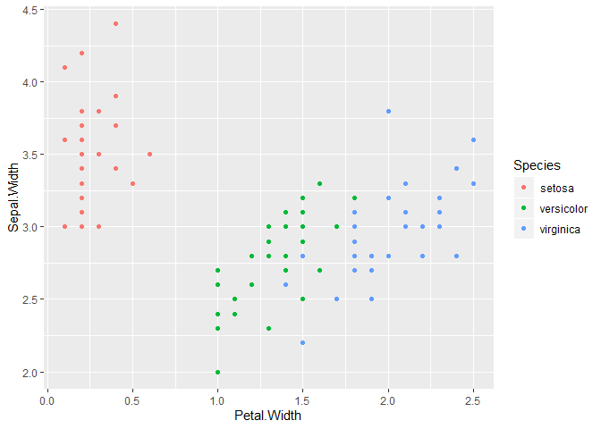
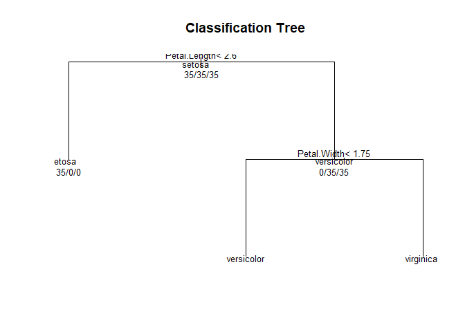
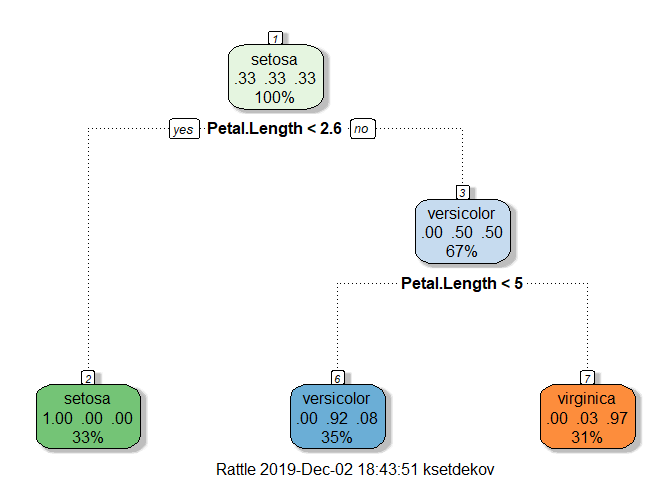

# week 3

## predicting with trees

1. start with all vars
2. find the best separating variable
3. divide the data into two leaves on that node
4. within each split, find the best variable/split that separates the outcomes
5. continue until the groups are too small or sufficientrly "pure"

### measures of impurity

Misclassification Error

$$\hat{P}_{mk} = \frac{1}{N_m}\sum_{x_i\; in \; Leaf \; m}\mathbb{1}(y_i = k)$$
__Misclassification Error__: 
$$ 1 - \hat{p}_{m k(m)}; k(m) = {\rm most; common; k}$$ 
* 0 = perfect purity
* 0.5 = no purity

__Gini index__:
$$ \sum_{k \neq k'} \hat{p}_{mk} \times \hat{p}_{mk'} = \sum_{k=1}^K \hat{p}_{mk}(1-\hat{p}_{mk}) = 1 - \sum_{k=1}^K p_{mk}^2$$

* 0 = perfect purity
* 0.5 = no purity

__Deviance/information gain__:

$$ -\sum_{k=1}^K \hat{p}_{mk} \log_2\hat{p}_{mk} $$
* 0 = perfect purity
* 1 = no purity

http://en.wikipedia.org/wiki/Decision_tree_learning


```r
data(iris)
library(ggplot2)
require(caret)
```

```
## Loading required package: caret
```

```
## Loading required package: lattice
```

```r
names(iris)
```

```
## [1] "Sepal.Length" "Sepal.Width"  "Petal.Length" "Petal.Width" 
## [5] "Species"
```

```r
table(iris$Species)
```

```
## 
##     setosa versicolor  virginica 
##         50         50         50
```


```r
inTrain <- createDataPartition(y = iris$Species,
                               p = 0.7,
                               list = FALSE)
training <- iris[inTrain, ]
testing <- iris[-inTrain, ]
dim(training)
```

```
## [1] 105   5
```

```r
dim(testing)
```

```
## [1] 45  5
```


---

## Iris petal widths/sepal width


```r
qplot(Petal.Width, Sepal.Width, colour = Species, data = training)
```

<!-- -->

```r
library(caret)
modFit <- train(Species ~ .,method="rpart",data=training)
print(modFit$finalModel)
```

```
## n= 105 
## 
## node), split, n, loss, yval, (yprob)
##       * denotes terminal node
## 
## 1) root 105 70 setosa (0.33333333 0.33333333 0.33333333)  
##   2) Petal.Length< 2.6 35  0 setosa (1.00000000 0.00000000 0.00000000) *
##   3) Petal.Length>=2.6 70 35 versicolor (0.00000000 0.50000000 0.50000000)  
##     6) Petal.Length< 4.95 37  3 versicolor (0.00000000 0.91891892 0.08108108) *
##     7) Petal.Length>=4.95 33  1 virginica (0.00000000 0.03030303 0.96969697) *
```


## Plot tree


```r
plot(modFit$finalModel, uniform=TRUE, 
      main="Classification Tree")
text(modFit$finalModel, use.n=TRUE, all=TRUE, cex=.8)
```

<!-- -->
## Prettier plots


```r
library(rattle)
```

```
## Rattle: A free graphical interface for data science with R.
## Version 5.2.0 Copyright (c) 2006-2018 Togaware Pty Ltd.
## Type 'rattle()' to shake, rattle, and roll your data.
```

```r
fancyRpartPlot(modFit$finalModel)
```

<!-- -->

## Predicting new values


```r
predict(modFit,newdata=testing)
```

```
##  [1] setosa     setosa     setosa     setosa     setosa     setosa    
##  [7] setosa     setosa     setosa     setosa     setosa     setosa    
## [13] setosa     setosa     setosa     versicolor versicolor versicolor
## [19] versicolor versicolor versicolor versicolor versicolor versicolor
## [25] virginica  versicolor versicolor versicolor versicolor versicolor
## [31] virginica  virginica  virginica  virginica  virginica  virginica 
## [37] versicolor virginica  virginica  versicolor virginica  virginica 
## [43] versicolor virginica  virginica 
## Levels: setosa versicolor virginica
```


## Notes and further resources

* Classification trees are non-linear models
  * They use interactions between variables
  * Data transformations may be less important (monotone transformations)
  * Trees can also be used for regression problems (continuous outcome)
* Note that there are multiple tree building options
in R both in the caret package - [party](http://cran.r-project.org/web/packages/party/index.html), [rpart](http://cran.r-project.org/web/packages/rpart/index.html) and out of the caret package - [tree](http://cran.r-project.org/web/packages/tree/index.html)
* [Introduction to statistical learning](http://www-bcf.usc.edu/~gareth/ISL/)
* [Elements of Statistical Learning](http://www-stat.stanford.edu/~tibs/ElemStatLearn/)
* [Classification and regression trees](http://www.amazon.com/Classification-Regression-Trees-Leo-Breiman/dp/0412048418)


