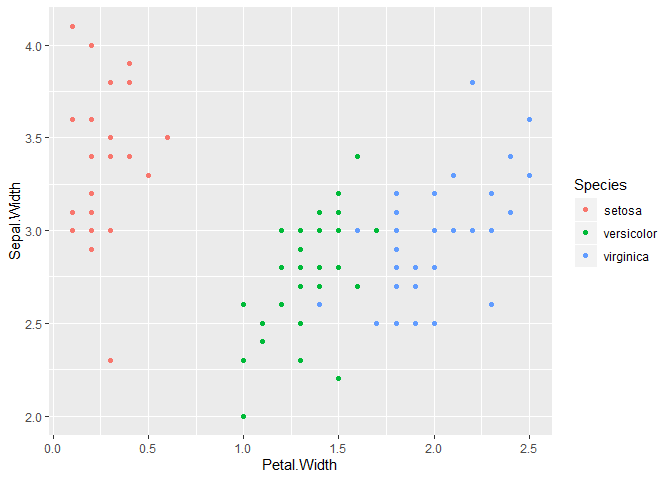
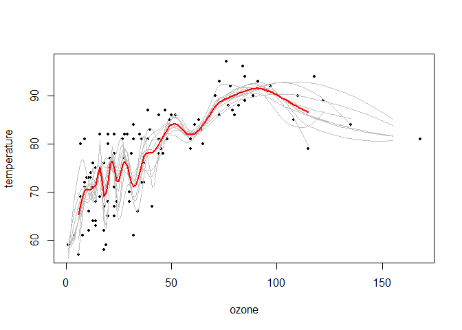
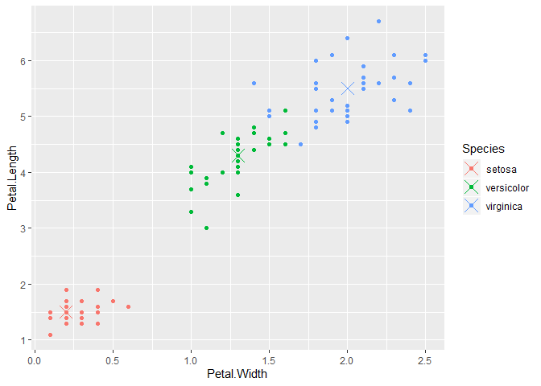
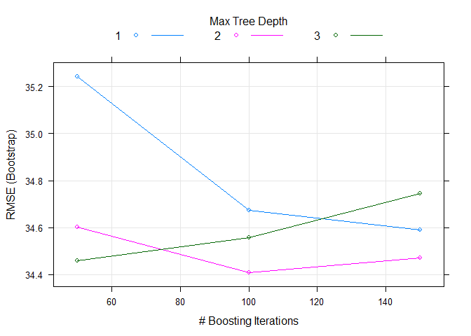
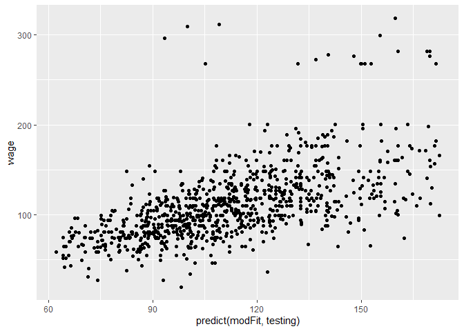
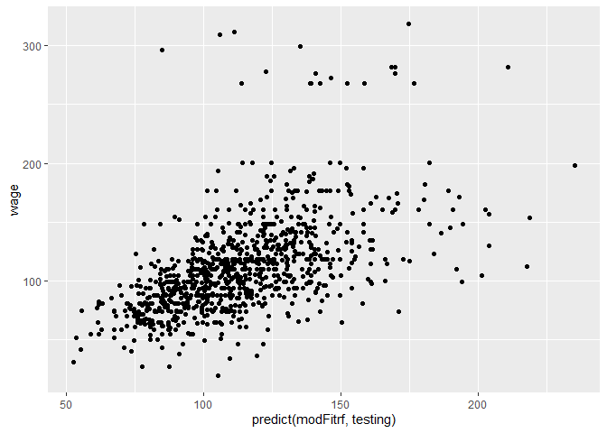
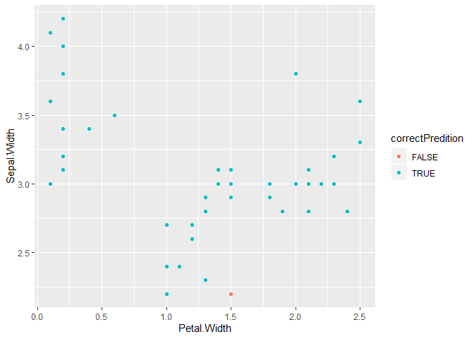

# week 3

## predicting with trees

1. start with all vars
2. find the best separating variable
3. divide the data into two leaves on that node
4. within each split, find the best variable/split that separates the outcomes
5. continue until the groups are too small or sufficientrly "pure"

### measures of impurity

Misclassification Error

$$\hat{P}_{mk} = \frac{1}{N_m}\sum_{x_i\; in \; Leaf \; m}\mathbb{1}(y_i = k)$$
__Misclassification Error__: 
$$ 1 - \hat{p}_{m k(m)}; k(m) = {\rm most; common; k}$$ 
* 0 = perfect purity
* 0.5 = no purity

__Gini index__:
$$ \sum_{k \neq k'} \hat{p}_{mk} \times \hat{p}_{mk'} = \sum_{k=1}^K \hat{p}_{mk}(1-\hat{p}_{mk}) = 1 - \sum_{k=1}^K p_{mk}^2$$

* 0 = perfect purity
* 0.5 = no purity

__Deviance/information gain__:

$$ -\sum_{k=1}^K \hat{p}_{mk} \log_2\hat{p}_{mk} $$
* 0 = perfect purity
* 1 = no purity

http://en.wikipedia.org/wiki/Decision_tree_learning


```r
data(iris)
library(ggplot2)
require(caret)
```

```
## Loading required package: caret
```

```
## Loading required package: lattice
```

```r
names(iris)
```

```
## [1] "Sepal.Length" "Sepal.Width"  "Petal.Length" "Petal.Width" 
## [5] "Species"
```

```r
table(iris$Species)
```

```
## 
##     setosa versicolor  virginica 
##         50         50         50
```


```r
inTrain <- createDataPartition(y = iris$Species,
                               p = 0.7,
                               list = FALSE)
training <- iris[inTrain, ]
testing <- iris[-inTrain, ]
dim(training)
```

```
## [1] 105   5
```

```r
dim(testing)
```

```
## [1] 45  5
```


---

## Iris petal widths/sepal width


```r
qplot(Petal.Width, Sepal.Width, colour = Species, data = training)
```

<!-- -->

```r
library(caret)
modFit <- train(Species ~ .,method="rpart",data=training)
print(modFit$finalModel)
```

```
## n= 105 
## 
## node), split, n, loss, yval, (yprob)
##       * denotes terminal node
## 
## 1) root 105 70 setosa (0.3333333 0.3333333 0.3333333)  
##   2) Petal.Length< 2.45 35  0 setosa (1.0000000 0.0000000 0.0000000) *
##   3) Petal.Length>=2.45 70 35 versicolor (0.0000000 0.5000000 0.5000000)  
##     6) Petal.Width< 1.75 38  4 versicolor (0.0000000 0.8947368 0.1052632) *
##     7) Petal.Width>=1.75 32  1 virginica (0.0000000 0.0312500 0.9687500) *
```


## Plot tree


```r
plot(modFit$finalModel, uniform=TRUE, 
      main="Classification Tree")
text(modFit$finalModel, use.n=TRUE, all=TRUE, cex=.8)
```

<!-- -->
## Prettier plots


```r
library(rattle)
```

```
## Rattle: A free graphical interface for data science with R.
## Version 5.2.0 Copyright (c) 2006-2018 Togaware Pty Ltd.
## Type 'rattle()' to shake, rattle, and roll your data.
```

```r
fancyRpartPlot(modFit$finalModel)
```

<!-- -->

## Predicting new values


```r
predict(modFit,newdata=testing)
```

```
##  [1] setosa     setosa     setosa     setosa     setosa     setosa    
##  [7] setosa     setosa     setosa     setosa     setosa     setosa    
## [13] setosa     setosa     setosa     versicolor versicolor versicolor
## [19] versicolor versicolor versicolor versicolor versicolor versicolor
## [25] versicolor versicolor versicolor versicolor versicolor versicolor
## [31] virginica  virginica  virginica  virginica  virginica  virginica 
## [37] virginica  virginica  virginica  versicolor virginica  virginica 
## [43] virginica  virginica  virginica 
## Levels: setosa versicolor virginica
```


## Notes and further resources

* Classification trees are non-linear models
  * They use interactions between variables
  * Data transformations may be less important (monotone transformations)
  * Trees can also be used for regression problems (continuous outcome)
* Note that there are multiple tree building options
in R both in the caret package - [party](http://cran.r-project.org/web/packages/party/index.html), [rpart](http://cran.r-project.org/web/packages/rpart/index.html) and out of the caret package - [tree](http://cran.r-project.org/web/packages/tree/index.html)
* [Introduction to statistical learning](http://www-bcf.usc.edu/~gareth/ISL/)
* [Elements of Statistical Learning](http://www-stat.stanford.edu/~tibs/ElemStatLearn/)
* [Classification and regression trees](http://www.amazon.com/Classification-Regression-Trees-Leo-Breiman/dp/0412048418)

## bootstrap aggregating (bagging)

1. reasmple causes and make predictions
2. average or majority vote for model


```r
library(ElemStatLearn)
data(ozone, package = "ElemStatLearn")
ozone <- ozone[order(ozone$ozone),]
head(ozone)
```

```
##     ozone radiation temperature wind
## 17      1         8          59  9.7
## 19      4        25          61  9.7
## 14      6        78          57 18.4
## 45      7        48          80 14.3
## 106     7        49          69 10.3
## 7       8        19          61 20.1
```

bagging example

```r
ll <- matrix(NA, nrow = 10, ncol = 155)
for (i in 1:10) {
    ss <- sample(1:dim(ozone)[1], replace = T)
    ozone0 <- ozone[ss, ]
    ozone0 <- ozone0[order(ozone0$ozone), ]
    loess0 <- loess(temperature ~ ozone, data = ozone0, span = 0.2)
    ll[i, ] <- predict(loess0, newdata = data.frame(ozone = 1:155))
}
#average
with(ozone, plot(ozone, temperature, pch = 19, cex = 0.5))
for (i in 1:10) {
    lines(1:155, ll[i,], col="grey", lwd=1)
}
lines(1:155, apply(ll,2,mean), col="red", lwd=2)
```

<!-- -->


bagging - lower variability with same bias


## baggin in caret

Some models perform bagging in train with $method$ options

* bagEarth
* treebag
* bagFDA

## custom bagging


```r
predictors = data.frame(ozone = ozone$ozone)
temperature = ozone$temperature
library(caret)
treebag <-
    bag(
        predictors,
        temperature,
        B = 10,
        bagControl = bagControl(
            fit = ctreeBag$fit,
            predict = ctreeBag$pred,
            aggregate = ctreeBag$aggregate
        )
    )
```

```
## Warning: executing %dopar% sequentially: no parallel backend registered
```
### custom bagging examples
greqy - actual
red - one tree
blue - fit from bagged regression

```r
with(ozone, plot(ozone, temperature, col = "lightgrey", pch = 19, cex = 0.5))
points(ozone$ozone, predict(treebag$fits[[1]]$fit, predictors), pch=19, col="red")
points(ozone$ozone, predict(treebag, predictors), pch=19, col="blue")
```

<!-- -->
exploration

```r
ctreeBag$fit
```

```
## function (x, y, ...) 
## {
##     loadNamespace("party")
##     data <- as.data.frame(x)
##     data$y <- y
##     party::ctree(y ~ ., data = data)
## }
## <bytecode: 0x000000002496ba10>
## <environment: namespace:caret>
```

```r
ctreeBag$pred
```

```
## function (object, x) 
## {
##     if (!is.data.frame(x)) 
##         x <- as.data.frame(x)
##     obsLevels <- levels(object@data@get("response")[, 1])
##     if (!is.null(obsLevels)) {
##         rawProbs <- party::treeresponse(object, x)
##         probMatrix <- matrix(unlist(rawProbs), ncol = length(obsLevels), 
##             byrow = TRUE)
##         out <- data.frame(probMatrix)
##         colnames(out) <- obsLevels
##         rownames(out) <- NULL
##     }
##     else out <- unlist(party::treeresponse(object, x))
##     out
## }
## <bytecode: 0x000000002496b000>
## <environment: namespace:caret>
```

```r
ctreeBag$aggregate
```

```
## function (x, type = "class") 
## {
##     if (is.matrix(x[[1]]) | is.data.frame(x[[1]])) {
##         pooled <- x[[1]] & NA
##         classes <- colnames(pooled)
##         for (i in 1:ncol(pooled)) {
##             tmp <- lapply(x, function(y, col) y[, col], col = i)
##             tmp <- do.call("rbind", tmp)
##             pooled[, i] <- apply(tmp, 2, median)
##         }
##         if (type == "class") {
##             out <- factor(classes[apply(pooled, 1, which.max)], 
##                 levels = classes)
##         }
##         else out <- as.data.frame(pooled)
##     }
##     else {
##         x <- matrix(unlist(x), ncol = length(x))
##         out <- apply(x, 1, median)
##     }
##     out
## }
## <bytecode: 0x0000000024976858>
## <environment: namespace:caret>
```
__Notes__:

* Good for nonlinear model
* often used with trees - an extension is random forstrs
* some models use bagging in caret's train function

__Further resources__:

* [Bagging](http://en.wikipedia.org/wiki/Bootstrap_aggregating)
* [Bagging and boosting](http://stat.ethz.ch/education/semesters/FS_2008/CompStat/sk-ch8.pdf)
* [Elements of Statistical Learning](http://www-stat.stanford.edu/~tibs/ElemStatLearn/)

## random forest

1. bootstrap samples
2. each split, bootstrap variables
3. grow multiple trees and vote or average

pros:

1. accuracy

cons:

1. speed
2. interpretability
3. overfitting


```r
data("iris")
library(ggplot2)
library(caret)
library(randomForest)
```

```
## randomForest 4.6-14
```

```
## Type rfNews() to see new features/changes/bug fixes.
```

```
## 
## Attaching package: 'randomForest'
```

```
## The following object is masked from 'package:rattle':
## 
##     importance
```

```
## The following object is masked from 'package:ggplot2':
## 
##     margin
```

```r
inTrain <- createDataPartition(y = iris$Species, p =0.7, list = FALSE)
training <- iris[inTrain,]
testing <- iris[-inTrain,]

modFit <- train(Species~., data = training, method = "rf", prox = TRUE) #prox - extra info
modFit
```

```
## Random Forest 
## 
## 105 samples
##   4 predictor
##   3 classes: 'setosa', 'versicolor', 'virginica' 
## 
## No pre-processing
## Resampling: Bootstrapped (25 reps) 
## Summary of sample sizes: 105, 105, 105, 105, 105, 105, ... 
## Resampling results across tuning parameters:
## 
##   mtry  Accuracy   Kappa    
##   2     0.9514588  0.9265219
##   3     0.9524134  0.9279188
##   4     0.9535399  0.9297308
## 
## Accuracy was used to select the optimal model using the largest value.
## The final value used for the model was mtry = 4.
```

```r
getTree(modFit$finalModel,k=2)
```

```
##   left daughter right daughter split var split point status prediction
## 1             2              3         4        1.65      1          0
## 2             4              5         3        2.45      1          0
## 3             6              7         3        4.85      1          0
## 4             0              0         0        0.00     -1          1
## 5             0              0         0        0.00     -1          2
## 6             8              9         2        2.85      1          0
## 7             0              0         0        0.00     -1          3
## 8             0              0         0        0.00     -1          3
## 9             0              0         0        0.00     -1          2
```
Class "centers" to show some of the model specifics - ceters for the predicted variables

```r
irisP <- classCenter(training[,c(3,4)] , training$Species, modFit$finalModel$prox)
irisP <- as.data.frame(irisP)
irisP$Species <- rownames(irisP)
p <- qplot(Petal.Width, Petal.Length, col = Species, data = training)
p+ geom_point(aes(x=Petal.Width, y= Petal.Length, col = Species), size = 5, shape = 4, data = irisP)
```

<!-- -->


```r
pred <- predict(modFit, testing)
testing$predRight <- pred ==testing$Species
table(pred, testing$Species)
```

```
##             
## pred         setosa versicolor virginica
##   setosa         15          0         0
##   versicolor      0         14         2
##   virginica       0          1        13
```

```r
qplot(Petal.Width, Petal.Length, colour =predRight, data = testing, main = "newdata Predictions")
```

<!-- -->

### Notes and further resources

__Notes__:

* Random forests are usually one of the two top
performing algorithms along with boosting in prediction contests.
* Random forests are difficult to interpret but often very accurate. 
* Care should be taken to avoid overfitting (see [rfcv](http://cran.r-project.org/web/packages/randomForest/randomForest.pdf) funtion)


__Further resources__:

* [Random forests](http://www.stat.berkeley.edu/~breiman/RandomForests/cc_home.htm)
* [Random forest Wikipedia](http://en.wikipedia.org/wiki/Random_forest)
* [Elements of Statistical Learning](http://www-stat.stanford.edu/~tibs/ElemStatLearn/)

## Boosting

1. take many weak predictors
2. wight them and add them up
3. get a stronger predictor

#### basic idea

1. start with classifiers
    * all possible trees, all regressions, all cutoffs.

2. Create a classififer that combines classification funcitons
    * goal to minimize error on the training set
    * iterative, select one h at each step
    * calculate weights based on errors
    * upweight missed classifications and select next h
    
[Adaboost on Wikipedia](http://en.wikipedia.org/wiki/AdaBoost)

[http://webee.technion.ac.il/people/rmeir/BoostingTutorial.pdf](http://webee.technion.ac.il/people/rmeir/BoostingTutorial.pdf)


### boosting can be with different models


* Boosting can be used with any subset of classifiers
* One large subclass is [gradient boosting](http://en.wikipedia.org/wiki/Gradient_boosting)
* R has multiple boosting libraries. Differences include the choice of basic classification functions and combination rules.
  * [gbm](http://cran.r-project.org/web/packages/gbm/index.html) - boosting with trees.
  * [mboost](http://cran.r-project.org/web/packages/mboost/index.html) - model based boosting
  * [ada](http://cran.r-project.org/web/packages/ada/index.html) - statistical boosting based on [additive logistic regression](http://projecteuclid.org/DPubS?service=UI&version=1.0&verb=Display&handle=euclid.aos/1016218223)
  * [gamBoost](http://cran.r-project.org/web/packages/GAMBoost/index.html) for boosting generalized additive models
* Most of these are available in the caret package 


```r
require(ISLR)
```

```
## Loading required package: ISLR
```

```r
data(Wage)
require(ggplot2)
require(caret)
Wage <- subset(Wage, select = -c(logwage))
inTrain <- createDataPartition(y=Wage$wage, p=0.7, list = FALSE)
training <- Wage[inTrain,]
testing <- Wage[-inTrain,]
```

#### boosting with trees

```r
modFit <- train(wage~., method = "gbm", data = training, verbose = FALSE)
```

```
## Warning in (function (x, y, offset = NULL, misc = NULL, distribution =
## "bernoulli", : variable 14: region2. Middle Atlantic has no variation.
```

```
## Warning in (function (x, y, offset = NULL, misc = NULL, distribution =
## "bernoulli", : variable 15: region3. East North Central has no variation.
```

```
## Warning in (function (x, y, offset = NULL, misc = NULL, distribution =
## "bernoulli", : variable 16: region4. West North Central has no variation.
```

```
## Warning in (function (x, y, offset = NULL, misc = NULL, distribution =
## "bernoulli", : variable 17: region5. South Atlantic has no variation.
```

```
## Warning in (function (x, y, offset = NULL, misc = NULL, distribution =
## "bernoulli", : variable 18: region6. East South Central has no variation.
```

```
## Warning in (function (x, y, offset = NULL, misc = NULL, distribution =
## "bernoulli", : variable 19: region7. West South Central has no variation.
```

```
## Warning in (function (x, y, offset = NULL, misc = NULL, distribution =
## "bernoulli", : variable 20: region8. Mountain has no variation.
```

```
## Warning in (function (x, y, offset = NULL, misc = NULL, distribution =
## "bernoulli", : variable 21: region9. Pacific has no variation.
```

```
## Warning in (function (x, y, offset = NULL, misc = NULL, distribution =
## "bernoulli", : variable 14: region2. Middle Atlantic has no variation.
```

```
## Warning in (function (x, y, offset = NULL, misc = NULL, distribution =
## "bernoulli", : variable 15: region3. East North Central has no variation.
```

```
## Warning in (function (x, y, offset = NULL, misc = NULL, distribution =
## "bernoulli", : variable 16: region4. West North Central has no variation.
```

```
## Warning in (function (x, y, offset = NULL, misc = NULL, distribution =
## "bernoulli", : variable 17: region5. South Atlantic has no variation.
```

```
## Warning in (function (x, y, offset = NULL, misc = NULL, distribution =
## "bernoulli", : variable 18: region6. East South Central has no variation.
```

```
## Warning in (function (x, y, offset = NULL, misc = NULL, distribution =
## "bernoulli", : variable 19: region7. West South Central has no variation.
```

```
## Warning in (function (x, y, offset = NULL, misc = NULL, distribution =
## "bernoulli", : variable 20: region8. Mountain has no variation.
```

```
## Warning in (function (x, y, offset = NULL, misc = NULL, distribution =
## "bernoulli", : variable 21: region9. Pacific has no variation.
```

```
## Warning in (function (x, y, offset = NULL, misc = NULL, distribution =
## "bernoulli", : variable 14: region2. Middle Atlantic has no variation.
```

```
## Warning in (function (x, y, offset = NULL, misc = NULL, distribution =
## "bernoulli", : variable 15: region3. East North Central has no variation.
```

```
## Warning in (function (x, y, offset = NULL, misc = NULL, distribution =
## "bernoulli", : variable 16: region4. West North Central has no variation.
```

```
## Warning in (function (x, y, offset = NULL, misc = NULL, distribution =
## "bernoulli", : variable 17: region5. South Atlantic has no variation.
```

```
## Warning in (function (x, y, offset = NULL, misc = NULL, distribution =
## "bernoulli", : variable 18: region6. East South Central has no variation.
```

```
## Warning in (function (x, y, offset = NULL, misc = NULL, distribution =
## "bernoulli", : variable 19: region7. West South Central has no variation.
```

```
## Warning in (function (x, y, offset = NULL, misc = NULL, distribution =
## "bernoulli", : variable 20: region8. Mountain has no variation.
```

```
## Warning in (function (x, y, offset = NULL, misc = NULL, distribution =
## "bernoulli", : variable 21: region9. Pacific has no variation.
```

```
## Warning in (function (x, y, offset = NULL, misc = NULL, distribution =
## "bernoulli", : variable 14: region2. Middle Atlantic has no variation.
```

```
## Warning in (function (x, y, offset = NULL, misc = NULL, distribution =
## "bernoulli", : variable 15: region3. East North Central has no variation.
```

```
## Warning in (function (x, y, offset = NULL, misc = NULL, distribution =
## "bernoulli", : variable 16: region4. West North Central has no variation.
```

```
## Warning in (function (x, y, offset = NULL, misc = NULL, distribution =
## "bernoulli", : variable 17: region5. South Atlantic has no variation.
```

```
## Warning in (function (x, y, offset = NULL, misc = NULL, distribution =
## "bernoulli", : variable 18: region6. East South Central has no variation.
```

```
## Warning in (function (x, y, offset = NULL, misc = NULL, distribution =
## "bernoulli", : variable 19: region7. West South Central has no variation.
```

```
## Warning in (function (x, y, offset = NULL, misc = NULL, distribution =
## "bernoulli", : variable 20: region8. Mountain has no variation.
```

```
## Warning in (function (x, y, offset = NULL, misc = NULL, distribution =
## "bernoulli", : variable 21: region9. Pacific has no variation.
```

```
## Warning in (function (x, y, offset = NULL, misc = NULL, distribution =
## "bernoulli", : variable 14: region2. Middle Atlantic has no variation.
```

```
## Warning in (function (x, y, offset = NULL, misc = NULL, distribution =
## "bernoulli", : variable 15: region3. East North Central has no variation.
```

```
## Warning in (function (x, y, offset = NULL, misc = NULL, distribution =
## "bernoulli", : variable 16: region4. West North Central has no variation.
```

```
## Warning in (function (x, y, offset = NULL, misc = NULL, distribution =
## "bernoulli", : variable 17: region5. South Atlantic has no variation.
```

```
## Warning in (function (x, y, offset = NULL, misc = NULL, distribution =
## "bernoulli", : variable 18: region6. East South Central has no variation.
```

```
## Warning in (function (x, y, offset = NULL, misc = NULL, distribution =
## "bernoulli", : variable 19: region7. West South Central has no variation.
```

```
## Warning in (function (x, y, offset = NULL, misc = NULL, distribution =
## "bernoulli", : variable 20: region8. Mountain has no variation.
```

```
## Warning in (function (x, y, offset = NULL, misc = NULL, distribution =
## "bernoulli", : variable 21: region9. Pacific has no variation.
```

```
## Warning in (function (x, y, offset = NULL, misc = NULL, distribution =
## "bernoulli", : variable 14: region2. Middle Atlantic has no variation.
```

```
## Warning in (function (x, y, offset = NULL, misc = NULL, distribution =
## "bernoulli", : variable 15: region3. East North Central has no variation.
```

```
## Warning in (function (x, y, offset = NULL, misc = NULL, distribution =
## "bernoulli", : variable 16: region4. West North Central has no variation.
```

```
## Warning in (function (x, y, offset = NULL, misc = NULL, distribution =
## "bernoulli", : variable 17: region5. South Atlantic has no variation.
```

```
## Warning in (function (x, y, offset = NULL, misc = NULL, distribution =
## "bernoulli", : variable 18: region6. East South Central has no variation.
```

```
## Warning in (function (x, y, offset = NULL, misc = NULL, distribution =
## "bernoulli", : variable 19: region7. West South Central has no variation.
```

```
## Warning in (function (x, y, offset = NULL, misc = NULL, distribution =
## "bernoulli", : variable 20: region8. Mountain has no variation.
```

```
## Warning in (function (x, y, offset = NULL, misc = NULL, distribution =
## "bernoulli", : variable 21: region9. Pacific has no variation.
```

```
## Warning in (function (x, y, offset = NULL, misc = NULL, distribution =
## "bernoulli", : variable 14: region2. Middle Atlantic has no variation.
```

```
## Warning in (function (x, y, offset = NULL, misc = NULL, distribution =
## "bernoulli", : variable 15: region3. East North Central has no variation.
```

```
## Warning in (function (x, y, offset = NULL, misc = NULL, distribution =
## "bernoulli", : variable 16: region4. West North Central has no variation.
```

```
## Warning in (function (x, y, offset = NULL, misc = NULL, distribution =
## "bernoulli", : variable 17: region5. South Atlantic has no variation.
```

```
## Warning in (function (x, y, offset = NULL, misc = NULL, distribution =
## "bernoulli", : variable 18: region6. East South Central has no variation.
```

```
## Warning in (function (x, y, offset = NULL, misc = NULL, distribution =
## "bernoulli", : variable 19: region7. West South Central has no variation.
```

```
## Warning in (function (x, y, offset = NULL, misc = NULL, distribution =
## "bernoulli", : variable 20: region8. Mountain has no variation.
```

```
## Warning in (function (x, y, offset = NULL, misc = NULL, distribution =
## "bernoulli", : variable 21: region9. Pacific has no variation.
```

```
## Warning in (function (x, y, offset = NULL, misc = NULL, distribution =
## "bernoulli", : variable 14: region2. Middle Atlantic has no variation.
```

```
## Warning in (function (x, y, offset = NULL, misc = NULL, distribution =
## "bernoulli", : variable 15: region3. East North Central has no variation.
```

```
## Warning in (function (x, y, offset = NULL, misc = NULL, distribution =
## "bernoulli", : variable 16: region4. West North Central has no variation.
```

```
## Warning in (function (x, y, offset = NULL, misc = NULL, distribution =
## "bernoulli", : variable 17: region5. South Atlantic has no variation.
```

```
## Warning in (function (x, y, offset = NULL, misc = NULL, distribution =
## "bernoulli", : variable 18: region6. East South Central has no variation.
```

```
## Warning in (function (x, y, offset = NULL, misc = NULL, distribution =
## "bernoulli", : variable 19: region7. West South Central has no variation.
```

```
## Warning in (function (x, y, offset = NULL, misc = NULL, distribution =
## "bernoulli", : variable 20: region8. Mountain has no variation.
```

```
## Warning in (function (x, y, offset = NULL, misc = NULL, distribution =
## "bernoulli", : variable 21: region9. Pacific has no variation.
```

```
## Warning in (function (x, y, offset = NULL, misc = NULL, distribution =
## "bernoulli", : variable 14: region2. Middle Atlantic has no variation.
```

```
## Warning in (function (x, y, offset = NULL, misc = NULL, distribution =
## "bernoulli", : variable 15: region3. East North Central has no variation.
```

```
## Warning in (function (x, y, offset = NULL, misc = NULL, distribution =
## "bernoulli", : variable 16: region4. West North Central has no variation.
```

```
## Warning in (function (x, y, offset = NULL, misc = NULL, distribution =
## "bernoulli", : variable 17: region5. South Atlantic has no variation.
```

```
## Warning in (function (x, y, offset = NULL, misc = NULL, distribution =
## "bernoulli", : variable 18: region6. East South Central has no variation.
```

```
## Warning in (function (x, y, offset = NULL, misc = NULL, distribution =
## "bernoulli", : variable 19: region7. West South Central has no variation.
```

```
## Warning in (function (x, y, offset = NULL, misc = NULL, distribution =
## "bernoulli", : variable 20: region8. Mountain has no variation.
```

```
## Warning in (function (x, y, offset = NULL, misc = NULL, distribution =
## "bernoulli", : variable 21: region9. Pacific has no variation.
```

```
## Warning in (function (x, y, offset = NULL, misc = NULL, distribution =
## "bernoulli", : variable 14: region2. Middle Atlantic has no variation.
```

```
## Warning in (function (x, y, offset = NULL, misc = NULL, distribution =
## "bernoulli", : variable 15: region3. East North Central has no variation.
```

```
## Warning in (function (x, y, offset = NULL, misc = NULL, distribution =
## "bernoulli", : variable 16: region4. West North Central has no variation.
```

```
## Warning in (function (x, y, offset = NULL, misc = NULL, distribution =
## "bernoulli", : variable 17: region5. South Atlantic has no variation.
```

```
## Warning in (function (x, y, offset = NULL, misc = NULL, distribution =
## "bernoulli", : variable 18: region6. East South Central has no variation.
```

```
## Warning in (function (x, y, offset = NULL, misc = NULL, distribution =
## "bernoulli", : variable 19: region7. West South Central has no variation.
```

```
## Warning in (function (x, y, offset = NULL, misc = NULL, distribution =
## "bernoulli", : variable 20: region8. Mountain has no variation.
```

```
## Warning in (function (x, y, offset = NULL, misc = NULL, distribution =
## "bernoulli", : variable 21: region9. Pacific has no variation.
```

```
## Warning in (function (x, y, offset = NULL, misc = NULL, distribution =
## "bernoulli", : variable 14: region2. Middle Atlantic has no variation.
```

```
## Warning in (function (x, y, offset = NULL, misc = NULL, distribution =
## "bernoulli", : variable 15: region3. East North Central has no variation.
```

```
## Warning in (function (x, y, offset = NULL, misc = NULL, distribution =
## "bernoulli", : variable 16: region4. West North Central has no variation.
```

```
## Warning in (function (x, y, offset = NULL, misc = NULL, distribution =
## "bernoulli", : variable 17: region5. South Atlantic has no variation.
```

```
## Warning in (function (x, y, offset = NULL, misc = NULL, distribution =
## "bernoulli", : variable 18: region6. East South Central has no variation.
```

```
## Warning in (function (x, y, offset = NULL, misc = NULL, distribution =
## "bernoulli", : variable 19: region7. West South Central has no variation.
```

```
## Warning in (function (x, y, offset = NULL, misc = NULL, distribution =
## "bernoulli", : variable 20: region8. Mountain has no variation.
```

```
## Warning in (function (x, y, offset = NULL, misc = NULL, distribution =
## "bernoulli", : variable 21: region9. Pacific has no variation.
```

```
## Warning in (function (x, y, offset = NULL, misc = NULL, distribution =
## "bernoulli", : variable 14: region2. Middle Atlantic has no variation.
```

```
## Warning in (function (x, y, offset = NULL, misc = NULL, distribution =
## "bernoulli", : variable 15: region3. East North Central has no variation.
```

```
## Warning in (function (x, y, offset = NULL, misc = NULL, distribution =
## "bernoulli", : variable 16: region4. West North Central has no variation.
```

```
## Warning in (function (x, y, offset = NULL, misc = NULL, distribution =
## "bernoulli", : variable 17: region5. South Atlantic has no variation.
```

```
## Warning in (function (x, y, offset = NULL, misc = NULL, distribution =
## "bernoulli", : variable 18: region6. East South Central has no variation.
```

```
## Warning in (function (x, y, offset = NULL, misc = NULL, distribution =
## "bernoulli", : variable 19: region7. West South Central has no variation.
```

```
## Warning in (function (x, y, offset = NULL, misc = NULL, distribution =
## "bernoulli", : variable 20: region8. Mountain has no variation.
```

```
## Warning in (function (x, y, offset = NULL, misc = NULL, distribution =
## "bernoulli", : variable 21: region9. Pacific has no variation.
```

```
## Warning in (function (x, y, offset = NULL, misc = NULL, distribution =
## "bernoulli", : variable 14: region2. Middle Atlantic has no variation.
```

```
## Warning in (function (x, y, offset = NULL, misc = NULL, distribution =
## "bernoulli", : variable 15: region3. East North Central has no variation.
```

```
## Warning in (function (x, y, offset = NULL, misc = NULL, distribution =
## "bernoulli", : variable 16: region4. West North Central has no variation.
```

```
## Warning in (function (x, y, offset = NULL, misc = NULL, distribution =
## "bernoulli", : variable 17: region5. South Atlantic has no variation.
```

```
## Warning in (function (x, y, offset = NULL, misc = NULL, distribution =
## "bernoulli", : variable 18: region6. East South Central has no variation.
```

```
## Warning in (function (x, y, offset = NULL, misc = NULL, distribution =
## "bernoulli", : variable 19: region7. West South Central has no variation.
```

```
## Warning in (function (x, y, offset = NULL, misc = NULL, distribution =
## "bernoulli", : variable 20: region8. Mountain has no variation.
```

```
## Warning in (function (x, y, offset = NULL, misc = NULL, distribution =
## "bernoulli", : variable 21: region9. Pacific has no variation.
```

```
## Warning in (function (x, y, offset = NULL, misc = NULL, distribution =
## "bernoulli", : variable 14: region2. Middle Atlantic has no variation.
```

```
## Warning in (function (x, y, offset = NULL, misc = NULL, distribution =
## "bernoulli", : variable 15: region3. East North Central has no variation.
```

```
## Warning in (function (x, y, offset = NULL, misc = NULL, distribution =
## "bernoulli", : variable 16: region4. West North Central has no variation.
```

```
## Warning in (function (x, y, offset = NULL, misc = NULL, distribution =
## "bernoulli", : variable 17: region5. South Atlantic has no variation.
```

```
## Warning in (function (x, y, offset = NULL, misc = NULL, distribution =
## "bernoulli", : variable 18: region6. East South Central has no variation.
```

```
## Warning in (function (x, y, offset = NULL, misc = NULL, distribution =
## "bernoulli", : variable 19: region7. West South Central has no variation.
```

```
## Warning in (function (x, y, offset = NULL, misc = NULL, distribution =
## "bernoulli", : variable 20: region8. Mountain has no variation.
```

```
## Warning in (function (x, y, offset = NULL, misc = NULL, distribution =
## "bernoulli", : variable 21: region9. Pacific has no variation.
```

```
## Warning in (function (x, y, offset = NULL, misc = NULL, distribution =
## "bernoulli", : variable 14: region2. Middle Atlantic has no variation.
```

```
## Warning in (function (x, y, offset = NULL, misc = NULL, distribution =
## "bernoulli", : variable 15: region3. East North Central has no variation.
```

```
## Warning in (function (x, y, offset = NULL, misc = NULL, distribution =
## "bernoulli", : variable 16: region4. West North Central has no variation.
```

```
## Warning in (function (x, y, offset = NULL, misc = NULL, distribution =
## "bernoulli", : variable 17: region5. South Atlantic has no variation.
```

```
## Warning in (function (x, y, offset = NULL, misc = NULL, distribution =
## "bernoulli", : variable 18: region6. East South Central has no variation.
```

```
## Warning in (function (x, y, offset = NULL, misc = NULL, distribution =
## "bernoulli", : variable 19: region7. West South Central has no variation.
```

```
## Warning in (function (x, y, offset = NULL, misc = NULL, distribution =
## "bernoulli", : variable 20: region8. Mountain has no variation.
```

```
## Warning in (function (x, y, offset = NULL, misc = NULL, distribution =
## "bernoulli", : variable 21: region9. Pacific has no variation.
```

```
## Warning in (function (x, y, offset = NULL, misc = NULL, distribution =
## "bernoulli", : variable 14: region2. Middle Atlantic has no variation.
```

```
## Warning in (function (x, y, offset = NULL, misc = NULL, distribution =
## "bernoulli", : variable 15: region3. East North Central has no variation.
```

```
## Warning in (function (x, y, offset = NULL, misc = NULL, distribution =
## "bernoulli", : variable 16: region4. West North Central has no variation.
```

```
## Warning in (function (x, y, offset = NULL, misc = NULL, distribution =
## "bernoulli", : variable 17: region5. South Atlantic has no variation.
```

```
## Warning in (function (x, y, offset = NULL, misc = NULL, distribution =
## "bernoulli", : variable 18: region6. East South Central has no variation.
```

```
## Warning in (function (x, y, offset = NULL, misc = NULL, distribution =
## "bernoulli", : variable 19: region7. West South Central has no variation.
```

```
## Warning in (function (x, y, offset = NULL, misc = NULL, distribution =
## "bernoulli", : variable 20: region8. Mountain has no variation.
```

```
## Warning in (function (x, y, offset = NULL, misc = NULL, distribution =
## "bernoulli", : variable 21: region9. Pacific has no variation.
```

```
## Warning in (function (x, y, offset = NULL, misc = NULL, distribution =
## "bernoulli", : variable 14: region2. Middle Atlantic has no variation.
```

```
## Warning in (function (x, y, offset = NULL, misc = NULL, distribution =
## "bernoulli", : variable 15: region3. East North Central has no variation.
```

```
## Warning in (function (x, y, offset = NULL, misc = NULL, distribution =
## "bernoulli", : variable 16: region4. West North Central has no variation.
```

```
## Warning in (function (x, y, offset = NULL, misc = NULL, distribution =
## "bernoulli", : variable 17: region5. South Atlantic has no variation.
```

```
## Warning in (function (x, y, offset = NULL, misc = NULL, distribution =
## "bernoulli", : variable 18: region6. East South Central has no variation.
```

```
## Warning in (function (x, y, offset = NULL, misc = NULL, distribution =
## "bernoulli", : variable 19: region7. West South Central has no variation.
```

```
## Warning in (function (x, y, offset = NULL, misc = NULL, distribution =
## "bernoulli", : variable 20: region8. Mountain has no variation.
```

```
## Warning in (function (x, y, offset = NULL, misc = NULL, distribution =
## "bernoulli", : variable 21: region9. Pacific has no variation.
```

```
## Warning in (function (x, y, offset = NULL, misc = NULL, distribution =
## "bernoulli", : variable 14: region2. Middle Atlantic has no variation.
```

```
## Warning in (function (x, y, offset = NULL, misc = NULL, distribution =
## "bernoulli", : variable 15: region3. East North Central has no variation.
```

```
## Warning in (function (x, y, offset = NULL, misc = NULL, distribution =
## "bernoulli", : variable 16: region4. West North Central has no variation.
```

```
## Warning in (function (x, y, offset = NULL, misc = NULL, distribution =
## "bernoulli", : variable 17: region5. South Atlantic has no variation.
```

```
## Warning in (function (x, y, offset = NULL, misc = NULL, distribution =
## "bernoulli", : variable 18: region6. East South Central has no variation.
```

```
## Warning in (function (x, y, offset = NULL, misc = NULL, distribution =
## "bernoulli", : variable 19: region7. West South Central has no variation.
```

```
## Warning in (function (x, y, offset = NULL, misc = NULL, distribution =
## "bernoulli", : variable 20: region8. Mountain has no variation.
```

```
## Warning in (function (x, y, offset = NULL, misc = NULL, distribution =
## "bernoulli", : variable 21: region9. Pacific has no variation.
```

```
## Warning in (function (x, y, offset = NULL, misc = NULL, distribution =
## "bernoulli", : variable 14: region2. Middle Atlantic has no variation.
```

```
## Warning in (function (x, y, offset = NULL, misc = NULL, distribution =
## "bernoulli", : variable 15: region3. East North Central has no variation.
```

```
## Warning in (function (x, y, offset = NULL, misc = NULL, distribution =
## "bernoulli", : variable 16: region4. West North Central has no variation.
```

```
## Warning in (function (x, y, offset = NULL, misc = NULL, distribution =
## "bernoulli", : variable 17: region5. South Atlantic has no variation.
```

```
## Warning in (function (x, y, offset = NULL, misc = NULL, distribution =
## "bernoulli", : variable 18: region6. East South Central has no variation.
```

```
## Warning in (function (x, y, offset = NULL, misc = NULL, distribution =
## "bernoulli", : variable 19: region7. West South Central has no variation.
```

```
## Warning in (function (x, y, offset = NULL, misc = NULL, distribution =
## "bernoulli", : variable 20: region8. Mountain has no variation.
```

```
## Warning in (function (x, y, offset = NULL, misc = NULL, distribution =
## "bernoulli", : variable 21: region9. Pacific has no variation.
```

```
## Warning in (function (x, y, offset = NULL, misc = NULL, distribution =
## "bernoulli", : variable 14: region2. Middle Atlantic has no variation.
```

```
## Warning in (function (x, y, offset = NULL, misc = NULL, distribution =
## "bernoulli", : variable 15: region3. East North Central has no variation.
```

```
## Warning in (function (x, y, offset = NULL, misc = NULL, distribution =
## "bernoulli", : variable 16: region4. West North Central has no variation.
```

```
## Warning in (function (x, y, offset = NULL, misc = NULL, distribution =
## "bernoulli", : variable 17: region5. South Atlantic has no variation.
```

```
## Warning in (function (x, y, offset = NULL, misc = NULL, distribution =
## "bernoulli", : variable 18: region6. East South Central has no variation.
```

```
## Warning in (function (x, y, offset = NULL, misc = NULL, distribution =
## "bernoulli", : variable 19: region7. West South Central has no variation.
```

```
## Warning in (function (x, y, offset = NULL, misc = NULL, distribution =
## "bernoulli", : variable 20: region8. Mountain has no variation.
```

```
## Warning in (function (x, y, offset = NULL, misc = NULL, distribution =
## "bernoulli", : variable 21: region9. Pacific has no variation.
```

```
## Warning in (function (x, y, offset = NULL, misc = NULL, distribution =
## "bernoulli", : variable 14: region2. Middle Atlantic has no variation.
```

```
## Warning in (function (x, y, offset = NULL, misc = NULL, distribution =
## "bernoulli", : variable 15: region3. East North Central has no variation.
```

```
## Warning in (function (x, y, offset = NULL, misc = NULL, distribution =
## "bernoulli", : variable 16: region4. West North Central has no variation.
```

```
## Warning in (function (x, y, offset = NULL, misc = NULL, distribution =
## "bernoulli", : variable 17: region5. South Atlantic has no variation.
```

```
## Warning in (function (x, y, offset = NULL, misc = NULL, distribution =
## "bernoulli", : variable 18: region6. East South Central has no variation.
```

```
## Warning in (function (x, y, offset = NULL, misc = NULL, distribution =
## "bernoulli", : variable 19: region7. West South Central has no variation.
```

```
## Warning in (function (x, y, offset = NULL, misc = NULL, distribution =
## "bernoulli", : variable 20: region8. Mountain has no variation.
```

```
## Warning in (function (x, y, offset = NULL, misc = NULL, distribution =
## "bernoulli", : variable 21: region9. Pacific has no variation.
```

```
## Warning in (function (x, y, offset = NULL, misc = NULL, distribution =
## "bernoulli", : variable 14: region2. Middle Atlantic has no variation.
```

```
## Warning in (function (x, y, offset = NULL, misc = NULL, distribution =
## "bernoulli", : variable 15: region3. East North Central has no variation.
```

```
## Warning in (function (x, y, offset = NULL, misc = NULL, distribution =
## "bernoulli", : variable 16: region4. West North Central has no variation.
```

```
## Warning in (function (x, y, offset = NULL, misc = NULL, distribution =
## "bernoulli", : variable 17: region5. South Atlantic has no variation.
```

```
## Warning in (function (x, y, offset = NULL, misc = NULL, distribution =
## "bernoulli", : variable 18: region6. East South Central has no variation.
```

```
## Warning in (function (x, y, offset = NULL, misc = NULL, distribution =
## "bernoulli", : variable 19: region7. West South Central has no variation.
```

```
## Warning in (function (x, y, offset = NULL, misc = NULL, distribution =
## "bernoulli", : variable 20: region8. Mountain has no variation.
```

```
## Warning in (function (x, y, offset = NULL, misc = NULL, distribution =
## "bernoulli", : variable 21: region9. Pacific has no variation.
```

```
## Warning in (function (x, y, offset = NULL, misc = NULL, distribution =
## "bernoulli", : variable 14: region2. Middle Atlantic has no variation.
```

```
## Warning in (function (x, y, offset = NULL, misc = NULL, distribution =
## "bernoulli", : variable 15: region3. East North Central has no variation.
```

```
## Warning in (function (x, y, offset = NULL, misc = NULL, distribution =
## "bernoulli", : variable 16: region4. West North Central has no variation.
```

```
## Warning in (function (x, y, offset = NULL, misc = NULL, distribution =
## "bernoulli", : variable 17: region5. South Atlantic has no variation.
```

```
## Warning in (function (x, y, offset = NULL, misc = NULL, distribution =
## "bernoulli", : variable 18: region6. East South Central has no variation.
```

```
## Warning in (function (x, y, offset = NULL, misc = NULL, distribution =
## "bernoulli", : variable 19: region7. West South Central has no variation.
```

```
## Warning in (function (x, y, offset = NULL, misc = NULL, distribution =
## "bernoulli", : variable 20: region8. Mountain has no variation.
```

```
## Warning in (function (x, y, offset = NULL, misc = NULL, distribution =
## "bernoulli", : variable 21: region9. Pacific has no variation.
```

```
## Warning in (function (x, y, offset = NULL, misc = NULL, distribution =
## "bernoulli", : variable 14: region2. Middle Atlantic has no variation.
```

```
## Warning in (function (x, y, offset = NULL, misc = NULL, distribution =
## "bernoulli", : variable 15: region3. East North Central has no variation.
```

```
## Warning in (function (x, y, offset = NULL, misc = NULL, distribution =
## "bernoulli", : variable 16: region4. West North Central has no variation.
```

```
## Warning in (function (x, y, offset = NULL, misc = NULL, distribution =
## "bernoulli", : variable 17: region5. South Atlantic has no variation.
```

```
## Warning in (function (x, y, offset = NULL, misc = NULL, distribution =
## "bernoulli", : variable 18: region6. East South Central has no variation.
```

```
## Warning in (function (x, y, offset = NULL, misc = NULL, distribution =
## "bernoulli", : variable 19: region7. West South Central has no variation.
```

```
## Warning in (function (x, y, offset = NULL, misc = NULL, distribution =
## "bernoulli", : variable 20: region8. Mountain has no variation.
```

```
## Warning in (function (x, y, offset = NULL, misc = NULL, distribution =
## "bernoulli", : variable 21: region9. Pacific has no variation.
```

```
## Warning in (function (x, y, offset = NULL, misc = NULL, distribution =
## "bernoulli", : variable 14: region2. Middle Atlantic has no variation.
```

```
## Warning in (function (x, y, offset = NULL, misc = NULL, distribution =
## "bernoulli", : variable 15: region3. East North Central has no variation.
```

```
## Warning in (function (x, y, offset = NULL, misc = NULL, distribution =
## "bernoulli", : variable 16: region4. West North Central has no variation.
```

```
## Warning in (function (x, y, offset = NULL, misc = NULL, distribution =
## "bernoulli", : variable 17: region5. South Atlantic has no variation.
```

```
## Warning in (function (x, y, offset = NULL, misc = NULL, distribution =
## "bernoulli", : variable 18: region6. East South Central has no variation.
```

```
## Warning in (function (x, y, offset = NULL, misc = NULL, distribution =
## "bernoulli", : variable 19: region7. West South Central has no variation.
```

```
## Warning in (function (x, y, offset = NULL, misc = NULL, distribution =
## "bernoulli", : variable 20: region8. Mountain has no variation.
```

```
## Warning in (function (x, y, offset = NULL, misc = NULL, distribution =
## "bernoulli", : variable 21: region9. Pacific has no variation.
```

```
## Warning in (function (x, y, offset = NULL, misc = NULL, distribution =
## "bernoulli", : variable 14: region2. Middle Atlantic has no variation.
```

```
## Warning in (function (x, y, offset = NULL, misc = NULL, distribution =
## "bernoulli", : variable 15: region3. East North Central has no variation.
```

```
## Warning in (function (x, y, offset = NULL, misc = NULL, distribution =
## "bernoulli", : variable 16: region4. West North Central has no variation.
```

```
## Warning in (function (x, y, offset = NULL, misc = NULL, distribution =
## "bernoulli", : variable 17: region5. South Atlantic has no variation.
```

```
## Warning in (function (x, y, offset = NULL, misc = NULL, distribution =
## "bernoulli", : variable 18: region6. East South Central has no variation.
```

```
## Warning in (function (x, y, offset = NULL, misc = NULL, distribution =
## "bernoulli", : variable 19: region7. West South Central has no variation.
```

```
## Warning in (function (x, y, offset = NULL, misc = NULL, distribution =
## "bernoulli", : variable 20: region8. Mountain has no variation.
```

```
## Warning in (function (x, y, offset = NULL, misc = NULL, distribution =
## "bernoulli", : variable 21: region9. Pacific has no variation.
```

```
## Warning in (function (x, y, offset = NULL, misc = NULL, distribution =
## "bernoulli", : variable 14: region2. Middle Atlantic has no variation.
```

```
## Warning in (function (x, y, offset = NULL, misc = NULL, distribution =
## "bernoulli", : variable 15: region3. East North Central has no variation.
```

```
## Warning in (function (x, y, offset = NULL, misc = NULL, distribution =
## "bernoulli", : variable 16: region4. West North Central has no variation.
```

```
## Warning in (function (x, y, offset = NULL, misc = NULL, distribution =
## "bernoulli", : variable 17: region5. South Atlantic has no variation.
```

```
## Warning in (function (x, y, offset = NULL, misc = NULL, distribution =
## "bernoulli", : variable 18: region6. East South Central has no variation.
```

```
## Warning in (function (x, y, offset = NULL, misc = NULL, distribution =
## "bernoulli", : variable 19: region7. West South Central has no variation.
```

```
## Warning in (function (x, y, offset = NULL, misc = NULL, distribution =
## "bernoulli", : variable 20: region8. Mountain has no variation.
```

```
## Warning in (function (x, y, offset = NULL, misc = NULL, distribution =
## "bernoulli", : variable 21: region9. Pacific has no variation.
```

```
## Warning in (function (x, y, offset = NULL, misc = NULL, distribution =
## "bernoulli", : variable 14: region2. Middle Atlantic has no variation.
```

```
## Warning in (function (x, y, offset = NULL, misc = NULL, distribution =
## "bernoulli", : variable 15: region3. East North Central has no variation.
```

```
## Warning in (function (x, y, offset = NULL, misc = NULL, distribution =
## "bernoulli", : variable 16: region4. West North Central has no variation.
```

```
## Warning in (function (x, y, offset = NULL, misc = NULL, distribution =
## "bernoulli", : variable 17: region5. South Atlantic has no variation.
```

```
## Warning in (function (x, y, offset = NULL, misc = NULL, distribution =
## "bernoulli", : variable 18: region6. East South Central has no variation.
```

```
## Warning in (function (x, y, offset = NULL, misc = NULL, distribution =
## "bernoulli", : variable 19: region7. West South Central has no variation.
```

```
## Warning in (function (x, y, offset = NULL, misc = NULL, distribution =
## "bernoulli", : variable 20: region8. Mountain has no variation.
```

```
## Warning in (function (x, y, offset = NULL, misc = NULL, distribution =
## "bernoulli", : variable 21: region9. Pacific has no variation.
```

```
## Warning in (function (x, y, offset = NULL, misc = NULL, distribution =
## "bernoulli", : variable 14: region2. Middle Atlantic has no variation.
```

```
## Warning in (function (x, y, offset = NULL, misc = NULL, distribution =
## "bernoulli", : variable 15: region3. East North Central has no variation.
```

```
## Warning in (function (x, y, offset = NULL, misc = NULL, distribution =
## "bernoulli", : variable 16: region4. West North Central has no variation.
```

```
## Warning in (function (x, y, offset = NULL, misc = NULL, distribution =
## "bernoulli", : variable 17: region5. South Atlantic has no variation.
```

```
## Warning in (function (x, y, offset = NULL, misc = NULL, distribution =
## "bernoulli", : variable 18: region6. East South Central has no variation.
```

```
## Warning in (function (x, y, offset = NULL, misc = NULL, distribution =
## "bernoulli", : variable 19: region7. West South Central has no variation.
```

```
## Warning in (function (x, y, offset = NULL, misc = NULL, distribution =
## "bernoulli", : variable 20: region8. Mountain has no variation.
```

```
## Warning in (function (x, y, offset = NULL, misc = NULL, distribution =
## "bernoulli", : variable 21: region9. Pacific has no variation.
```

```
## Warning in (function (x, y, offset = NULL, misc = NULL, distribution =
## "bernoulli", : variable 14: region2. Middle Atlantic has no variation.
```

```
## Warning in (function (x, y, offset = NULL, misc = NULL, distribution =
## "bernoulli", : variable 15: region3. East North Central has no variation.
```

```
## Warning in (function (x, y, offset = NULL, misc = NULL, distribution =
## "bernoulli", : variable 16: region4. West North Central has no variation.
```

```
## Warning in (function (x, y, offset = NULL, misc = NULL, distribution =
## "bernoulli", : variable 17: region5. South Atlantic has no variation.
```

```
## Warning in (function (x, y, offset = NULL, misc = NULL, distribution =
## "bernoulli", : variable 18: region6. East South Central has no variation.
```

```
## Warning in (function (x, y, offset = NULL, misc = NULL, distribution =
## "bernoulli", : variable 19: region7. West South Central has no variation.
```

```
## Warning in (function (x, y, offset = NULL, misc = NULL, distribution =
## "bernoulli", : variable 20: region8. Mountain has no variation.
```

```
## Warning in (function (x, y, offset = NULL, misc = NULL, distribution =
## "bernoulli", : variable 21: region9. Pacific has no variation.
```

```
## Warning in (function (x, y, offset = NULL, misc = NULL, distribution =
## "bernoulli", : variable 14: region2. Middle Atlantic has no variation.
```

```
## Warning in (function (x, y, offset = NULL, misc = NULL, distribution =
## "bernoulli", : variable 15: region3. East North Central has no variation.
```

```
## Warning in (function (x, y, offset = NULL, misc = NULL, distribution =
## "bernoulli", : variable 16: region4. West North Central has no variation.
```

```
## Warning in (function (x, y, offset = NULL, misc = NULL, distribution =
## "bernoulli", : variable 17: region5. South Atlantic has no variation.
```

```
## Warning in (function (x, y, offset = NULL, misc = NULL, distribution =
## "bernoulli", : variable 18: region6. East South Central has no variation.
```

```
## Warning in (function (x, y, offset = NULL, misc = NULL, distribution =
## "bernoulli", : variable 19: region7. West South Central has no variation.
```

```
## Warning in (function (x, y, offset = NULL, misc = NULL, distribution =
## "bernoulli", : variable 20: region8. Mountain has no variation.
```

```
## Warning in (function (x, y, offset = NULL, misc = NULL, distribution =
## "bernoulli", : variable 21: region9. Pacific has no variation.
```

```
## Warning in (function (x, y, offset = NULL, misc = NULL, distribution =
## "bernoulli", : variable 14: region2. Middle Atlantic has no variation.
```

```
## Warning in (function (x, y, offset = NULL, misc = NULL, distribution =
## "bernoulli", : variable 15: region3. East North Central has no variation.
```

```
## Warning in (function (x, y, offset = NULL, misc = NULL, distribution =
## "bernoulli", : variable 16: region4. West North Central has no variation.
```

```
## Warning in (function (x, y, offset = NULL, misc = NULL, distribution =
## "bernoulli", : variable 17: region5. South Atlantic has no variation.
```

```
## Warning in (function (x, y, offset = NULL, misc = NULL, distribution =
## "bernoulli", : variable 18: region6. East South Central has no variation.
```

```
## Warning in (function (x, y, offset = NULL, misc = NULL, distribution =
## "bernoulli", : variable 19: region7. West South Central has no variation.
```

```
## Warning in (function (x, y, offset = NULL, misc = NULL, distribution =
## "bernoulli", : variable 20: region8. Mountain has no variation.
```

```
## Warning in (function (x, y, offset = NULL, misc = NULL, distribution =
## "bernoulli", : variable 21: region9. Pacific has no variation.
```

```
## Warning in (function (x, y, offset = NULL, misc = NULL, distribution =
## "bernoulli", : variable 14: region2. Middle Atlantic has no variation.
```

```
## Warning in (function (x, y, offset = NULL, misc = NULL, distribution =
## "bernoulli", : variable 15: region3. East North Central has no variation.
```

```
## Warning in (function (x, y, offset = NULL, misc = NULL, distribution =
## "bernoulli", : variable 16: region4. West North Central has no variation.
```

```
## Warning in (function (x, y, offset = NULL, misc = NULL, distribution =
## "bernoulli", : variable 17: region5. South Atlantic has no variation.
```

```
## Warning in (function (x, y, offset = NULL, misc = NULL, distribution =
## "bernoulli", : variable 18: region6. East South Central has no variation.
```

```
## Warning in (function (x, y, offset = NULL, misc = NULL, distribution =
## "bernoulli", : variable 19: region7. West South Central has no variation.
```

```
## Warning in (function (x, y, offset = NULL, misc = NULL, distribution =
## "bernoulli", : variable 20: region8. Mountain has no variation.
```

```
## Warning in (function (x, y, offset = NULL, misc = NULL, distribution =
## "bernoulli", : variable 21: region9. Pacific has no variation.
```

```
## Warning in (function (x, y, offset = NULL, misc = NULL, distribution =
## "bernoulli", : variable 14: region2. Middle Atlantic has no variation.
```

```
## Warning in (function (x, y, offset = NULL, misc = NULL, distribution =
## "bernoulli", : variable 15: region3. East North Central has no variation.
```

```
## Warning in (function (x, y, offset = NULL, misc = NULL, distribution =
## "bernoulli", : variable 16: region4. West North Central has no variation.
```

```
## Warning in (function (x, y, offset = NULL, misc = NULL, distribution =
## "bernoulli", : variable 17: region5. South Atlantic has no variation.
```

```
## Warning in (function (x, y, offset = NULL, misc = NULL, distribution =
## "bernoulli", : variable 18: region6. East South Central has no variation.
```

```
## Warning in (function (x, y, offset = NULL, misc = NULL, distribution =
## "bernoulli", : variable 19: region7. West South Central has no variation.
```

```
## Warning in (function (x, y, offset = NULL, misc = NULL, distribution =
## "bernoulli", : variable 20: region8. Mountain has no variation.
```

```
## Warning in (function (x, y, offset = NULL, misc = NULL, distribution =
## "bernoulli", : variable 21: region9. Pacific has no variation.
```

```
## Warning in (function (x, y, offset = NULL, misc = NULL, distribution =
## "bernoulli", : variable 14: region2. Middle Atlantic has no variation.
```

```
## Warning in (function (x, y, offset = NULL, misc = NULL, distribution =
## "bernoulli", : variable 15: region3. East North Central has no variation.
```

```
## Warning in (function (x, y, offset = NULL, misc = NULL, distribution =
## "bernoulli", : variable 16: region4. West North Central has no variation.
```

```
## Warning in (function (x, y, offset = NULL, misc = NULL, distribution =
## "bernoulli", : variable 17: region5. South Atlantic has no variation.
```

```
## Warning in (function (x, y, offset = NULL, misc = NULL, distribution =
## "bernoulli", : variable 18: region6. East South Central has no variation.
```

```
## Warning in (function (x, y, offset = NULL, misc = NULL, distribution =
## "bernoulli", : variable 19: region7. West South Central has no variation.
```

```
## Warning in (function (x, y, offset = NULL, misc = NULL, distribution =
## "bernoulli", : variable 20: region8. Mountain has no variation.
```

```
## Warning in (function (x, y, offset = NULL, misc = NULL, distribution =
## "bernoulli", : variable 21: region9. Pacific has no variation.
```

```
## Warning in (function (x, y, offset = NULL, misc = NULL, distribution =
## "bernoulli", : variable 14: region2. Middle Atlantic has no variation.
```

```
## Warning in (function (x, y, offset = NULL, misc = NULL, distribution =
## "bernoulli", : variable 15: region3. East North Central has no variation.
```

```
## Warning in (function (x, y, offset = NULL, misc = NULL, distribution =
## "bernoulli", : variable 16: region4. West North Central has no variation.
```

```
## Warning in (function (x, y, offset = NULL, misc = NULL, distribution =
## "bernoulli", : variable 17: region5. South Atlantic has no variation.
```

```
## Warning in (function (x, y, offset = NULL, misc = NULL, distribution =
## "bernoulli", : variable 18: region6. East South Central has no variation.
```

```
## Warning in (function (x, y, offset = NULL, misc = NULL, distribution =
## "bernoulli", : variable 19: region7. West South Central has no variation.
```

```
## Warning in (function (x, y, offset = NULL, misc = NULL, distribution =
## "bernoulli", : variable 20: region8. Mountain has no variation.
```

```
## Warning in (function (x, y, offset = NULL, misc = NULL, distribution =
## "bernoulli", : variable 21: region9. Pacific has no variation.
```

```
## Warning in (function (x, y, offset = NULL, misc = NULL, distribution =
## "bernoulli", : variable 14: region2. Middle Atlantic has no variation.
```

```
## Warning in (function (x, y, offset = NULL, misc = NULL, distribution =
## "bernoulli", : variable 15: region3. East North Central has no variation.
```

```
## Warning in (function (x, y, offset = NULL, misc = NULL, distribution =
## "bernoulli", : variable 16: region4. West North Central has no variation.
```

```
## Warning in (function (x, y, offset = NULL, misc = NULL, distribution =
## "bernoulli", : variable 17: region5. South Atlantic has no variation.
```

```
## Warning in (function (x, y, offset = NULL, misc = NULL, distribution =
## "bernoulli", : variable 18: region6. East South Central has no variation.
```

```
## Warning in (function (x, y, offset = NULL, misc = NULL, distribution =
## "bernoulli", : variable 19: region7. West South Central has no variation.
```

```
## Warning in (function (x, y, offset = NULL, misc = NULL, distribution =
## "bernoulli", : variable 20: region8. Mountain has no variation.
```

```
## Warning in (function (x, y, offset = NULL, misc = NULL, distribution =
## "bernoulli", : variable 21: region9. Pacific has no variation.
```

```
## Warning in (function (x, y, offset = NULL, misc = NULL, distribution =
## "bernoulli", : variable 14: region2. Middle Atlantic has no variation.
```

```
## Warning in (function (x, y, offset = NULL, misc = NULL, distribution =
## "bernoulli", : variable 15: region3. East North Central has no variation.
```

```
## Warning in (function (x, y, offset = NULL, misc = NULL, distribution =
## "bernoulli", : variable 16: region4. West North Central has no variation.
```

```
## Warning in (function (x, y, offset = NULL, misc = NULL, distribution =
## "bernoulli", : variable 17: region5. South Atlantic has no variation.
```

```
## Warning in (function (x, y, offset = NULL, misc = NULL, distribution =
## "bernoulli", : variable 18: region6. East South Central has no variation.
```

```
## Warning in (function (x, y, offset = NULL, misc = NULL, distribution =
## "bernoulli", : variable 19: region7. West South Central has no variation.
```

```
## Warning in (function (x, y, offset = NULL, misc = NULL, distribution =
## "bernoulli", : variable 20: region8. Mountain has no variation.
```

```
## Warning in (function (x, y, offset = NULL, misc = NULL, distribution =
## "bernoulli", : variable 21: region9. Pacific has no variation.
```

```
## Warning in (function (x, y, offset = NULL, misc = NULL, distribution =
## "bernoulli", : variable 14: region2. Middle Atlantic has no variation.
```

```
## Warning in (function (x, y, offset = NULL, misc = NULL, distribution =
## "bernoulli", : variable 15: region3. East North Central has no variation.
```

```
## Warning in (function (x, y, offset = NULL, misc = NULL, distribution =
## "bernoulli", : variable 16: region4. West North Central has no variation.
```

```
## Warning in (function (x, y, offset = NULL, misc = NULL, distribution =
## "bernoulli", : variable 17: region5. South Atlantic has no variation.
```

```
## Warning in (function (x, y, offset = NULL, misc = NULL, distribution =
## "bernoulli", : variable 18: region6. East South Central has no variation.
```

```
## Warning in (function (x, y, offset = NULL, misc = NULL, distribution =
## "bernoulli", : variable 19: region7. West South Central has no variation.
```

```
## Warning in (function (x, y, offset = NULL, misc = NULL, distribution =
## "bernoulli", : variable 20: region8. Mountain has no variation.
```

```
## Warning in (function (x, y, offset = NULL, misc = NULL, distribution =
## "bernoulli", : variable 21: region9. Pacific has no variation.
```

```
## Warning in (function (x, y, offset = NULL, misc = NULL, distribution =
## "bernoulli", : variable 14: region2. Middle Atlantic has no variation.
```

```
## Warning in (function (x, y, offset = NULL, misc = NULL, distribution =
## "bernoulli", : variable 15: region3. East North Central has no variation.
```

```
## Warning in (function (x, y, offset = NULL, misc = NULL, distribution =
## "bernoulli", : variable 16: region4. West North Central has no variation.
```

```
## Warning in (function (x, y, offset = NULL, misc = NULL, distribution =
## "bernoulli", : variable 17: region5. South Atlantic has no variation.
```

```
## Warning in (function (x, y, offset = NULL, misc = NULL, distribution =
## "bernoulli", : variable 18: region6. East South Central has no variation.
```

```
## Warning in (function (x, y, offset = NULL, misc = NULL, distribution =
## "bernoulli", : variable 19: region7. West South Central has no variation.
```

```
## Warning in (function (x, y, offset = NULL, misc = NULL, distribution =
## "bernoulli", : variable 20: region8. Mountain has no variation.
```

```
## Warning in (function (x, y, offset = NULL, misc = NULL, distribution =
## "bernoulli", : variable 21: region9. Pacific has no variation.
```

```
## Warning in (function (x, y, offset = NULL, misc = NULL, distribution =
## "bernoulli", : variable 14: region2. Middle Atlantic has no variation.
```

```
## Warning in (function (x, y, offset = NULL, misc = NULL, distribution =
## "bernoulli", : variable 15: region3. East North Central has no variation.
```

```
## Warning in (function (x, y, offset = NULL, misc = NULL, distribution =
## "bernoulli", : variable 16: region4. West North Central has no variation.
```

```
## Warning in (function (x, y, offset = NULL, misc = NULL, distribution =
## "bernoulli", : variable 17: region5. South Atlantic has no variation.
```

```
## Warning in (function (x, y, offset = NULL, misc = NULL, distribution =
## "bernoulli", : variable 18: region6. East South Central has no variation.
```

```
## Warning in (function (x, y, offset = NULL, misc = NULL, distribution =
## "bernoulli", : variable 19: region7. West South Central has no variation.
```

```
## Warning in (function (x, y, offset = NULL, misc = NULL, distribution =
## "bernoulli", : variable 20: region8. Mountain has no variation.
```

```
## Warning in (function (x, y, offset = NULL, misc = NULL, distribution =
## "bernoulli", : variable 21: region9. Pacific has no variation.
```

```
## Warning in (function (x, y, offset = NULL, misc = NULL, distribution =
## "bernoulli", : variable 14: region2. Middle Atlantic has no variation.
```

```
## Warning in (function (x, y, offset = NULL, misc = NULL, distribution =
## "bernoulli", : variable 15: region3. East North Central has no variation.
```

```
## Warning in (function (x, y, offset = NULL, misc = NULL, distribution =
## "bernoulli", : variable 16: region4. West North Central has no variation.
```

```
## Warning in (function (x, y, offset = NULL, misc = NULL, distribution =
## "bernoulli", : variable 17: region5. South Atlantic has no variation.
```

```
## Warning in (function (x, y, offset = NULL, misc = NULL, distribution =
## "bernoulli", : variable 18: region6. East South Central has no variation.
```

```
## Warning in (function (x, y, offset = NULL, misc = NULL, distribution =
## "bernoulli", : variable 19: region7. West South Central has no variation.
```

```
## Warning in (function (x, y, offset = NULL, misc = NULL, distribution =
## "bernoulli", : variable 20: region8. Mountain has no variation.
```

```
## Warning in (function (x, y, offset = NULL, misc = NULL, distribution =
## "bernoulli", : variable 21: region9. Pacific has no variation.
```

```
## Warning in (function (x, y, offset = NULL, misc = NULL, distribution =
## "bernoulli", : variable 14: region2. Middle Atlantic has no variation.
```

```
## Warning in (function (x, y, offset = NULL, misc = NULL, distribution =
## "bernoulli", : variable 15: region3. East North Central has no variation.
```

```
## Warning in (function (x, y, offset = NULL, misc = NULL, distribution =
## "bernoulli", : variable 16: region4. West North Central has no variation.
```

```
## Warning in (function (x, y, offset = NULL, misc = NULL, distribution =
## "bernoulli", : variable 17: region5. South Atlantic has no variation.
```

```
## Warning in (function (x, y, offset = NULL, misc = NULL, distribution =
## "bernoulli", : variable 18: region6. East South Central has no variation.
```

```
## Warning in (function (x, y, offset = NULL, misc = NULL, distribution =
## "bernoulli", : variable 19: region7. West South Central has no variation.
```

```
## Warning in (function (x, y, offset = NULL, misc = NULL, distribution =
## "bernoulli", : variable 20: region8. Mountain has no variation.
```

```
## Warning in (function (x, y, offset = NULL, misc = NULL, distribution =
## "bernoulli", : variable 21: region9. Pacific has no variation.
```

```
## Warning in (function (x, y, offset = NULL, misc = NULL, distribution =
## "bernoulli", : variable 14: region2. Middle Atlantic has no variation.
```

```
## Warning in (function (x, y, offset = NULL, misc = NULL, distribution =
## "bernoulli", : variable 15: region3. East North Central has no variation.
```

```
## Warning in (function (x, y, offset = NULL, misc = NULL, distribution =
## "bernoulli", : variable 16: region4. West North Central has no variation.
```

```
## Warning in (function (x, y, offset = NULL, misc = NULL, distribution =
## "bernoulli", : variable 17: region5. South Atlantic has no variation.
```

```
## Warning in (function (x, y, offset = NULL, misc = NULL, distribution =
## "bernoulli", : variable 18: region6. East South Central has no variation.
```

```
## Warning in (function (x, y, offset = NULL, misc = NULL, distribution =
## "bernoulli", : variable 19: region7. West South Central has no variation.
```

```
## Warning in (function (x, y, offset = NULL, misc = NULL, distribution =
## "bernoulli", : variable 20: region8. Mountain has no variation.
```

```
## Warning in (function (x, y, offset = NULL, misc = NULL, distribution =
## "bernoulli", : variable 21: region9. Pacific has no variation.
```

```
## Warning in (function (x, y, offset = NULL, misc = NULL, distribution =
## "bernoulli", : variable 14: region2. Middle Atlantic has no variation.
```

```
## Warning in (function (x, y, offset = NULL, misc = NULL, distribution =
## "bernoulli", : variable 15: region3. East North Central has no variation.
```

```
## Warning in (function (x, y, offset = NULL, misc = NULL, distribution =
## "bernoulli", : variable 16: region4. West North Central has no variation.
```

```
## Warning in (function (x, y, offset = NULL, misc = NULL, distribution =
## "bernoulli", : variable 17: region5. South Atlantic has no variation.
```

```
## Warning in (function (x, y, offset = NULL, misc = NULL, distribution =
## "bernoulli", : variable 18: region6. East South Central has no variation.
```

```
## Warning in (function (x, y, offset = NULL, misc = NULL, distribution =
## "bernoulli", : variable 19: region7. West South Central has no variation.
```

```
## Warning in (function (x, y, offset = NULL, misc = NULL, distribution =
## "bernoulli", : variable 20: region8. Mountain has no variation.
```

```
## Warning in (function (x, y, offset = NULL, misc = NULL, distribution =
## "bernoulli", : variable 21: region9. Pacific has no variation.
```

```
## Warning in (function (x, y, offset = NULL, misc = NULL, distribution =
## "bernoulli", : variable 14: region2. Middle Atlantic has no variation.
```

```
## Warning in (function (x, y, offset = NULL, misc = NULL, distribution =
## "bernoulli", : variable 15: region3. East North Central has no variation.
```

```
## Warning in (function (x, y, offset = NULL, misc = NULL, distribution =
## "bernoulli", : variable 16: region4. West North Central has no variation.
```

```
## Warning in (function (x, y, offset = NULL, misc = NULL, distribution =
## "bernoulli", : variable 17: region5. South Atlantic has no variation.
```

```
## Warning in (function (x, y, offset = NULL, misc = NULL, distribution =
## "bernoulli", : variable 18: region6. East South Central has no variation.
```

```
## Warning in (function (x, y, offset = NULL, misc = NULL, distribution =
## "bernoulli", : variable 19: region7. West South Central has no variation.
```

```
## Warning in (function (x, y, offset = NULL, misc = NULL, distribution =
## "bernoulli", : variable 20: region8. Mountain has no variation.
```

```
## Warning in (function (x, y, offset = NULL, misc = NULL, distribution =
## "bernoulli", : variable 21: region9. Pacific has no variation.
```

```
## Warning in (function (x, y, offset = NULL, misc = NULL, distribution =
## "bernoulli", : variable 14: region2. Middle Atlantic has no variation.
```

```
## Warning in (function (x, y, offset = NULL, misc = NULL, distribution =
## "bernoulli", : variable 15: region3. East North Central has no variation.
```

```
## Warning in (function (x, y, offset = NULL, misc = NULL, distribution =
## "bernoulli", : variable 16: region4. West North Central has no variation.
```

```
## Warning in (function (x, y, offset = NULL, misc = NULL, distribution =
## "bernoulli", : variable 17: region5. South Atlantic has no variation.
```

```
## Warning in (function (x, y, offset = NULL, misc = NULL, distribution =
## "bernoulli", : variable 18: region6. East South Central has no variation.
```

```
## Warning in (function (x, y, offset = NULL, misc = NULL, distribution =
## "bernoulli", : variable 19: region7. West South Central has no variation.
```

```
## Warning in (function (x, y, offset = NULL, misc = NULL, distribution =
## "bernoulli", : variable 20: region8. Mountain has no variation.
```

```
## Warning in (function (x, y, offset = NULL, misc = NULL, distribution =
## "bernoulli", : variable 21: region9. Pacific has no variation.
```

```
## Warning in (function (x, y, offset = NULL, misc = NULL, distribution =
## "bernoulli", : variable 14: region2. Middle Atlantic has no variation.
```

```
## Warning in (function (x, y, offset = NULL, misc = NULL, distribution =
## "bernoulli", : variable 15: region3. East North Central has no variation.
```

```
## Warning in (function (x, y, offset = NULL, misc = NULL, distribution =
## "bernoulli", : variable 16: region4. West North Central has no variation.
```

```
## Warning in (function (x, y, offset = NULL, misc = NULL, distribution =
## "bernoulli", : variable 17: region5. South Atlantic has no variation.
```

```
## Warning in (function (x, y, offset = NULL, misc = NULL, distribution =
## "bernoulli", : variable 18: region6. East South Central has no variation.
```

```
## Warning in (function (x, y, offset = NULL, misc = NULL, distribution =
## "bernoulli", : variable 19: region7. West South Central has no variation.
```

```
## Warning in (function (x, y, offset = NULL, misc = NULL, distribution =
## "bernoulli", : variable 20: region8. Mountain has no variation.
```

```
## Warning in (function (x, y, offset = NULL, misc = NULL, distribution =
## "bernoulli", : variable 21: region9. Pacific has no variation.
```

```
## Warning in (function (x, y, offset = NULL, misc = NULL, distribution =
## "bernoulli", : variable 14: region2. Middle Atlantic has no variation.
```

```
## Warning in (function (x, y, offset = NULL, misc = NULL, distribution =
## "bernoulli", : variable 15: region3. East North Central has no variation.
```

```
## Warning in (function (x, y, offset = NULL, misc = NULL, distribution =
## "bernoulli", : variable 16: region4. West North Central has no variation.
```

```
## Warning in (function (x, y, offset = NULL, misc = NULL, distribution =
## "bernoulli", : variable 17: region5. South Atlantic has no variation.
```

```
## Warning in (function (x, y, offset = NULL, misc = NULL, distribution =
## "bernoulli", : variable 18: region6. East South Central has no variation.
```

```
## Warning in (function (x, y, offset = NULL, misc = NULL, distribution =
## "bernoulli", : variable 19: region7. West South Central has no variation.
```

```
## Warning in (function (x, y, offset = NULL, misc = NULL, distribution =
## "bernoulli", : variable 20: region8. Mountain has no variation.
```

```
## Warning in (function (x, y, offset = NULL, misc = NULL, distribution =
## "bernoulli", : variable 21: region9. Pacific has no variation.
```

```
## Warning in (function (x, y, offset = NULL, misc = NULL, distribution =
## "bernoulli", : variable 14: region2. Middle Atlantic has no variation.
```

```
## Warning in (function (x, y, offset = NULL, misc = NULL, distribution =
## "bernoulli", : variable 15: region3. East North Central has no variation.
```

```
## Warning in (function (x, y, offset = NULL, misc = NULL, distribution =
## "bernoulli", : variable 16: region4. West North Central has no variation.
```

```
## Warning in (function (x, y, offset = NULL, misc = NULL, distribution =
## "bernoulli", : variable 17: region5. South Atlantic has no variation.
```

```
## Warning in (function (x, y, offset = NULL, misc = NULL, distribution =
## "bernoulli", : variable 18: region6. East South Central has no variation.
```

```
## Warning in (function (x, y, offset = NULL, misc = NULL, distribution =
## "bernoulli", : variable 19: region7. West South Central has no variation.
```

```
## Warning in (function (x, y, offset = NULL, misc = NULL, distribution =
## "bernoulli", : variable 20: region8. Mountain has no variation.
```

```
## Warning in (function (x, y, offset = NULL, misc = NULL, distribution =
## "bernoulli", : variable 21: region9. Pacific has no variation.
```

```
## Warning in (function (x, y, offset = NULL, misc = NULL, distribution =
## "bernoulli", : variable 14: region2. Middle Atlantic has no variation.
```

```
## Warning in (function (x, y, offset = NULL, misc = NULL, distribution =
## "bernoulli", : variable 15: region3. East North Central has no variation.
```

```
## Warning in (function (x, y, offset = NULL, misc = NULL, distribution =
## "bernoulli", : variable 16: region4. West North Central has no variation.
```

```
## Warning in (function (x, y, offset = NULL, misc = NULL, distribution =
## "bernoulli", : variable 17: region5. South Atlantic has no variation.
```

```
## Warning in (function (x, y, offset = NULL, misc = NULL, distribution =
## "bernoulli", : variable 18: region6. East South Central has no variation.
```

```
## Warning in (function (x, y, offset = NULL, misc = NULL, distribution =
## "bernoulli", : variable 19: region7. West South Central has no variation.
```

```
## Warning in (function (x, y, offset = NULL, misc = NULL, distribution =
## "bernoulli", : variable 20: region8. Mountain has no variation.
```

```
## Warning in (function (x, y, offset = NULL, misc = NULL, distribution =
## "bernoulli", : variable 21: region9. Pacific has no variation.
```

```
## Warning in (function (x, y, offset = NULL, misc = NULL, distribution =
## "bernoulli", : variable 14: region2. Middle Atlantic has no variation.
```

```
## Warning in (function (x, y, offset = NULL, misc = NULL, distribution =
## "bernoulli", : variable 15: region3. East North Central has no variation.
```

```
## Warning in (function (x, y, offset = NULL, misc = NULL, distribution =
## "bernoulli", : variable 16: region4. West North Central has no variation.
```

```
## Warning in (function (x, y, offset = NULL, misc = NULL, distribution =
## "bernoulli", : variable 17: region5. South Atlantic has no variation.
```

```
## Warning in (function (x, y, offset = NULL, misc = NULL, distribution =
## "bernoulli", : variable 18: region6. East South Central has no variation.
```

```
## Warning in (function (x, y, offset = NULL, misc = NULL, distribution =
## "bernoulli", : variable 19: region7. West South Central has no variation.
```

```
## Warning in (function (x, y, offset = NULL, misc = NULL, distribution =
## "bernoulli", : variable 20: region8. Mountain has no variation.
```

```
## Warning in (function (x, y, offset = NULL, misc = NULL, distribution =
## "bernoulli", : variable 21: region9. Pacific has no variation.
```

```
## Warning in (function (x, y, offset = NULL, misc = NULL, distribution =
## "bernoulli", : variable 14: region2. Middle Atlantic has no variation.
```

```
## Warning in (function (x, y, offset = NULL, misc = NULL, distribution =
## "bernoulli", : variable 15: region3. East North Central has no variation.
```

```
## Warning in (function (x, y, offset = NULL, misc = NULL, distribution =
## "bernoulli", : variable 16: region4. West North Central has no variation.
```

```
## Warning in (function (x, y, offset = NULL, misc = NULL, distribution =
## "bernoulli", : variable 17: region5. South Atlantic has no variation.
```

```
## Warning in (function (x, y, offset = NULL, misc = NULL, distribution =
## "bernoulli", : variable 18: region6. East South Central has no variation.
```

```
## Warning in (function (x, y, offset = NULL, misc = NULL, distribution =
## "bernoulli", : variable 19: region7. West South Central has no variation.
```

```
## Warning in (function (x, y, offset = NULL, misc = NULL, distribution =
## "bernoulli", : variable 20: region8. Mountain has no variation.
```

```
## Warning in (function (x, y, offset = NULL, misc = NULL, distribution =
## "bernoulli", : variable 21: region9. Pacific has no variation.
```

```
## Warning in (function (x, y, offset = NULL, misc = NULL, distribution =
## "bernoulli", : variable 14: region2. Middle Atlantic has no variation.
```

```
## Warning in (function (x, y, offset = NULL, misc = NULL, distribution =
## "bernoulli", : variable 15: region3. East North Central has no variation.
```

```
## Warning in (function (x, y, offset = NULL, misc = NULL, distribution =
## "bernoulli", : variable 16: region4. West North Central has no variation.
```

```
## Warning in (function (x, y, offset = NULL, misc = NULL, distribution =
## "bernoulli", : variable 17: region5. South Atlantic has no variation.
```

```
## Warning in (function (x, y, offset = NULL, misc = NULL, distribution =
## "bernoulli", : variable 18: region6. East South Central has no variation.
```

```
## Warning in (function (x, y, offset = NULL, misc = NULL, distribution =
## "bernoulli", : variable 19: region7. West South Central has no variation.
```

```
## Warning in (function (x, y, offset = NULL, misc = NULL, distribution =
## "bernoulli", : variable 20: region8. Mountain has no variation.
```

```
## Warning in (function (x, y, offset = NULL, misc = NULL, distribution =
## "bernoulli", : variable 21: region9. Pacific has no variation.
```

```
## Warning in (function (x, y, offset = NULL, misc = NULL, distribution =
## "bernoulli", : variable 14: region2. Middle Atlantic has no variation.
```

```
## Warning in (function (x, y, offset = NULL, misc = NULL, distribution =
## "bernoulli", : variable 15: region3. East North Central has no variation.
```

```
## Warning in (function (x, y, offset = NULL, misc = NULL, distribution =
## "bernoulli", : variable 16: region4. West North Central has no variation.
```

```
## Warning in (function (x, y, offset = NULL, misc = NULL, distribution =
## "bernoulli", : variable 17: region5. South Atlantic has no variation.
```

```
## Warning in (function (x, y, offset = NULL, misc = NULL, distribution =
## "bernoulli", : variable 18: region6. East South Central has no variation.
```

```
## Warning in (function (x, y, offset = NULL, misc = NULL, distribution =
## "bernoulli", : variable 19: region7. West South Central has no variation.
```

```
## Warning in (function (x, y, offset = NULL, misc = NULL, distribution =
## "bernoulli", : variable 20: region8. Mountain has no variation.
```

```
## Warning in (function (x, y, offset = NULL, misc = NULL, distribution =
## "bernoulli", : variable 21: region9. Pacific has no variation.
```

```
## Warning in (function (x, y, offset = NULL, misc = NULL, distribution =
## "bernoulli", : variable 14: region2. Middle Atlantic has no variation.
```

```
## Warning in (function (x, y, offset = NULL, misc = NULL, distribution =
## "bernoulli", : variable 15: region3. East North Central has no variation.
```

```
## Warning in (function (x, y, offset = NULL, misc = NULL, distribution =
## "bernoulli", : variable 16: region4. West North Central has no variation.
```

```
## Warning in (function (x, y, offset = NULL, misc = NULL, distribution =
## "bernoulli", : variable 17: region5. South Atlantic has no variation.
```

```
## Warning in (function (x, y, offset = NULL, misc = NULL, distribution =
## "bernoulli", : variable 18: region6. East South Central has no variation.
```

```
## Warning in (function (x, y, offset = NULL, misc = NULL, distribution =
## "bernoulli", : variable 19: region7. West South Central has no variation.
```

```
## Warning in (function (x, y, offset = NULL, misc = NULL, distribution =
## "bernoulli", : variable 20: region8. Mountain has no variation.
```

```
## Warning in (function (x, y, offset = NULL, misc = NULL, distribution =
## "bernoulli", : variable 21: region9. Pacific has no variation.
```

```
## Warning in (function (x, y, offset = NULL, misc = NULL, distribution =
## "bernoulli", : variable 14: region2. Middle Atlantic has no variation.
```

```
## Warning in (function (x, y, offset = NULL, misc = NULL, distribution =
## "bernoulli", : variable 15: region3. East North Central has no variation.
```

```
## Warning in (function (x, y, offset = NULL, misc = NULL, distribution =
## "bernoulli", : variable 16: region4. West North Central has no variation.
```

```
## Warning in (function (x, y, offset = NULL, misc = NULL, distribution =
## "bernoulli", : variable 17: region5. South Atlantic has no variation.
```

```
## Warning in (function (x, y, offset = NULL, misc = NULL, distribution =
## "bernoulli", : variable 18: region6. East South Central has no variation.
```

```
## Warning in (function (x, y, offset = NULL, misc = NULL, distribution =
## "bernoulli", : variable 19: region7. West South Central has no variation.
```

```
## Warning in (function (x, y, offset = NULL, misc = NULL, distribution =
## "bernoulli", : variable 20: region8. Mountain has no variation.
```

```
## Warning in (function (x, y, offset = NULL, misc = NULL, distribution =
## "bernoulli", : variable 21: region9. Pacific has no variation.
```

```
## Warning in (function (x, y, offset = NULL, misc = NULL, distribution =
## "bernoulli", : variable 14: region2. Middle Atlantic has no variation.
```

```
## Warning in (function (x, y, offset = NULL, misc = NULL, distribution =
## "bernoulli", : variable 15: region3. East North Central has no variation.
```

```
## Warning in (function (x, y, offset = NULL, misc = NULL, distribution =
## "bernoulli", : variable 16: region4. West North Central has no variation.
```

```
## Warning in (function (x, y, offset = NULL, misc = NULL, distribution =
## "bernoulli", : variable 17: region5. South Atlantic has no variation.
```

```
## Warning in (function (x, y, offset = NULL, misc = NULL, distribution =
## "bernoulli", : variable 18: region6. East South Central has no variation.
```

```
## Warning in (function (x, y, offset = NULL, misc = NULL, distribution =
## "bernoulli", : variable 19: region7. West South Central has no variation.
```

```
## Warning in (function (x, y, offset = NULL, misc = NULL, distribution =
## "bernoulli", : variable 20: region8. Mountain has no variation.
```

```
## Warning in (function (x, y, offset = NULL, misc = NULL, distribution =
## "bernoulli", : variable 21: region9. Pacific has no variation.
```

```
## Warning in (function (x, y, offset = NULL, misc = NULL, distribution =
## "bernoulli", : variable 14: region2. Middle Atlantic has no variation.
```

```
## Warning in (function (x, y, offset = NULL, misc = NULL, distribution =
## "bernoulli", : variable 15: region3. East North Central has no variation.
```

```
## Warning in (function (x, y, offset = NULL, misc = NULL, distribution =
## "bernoulli", : variable 16: region4. West North Central has no variation.
```

```
## Warning in (function (x, y, offset = NULL, misc = NULL, distribution =
## "bernoulli", : variable 17: region5. South Atlantic has no variation.
```

```
## Warning in (function (x, y, offset = NULL, misc = NULL, distribution =
## "bernoulli", : variable 18: region6. East South Central has no variation.
```

```
## Warning in (function (x, y, offset = NULL, misc = NULL, distribution =
## "bernoulli", : variable 19: region7. West South Central has no variation.
```

```
## Warning in (function (x, y, offset = NULL, misc = NULL, distribution =
## "bernoulli", : variable 20: region8. Mountain has no variation.
```

```
## Warning in (function (x, y, offset = NULL, misc = NULL, distribution =
## "bernoulli", : variable 21: region9. Pacific has no variation.
```

```
## Warning in (function (x, y, offset = NULL, misc = NULL, distribution =
## "bernoulli", : variable 14: region2. Middle Atlantic has no variation.
```

```
## Warning in (function (x, y, offset = NULL, misc = NULL, distribution =
## "bernoulli", : variable 15: region3. East North Central has no variation.
```

```
## Warning in (function (x, y, offset = NULL, misc = NULL, distribution =
## "bernoulli", : variable 16: region4. West North Central has no variation.
```

```
## Warning in (function (x, y, offset = NULL, misc = NULL, distribution =
## "bernoulli", : variable 17: region5. South Atlantic has no variation.
```

```
## Warning in (function (x, y, offset = NULL, misc = NULL, distribution =
## "bernoulli", : variable 18: region6. East South Central has no variation.
```

```
## Warning in (function (x, y, offset = NULL, misc = NULL, distribution =
## "bernoulli", : variable 19: region7. West South Central has no variation.
```

```
## Warning in (function (x, y, offset = NULL, misc = NULL, distribution =
## "bernoulli", : variable 20: region8. Mountain has no variation.
```

```
## Warning in (function (x, y, offset = NULL, misc = NULL, distribution =
## "bernoulli", : variable 21: region9. Pacific has no variation.
```

```
## Warning in (function (x, y, offset = NULL, misc = NULL, distribution =
## "bernoulli", : variable 14: region2. Middle Atlantic has no variation.
```

```
## Warning in (function (x, y, offset = NULL, misc = NULL, distribution =
## "bernoulli", : variable 15: region3. East North Central has no variation.
```

```
## Warning in (function (x, y, offset = NULL, misc = NULL, distribution =
## "bernoulli", : variable 16: region4. West North Central has no variation.
```

```
## Warning in (function (x, y, offset = NULL, misc = NULL, distribution =
## "bernoulli", : variable 17: region5. South Atlantic has no variation.
```

```
## Warning in (function (x, y, offset = NULL, misc = NULL, distribution =
## "bernoulli", : variable 18: region6. East South Central has no variation.
```

```
## Warning in (function (x, y, offset = NULL, misc = NULL, distribution =
## "bernoulli", : variable 19: region7. West South Central has no variation.
```

```
## Warning in (function (x, y, offset = NULL, misc = NULL, distribution =
## "bernoulli", : variable 20: region8. Mountain has no variation.
```

```
## Warning in (function (x, y, offset = NULL, misc = NULL, distribution =
## "bernoulli", : variable 21: region9. Pacific has no variation.
```

```
## Warning in (function (x, y, offset = NULL, misc = NULL, distribution =
## "bernoulli", : variable 14: region2. Middle Atlantic has no variation.
```

```
## Warning in (function (x, y, offset = NULL, misc = NULL, distribution =
## "bernoulli", : variable 15: region3. East North Central has no variation.
```

```
## Warning in (function (x, y, offset = NULL, misc = NULL, distribution =
## "bernoulli", : variable 16: region4. West North Central has no variation.
```

```
## Warning in (function (x, y, offset = NULL, misc = NULL, distribution =
## "bernoulli", : variable 17: region5. South Atlantic has no variation.
```

```
## Warning in (function (x, y, offset = NULL, misc = NULL, distribution =
## "bernoulli", : variable 18: region6. East South Central has no variation.
```

```
## Warning in (function (x, y, offset = NULL, misc = NULL, distribution =
## "bernoulli", : variable 19: region7. West South Central has no variation.
```

```
## Warning in (function (x, y, offset = NULL, misc = NULL, distribution =
## "bernoulli", : variable 20: region8. Mountain has no variation.
```

```
## Warning in (function (x, y, offset = NULL, misc = NULL, distribution =
## "bernoulli", : variable 21: region9. Pacific has no variation.
```

```
## Warning in (function (x, y, offset = NULL, misc = NULL, distribution =
## "bernoulli", : variable 14: region2. Middle Atlantic has no variation.
```

```
## Warning in (function (x, y, offset = NULL, misc = NULL, distribution =
## "bernoulli", : variable 15: region3. East North Central has no variation.
```

```
## Warning in (function (x, y, offset = NULL, misc = NULL, distribution =
## "bernoulli", : variable 16: region4. West North Central has no variation.
```

```
## Warning in (function (x, y, offset = NULL, misc = NULL, distribution =
## "bernoulli", : variable 17: region5. South Atlantic has no variation.
```

```
## Warning in (function (x, y, offset = NULL, misc = NULL, distribution =
## "bernoulli", : variable 18: region6. East South Central has no variation.
```

```
## Warning in (function (x, y, offset = NULL, misc = NULL, distribution =
## "bernoulli", : variable 19: region7. West South Central has no variation.
```

```
## Warning in (function (x, y, offset = NULL, misc = NULL, distribution =
## "bernoulli", : variable 20: region8. Mountain has no variation.
```

```
## Warning in (function (x, y, offset = NULL, misc = NULL, distribution =
## "bernoulli", : variable 21: region9. Pacific has no variation.
```

```
## Warning in (function (x, y, offset = NULL, misc = NULL, distribution =
## "bernoulli", : variable 14: region2. Middle Atlantic has no variation.
```

```
## Warning in (function (x, y, offset = NULL, misc = NULL, distribution =
## "bernoulli", : variable 15: region3. East North Central has no variation.
```

```
## Warning in (function (x, y, offset = NULL, misc = NULL, distribution =
## "bernoulli", : variable 16: region4. West North Central has no variation.
```

```
## Warning in (function (x, y, offset = NULL, misc = NULL, distribution =
## "bernoulli", : variable 17: region5. South Atlantic has no variation.
```

```
## Warning in (function (x, y, offset = NULL, misc = NULL, distribution =
## "bernoulli", : variable 18: region6. East South Central has no variation.
```

```
## Warning in (function (x, y, offset = NULL, misc = NULL, distribution =
## "bernoulli", : variable 19: region7. West South Central has no variation.
```

```
## Warning in (function (x, y, offset = NULL, misc = NULL, distribution =
## "bernoulli", : variable 20: region8. Mountain has no variation.
```

```
## Warning in (function (x, y, offset = NULL, misc = NULL, distribution =
## "bernoulli", : variable 21: region9. Pacific has no variation.
```

```
## Warning in (function (x, y, offset = NULL, misc = NULL, distribution =
## "bernoulli", : variable 14: region2. Middle Atlantic has no variation.
```

```
## Warning in (function (x, y, offset = NULL, misc = NULL, distribution =
## "bernoulli", : variable 15: region3. East North Central has no variation.
```

```
## Warning in (function (x, y, offset = NULL, misc = NULL, distribution =
## "bernoulli", : variable 16: region4. West North Central has no variation.
```

```
## Warning in (function (x, y, offset = NULL, misc = NULL, distribution =
## "bernoulli", : variable 17: region5. South Atlantic has no variation.
```

```
## Warning in (function (x, y, offset = NULL, misc = NULL, distribution =
## "bernoulli", : variable 18: region6. East South Central has no variation.
```

```
## Warning in (function (x, y, offset = NULL, misc = NULL, distribution =
## "bernoulli", : variable 19: region7. West South Central has no variation.
```

```
## Warning in (function (x, y, offset = NULL, misc = NULL, distribution =
## "bernoulli", : variable 20: region8. Mountain has no variation.
```

```
## Warning in (function (x, y, offset = NULL, misc = NULL, distribution =
## "bernoulli", : variable 21: region9. Pacific has no variation.
```

```
## Warning in (function (x, y, offset = NULL, misc = NULL, distribution =
## "bernoulli", : variable 14: region2. Middle Atlantic has no variation.
```

```
## Warning in (function (x, y, offset = NULL, misc = NULL, distribution =
## "bernoulli", : variable 15: region3. East North Central has no variation.
```

```
## Warning in (function (x, y, offset = NULL, misc = NULL, distribution =
## "bernoulli", : variable 16: region4. West North Central has no variation.
```

```
## Warning in (function (x, y, offset = NULL, misc = NULL, distribution =
## "bernoulli", : variable 17: region5. South Atlantic has no variation.
```

```
## Warning in (function (x, y, offset = NULL, misc = NULL, distribution =
## "bernoulli", : variable 18: region6. East South Central has no variation.
```

```
## Warning in (function (x, y, offset = NULL, misc = NULL, distribution =
## "bernoulli", : variable 19: region7. West South Central has no variation.
```

```
## Warning in (function (x, y, offset = NULL, misc = NULL, distribution =
## "bernoulli", : variable 20: region8. Mountain has no variation.
```

```
## Warning in (function (x, y, offset = NULL, misc = NULL, distribution =
## "bernoulli", : variable 21: region9. Pacific has no variation.
```

```
## Warning in (function (x, y, offset = NULL, misc = NULL, distribution =
## "bernoulli", : variable 14: region2. Middle Atlantic has no variation.
```

```
## Warning in (function (x, y, offset = NULL, misc = NULL, distribution =
## "bernoulli", : variable 15: region3. East North Central has no variation.
```

```
## Warning in (function (x, y, offset = NULL, misc = NULL, distribution =
## "bernoulli", : variable 16: region4. West North Central has no variation.
```

```
## Warning in (function (x, y, offset = NULL, misc = NULL, distribution =
## "bernoulli", : variable 17: region5. South Atlantic has no variation.
```

```
## Warning in (function (x, y, offset = NULL, misc = NULL, distribution =
## "bernoulli", : variable 18: region6. East South Central has no variation.
```

```
## Warning in (function (x, y, offset = NULL, misc = NULL, distribution =
## "bernoulli", : variable 19: region7. West South Central has no variation.
```

```
## Warning in (function (x, y, offset = NULL, misc = NULL, distribution =
## "bernoulli", : variable 20: region8. Mountain has no variation.
```

```
## Warning in (function (x, y, offset = NULL, misc = NULL, distribution =
## "bernoulli", : variable 21: region9. Pacific has no variation.
```

```
## Warning in (function (x, y, offset = NULL, misc = NULL, distribution =
## "bernoulli", : variable 14: region2. Middle Atlantic has no variation.
```

```
## Warning in (function (x, y, offset = NULL, misc = NULL, distribution =
## "bernoulli", : variable 15: region3. East North Central has no variation.
```

```
## Warning in (function (x, y, offset = NULL, misc = NULL, distribution =
## "bernoulli", : variable 16: region4. West North Central has no variation.
```

```
## Warning in (function (x, y, offset = NULL, misc = NULL, distribution =
## "bernoulli", : variable 17: region5. South Atlantic has no variation.
```

```
## Warning in (function (x, y, offset = NULL, misc = NULL, distribution =
## "bernoulli", : variable 18: region6. East South Central has no variation.
```

```
## Warning in (function (x, y, offset = NULL, misc = NULL, distribution =
## "bernoulli", : variable 19: region7. West South Central has no variation.
```

```
## Warning in (function (x, y, offset = NULL, misc = NULL, distribution =
## "bernoulli", : variable 20: region8. Mountain has no variation.
```

```
## Warning in (function (x, y, offset = NULL, misc = NULL, distribution =
## "bernoulli", : variable 21: region9. Pacific has no variation.
```

```
## Warning in (function (x, y, offset = NULL, misc = NULL, distribution =
## "bernoulli", : variable 14: region2. Middle Atlantic has no variation.
```

```
## Warning in (function (x, y, offset = NULL, misc = NULL, distribution =
## "bernoulli", : variable 15: region3. East North Central has no variation.
```

```
## Warning in (function (x, y, offset = NULL, misc = NULL, distribution =
## "bernoulli", : variable 16: region4. West North Central has no variation.
```

```
## Warning in (function (x, y, offset = NULL, misc = NULL, distribution =
## "bernoulli", : variable 17: region5. South Atlantic has no variation.
```

```
## Warning in (function (x, y, offset = NULL, misc = NULL, distribution =
## "bernoulli", : variable 18: region6. East South Central has no variation.
```

```
## Warning in (function (x, y, offset = NULL, misc = NULL, distribution =
## "bernoulli", : variable 19: region7. West South Central has no variation.
```

```
## Warning in (function (x, y, offset = NULL, misc = NULL, distribution =
## "bernoulli", : variable 20: region8. Mountain has no variation.
```

```
## Warning in (function (x, y, offset = NULL, misc = NULL, distribution =
## "bernoulli", : variable 21: region9. Pacific has no variation.
```

```
## Warning in (function (x, y, offset = NULL, misc = NULL, distribution =
## "bernoulli", : variable 14: region2. Middle Atlantic has no variation.
```

```
## Warning in (function (x, y, offset = NULL, misc = NULL, distribution =
## "bernoulli", : variable 15: region3. East North Central has no variation.
```

```
## Warning in (function (x, y, offset = NULL, misc = NULL, distribution =
## "bernoulli", : variable 16: region4. West North Central has no variation.
```

```
## Warning in (function (x, y, offset = NULL, misc = NULL, distribution =
## "bernoulli", : variable 17: region5. South Atlantic has no variation.
```

```
## Warning in (function (x, y, offset = NULL, misc = NULL, distribution =
## "bernoulli", : variable 18: region6. East South Central has no variation.
```

```
## Warning in (function (x, y, offset = NULL, misc = NULL, distribution =
## "bernoulli", : variable 19: region7. West South Central has no variation.
```

```
## Warning in (function (x, y, offset = NULL, misc = NULL, distribution =
## "bernoulli", : variable 20: region8. Mountain has no variation.
```

```
## Warning in (function (x, y, offset = NULL, misc = NULL, distribution =
## "bernoulli", : variable 21: region9. Pacific has no variation.
```

```
## Warning in (function (x, y, offset = NULL, misc = NULL, distribution =
## "bernoulli", : variable 14: region2. Middle Atlantic has no variation.
```

```
## Warning in (function (x, y, offset = NULL, misc = NULL, distribution =
## "bernoulli", : variable 15: region3. East North Central has no variation.
```

```
## Warning in (function (x, y, offset = NULL, misc = NULL, distribution =
## "bernoulli", : variable 16: region4. West North Central has no variation.
```

```
## Warning in (function (x, y, offset = NULL, misc = NULL, distribution =
## "bernoulli", : variable 17: region5. South Atlantic has no variation.
```

```
## Warning in (function (x, y, offset = NULL, misc = NULL, distribution =
## "bernoulli", : variable 18: region6. East South Central has no variation.
```

```
## Warning in (function (x, y, offset = NULL, misc = NULL, distribution =
## "bernoulli", : variable 19: region7. West South Central has no variation.
```

```
## Warning in (function (x, y, offset = NULL, misc = NULL, distribution =
## "bernoulli", : variable 20: region8. Mountain has no variation.
```

```
## Warning in (function (x, y, offset = NULL, misc = NULL, distribution =
## "bernoulli", : variable 21: region9. Pacific has no variation.
```

```
## Warning in (function (x, y, offset = NULL, misc = NULL, distribution =
## "bernoulli", : variable 14: region2. Middle Atlantic has no variation.
```

```
## Warning in (function (x, y, offset = NULL, misc = NULL, distribution =
## "bernoulli", : variable 15: region3. East North Central has no variation.
```

```
## Warning in (function (x, y, offset = NULL, misc = NULL, distribution =
## "bernoulli", : variable 16: region4. West North Central has no variation.
```

```
## Warning in (function (x, y, offset = NULL, misc = NULL, distribution =
## "bernoulli", : variable 17: region5. South Atlantic has no variation.
```

```
## Warning in (function (x, y, offset = NULL, misc = NULL, distribution =
## "bernoulli", : variable 18: region6. East South Central has no variation.
```

```
## Warning in (function (x, y, offset = NULL, misc = NULL, distribution =
## "bernoulli", : variable 19: region7. West South Central has no variation.
```

```
## Warning in (function (x, y, offset = NULL, misc = NULL, distribution =
## "bernoulli", : variable 20: region8. Mountain has no variation.
```

```
## Warning in (function (x, y, offset = NULL, misc = NULL, distribution =
## "bernoulli", : variable 21: region9. Pacific has no variation.
```

```
## Warning in (function (x, y, offset = NULL, misc = NULL, distribution =
## "bernoulli", : variable 14: region2. Middle Atlantic has no variation.
```

```
## Warning in (function (x, y, offset = NULL, misc = NULL, distribution =
## "bernoulli", : variable 15: region3. East North Central has no variation.
```

```
## Warning in (function (x, y, offset = NULL, misc = NULL, distribution =
## "bernoulli", : variable 16: region4. West North Central has no variation.
```

```
## Warning in (function (x, y, offset = NULL, misc = NULL, distribution =
## "bernoulli", : variable 17: region5. South Atlantic has no variation.
```

```
## Warning in (function (x, y, offset = NULL, misc = NULL, distribution =
## "bernoulli", : variable 18: region6. East South Central has no variation.
```

```
## Warning in (function (x, y, offset = NULL, misc = NULL, distribution =
## "bernoulli", : variable 19: region7. West South Central has no variation.
```

```
## Warning in (function (x, y, offset = NULL, misc = NULL, distribution =
## "bernoulli", : variable 20: region8. Mountain has no variation.
```

```
## Warning in (function (x, y, offset = NULL, misc = NULL, distribution =
## "bernoulli", : variable 21: region9. Pacific has no variation.
```

```
## Warning in (function (x, y, offset = NULL, misc = NULL, distribution =
## "bernoulli", : variable 14: region2. Middle Atlantic has no variation.
```

```
## Warning in (function (x, y, offset = NULL, misc = NULL, distribution =
## "bernoulli", : variable 15: region3. East North Central has no variation.
```

```
## Warning in (function (x, y, offset = NULL, misc = NULL, distribution =
## "bernoulli", : variable 16: region4. West North Central has no variation.
```

```
## Warning in (function (x, y, offset = NULL, misc = NULL, distribution =
## "bernoulli", : variable 17: region5. South Atlantic has no variation.
```

```
## Warning in (function (x, y, offset = NULL, misc = NULL, distribution =
## "bernoulli", : variable 18: region6. East South Central has no variation.
```

```
## Warning in (function (x, y, offset = NULL, misc = NULL, distribution =
## "bernoulli", : variable 19: region7. West South Central has no variation.
```

```
## Warning in (function (x, y, offset = NULL, misc = NULL, distribution =
## "bernoulli", : variable 20: region8. Mountain has no variation.
```

```
## Warning in (function (x, y, offset = NULL, misc = NULL, distribution =
## "bernoulli", : variable 21: region9. Pacific has no variation.
```

```
## Warning in (function (x, y, offset = NULL, misc = NULL, distribution =
## "bernoulli", : variable 14: region2. Middle Atlantic has no variation.
```

```
## Warning in (function (x, y, offset = NULL, misc = NULL, distribution =
## "bernoulli", : variable 15: region3. East North Central has no variation.
```

```
## Warning in (function (x, y, offset = NULL, misc = NULL, distribution =
## "bernoulli", : variable 16: region4. West North Central has no variation.
```

```
## Warning in (function (x, y, offset = NULL, misc = NULL, distribution =
## "bernoulli", : variable 17: region5. South Atlantic has no variation.
```

```
## Warning in (function (x, y, offset = NULL, misc = NULL, distribution =
## "bernoulli", : variable 18: region6. East South Central has no variation.
```

```
## Warning in (function (x, y, offset = NULL, misc = NULL, distribution =
## "bernoulli", : variable 19: region7. West South Central has no variation.
```

```
## Warning in (function (x, y, offset = NULL, misc = NULL, distribution =
## "bernoulli", : variable 20: region8. Mountain has no variation.
```

```
## Warning in (function (x, y, offset = NULL, misc = NULL, distribution =
## "bernoulli", : variable 21: region9. Pacific has no variation.
```

```
## Warning in (function (x, y, offset = NULL, misc = NULL, distribution =
## "bernoulli", : variable 14: region2. Middle Atlantic has no variation.
```

```
## Warning in (function (x, y, offset = NULL, misc = NULL, distribution =
## "bernoulli", : variable 15: region3. East North Central has no variation.
```

```
## Warning in (function (x, y, offset = NULL, misc = NULL, distribution =
## "bernoulli", : variable 16: region4. West North Central has no variation.
```

```
## Warning in (function (x, y, offset = NULL, misc = NULL, distribution =
## "bernoulli", : variable 17: region5. South Atlantic has no variation.
```

```
## Warning in (function (x, y, offset = NULL, misc = NULL, distribution =
## "bernoulli", : variable 18: region6. East South Central has no variation.
```

```
## Warning in (function (x, y, offset = NULL, misc = NULL, distribution =
## "bernoulli", : variable 19: region7. West South Central has no variation.
```

```
## Warning in (function (x, y, offset = NULL, misc = NULL, distribution =
## "bernoulli", : variable 20: region8. Mountain has no variation.
```

```
## Warning in (function (x, y, offset = NULL, misc = NULL, distribution =
## "bernoulli", : variable 21: region9. Pacific has no variation.
```

```r
print(modFit)
```

```
## Stochastic Gradient Boosting 
## 
## 2102 samples
##    9 predictor
## 
## No pre-processing
## Resampling: Bootstrapped (25 reps) 
## Summary of sample sizes: 2102, 2102, 2102, 2102, 2102, 2102, ... 
## Resampling results across tuning parameters:
## 
##   interaction.depth  n.trees  RMSE      Rsquared   MAE     
##   1                   50      35.62296  0.3116470  23.99700
##   1                  100      35.03916  0.3203808  23.56071
##   1                  150      35.00222  0.3197653  23.55619
##   2                   50      35.08379  0.3198643  23.60730
##   2                  100      34.98274  0.3204040  23.60280
##   2                  150      35.09491  0.3165925  23.73683
##   3                   50      35.01484  0.3203285  23.59735
##   3                  100      35.17380  0.3134511  23.79020
##   3                  150      35.35589  0.3081356  23.97381
## 
## Tuning parameter 'shrinkage' was held constant at a value of 0.1
## 
## Tuning parameter 'n.minobsinnode' was held constant at a value of 10
## RMSE was used to select the optimal model using the smallest value.
## The final values used for the model were n.trees = 100,
##  interaction.depth = 2, shrinkage = 0.1 and n.minobsinnode = 10.
```

```r
plot(modFit)
```

<!-- -->


```r
require(ggplot2)
qplot(predict(modFit,testing), wage, data = testing)
```

<!-- -->

```r
mad(predict(modFit,testing)- testing$wage)
```

```
## [1] 23.50662
```

```r
MLmetrics::RMSE(y_pred = predict(modFit,testing),y_true = testing$wage)
```

```
## [1] 32.23754
```

```r
#randomForest compare
modFitrf <- train(wage~., method = "rf", data = training, prox = TRUE)
mad(predict(modFitrf,testing)- testing$wage)
```

```
## [1] 25.16234
```

```r
MLmetrics::RMSE(y_pred = predict(modFitrf,testing),y_true = testing$wage)
```

```
## [1] 34.10887
```

```r
qplot(predict(modFitrf,testing), wage, data = testing)
```

<!-- -->
### Boosting notes and further reading

* A couple of nice tutorials for boosting
  * Freund and Shapire - [http://www.cc.gatech.edu/~thad/6601-gradAI-fall2013/boosting.pdf](http://www.cc.gatech.edu/~thad/6601-gradAI-fall2013/boosting.pdf)
  * Ron Meir- [http://webee.technion.ac.il/people/rmeir/BoostingTutorial.pdf](http://webee.technion.ac.il/people/rmeir/BoostingTutorial.pdf)
* Boosting, random forests, and model ensembling are the most common tools that win Kaggle and other prediction contests. 
  * [http://www.netflixprize.com/assets/GrandPrize2009_BPC_BigChaos.pdf](http://www.netflixprize.com/assets/GrandPrize2009_BPC_BigChaos.pdf)
  * [https://kaggle2.blob.core.windows.net/wiki-files/327/09ccf652-8c1c-4a3d-b979-ce2369c985e4/Willem%20Mestrom%20-%20Milestone%201%20Description%20V2%202.pdf](https://kaggle2.blob.core.windows.net/wiki-files/327/09ccf652-8c1c-4a3d-b979-ce2369c985e4/Willem%20Mestrom%20-%20Milestone%201%20Description%20V2%202.pdf)
  
## model based predictions
### Basic idea

1. Assume the data follow a probabilistic model
2. Use Bayes' theorem to identify optimal classifiers

__Pros:__

* Can take advantage of structure of the data
* May be computationally convenient
* Are reasonably accurate on real problems

__Cons:__

* Make additional assumptions about the data
* When the model is incorrect you may get reduced accuracy

---

### Model based approach


1. Our goal is to build parametric model for conditional distribution $P(Y = k | X = x)$

2. A typical approach is to apply [Bayes theorem](http://en.wikipedia.org/wiki/Bayes'_theorem):
$$ Pr(Y = k | X=x) = \frac{Pr(X=x|Y=k)Pr(Y=k)}{\sum_{\ell=1}^K Pr(X=x |Y = \ell) Pr(Y=\ell)}$$
$$Pr(Y = k | X=x) = \frac{f_k(x) \pi_k}{\sum_{\ell = 1}^K f_{\ell}(x) \pi_{\ell}}$$
$f_k(x)$ - features distribution given class

$Pr(Y=k)$ -  assume a prior that each specific element comes from a class
3. Typically prior probabilities $\pi_k$ are set in advance.

4. A common choice for $f_k(x) = \frac{1}{\sigma_k \sqrt{2 \pi}}e^{-\frac{(x-\mu_k)^2}{\sigma_k^2}}$, a Gaussian distribution

5. Estimate the parameters ($\mu_k$,$\sigma_k^2$) from the data.

6. Classify to the class with the highest value of $P(Y = k | X = x)$

## Classifying using the model

A range of models use this approach

* Linear discriminant analysis assumes $f_k(x)$ is multivariate Gaussian with same covariances (http://statweb.stanford.edu/~tibs/ElemStatLearn/)
    * basically lines through data
* Quadratic discrimant analysis assumes $f_k(x)$ is multivariate Gaussian with different covariances
    * different covariance matrices through different classes
* [Model based prediction](http://www.stat.washington.edu/mclust/) assumes more complicated versions for the covariance matrix 
* Naive Bayes assumes independence between features for model building

http://statweb.stanford.edu/~tibs/ElemStatLearn/


## Naive Bayes.

Suppose we have many predictors, we would want to model: $P(Y = k | X_1,\ldots,X_m)$

We could use Bayes Theorem to get:

$$P(Y = k | X_1,\ldots,X_m) = \frac{\pi_k P(X_1,\ldots,X_m| Y=k)}{\sum_{\ell = 1}^K P(X_1,\ldots,X_m | Y=k) \pi_{\ell}}$$
$$ \propto \pi_k P(X_1,\ldots,X_m| Y=k)$$

This can be written:

$$P(X_1,\ldots,X_m, Y=k) = \pi_k P(X_1 | Y = k)P(X_2,\ldots,X_m | X_1,Y=k)$$
$$ = \pi_k P(X_1 | Y = k) P(X_2 | X_1, Y=k) P(X_3,\ldots,X_m | X_1,X_2, Y=k)$$
$$ = \pi_k P(X_1 | Y = k) P(X_2 | X_1, Y=k)\ldots P(X_m|X_1\ldots,X_{m-1},Y=k)$$


assume that all of the predictor variables are independent of each other.

In which case they drop out of this conditioning argument.

prior probability X the probability of each feature by itself X conditional on being in each class.


$$ \approx \pi_k P(X_1 | Y = k) P(X_2 | Y = k)\ldots P(X_m |,Y=k)$$

Great when a lot of features - like documents.

```r
data(iris)
library(ggplot2)
names(iris)
```

```
## [1] "Sepal.Length" "Sepal.Width"  "Petal.Length" "Petal.Width" 
## [5] "Species"
```

```r
inTrain <- createDataPartition(y = iris$Species, p =0.7, list = FALSE)
training <- iris[inTrain,]
testing <- iris[-inTrain,]


modlda=train(Species~., data=training, method = "lda")
modnb=train(Species~., data=training, method = "nb")

plda=predict(modlda, testing)
pnb=predict(modnb, testing)
table(plda, testing$Species)
```

```
##             
## plda         setosa versicolor virginica
##   setosa         15          0         0
##   versicolor      0         15         0
##   virginica       0          0        15
```

```r
table(pnb, testing$Species)
```

```
##             
## pnb          setosa versicolor virginica
##   setosa         15          0         0
##   versicolor      0         14         0
##   virginica       0          1        15
```

#### almost identical

```r
table(pnb, plda)
```

```
##             plda
## pnb          setosa versicolor virginica
##   setosa         15          0         0
##   versicolor      0         14         0
##   virginica       0          1        15
```

```r
equalpredictions = (plda== pnb)
qplot(Petal.Width, Sepal.Width, colour=equalpredictions, data = testing)
```

<!-- -->

```r
correctPredition = (pnb == testing$Species)
qplot(Petal.Width, Sepal.Width, colour=correctPredition, data = testing)
```

<!-- -->

## Notes and further reading

* [Introduction to statistical learning](http://www-bcf.usc.edu/~gareth/ISL/)
* [Elements of Statistical Learning](http://www-stat.stanford.edu/~tibs/ElemStatLearn/)
* [Model based clustering](http://www.stat.washington.edu/raftery/Research/PDF/fraley2002.pdf)
* [Linear Discriminant Analysis](http://en.wikipedia.org/wiki/Linear_discriminant_analysis)
* [Quadratic Discriminant Analysis](http://en.wikipedia.org/wiki/Quadratic_classifier)

