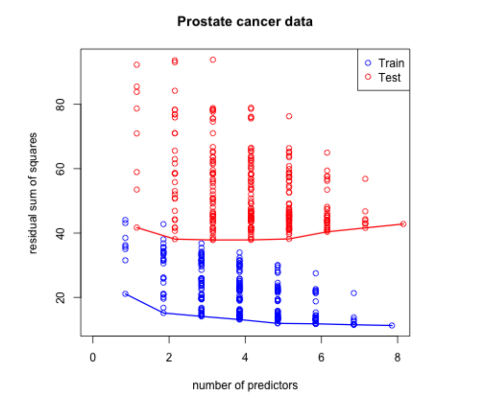
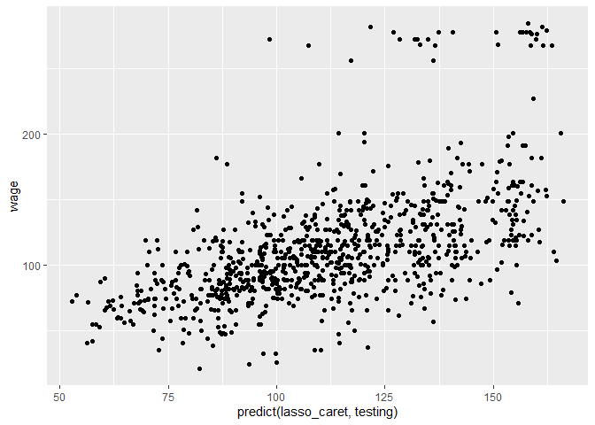
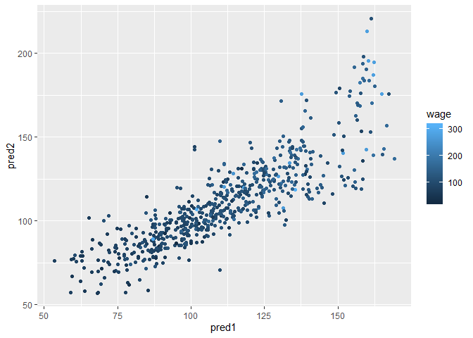
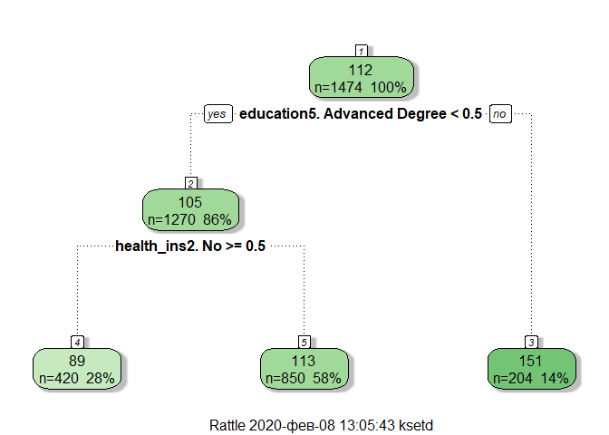
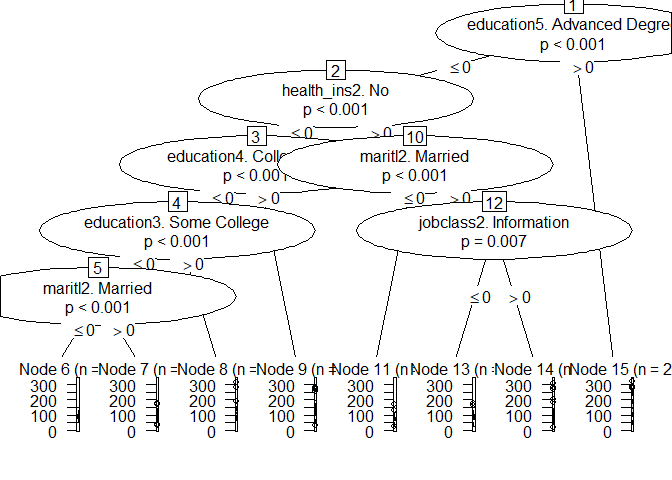
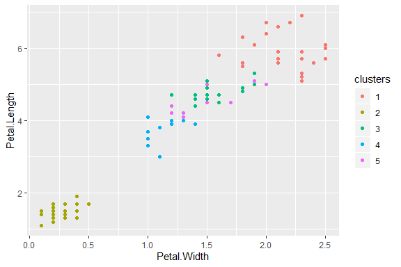

# week 4

## reguralized regressions

_idea_

1. fit regression
2. shrink large coefficients.

*good*

* can help with bias
* can help with model selection

*bad*

* may be computationally hard on big data
* worse than random forest and boosting


```r
library(ElemStatLearn)
data("prostate")
str(prostate)
```

```
## 'data.frame':	97 obs. of  10 variables:
##  $ lcavol : num  -0.58 -0.994 -0.511 -1.204 0.751 ...
##  $ lweight: num  2.77 3.32 2.69 3.28 3.43 ...
##  $ age    : int  50 58 74 58 62 50 64 58 47 63 ...
##  $ lbph   : num  -1.39 -1.39 -1.39 -1.39 -1.39 ...
##  $ svi    : int  0 0 0 0 0 0 0 0 0 0 ...
##  $ lcp    : num  -1.39 -1.39 -1.39 -1.39 -1.39 ...
##  $ gleason: int  6 6 7 6 6 6 6 6 6 6 ...
##  $ pgg45  : int  0 0 20 0 0 0 0 0 0 0 ...
##  $ lpsa   : num  -0.431 -0.163 -0.163 -0.163 0.372 ...
##  $ train  : logi  TRUE TRUE TRUE TRUE TRUE TRUE ...
```



[Code here](http://www.cbcb.umd.edu/~hcorrada/PracticalML/src/selection.R)

## Most common pattern


http://www.biostat.jhsph.edu/~ririzarr/Teaching/649/


## good solution - split samples
* No method better when data/computation time permits it

* Approach
  1. Divide data into training/test/validation
  2. Treat validation as test data, train all competing models on the train data and pick the best one on validation. 
  3. To appropriately assess performance on new data apply to test set
  4. You may re-split and reperform steps 1-3

* Two common problems
  * Limited data
  * Computational complexity
  
http://www.biostat.jhsph.edu/~ririzarr/Teaching/649/
http://www.cbcb.umd.edu/~hcorrada/PracticalML/

Reqularized regression trades of variance for better bias

Assume $Y_i = f(X_i) + \epsilon_i$

$EPE(\lambda) = E\left[\{Y - \hat{f}_{\lambda}(X)\}^2\right]$

Suppose $\hat{f}_{\lambda}$ is the estimate from the training data and look at a new data point $X = x^*$

$$E\left[\{Y - \hat{f}_{\lambda}(x^*)\}^2\right] = \sigma^2 + \{E[\hat{f}_{\lambda}(x^*)] - f(x^*)\}^2 + var[\hat{f}_\lambda(x_0)]$$

<center> = Irreducible error + Bias$^2$ + Variance </center>

#### One more issue with high-dimensional data

More predictors than samples


```r
small = prostate[1:5, ]
lm(lpsa~., data = small)
```

```
## 
## Call:
## lm(formula = lpsa ~ ., data = small)
## 
## Coefficients:
## (Intercept)       lcavol      lweight          age         lbph  
##     9.60615      0.13901     -0.79142      0.09516           NA  
##         svi          lcp      gleason        pgg45    trainTRUE  
##          NA           NA     -2.08710           NA           NA
```
## Hard thresholding

* Model $Y = f(X) + \epsilon$

* Set $\hat{f}_{\lambda}(x) = x'\beta$

* Constrain only $\lambda$ coefficients to be nonzero. 

* Selection problem is after chosing $\lambda$ figure out which $p - \lambda$ coefficients to make nonzero

http://www.biostat.jhsph.edu/~ririzarr/Teaching/649/
http://www.cbcb.umd.edu/~hcorrada/PracticalML/

---

## Regularization for regression

If the $\beta_j$'s are unconstrained:
* They can explode
* And hence are susceptible to very high variance

To control variance, we might regularize/shrink the coefficients. 

$$ PRSS(\beta) = \sum_{j=1}^n (Y_j - \sum_{i=1}^m \beta_{1i} X_{ij})^2 + P(\lambda; \beta)$$

where $PRSS$ is a penalized form of the sum of squares. Things that are commonly looked for

* Penalty reduces complexity
* Penalty reduces variance
* Penalty respects structure of the problem

---

## Ridge regression

Solve:

$$ \sum_{i=1}^N \left(y_i - \beta_0 + \sum_{j=1}^p x_{ij}\beta_j \right)^2 + \lambda \sum_{j=1}^p \beta_j^2$$

equivalent to solving

$\sum_{i=1}^N \left(y_i - \beta_0 + \sum_{j=1}^p x_{ij}\beta_j \right)^2$ subject to $\sum_{j=1}^p \beta_j^2 \leq s$ where $s$ is inversely proportional to $\lambda$ 


Inclusion of $\lambda$ makes the problem non-singular even if $X^TX$ is not invertible.

http://www.biostat.jhsph.edu/~ririzarr/Teaching/649/
http://www.cbcb.umd.edu/~hcorrada/PracticalML/

## Tuning parameter $\lambda$

* $\lambda$ controls the size of the coefficients
* $\lambda$ controls the amount of {\bf regularization}
* As $\lambda \rightarrow 0$ we obtain the least square solution
* As $\lambda \rightarrow \infty$ we have $\hat{\beta}_{\lambda=\infty}^{ridge} = 0$


## Lasso 

$\sum_{i=1}^N \left(y_i - \beta_0 + \sum_{j=1}^p x_{ij}\beta_j \right)^2$ subject to $\sum_{j=1}^p |\beta_j| \leq s$ 

also has a lagrangian form 

$$ \sum_{i=1}^N \left(y_i - \beta_0 + \sum_{j=1}^p x_{ij}\beta_j \right)^2 + \lambda \sum_{j=1}^p |\beta_j|$$

For orthonormal design matrices (not the norm!) this has a closed form solution

$$\hat{\beta}_j = sign(\hat{\beta}_j^0)(|\hat{\beta}_j^0 - \gamma)^{+}$$
 
but not in general. 

Good model as it 

## Notes and further reading


* [Hector Corrada Bravo's Practical Machine Learning lecture notes](http://www.cbcb.umd.edu/~hcorrada/PracticalML/)
* [Hector's penalized regression reading list](http://www.cbcb.umd.edu/~hcorrada/AMSC689.html#readings)
* [Elements of Statistical Learning](http://statweb.stanford.edu/~tibs/ElemStatLearn/)
* In `caret` methods are:
  * `ridge`
  * `lasso`
  * `relaxo`
  

```r
library(dplyr)

library(caret)
require(ISLR)
data(Wage)
require(ggplot2)

Wage <- subset(Wage, select = -c(logwage))
inTrain <- createDataPartition(y=Wage$wage, p=0.7, list = FALSE)
training <- Wage[inTrain,]
testing <- Wage[-inTrain,]
modFit <- train(wage~., method = "lm", data = training, verbose = FALSE)

print(modFit)
```

```
## Linear Regression 
## 
## 2102 samples
##    9 predictor
## 
## No pre-processing
## Resampling: Bootstrapped (25 reps) 
## Summary of sample sizes: 2102, 2102, 2102, 2102, 2102, 2102, ... 
## Resampling results:
## 
##   RMSE      Rsquared   MAE     
##   34.53186  0.3289216  23.25285
## 
## Tuning parameter 'intercept' was held constant at a value of TRUE
```

Это результат для простой модели


```r
qplot(predict(modFit,testing), wage, data = testing)
```

<!-- -->

```r
MLmetrics::RMSE(y_pred = predict(modFit,testing),y_true = testing$wage)
```

```
## [1] 34.18433
```

```r
lasso_caret<- train(wage~., data = training, method = "glmnet", lambda= 0,
                    tuneGrid = expand.grid(alpha = 1,  lambda = 0))
print(lasso_caret)
```

```
## glmnet 
## 
## 2102 samples
##    9 predictor
## 
## No pre-processing
## Resampling: Bootstrapped (25 reps) 
## Summary of sample sizes: 2102, 2102, 2102, 2102, 2102, 2102, ... 
## Resampling results:
## 
##   RMSE      Rsquared   MAE     
##   34.08297  0.3155644  23.04166
## 
## Tuning parameter 'alpha' was held constant at a value of 1
## 
## Tuning parameter 'lambda' was held constant at a value of 0
```

```r
qplot(predict(lasso_caret,testing), wage, data = testing)
```

<!-- -->

```r
MLmetrics::RMSE(y_pred = predict(lasso_caret,testing),y_true = testing$wage)
```

```
## [1] 34.18404
```
Это результат для модели с Lasso


# ensembling methods

* combine classifiers by averaging, Voting
* combininig -> greater accuracy
* reduce interpretability
* boosting, bagging and RF does this with one type of predictions

## approaches

1. boosting, bagging and RF 
    * similar classifier
2. combine different classifiers
    * model stacking 
    * model ensembling


```r
#separate in 3 sets
library(ISLR)
data("Wage")
library(ggplot2)
library(caret)
Wage <- subset(Wage, select = -c(logwage))
inBuild <- createDataPartition(y=Wage$wage, p=0.7, list = FALSE)
validation <- Wage[-inBuild,]
buildData <- Wage[inBuild,]
inTrain <- createDataPartition(y=buildData$wage, p=0.7, list = FALSE)
training <- buildData[inTrain,]
testing <- buildData[-inTrain,]
```

### build 2 models


```r
library(party)
```

```
## Loading required package: grid
```

```
## Loading required package: mvtnorm
```

```
## Loading required package: modeltools
```

```
## Loading required package: stats4
```

```
## Loading required package: strucchange
```

```
## Loading required package: zoo
```

```
## 
## Attaching package: 'zoo'
```

```
## The following objects are masked from 'package:base':
## 
##     as.Date, as.Date.numeric
```

```
## Loading required package: sandwich
```

```r
mod1 <- train(wage~., method ="glm", data = training)
mod2 <- train(wage~., method ="rf", data = training, trControl = trainControl(method = "cv"),number = 3)
mod3 <- train(wage~., method ="rpart", data = training)
mod4 <- train(wage~., method ="ctree", data = training)
mod5 <- mob(wage~age+education|year+maritl+race+region+jobclass+health+health_ins,data = training)
```
### compare them

```r
pred1 <- predict(mod1, testing)
```

```
## Warning in predict.lm(object, newdata, se.fit, scale = 1, type = if (type
## == : prediction from a rank-deficient fit may be misleading
```

```r
pred2 <- predict(mod2, testing)
pred3 <- predict(mod3, testing)
pred4 <- predict(mod4, testing)
pred5 <- predict(mod5, testing)
                 
qplot(pred1,pred2, colour = wage, data = testing)
```

<!-- -->

```r
qplot(pred3,pred4, colour = wage, data = testing)
```

<!-- -->

```r
library(rattle)
```

```
## Rattle: A free graphical interface for data science with R.
## Version 5.2.0 Copyright (c) 2006-2018 Togaware Pty Ltd.
## Type 'rattle()' to shake, rattle, and roll your data.
```

```r
fancyRpartPlot(mod3$finalModel)
```

<!-- -->

```r
plot(mod4$finalModel)
```

<!-- -->

```r
plot(mod5)
```

<!-- -->

```r
qplot(wage,pred5, colour = wage, data = testing)
```

<!-- -->

### make a model that combines predictors


```r
predDF2 <- data.frame(pred1, pred2, wage = testing$wage)
#variant with 5
predDF5 <- data.frame(pred1, pred2, pred3, pred4, pred5, wage = testing$wage)

combModFit2 <- train(wage~., method = "gam", data = predDF2)
```

```
## Loading required package: mgcv
```

```
## Loading required package: nlme
```

```
## 
## Attaching package: 'nlme'
```

```
## The following object is masked from 'package:dplyr':
## 
##     collapse
```

```
## This is mgcv 1.8-28. For overview type 'help("mgcv-package")'.
```

```r
combModFit5 <- train(wage~., method = "gam", data = predDF5)
combPred2 <- predict(combModFit2,predDF2)
combPred5 <- predict(combModFit5,predDF2)
```

#### testing errors

```r
MLmetrics::RMSE(y_pred = pred1,y_true = testing$wage)
```

```
## [1] 38.44443
```

```r
MLmetrics::RMSE(y_pred = pred2,y_true = testing$wage)
```

```
## [1] 39.17575
```

```r
MLmetrics::RMSE(y_pred = combPred2,y_true = testing$wage)
```

```
## [1] 38.14702
```

```r
MLmetrics::RMSE(y_pred = pred3,y_true = testing$wage)
```

```
## [1] 41.56397
```

```r
MLmetrics::RMSE(y_pred = pred4,y_true = testing$wage)
```

```
## [1] 40.02504
```

```r
MLmetrics::RMSE(y_pred = pred5,y_true = testing$wage)
```

```
## [1] 38.57218
```

```r
MLmetrics::RMSE(y_pred = combPred5,y_true = testing$wage)
```

```
## [1] 37.84403
```

```r
plot(combModFit5$finalModel)
```

<!-- --><!-- --><!-- -->
### on a validation

```r
pred1V <- predict(mod1, validation)
```

```
## Warning in predict.lm(object, newdata, se.fit, scale = 1, type = if (type
## == : prediction from a rank-deficient fit may be misleading
```

```r
pred2V <- predict(mod2, validation)
predVDF2 <- data.frame(pred1 = pred1V, pred2 = pred2V)
combPredV2 <- predict(combModFit2, predVDF2)

pred3V <- predict(mod3, validation)
pred4V <- predict(mod4, validation)
pred5V <- predict(mod5, validation)
predVDF5 <-
    data.frame(
        pred1 = pred1V,
        pred2 = pred2V,
        pred3 = pred3V,
        pred4 = pred4V,
        pred5 = pred5V
    )
combPredV5 <- predict(combModFit5,predVDF5)
MLmetrics::RMSE(y_pred = pred1V,y_true = validation$wage)
```

```
## [1] 32.12092
```

```r
MLmetrics::RMSE(y_pred = pred2V,y_true = validation$wage)
```

```
## [1] 32.61731
```

```r
MLmetrics::RMSE(y_pred = combPredV2,y_true = validation$wage)
```

```
## [1] 31.80675
```

```r
## 5 part model
MLmetrics::RMSE(y_pred = pred3V,y_true = validation$wage)
```

```
## [1] 34.92727
```

```r
MLmetrics::RMSE(y_pred = pred4V,y_true = validation$wage)
```

```
## [1] 33.49814
```

```r
MLmetrics::RMSE(y_pred = pred5V,y_true = validation$wage)
```

```
## [1] 32.17834
```

```r
MLmetrics::RMSE(y_pred = combPredV5,y_true = validation$wage)
```

```
## [1] 31.70679
```

## Notes and further resources

* Even simple blending can be useful
* Typical model for binary/multiclass data
  * Build an odd number of models
  * Predict with each model
  * Predict the class by majority vote
* This can get dramatically more complicated
  * Simple blending in caret: [caretEnsemble](https://github.com/zachmayer/caretEnsemble) (use at your own risk!)
  * Wikipedia [ensemlbe learning](http://en.wikipedia.org/wiki/Ensemble_learning)

---

## Recall - scalability matters

[http://www.techdirt.com/blog/innovation/articles/20120409/03412518422/](http://www.techdirt.com/blog/innovation/articles/20120409/03412518422/)

[http://techblog.netflix.com/2012/04/netflix-recommendations-beyond-5-stars.html](http://techblog.netflix.com/2012/04/netflix-recommendations-beyond-5-stars.html)

# Forecasting

* Data dependent over time
* Harder to subsempling for training/testing
* mind what you predict

## quantmod and google data

```r
library(quantmod)
```

```
## Loading required package: xts
```

```
## Registered S3 method overwritten by 'xts':
##   method     from
##   as.zoo.xts zoo
```

```
## 
## Attaching package: 'xts'
```

```
## The following objects are masked from 'package:dplyr':
## 
##     first, last
```

```
## Loading required package: TTR
```

```
## Registered S3 method overwritten by 'quantmod':
##   method            from
##   as.zoo.data.frame zoo
```

```
## Version 0.4-0 included new data defaults. See ?getSymbols.
```

```r
from.dat <- as.Date("01/01/08", format = "%m/%d/%y")
to.dat <- as.Date("12/24/19", format = "%m/%d/%y")
getSymbols("RUB=X", src = "yahoo", from = from.dat, to = to.dat)
```

```
## 'getSymbols' currently uses auto.assign=TRUE by default, but will
## use auto.assign=FALSE in 0.5-0. You will still be able to use
## 'loadSymbols' to automatically load data. getOption("getSymbols.env")
## and getOption("getSymbols.auto.assign") will still be checked for
## alternate defaults.
## 
## This message is shown once per session and may be disabled by setting 
## options("getSymbols.warning4.0"=FALSE). See ?getSymbols for details.
```

```
## Warning: RUB=X contains missing values. Some functions will not work if
## objects contain missing values in the middle of the series. Consider using
## na.omit(), na.approx(), na.fill(), etc to remove or replace them.
```

```
## [1] "RUB=X"
```

```r
tail(`RUB=X`)
```

```
##            RUB=X.Open RUB=X.High RUB=X.Low RUB=X.Close RUB=X.Volume
## 2019-12-17    62.4400    62.6950   62.3272     62.4400            0
## 2019-12-18    62.4174    62.6797   62.3900     62.4088            0
## 2019-12-19    62.6128    62.6687   62.2701     62.6128            0
## 2019-12-20    62.3219    62.4530   61.9832     62.3219            0
## 2019-12-23    62.4467    62.4469   62.1431     62.2226            0
## 2019-12-24    62.3260    62.4250   61.8673     61.9635            0
##            RUB=X.Adjusted
## 2019-12-17        62.4400
## 2019-12-18        62.4088
## 2019-12-19        62.6128
## 2019-12-20        62.3219
## 2019-12-23        62.2226
## 2019-12-24        61.9635
```
## summarize

```r
rub <- to.daily(`RUB=X`)
```

```
## Warning in to.period(x, "days", name = name, ...): missing values removed
## from data
```

```r
rubM <- to.monthly(`RUB=X`)
```

```
## Warning in to.period(x, "months", indexAt = indexAt, name = name, ...):
## missing values removed from data
```

```r
rubclose <- Op(rub)
rubclosem <- Op(rubM)
ts1 <- ts(rubclose, frequency = 259)
tsm <- ts(rubclosem, frequency = 12)

plot(ts1, xlab = "Days+1", ylab = "USD/RUB")
```

<!-- -->

```r
plot(tsm, xlab = "Years+1", ylab = "USD/RUB")
```

<!-- -->

```r
to.dat-from.dat
```

```
## Time difference of 4375 days
```

```r
3097*365/4375
```

```
## [1] 258.3783
```
## decompose

```r
plot(decompose(tsm), xlab = "Years+1")
```

<!-- -->

```r
plot(decompose(ts1), xlab = "Years+1")
```

<!-- -->

## train and test sets

```r
tsmTrain <- window(tsm, start =1, end = 11)
tsmTest <- window(tsm, start = 11, end = (12-0.01))
tsmTrain
```

```
##        Jan     Feb     Mar     Apr     May     Jun     Jul     Aug     Sep
## 1  24.4500 24.4290 24.0010 23.6310 23.7570 23.6820 23.4120 24.6550 24.6290
## 2  30.5200 35.8820 35.8720 33.5200 32.5450 30.8160 31.1610 31.4690 32.4043
## 3  30.2750 30.1952 29.9489 29.4285 29.3060 30.8855 31.3770 30.2250 30.7580
## 4  30.4252 29.7550 28.8096 28.4000 27.3431 27.9737 27.8927 27.6163 28.7931
## 5  31.9887 30.3500 29.1892 29.3362 29.3230 33.3853 32.2792 32.2002 32.2380
## 6  30.5020 29.9816 30.6066 31.0093 31.0009 31.9012 32.8105 32.9228 33.2639
## 7  32.7162 35.1212 36.6093 35.1027 35.6012 34.9025 33.8572 35.6412 36.4762
## 8  58.3250 69.5100 61.5100 57.8535 51.4600 52.2250 55.5812 61.5125 62.6487
## 9  73.8150 75.7920 74.2380 66.8450 64.3720 66.7210 64.0040 65.7530 65.2807
## 10 61.2313 60.1468 58.3508 56.2286 56.9124 56.7104 58.8806 59.7300 57.9767
## 11 57.6270                                                                
##        Oct     Nov     Dec
## 1  25.6310 27.0570 27.9530
## 2  30.0222 29.1260 29.2052
## 3  30.5440 30.7890 31.5165
## 4  32.1991 30.3040 30.6675
## 5  31.2222 31.2800 30.8450
## 6  32.4028 32.0407 33.1125
## 7  39.5942 43.1650 50.6975
## 8  65.2100 64.1150 66.2550
## 9  62.8719 63.2682 64.0713
## 10 57.3253 58.2295 58.4459
## 11
```
## simple fx MA

```r
plot(tsmTrain)
library(forecast)
```

```
## Registered S3 methods overwritten by 'forecast':
##   method             from    
##   fitted.fracdiff    fracdiff
##   residuals.fracdiff fracdiff
```

```
## 
## Attaching package: 'forecast'
```

```
## The following object is masked from 'package:nlme':
## 
##     getResponse
```

```r
lines(ma(tsmTrain, order = 4), col = "red")
```

<!-- -->


__Example - simple exponential smoothing__
$$\hat{y}_{t+1} = \alpha y_t + (1-\alpha)\hat{y}_{t-1}$$

[https://www.otexts.org/fpp/7/6](https://www.otexts.org/fpp/7/6)

## exponential smoothing

```r
etsm <- ets(tsmTrain, model = "MMM")
fcast <- forecast(etsm)
plot(fcast)
lines(tsmTest, col = "red")
```

<!-- -->

```r
fit <- hw(tsmTrain)
plot(forecast(fit))
lines(tsmTest, col = "red")
```

<!-- -->


```r
accuracy(fcast, tsmTest)
```

```
##                       ME      RMSE      MAE        MPE      MAPE      MASE
## Training set -0.08035276  2.161984 1.491407 -0.1540837  3.548998 0.2265745
## Test set      8.41613682 10.215504 9.075733 12.9588099 14.132303 1.3787848
##                   ACF1 Theil's U
## Training set 0.1954354        NA
## Test set     0.6494138  3.881399
```
## Notes and further resources

* [Forecasting and timeseries prediction](http://en.wikipedia.org/wiki/Forecasting) is an entire field
* Rob Hyndman's [Forecasting: principles and practice](https://www.otexts.org/fpp/) is a good place to start
* Cautions
  * Be wary of spurious correlations
  * Be careful how far you predict (extrapolation)
  * Be wary of dependencies over time
* See [quantmod](http://cran.r-project.org/web/packages/quantmod/quantmod.pdf) or [quandl](http://www.quandl.com/help/packages/r) packages for finance-related problems.


# Unsupervised predictions
## Key ideas

* Sometimes you don't know the labels for prediction
* To build a predictor
  * Create clusters - somehow
  * Name clusters - hard (not known)
  * Build predictor for clusters
* In a new data set
  * Predict clusters


```r
data(iris); library(ggplot2)
inTrain <- createDataPartition(y=iris$Species,
                              p=0.7, list=FALSE)
training <- iris[inTrain,]
testing <- iris[-inTrain,]
dim(training); dim(testing)
```

```
## [1] 105   5
```

```
## [1] 45  5
```


---

## Cluster with k-means


```r
kMeans1 <- kmeans(subset(training,select=-c(Species)),centers=5)
training$clusters <- as.factor(kMeans1$cluster)
qplot(Petal.Width,Petal.Length,colour=clusters,data=training)
```

<!-- -->

## Compare to real labels


```r
table(kMeans1$cluster,training$Species)
```

```
##    
##     setosa versicolor virginica
##   1      0          2        19
##   2      0         18         1
##   3     35          0         0
##   4      0          0        15
##   5      0         15         0
```
## Build predictor


```r
modFit <- train(clusters ~.,data=subset(training,select=-c(Species)),method="ctree")
table(predict(modFit,training),training$Species)
```

```
##    
##     setosa versicolor virginica
##   1      0          3        18
##   2      0         16         0
##   3     35          0         0
##   4      0          3        16
##   5      0         13         1
```

---

## Apply on test


```r
testClusterPred <- predict(modFit,testing) 
table(testClusterPred ,testing$Species)
```

```
##                
## testClusterPred setosa versicolor virginica
##               1      0          0         4
##               2      0          7         0
##               3     15          0         0
##               4      0          0        11
##               5      0          8         0
```


---

## Notes and further reading

* _The cl_predict function in the clue package_ provides similar functionality
* Beware over-interpretation of clusters!
* This is one basic approach to [recommendation engines](http://en.wikipedia.org/wiki/Recommender_system)
* [Elements of statistical learning](http://www-stat.stanford.edu/~tibs/ElemStatLearn/)
* [Introduction to statistical learning](http://www-bcf.usc.edu/~gareth/ISL/)

# Quiz
### 1 (0.6 0.51 0.636)

```r
library(ElemStatLearn)
library(caret)
data(vowel.train)

data(vowel.test)
library(dplyr)
vowel.train <- vowel.train %>% mutate(y = factor(y))
vowel.test <- vowel.test %>% mutate(y = factor(y))

set.seed(33833)

mod1 <- train(y~., method ="rf", data = vowel.train, verbose = FALSE)
mod2 <- train(y~., method ="gbm", data = vowel.train, verbose = FALSE)


prediction1 <- predict(mod1, newdata = vowel.test)
confusionMatrix(prediction1, vowel.test$y)
```

```
## Confusion Matrix and Statistics
## 
##           Reference
## Prediction  1  2  3  4  5  6  7  8  9 10 11
##         1  33  1  0  0  0  0  0  0  0  1  0
##         2   9 23  3  0  0  0  0  0  0 17  1
##         3   0 15 32  3  0  0  0  0  0  3  1
##         4   0  0  4 30  3  0  0  0  0  0  2
##         5   0  0  0  0 16  8  9  0  0  0  0
##         6   0  0  3  8 20 26  5  0  0  0  6
##         7   0  0  0  0  3  0 27  6  5  0  3
##         8   0  0  0  0  0  0  0 29  5  0  0
##         9   0  3  0  0  0  0  0  7 24  2 12
##         10  0  0  0  0  0  0  1  0  2 19  0
##         11  0  0  0  1  0  8  0  0  6  0 17
## 
## Overall Statistics
##                                           
##                Accuracy : 0.5974          
##                  95% CI : (0.5511, 0.6425)
##     No Information Rate : 0.0909          
##     P-Value [Acc > NIR] : < 2.2e-16       
##                                           
##                   Kappa : 0.5571          
##                                           
##  Mcnemar's Test P-Value : NA              
## 
## Statistics by Class:
## 
##                      Class: 1 Class: 2 Class: 3 Class: 4 Class: 5 Class: 6
## Sensitivity           0.78571  0.54762  0.76190  0.71429  0.38095  0.61905
## Specificity           0.99524  0.92857  0.94762  0.97857  0.95952  0.90000
## Pos Pred Value        0.94286  0.43396  0.59259  0.76923  0.48485  0.38235
## Neg Pred Value        0.97892  0.95355  0.97549  0.97163  0.93939  0.95939
## Prevalence            0.09091  0.09091  0.09091  0.09091  0.09091  0.09091
## Detection Rate        0.07143  0.04978  0.06926  0.06494  0.03463  0.05628
## Detection Prevalence  0.07576  0.11472  0.11688  0.08442  0.07143  0.14719
## Balanced Accuracy     0.89048  0.73810  0.85476  0.84643  0.67024  0.75952
##                      Class: 7 Class: 8 Class: 9 Class: 10 Class: 11
## Sensitivity           0.64286  0.69048  0.57143   0.45238   0.40476
## Specificity           0.95952  0.98810  0.94286   0.99286   0.96429
## Pos Pred Value        0.61364  0.85294  0.50000   0.86364   0.53125
## Neg Pred Value        0.96411  0.96963  0.95652   0.94773   0.94186
## Prevalence            0.09091  0.09091  0.09091   0.09091   0.09091
## Detection Rate        0.05844  0.06277  0.05195   0.04113   0.03680
## Detection Prevalence  0.09524  0.07359  0.10390   0.04762   0.06926
## Balanced Accuracy     0.80119  0.83929  0.75714   0.72262   0.68452
```

```r
#rf 0.5974
prediction2 <- predict(mod2, newdata = vowel.test)
confusionMatrix(prediction2, vowel.test$y)
```

```
## Confusion Matrix and Statistics
## 
##           Reference
## Prediction  1  2  3  4  5  6  7  8  9 10 11
##         1  28  0  0  0  0  0  0  0  0  2  0
##         2  10 22  1  0  0  0  1  0  0 14  0
##         3   2 10 11  3  0  0  0  0  0  0  0
##         4   0  0  7 23  3  0  1  0  0  0  0
##         5   0  0  0  1 17  5  0  0  0  0  0
##         6   0  1 18 14 10 28  0  0  2  0 10
##         7   0  0  0  0  8  2 38  9  4  0 10
##         8   0  0  0  0  0  0  2 28  9  0  0
##         9   0  5  0  0  0  0  0  5 27  4 18
##         10  2  0  0  0  0  0  0  0  0 22  0
##         11  0  4  5  1  4  7  0  0  0  0  4
## 
## Overall Statistics
##                                          
##                Accuracy : 0.5368         
##                  95% CI : (0.4901, 0.583)
##     No Information Rate : 0.0909         
##     P-Value [Acc > NIR] : < 2.2e-16      
##                                          
##                   Kappa : 0.4905         
##                                          
##  Mcnemar's Test P-Value : NA             
## 
## Statistics by Class:
## 
##                      Class: 1 Class: 2 Class: 3 Class: 4 Class: 5 Class: 6
## Sensitivity           0.66667  0.52381  0.26190  0.54762  0.40476  0.66667
## Specificity           0.99524  0.93810  0.96429  0.97381  0.98571  0.86905
## Pos Pred Value        0.93333  0.45833  0.42308  0.67647  0.73913  0.33735
## Neg Pred Value        0.96759  0.95169  0.92890  0.95561  0.94305  0.96306
## Prevalence            0.09091  0.09091  0.09091  0.09091  0.09091  0.09091
## Detection Rate        0.06061  0.04762  0.02381  0.04978  0.03680  0.06061
## Detection Prevalence  0.06494  0.10390  0.05628  0.07359  0.04978  0.17965
## Balanced Accuracy     0.83095  0.73095  0.61310  0.76071  0.69524  0.76786
##                      Class: 7 Class: 8 Class: 9 Class: 10 Class: 11
## Sensitivity           0.90476  0.66667  0.64286   0.52381  0.095238
## Specificity           0.92143  0.97381  0.92381   0.99524  0.950000
## Pos Pred Value        0.53521  0.71795  0.45763   0.91667  0.160000
## Neg Pred Value        0.98977  0.96690  0.96278   0.95434  0.913043
## Prevalence            0.09091  0.09091  0.09091   0.09091  0.090909
## Detection Rate        0.08225  0.06061  0.05844   0.04762  0.008658
## Detection Prevalence  0.15368  0.08442  0.12771   0.05195  0.054113
## Balanced Accuracy     0.91310  0.82024  0.78333   0.75952  0.522619
```

```r
#rf 0.5368
confusionMatrix(prediction1, prediction2)
```

```
## Confusion Matrix and Statistics
## 
##           Reference
## Prediction  1  2  3  4  5  6  7  8  9 10 11
##         1  28  2  1  0  0  0  0  0  0  3  1
##         2   1 41  4  0  0  0  0  0  3  2  2
##         3   1  3 21  5  0 15  1  0  0  2  6
##         4   0  0  0 28  0  8  0  0  2  0  1
##         5   0  0  0  0 16  2 12  2  0  0  1
##         6   0  0  0  1  6 49  9  0  0  0  3
##         7   0  1  0  0  1  0 40  1  1  0  0
##         8   0  0  0  0  0  0  3 31  0  0  0
##         9   0  0  0  0  0  0  1  5 41  1  0
##         10  0  1  0  0  0  0  1  0  4 16  0
##         11  0  0  0  0  0  9  4  0  8  0 11
## 
## Overall Statistics
##                                           
##                Accuracy : 0.697           
##                  95% CI : (0.6528, 0.7386)
##     No Information Rate : 0.1797          
##     P-Value [Acc > NIR] : < 2.2e-16       
##                                           
##                   Kappa : 0.6633          
##                                           
##  Mcnemar's Test P-Value : NA              
## 
## Statistics by Class:
## 
##                      Class: 1 Class: 2 Class: 3 Class: 4 Class: 5 Class: 6
## Sensitivity           0.93333  0.85417  0.80769  0.82353  0.69565   0.5904
## Specificity           0.98380  0.97101  0.92431  0.97430  0.96128   0.9499
## Pos Pred Value        0.80000  0.77358  0.38889  0.71795  0.48485   0.7206
## Neg Pred Value        0.99532  0.98289  0.98775  0.98582  0.98368   0.9137
## Prevalence            0.06494  0.10390  0.05628  0.07359  0.04978   0.1797
## Detection Rate        0.06061  0.08874  0.04545  0.06061  0.03463   0.1061
## Detection Prevalence  0.07576  0.11472  0.11688  0.08442  0.07143   0.1472
## Balanced Accuracy     0.95856  0.91259  0.86600  0.89891  0.82846   0.7701
##                      Class: 7 Class: 8 Class: 9 Class: 10 Class: 11
## Sensitivity           0.56338  0.79487  0.69492   0.66667   0.44000
## Specificity           0.98977  0.99291  0.98263   0.98630   0.95195
## Pos Pred Value        0.90909  0.91176  0.85417   0.72727   0.34375
## Neg Pred Value        0.92584  0.98131  0.95652   0.98182   0.96744
## Prevalence            0.15368  0.08442  0.12771   0.05195   0.05411
## Detection Rate        0.08658  0.06710  0.08874   0.03463   0.02381
## Detection Prevalence  0.09524  0.07359  0.10390   0.04762   0.06926
## Balanced Accuracy     0.77658  0.89389  0.83877   0.82648   0.69597
```

```r
# agreement 0.697
```
### 2 0.76 worse than lda


```r
library(caret)

library(gbm)

set.seed(3433)

library(AppliedPredictiveModeling)

data(AlzheimerDisease)

adData = data.frame(diagnosis,predictors)

inTrain = createDataPartition(adData$diagnosis, p = 3/4)[[1]]

training = adData[ inTrain,]

testing = adData[-inTrain,]

set.seed(62433)
mod1 <- train(diagnosis~., method ="rf", data = training, verbose = FALSE)
mod2 <- train(diagnosis~., method ="gbm", data = training, verbose = FALSE)
mod3 <- train(diagnosis~., method ="lda", data = training, verbose = FALSE)
```

```
## Warning in lda.default(x, grouping, ...): variables are collinear

## Warning in lda.default(x, grouping, ...): variables are collinear

## Warning in lda.default(x, grouping, ...): variables are collinear
```

```r
pred1 <- predict(mod1, training)
pred2 <- predict(mod2, training)
pred3 <- predict(mod3, training)
predDF3 <- data.frame(pred1, pred2, pred3, diagnosis = training$diagnosis)


combModFit <- train(diagnosis~., method = "rf", data = predDF3, verbose = FALSE)
```

```
## note: only 2 unique complexity parameters in default grid. Truncating the grid to 2 .
```

```r
pred1 <- predict(mod1, testing)
pred2 <- predict(mod2, testing)
pred3 <- predict(mod3, testing)
predDF3 <- data.frame(pred1, pred2, pred3, diagnosis = testing$diagnosis)
combPred <- predict(combModFit,predDF3)

MLmetrics::Accuracy(combPred, testing$diagnosis)
```

```
## [1] 0.902439
```

```r
MLmetrics::Accuracy(pred1, testing$diagnosis)
```

```
## [1] 0.902439
```

```r
MLmetrics::Accuracy(pred2, testing$diagnosis)
```

```
## [1] 0.8902439
```

```r
MLmetrics::Accuracy(pred3, testing$diagnosis)
```

```
## [1] 0.9146341
```

### 3 cement


```r
set.seed(3523)

library(AppliedPredictiveModeling)

data(concrete)

inTrain = createDataPartition(concrete$CompressiveStrength, p = 3/4)[[1]]

training = concrete[ inTrain,]

testing = concrete[-inTrain,]

set.seed(233)


library(elasticnet)
```

```
## Loading required package: lars
```

```
## Loaded lars 1.2
```

```r
object <- enet(x = as.matrix(training[,1:8]),training[,9],lambda=0)

plot(object,xvar="step", use.color = TRUE)
```

<!-- -->

### 4 0.9617  

```r
library(lubridate) # For year() function below
```

```
## 
## Attaching package: 'lubridate'
```

```
## The following object is masked from 'package:base':
## 
##     date
```

```r
dat = read.csv("gaData.csv")

training = dat[year(dat$date) < 2012,]

testing = dat[(year(dat$date)) > 2011,]

tstrain = ts(training$visitsTumblr)
library(forecast)

tspredict <- bats(training$visitsTumblr)
testfx <- forecast(tspredict,h = 235)
testfx %>% plot()
```

<!-- -->

```r
upper <- testfx$upper[,2]
lower <- testfx$lower[,2]

testpref <- data.frame(upper, lower, visitors=testing$visitsTumblr)
testpref %>% mutate(within = ifelse((visitors>lower)&(visitors<upper),1,0)) %>% select(within) %>% summary()
```

```
##      within      
##  Min.   :0.0000  
##  1st Qu.:1.0000  
##  Median :1.0000  
##  Mean   :0.9617  
##  3rd Qu.:1.0000  
##  Max.   :1.0000
```


### 5 7.962075 (6.93)
Set the seed to 325 and fit a support vector machine using the e1071 package to predict Compressive Strength using the default settings. Predict on the testing set. What is the RMSE?

```r
set.seed(3523)

library(AppliedPredictiveModeling)

data(concrete)

inTrain = createDataPartition(concrete$CompressiveStrength, p = 3/4)[[1]]

training = concrete[ inTrain,]

testing = concrete[-inTrain,]
set.seed(325)
library(e1071)

svmresult <- e1071::svm(CompressiveStrength~., data = training)

MLmetrics::RMSE(y_pred = predict(svmresult,testing),y_true = testing$CompressiveStrength)
```

```
## [1] 7.962075
```


