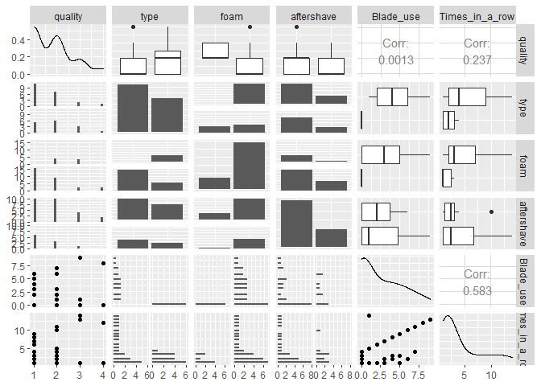
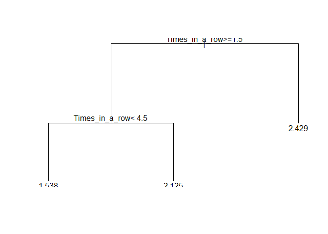

# read data

```r
library(readr)
library(dplyr)
library(knitr)
library(GGally)
```

```
## Warning: package 'GGally' was built under R version 3.6.3
```

```
## Loading required package: ggplot2
```

```
## Warning: package 'ggplot2' was built under R version 3.6.3
```

```
## Registered S3 method overwritten by 'GGally':
##   method from   
##   +.gg   ggplot2
```

```
## 
## Attaching package: 'GGally'
```

```
## The following object is masked from 'package:dplyr':
## 
##     nasa
```

```r
shaving <- read_csv("shaving.csv", 
    col_types = cols(Blade_use = col_integer(), 
        `Blade_use(raw)` = col_integer(), 
        Times_in_a_row = col_integer()))
```

```
## Warning: Missing column names filled in: 'X7' [7], 'X11' [11], 'X12' [12],
## 'X13' [13], 'X14' [14], 'X15' [15], 'X16' [16], 'X17' [17], 'X18' [18]
```

```r
shaving <- shaving %>% select(`Насколько щека шершавая?`, `Чем брился?`,`Была ли пена?`,`Было ли средство после бритья?`,Blade_use,Times_in_a_row)
```


```r
names(shaving) <-
    c("quality",
      "type",
      "foam",
      "aftershave",
      "Blade_use",
      "Times_in_a_row")
shaving <- shaving %>% mutate(
    quality = as.integer(quality),
    type = factor(type),
    foam = as.logical(foam == "Да"),
    aftershave = as.logical(aftershave == "Да")
)
kable(head(shaving))
```


 quality  type                     foam    aftershave    Blade_use   Times_in_a_row
--------  -----------------------  ------  -----------  ----------  ---------------
       4  Электробритва роторная   TRUE    FALSE                 0                1
       2  Т-образный станок        TRUE    FALSE                 1                1
       1  Электробритва роторная   TRUE    FALSE                 0                1
       1  Электробритва роторная   TRUE    FALSE                 0                2
       2  Электробритва роторная   FALSE   FALSE                 0                3
       1  Т-образный станок        TRUE    TRUE                  2                1

```r
ggpairs(shaving)
```

```
## `stat_bin()` using `bins = 30`. Pick better value with `binwidth`.
## `stat_bin()` using `bins = 30`. Pick better value with `binwidth`.
## `stat_bin()` using `bins = 30`. Pick better value with `binwidth`.
## `stat_bin()` using `bins = 30`. Pick better value with `binwidth`.
## `stat_bin()` using `bins = 30`. Pick better value with `binwidth`.
## `stat_bin()` using `bins = 30`. Pick better value with `binwidth`.
## `stat_bin()` using `bins = 30`. Pick better value with `binwidth`.
## `stat_bin()` using `bins = 30`. Pick better value with `binwidth`.
## `stat_bin()` using `bins = 30`. Pick better value with `binwidth`.
```

<!-- -->


```r
library(party)
```

```
## Warning: package 'party' was built under R version 3.6.3
```

```
## Loading required package: grid
```

```
## Loading required package: mvtnorm
```

```
## Warning: package 'mvtnorm' was built under R version 3.6.2
```

```
## Loading required package: modeltools
```

```
## Warning: package 'modeltools' was built under R version 3.6.3
```

```
## Loading required package: stats4
```

```
## Loading required package: strucchange
```

```
## Loading required package: zoo
```

```
## Warning: package 'zoo' was built under R version 3.6.3
```

```
## 
## Attaching package: 'zoo'
```

```
## The following objects are masked from 'package:base':
## 
##     as.Date, as.Date.numeric
```

```
## Loading required package: sandwich
```

```r
library(caret)
```

```
## Warning: package 'caret' was built under R version 3.6.3
```

```
## Loading required package: lattice
```

```r
intest <- createDataPartition(y=shaving$quality, p=0.75, list = F)
test <- shaving[-intest,]
train <- shaving[c(intest),]

party_mod <- train(quality~., method ="rpart", data = train)
```

```
## Warning in nominalTrainWorkflow(x = x, y = y, wts = weights, info = trainInfo, :
## There were missing values in resampled performance measures.
```

```r
pred <- predict(party_mod, newdata = test)
View(data.frame(pred, test))
plot(party_mod$finalModel)
text(party_mod$finalModel)
```

<!-- -->

```r
party_mod
```

```
## CART 
## 
## 28 samples
##  5 predictor
## 
## No pre-processing
## Resampling: Bootstrapped (25 reps) 
## Summary of sample sizes: 28, 28, 28, 28, 28, 28, ... 
## Resampling results across tuning parameters:
## 
##   cp          RMSE       Rsquared   MAE      
##   0.00000000  0.9950036  0.1550437  0.8123085
##   0.07794956  1.0132425  0.1050906  0.8259102
##   0.10675381  1.0126122  0.1048061  0.8242940
## 
## RMSE was used to select the optimal model using the smallest value.
## The final value used for the model was cp = 0.
```

```r
mod1 <- train(quality~., method ="glm", data = train)
pred1 <- predict(mod1, newdata = test)
View(data.frame(pred1, test))
mod1
```

```
## Generalized Linear Model 
## 
## 28 samples
##  5 predictor
## 
## No pre-processing
## Resampling: Bootstrapped (25 reps) 
## Summary of sample sizes: 28, 28, 28, 28, 28, 28, ... 
## Resampling results:
## 
##   RMSE      Rsquared    MAE      
##   1.081466  0.08571671  0.8869133
```

```r
mod2 <- train(quality~., method ="rf", data = train, trControl = trainControl(method = "cv"),number = 3)
```

```
## Warning in randomForest.default(x, y, mtry = param$mtry, ...): The response has
## five or fewer unique values. Are you sure you want to do regression?
```

```
## Warning in randomForest.default(x, y, mtry = param$mtry, ...): The response has
## five or fewer unique values. Are you sure you want to do regression?

## Warning in randomForest.default(x, y, mtry = param$mtry, ...): The response has
## five or fewer unique values. Are you sure you want to do regression?

## Warning in randomForest.default(x, y, mtry = param$mtry, ...): The response has
## five or fewer unique values. Are you sure you want to do regression?

## Warning in randomForest.default(x, y, mtry = param$mtry, ...): The response has
## five or fewer unique values. Are you sure you want to do regression?

## Warning in randomForest.default(x, y, mtry = param$mtry, ...): The response has
## five or fewer unique values. Are you sure you want to do regression?

## Warning in randomForest.default(x, y, mtry = param$mtry, ...): The response has
## five or fewer unique values. Are you sure you want to do regression?

## Warning in randomForest.default(x, y, mtry = param$mtry, ...): The response has
## five or fewer unique values. Are you sure you want to do regression?

## Warning in randomForest.default(x, y, mtry = param$mtry, ...): The response has
## five or fewer unique values. Are you sure you want to do regression?

## Warning in randomForest.default(x, y, mtry = param$mtry, ...): The response has
## five or fewer unique values. Are you sure you want to do regression?

## Warning in randomForest.default(x, y, mtry = param$mtry, ...): The response has
## five or fewer unique values. Are you sure you want to do regression?

## Warning in randomForest.default(x, y, mtry = param$mtry, ...): The response has
## five or fewer unique values. Are you sure you want to do regression?

## Warning in randomForest.default(x, y, mtry = param$mtry, ...): The response has
## five or fewer unique values. Are you sure you want to do regression?

## Warning in randomForest.default(x, y, mtry = param$mtry, ...): The response has
## five or fewer unique values. Are you sure you want to do regression?

## Warning in randomForest.default(x, y, mtry = param$mtry, ...): The response has
## five or fewer unique values. Are you sure you want to do regression?

## Warning in randomForest.default(x, y, mtry = param$mtry, ...): The response has
## five or fewer unique values. Are you sure you want to do regression?

## Warning in randomForest.default(x, y, mtry = param$mtry, ...): The response has
## five or fewer unique values. Are you sure you want to do regression?

## Warning in randomForest.default(x, y, mtry = param$mtry, ...): The response has
## five or fewer unique values. Are you sure you want to do regression?

## Warning in randomForest.default(x, y, mtry = param$mtry, ...): The response has
## five or fewer unique values. Are you sure you want to do regression?

## Warning in randomForest.default(x, y, mtry = param$mtry, ...): The response has
## five or fewer unique values. Are you sure you want to do regression?

## Warning in randomForest.default(x, y, mtry = param$mtry, ...): The response has
## five or fewer unique values. Are you sure you want to do regression?

## Warning in randomForest.default(x, y, mtry = param$mtry, ...): The response has
## five or fewer unique values. Are you sure you want to do regression?

## Warning in randomForest.default(x, y, mtry = param$mtry, ...): The response has
## five or fewer unique values. Are you sure you want to do regression?

## Warning in randomForest.default(x, y, mtry = param$mtry, ...): The response has
## five or fewer unique values. Are you sure you want to do regression?

## Warning in randomForest.default(x, y, mtry = param$mtry, ...): The response has
## five or fewer unique values. Are you sure you want to do regression?

## Warning in randomForest.default(x, y, mtry = param$mtry, ...): The response has
## five or fewer unique values. Are you sure you want to do regression?

## Warning in randomForest.default(x, y, mtry = param$mtry, ...): The response has
## five or fewer unique values. Are you sure you want to do regression?

## Warning in randomForest.default(x, y, mtry = param$mtry, ...): The response has
## five or fewer unique values. Are you sure you want to do regression?

## Warning in randomForest.default(x, y, mtry = param$mtry, ...): The response has
## five or fewer unique values. Are you sure you want to do regression?

## Warning in randomForest.default(x, y, mtry = param$mtry, ...): The response has
## five or fewer unique values. Are you sure you want to do regression?
```

```
## Warning in nominalTrainWorkflow(x = x, y = y, wts = weights, info = trainInfo, :
## There were missing values in resampled performance measures.
```

```
## Warning in randomForest.default(x, y, mtry = param$mtry, ...): The response has
## five or fewer unique values. Are you sure you want to do regression?
```

```r
mod2
```

```
## Random Forest 
## 
## 28 samples
##  5 predictor
## 
## No pre-processing
## Resampling: Cross-Validated (10 fold) 
## Summary of sample sizes: 25, 25, 25, 26, 25, 25, ... 
## Resampling results across tuning parameters:
## 
##   mtry  RMSE       Rsquared   MAE      
##   2     0.7014273  0.6766117  0.6113263
##   3     0.7100630  0.6951284  0.6185574
##   5     0.7253194  0.6966759  0.6232689
## 
## RMSE was used to select the optimal model using the smallest value.
## The final value used for the model was mtry = 2.
```

```r
pred2 <- predict(mod2, newdata = test)
View(data.frame(pred2, test))
```

